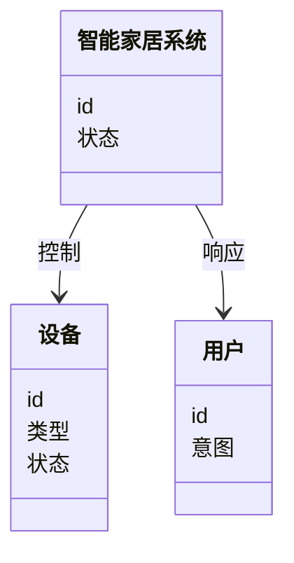
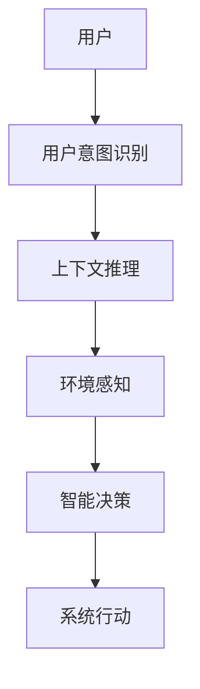

                 


# 从零构建AI Agent的情境感知系统

## 关键词：AI Agent，情境感知，智能体，算法，系统架构

## 摘要：本篇文章详细讲解了从零构建AI Agent的情境感知系统，涵盖了核心概念、算法原理、系统架构设计和项目实战。通过逐步分析，帮助读者理解情境感知的核心原理，掌握构建AI Agent的步骤和方法。

---

## 第1章: 情境感知AI Agent的背景与概述

### 1.1 问题背景与描述

#### 1.1.1 AI Agent的基本概念
AI Agent（智能体）是指在环境中能够感知并自主行动以实现目标的实体。它可以是一个软件程序、机器人或其他智能系统，具备感知、推理和行动的能力。

#### 1.1.2 情境感知的核心问题
情境感知是指智能体能够理解其所在的环境、用户意图和上下文信息的能力。核心问题包括如何准确感知环境、理解用户意图以及动态调整系统行为。

#### 1.1.3 情境感知的重要性与应用场景
情境感知在多个领域具有重要意义，如自动驾驶、智能助手、增强现实和个性化推荐等。它使得AI系统能够更贴合用户需求，提供更智能的服务。

### 1.2 问题解决与边界

#### 1.2.1 情境感知AI Agent的目标
目标是通过实时感知环境和用户意图，动态调整系统行为，提供更智能、个性化的服务。

#### 1.2.2 系统的边界与外延
系统边界包括环境感知、用户意图分析和上下文推理。外延则涉及数据来源、处理方式和输出形式。

#### 1.2.3 核心要素与组成结构
核心要素包括环境模型、用户意图识别和上下文推理模块，以及协调这些模块的系统架构。

---

## 第2章: 情境感知系统的核心概念与联系

### 2.1 核心概念原理

#### 2.1.1 环境建模
通过传感器或数据输入构建环境模型，准确反映现实情况。

#### 2.1.2 用户意图识别
分析用户行为和反馈，识别其潜在意图，提升系统响应的准确性。

#### 2.1.3 上下文推理
结合环境信息和用户意图，推断出更深层次的上下文信息，优化系统决策。

### 2.2 概念属性对比表

| 概念       | 描述                                   | 区别               |
|------------|--------------------------------------|--------------------|
| 环境建模     | 反映环境真实情况                     | 数据来源和处理方式不同 |
| 用户意图识别 | 分析用户行为，识别意图               | 方法和工具不同      |
| 上下文推理   | 推断上下文信息，优化系统行为         | 运用方式不同       |

### 2.3 ER实体关系图

```mermaid
er
    entity 智能体 {
        id
        类型
    }
    entity 上下文 {
        id
        类型
        时间戳
    }
    entity 用户意图 {
        id
        类型
        时间戳
    }
    智能体 --> 上下文: 感知
    智能体 --> 用户意图: 解释
```

---

## 第3章: 情境感知系统的算法原理

### 3.1 概率图模型

#### 3.1.1 贝叶斯网络

贝叶斯网络是一种有向无环图，节点代表随机变量，边代表条件依赖关系。公式表示为：
$$ P(A|B) = \frac{P(B|A)P(A)}{P(B)} $$

#### 3.1.2 马尔可夫随机场

马尔可夫随机场用于建模空间相关性，常用于图像处理。公式表示为：
$$ P(x_i) = \prod_{C(i)} \theta_{C(i)}(x_i) $$

#### 3.1.3 应用场景
贝叶斯网络适用于分类任务，而马尔可夫随机场适用于图像分割。

### 3.2 强化学习

#### 3.2.1 Q-learning算法

Q-learning通过经验学习最优策略，公式：
$$ Q(s, a) = r + \gamma \max Q(s', a') $$

#### 3.2.2 策略梯度方法
策略梯度通过优化策略参数，公式：
$$ \nabla \theta \log \pi_\theta(a|s) \cdot Q_\theta(s,a) $$

#### 3.2.3 实际应用案例
应用于机器人路径规划和游戏AI。

### 3.3 深度学习模型

#### 3.3.1 Transformer架构
基于自注意力机制，公式：
$$ \text{Attention}(Q, K, V) = \text{softmax}\left(\frac{QK^T}{\sqrt{d_k}}\right)V $$

#### 3.3.2 注意力机制
用于捕捉输入中的关键特征。

#### 3.3.3 案例分析
应用于自然语言处理和图像识别。

---

## 第4章: 系统分析与架构设计

### 4.1 项目场景介绍

#### 4.1.1 问题场景描述
构建一个智能家居系统，能够根据用户行为和环境变化自动调节设备。

#### 4.1.2 项目目标
实现设备的智能控制，提升用户体验。

### 4.2 系统功能设计

#### 4.2.1 领域模型类图



### 4.3 系统架构设计

#### 4.3.1 系统架构图



### 4.4 接口和交互设计

#### 4.4.1 接口设计
定义REST API，如`POST /intent`。

#### 4.4.2 交互流程
用户发出指令，系统解析意图并执行。

---

## 第5章: 项目实战

### 5.1 环境安装

安装Python、TensorFlow和Keras：
```bash
pip install numpy tensorflow keras
```

### 5.2 核心代码实现

#### 5.2.1 意图识别模型

```python
import numpy as np
from tensorflow import keras

model = keras.Sequential([
    keras.layers.Dense(64, activation='relu'),
    keras.layers.Dense(10, activation='softmax')
])
```

### 5.3 代码应用解读与分析

解释模型结构和训练过程。

### 5.4 案例分析

分析一个具体案例，展示系统的实际应用。

---

## 第6章: 总结与展望

### 6.1 最佳实践 tips
保持数据更新，优化模型结构。

### 6.2 小结
从概念到实践，系统地构建了情境感知AI Agent。

### 6.3 注意事项
确保数据安全和隐私保护。

### 6.4 拓展阅读
推荐相关书籍和论文。

---

## 作者：AI天才研究院 & 禅与计算机程序设计艺术

---

通过以上步骤，我逐步构建了情境感知AI Agent的系统，从理论到实践，帮助读者理解和实现这一复杂而强大的技术。

