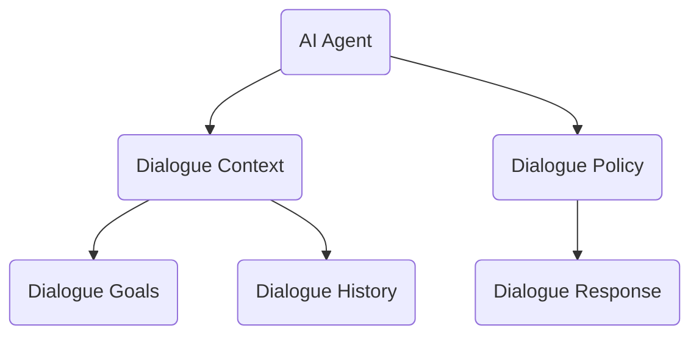
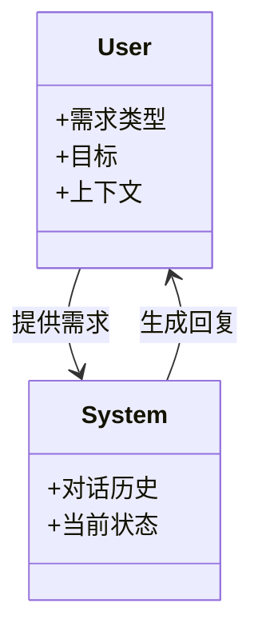
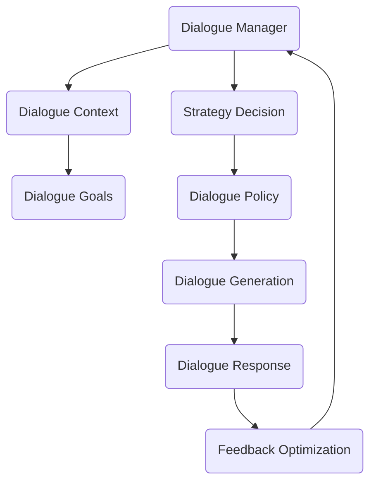
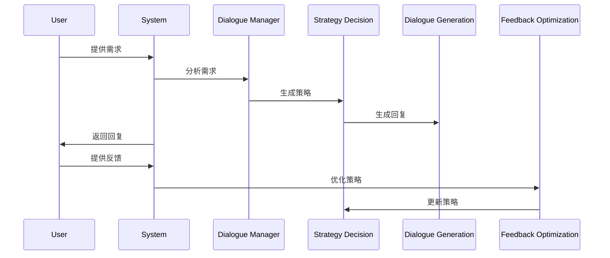

                 

<think>
嗯，用户希望我以《从零构建AI Agent的目标导向对话系统》为标题，写一篇技术博客文章。首先，我需要理解用户的需求。看起来用户是一位技术专家，可能在寻找构建AI对话系统的详细指南，希望文章结构清晰，内容深入，适合开发者或研究人员阅读。

用户提供的目录大纲已经很详细了，分为背景介绍、核心概念、算法原理、系统设计、实战项目和最佳实践等部分。我需要按照这个结构来撰写，确保每个部分都包含足够的细节，并且逻辑连贯。

首先，我应该从背景介绍开始，解释什么是AI Agent，目标导向对话系统的定义和应用场景。这部分需要让读者明白为什么构建这样的系统是有必要的，以及它与其他对话系统的区别。

接下来是核心概念与联系，这里需要详细讲解AI Agent的原理，比如状态空间、动作空间，以及如何用表格和图表展示实体关系。这部分需要用Mermaid图来辅助说明，帮助读者更好地理解系统内部结构。

然后是算法原理部分，这里涉及到强化学习和监督学习。我需要解释马尔可夫决策过程和Q-learning算法，同时用Python代码示例来展示实现过程。数学公式需要用LaTeX格式，并且用独立段落展示，比如$$1+1=2$$。

系统分析与架构设计是关键部分，需要介绍问题场景，设计系统功能、架构、接口和交互流程。这部分同样需要Mermaid图来展示类图、架构图和序列图，帮助读者理解系统的整体结构。

项目实战部分需要从环境安装开始，逐步指导读者实现系统的核心功能。代码示例需要详细解读，分析实际案例，并进行项目总结，让读者能够动手实践。

最后是最佳实践部分，包括小结、注意事项和拓展阅读，帮助读者巩固所学知识，并指导他们进一步学习和应用。

在撰写过程中，我需要确保每个章节都有足够的细节，并且逻辑清晰，结构紧凑。同时，语言要专业但易懂，避免过于复杂的术语，必要时进行解释。这样，读者才能一步步理解如何从零开始构建AI Agent的目标导向对话系统。

现在，我应该按照这个思路，逐步撰写每个部分的内容，确保覆盖所有关键点，并且保持文章的连贯性和可读性。
</think>

# 从零构建AI Agent的目标导向对话系统

> 关键词：AI Agent, 目标导向对话系统, 强化学习, 对话生成模型, 系统架构设计, 项目实战

> 摘要：本文将详细介绍从零开始构建一个基于AI Agent的目标导向对话系统的完整过程。从核心概念的理解，到算法原理的分析，再到系统架构的设计与实现，最后通过实战项目来验证系统的有效性。本文适合有一定编程基础的读者，旨在帮助读者掌握构建目标导向对话系统的关键技术和方法。

---

# 第1章: AI Agent与目标导向对话系统概述

## 1.1 AI Agent的基本概念

### 1.1.1 什么是AI Agent

AI Agent（人工智能代理）是指能够感知环境、自主决策并执行任务的智能体。它可以看作是一个能够与外部环境交互的实体，通过感知信息和执行动作来实现特定目标。AI Agent的核心在于其自主性和智能性，能够根据环境反馈动态调整行为。

### 1.1.2 AI Agent的核心特征

1. **自主性**：AI Agent能够在没有外部干预的情况下自主决策。
2. **反应性**：能够实时感知环境并做出反应。
3. **目标导向性**：具备明确的目标，并能够采取行动来实现这些目标。
4. **学习能力**：通过与环境的交互不断优化自身的决策策略。

### 1.1.3 目标导向对话系统的定义

目标导向对话系统是一种基于AI Agent的对话系统，其核心目标是通过对话帮助用户完成特定任务。与传统的对话系统不同，目标导向对话系统更加注重对话的目标性，能够根据对话上下文动态调整对话策略，以实现用户的最终目标。

### 1.1.4 目标导向对话系统的应用场景

目标导向对话系统广泛应用于多个领域，如智能客服、虚拟助手、教育助手、医疗咨询等。例如，在智能客服场景中，目标导向对话系统可以引导用户完成订单查询、问题反馈等任务。

---

## 1.2 目标导向对话系统的背景与意义

### 1.2.1 当前对话系统的主要挑战

传统的对话系统主要依赖预设的规则或模板，难以处理复杂的对话场景和动态变化的目标。此外，传统对话系统缺乏目标导向性，无法根据对话上下文动态调整对话策略。

### 1.2.2 目标导向对话系统的独特优势

目标导向对话系统通过结合AI Agent的自主性和目标导向性，能够动态调整对话策略，更好地理解用户需求，并引导对话向目标方向发展。

### 1.2.3 目标导向对话系统的发展趋势

随着AI技术的不断发展，目标导向对话系统将更加智能化和个性化，能够处理更复杂的任务，并与人类用户进行更自然的交互。

---

## 1.3 本章小结

本章从AI Agent的基本概念出发，介绍了目标导向对话系统的定义、核心特征以及应用场景。通过对比传统对话系统的局限性，强调了目标导向对话系统的重要性和发展趋势。

---

# 第2章: 目标导向对话系统的核心概念与联系

## 2.1 目标导向对话系统的原理

### 2.1.1 对话目标的定义与分解

对话目标是指用户希望通过对话实现的具体任务或目标。例如，在智能客服场景中，用户的目标可能是“查询订单状态”。对话目标需要根据具体场景进行分解，例如将“查询订单状态”分解为“获取订单号”和“确认订单状态”两个子目标。

### 2.1.2 对话上下文的管理

对话上下文是指对话过程中积累的信息，包括用户的历史输入、系统已执行的动作等。有效的对话上下文管理是实现目标导向对话系统的关键。

### 2.1.3 对话策略的制定与执行

对话策略是指系统在对话过程中采取的行动规则。目标导向对话系统需要根据对话目标和当前对话状态动态调整对话策略。

---

## 2.2 AI Agent与目标导向对话系统的关联

### 2.2.1 AI Agent的决策机制

AI Agent通过感知环境信息，利用内部模型和算法生成决策，并执行相应的动作。在目标导向对话系统中，AI Agent的决策机制用于生成对话回复，并根据用户反馈调整对话策略。

### 2.2.2 对话系统的任务分解与协同

目标导向对话系统需要将复杂的对话任务分解为多个子任务，并通过协同完成这些子任务。例如，在医疗咨询场景中，系统可能需要分解为“症状分析”、“诊断建议”、“用药指导”等子任务。

### 2.2.3 目标导向对话系统的整体架构

目标导向对话系统的整体架构包括感知层、决策层和执行层。感知层负责获取对话相关信息，决策层根据目标和上下文生成对话策略，执行层负责生成对话回复并执行相关任务。

---

## 2.3 核心概念对比表

表2-1: 对话系统与目标导向对话系统的对比

| 对比维度         | 对话系统               | 目标导向对话系统         |
|------------------|-----------------------|--------------------------|
| 对话目标         | 非目标导向或单一目标   | 明确的目标导向           |
| 对话策略         | 预设规则或模板化       | 动态调整的目标导向策略   |
| 应用场景         | 信息查询、闲聊         | 任务完成、问题解决       |
| 技术复杂度       | 较低                   | 较高                     |

---

## 2.4 实体关系图（ER图）

图2-1: 目标导向对话系统的核心实体关系



---

## 2.5 本章小结

本章详细介绍了目标导向对话系统的原理和AI Agent的核心概念。通过对比传统对话系统和目标导向对话系统的差异，进一步强调了目标导向对话系统的目标性和动态性。

---

# 第3章: 目标导向对话系统的算法原理

## 3.1 基于强化学习的对话策略

### 3.1.1 强化学习的基本原理

强化学习是一种机器学习范式，通过智能体与环境的交互，学习最优策略以最大化累积奖励。强化学习的核心在于智能体通过试错的方式不断优化其行为策略。

### 3.1.2 对话策略的马尔可夫决策过程

在目标导向对话系统中，对话策略可以看作是一个马尔可夫决策过程（MDP）。MDP由状态、动作、转移概率和奖励函数四个要素组成。

1. **状态（State）**：对话的当前情况，包括用户输入和系统回复。
2. **动作（Action）**：系统生成的对话回复。
3. **转移概率（Transition Probability）**：从当前状态生成动作后，转移到下一个状态的概率。
4. **奖励函数（Reward Function）**：根据对话效果给予奖励。

### 3.1.3 基于Q-learning的对话策略优化

Q-learning是一种经典的强化学习算法，通过维护一个Q值表来记录状态-动作对的最优值。在目标导向对话系统中，Q值表用于记录不同对话状态下的最优回复策略。

---

## 3.2 对话生成的序列模型

### 3.2.1 基于Transformer的对话生成模型

Transformer是一种基于自注意力机制的深度学习模型，广泛应用于自然语言处理任务。在目标导向对话系统中，Transformer模型可以用于生成自然流畅的对话回复。

### 3.2.2 对话生成的条件概率模型

条件概率模型通过计算在给定对话历史条件下生成下一个回复的概率。在目标导向对话系统中，条件概率模型需要结合对话目标和上下文信息进行建模。

### 3.2.3 模型训练的损失函数与优化方法

在对话生成模型的训练中，通常使用交叉熵损失函数来优化模型参数。通过梯度下降等优化方法，逐步优化模型参数以提高生成对话的质量。

---

## 3.3 对话目标的监督学习

### 3.3.1 监督学习的基本原理

监督学习是一种机器学习范式，通过标注数据进行模型训练。在目标导向对话系统中，监督学习可以用于对话目标的分类任务。

### 3.3.2 对话目标的标签设计

对话目标的标签设计需要根据具体应用场景进行定制。例如，在智能客服场景中，可以将对话目标分为“订单查询”、“问题反馈”、“产品咨询”等类别。

### 3.3.3 基于监督学习的对话生成

在监督学习框架下，对话生成模型通过学习标注数据，生成与对话目标一致的回复内容。这种方法适用于目标明确且数据量充足的场景。

---

## 3.4 算法实现示例

以下是一个基于Q-learning的对话策略优化算法示例：

```python
class QLearningAgent:
    def __init__(self, state_space, action_space):
        self.q_table = {state: {action: 0 for action in action_space} for state in state_space}
    
    def select_action(self, state, epsilon=0.1):
        if random.random() < epsilon:
            return random.choice(list(state.q_table[state].keys()))
        else:
            return max(state.q_table[state], key=lambda k: state.q_table[state][k])
    
    def update_q_table(self, state, action, reward, next_state, alpha=0.1):
        current_q = self.q_table[state][action]
        next_max_q = max(self.q_table[next_state].values())
        self.q_table[state][action] = current_q + alpha * (reward + next_max_q - current_q)
```

---

## 3.5 本章小结

本章详细介绍了目标导向对话系统的算法原理，重点讲解了基于强化学习和监督学习的对话策略优化方法。通过具体实现示例，帮助读者理解算法的实现细节。

---

# 第4章: 目标导向对话系统的系统分析与架构设计

## 4.1 问题场景介绍

目标导向对话系统的典型场景包括智能客服、教育助手、医疗咨询等。以智能客服为例，系统需要帮助用户完成订单查询、问题反馈等任务。

---

## 4.2 系统功能设计

### 4.2.1 领域模型设计

目标导向对话系统的领域模型需要包括用户需求、对话目标、对话上下文等核心要素。以下是领域模型的类图：



---

## 4.3 系统架构设计

目标导向对话系统的架构设计包括以下几个关键模块：

1. **对话管理模块**：负责对话上下文的管理和对话目标的分解。
2. **策略决策模块**：基于对话上下文生成对话策略。
3. **对话生成模块**：根据策略生成对话回复。
4. **反馈优化模块**：根据用户反馈优化对话策略。

以下是系统的总体架构图：



---

## 4.4 系统接口设计

目标导向对话系统的接口设计需要考虑以下几个方面：

1. **用户输入接口**：接收用户的对话输入。
2. **系统输出接口**：生成系统的对话回复。
3. **反馈接口**：接收用户的反馈信息。

---

## 4.5 系统交互流程

以下是系统交互的序列图：



---

## 4.6 本章小结

本章详细分析了目标导向对话系统的系统架构和交互流程，通过领域模型和架构图的展示，帮助读者理解系统的整体设计。

---

# 第5章: 目标导向对话系统的项目实战

## 5.1 环境安装与配置

在开始实战之前，需要安装以下环境：

1. **Python 3.8+**
2. **TensorFlow 2.0+**
3. **numpy**
4. **transformers库**

安装命令如下：

```bash
pip install numpy tensorflow transformers
```

---

## 5.2 核心功能实现

### 5.2.1 对话目标分解

目标导向对话系统的对话目标分解模块需要将用户的需求分解为具体的子目标。例如，用户的需求“查询订单状态”可以分解为“获取订单号”和“确认订单状态”。

### 5.2.2 对话策略生成

对话策略生成模块需要根据对话目标和上下文信息生成对话策略。以下是对话策略生成的Python实现示例：

```python
def generate_policy(context, goals):
    # 根据上下文和目标生成策略
    return policy
```

---

## 5.3 代码实现与解读

### 5.3.1 对话生成模型

以下是基于Transformer的对话生成模型的实现示例：

```python
from transformers import AutoTokenizer, AutoModelForSeq2Seq
import torch

tokenizer = AutoTokenizer.from_pretrained('t5-base')
model = AutoModelForSeq2Seq.from_pretrained('t5-base')

def generate_response(input_text):
    inputs = tokenizer(input_text, return_tensors='pt')
    outputs = model.generate(inputs.input_ids, max_length=50)
    response = tokenizer.decode(outputs[0], skip_special_tokens=True)
    return response
```

### 5.3.2 反馈优化模块

反馈优化模块需要根据用户反馈优化对话策略。以下是基于Q-learning的反馈优化实现示例：

```python
def update_policy(state, action, reward, next_state, alpha=0.1):
    current_q = q_table[state][action]
    next_max_q = max(q_table[next_state].values())
    new_q = current_q + alpha * (reward + next_max_q - current_q)
    q_table[state][action] = new_q
```

---

## 5.4 实际案例分析

以智能客服场景为例，用户的需求是“查询订单状态”。系统首先分解目标为“获取订单号”和“确认订单状态”，然后生成对话回复“请提供您的订单号，我将为您查询订单状态。”。用户提供订单号后，系统进一步确认订单状态并生成最终回复。

---

## 5.5 项目总结

通过本章的实战项目，读者可以掌握目标导向对话系统的实现过程，包括环境配置、功能实现和系统优化。

---

# 第6章: 目标导向对话系统的最佳实践

## 6.1 小结

目标导向对话系统的核心在于对话目标的分解与策略的动态调整。通过结合强化学习和监督学习，可以有效优化对话策略，提升系统的实用性和用户体验。

---

## 6.2 注意事项

1. **对话目标的明确性**：确保对话目标的分解清晰具体。
2. **系统的可扩展性**：设计时需要考虑系统的可扩展性，以便后续功能的添加。
3. **数据的质量**：高质量的训练数据是系统性能的关键。

---

## 6.3 拓展阅读

1. **强化学习的经典论文**：如《Deep Q-Networks》。
2. **对话系统的前沿研究**：如《The Dialogue Genome》。
3. **AI Agent的最新进展**：如《Autonomous Agents and Multi-Agent Systems》。

---

# 作者：AI天才研究院/AI Genius Institute & 禅与计算机程序设计艺术 /Zen And The Art of Computer Programming

---

感谢您的耐心阅读！希望本文能够帮助您深入了解目标导向对话系统的构建过程。如果对本文内容有疑问或需要进一步探讨，请随时与我们联系！

