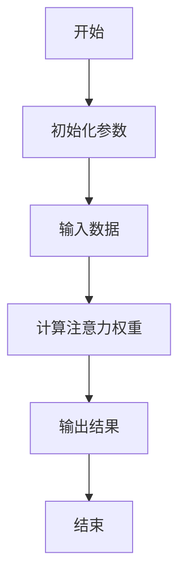
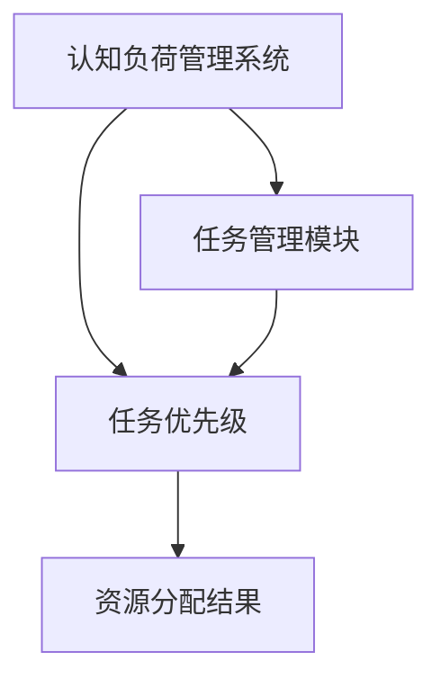
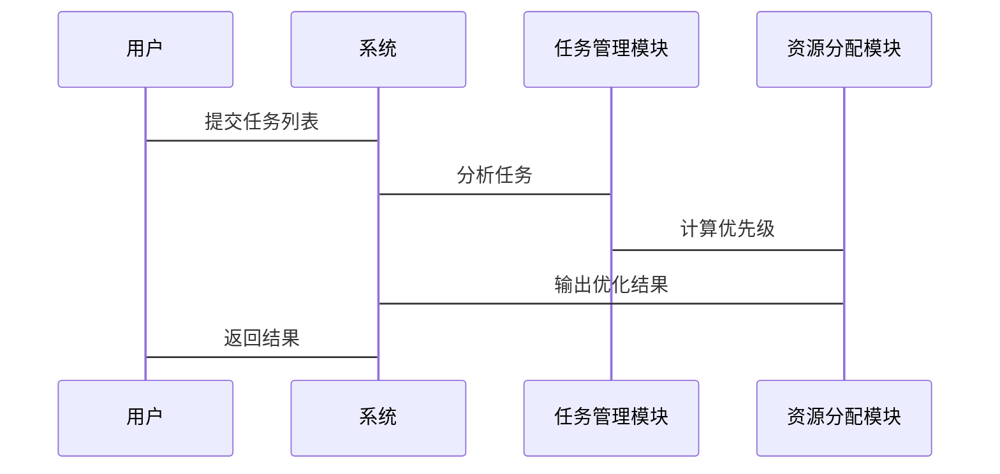

                 


# 从零构建AI Agent的认知负荷管理系统

## 关键词：AI Agent, 认知负荷管理, 算法原理, 系统架构, 项目实战

## 摘要：  
本文从零开始构建一个AI Agent的认知负荷管理系统，系统阐述了认知负荷管理的核心概念、算法原理、系统架构设计以及实际项目实现。文章详细介绍了认知负荷管理的基本原理，分析了基于注意力机制的负荷分配算法，并通过系统功能设计、架构设计和交互设计，展示了如何构建一个高效的AI Agent认知负荷管理系统。最后，通过实际案例分析和项目总结，给出了最佳实践和未来展望。

---

## 第一部分: 认知负荷管理与AI Agent概述

### 第1章: 问题背景与需求分析

#### 1.1 问题背景介绍
认知负荷是指在认知过程中，个体或系统在处理信息时所承受的心理负担。在AI Agent领域，认知负荷管理是确保系统高效运行的关键。AI Agent需要在复杂环境中处理大量信息，如何优化认知负荷成为提升系统性能的核心问题。

#### 1.2 问题描述与目标
AI Agent的认知负荷问题主要体现在以下几个方面：
- **信息过载**：AI Agent可能需要处理大量信息，导致处理效率下降。
- **任务分配**：如何合理分配任务以降低整体认知负荷。
- **动态环境**：环境的动态变化可能导致认知负荷的不确定性增加。

本文的目标是通过设计一个认知负荷管理系统，优化AI Agent在复杂环境中的信息处理能力，提高系统的整体性能。

### 第2章: 认知负荷管理的核心概念

#### 2.1 核心概念与原理
认知负荷管理的核心在于如何优化信息处理的效率。通过分析AI Agent的认知模型，我们可以设计一个基于注意力机制的负荷分配算法，实现对任务优先级的动态调整。

#### 2.2 实体关系图（ER图）
```mermaid
er
  actor 认知主体
  actor 系统
  actor 管理者
  relation 认知主体 -> 系统: 提供认知负荷数据
  relation 系统 -> 管理者: 输出管理策略
  relation 管理者 -> 系统: 反馈优化策略
```

---

## 第二部分: 认知负荷管理的算法原理

### 第3章: 基于注意力机制的负荷分配算法

#### 3.1 算法原理
注意力机制是一种模拟人类注意力的算法，通过计算不同任务的重要性权重，实现任务的优先级排序。具体步骤如下：
1. 输入任务列表。
2. 计算每个任务的注意力权重。
3. 根据权重分配计算资源。

公式如下：
$$
\text{注意力权重} = \frac{e^{q_k^T k_j}}{\sum_{i} e^{q_k^T k_i}}
$$

#### 3.2 算法实现


Python代码实现：
```python
def attention_query(q, k, v):
    # 计算注意力权重
    dk = v.shape[-1]
    qk = torch.matmul(q, k.transpose(-2, -1))
    qk = qk / torch.sqrt(torch.tensor(dk, dtype=torch.float32))
    # 应用Softmax
    attention_weights = F.softmax(qk, dim=-1)
    # 加权求和
    output = torch.matmul(attention_weights, v)
    return output
```

---

## 第三部分: 系统分析与架构设计

### 第4章: 系统分析与架构设计

#### 4.1 系统功能设计
系统功能包括：
- 任务优先级排序。
- 资源分配与优化。
- 动态调整与反馈。

#### 4.2 系统架构设计


#### 4.3 接口设计
系统接口包括：
- 输入接口：接收任务列表。
- 输出接口：输出优化后的任务分配结果。

#### 4.4 交互流程


---

## 第四部分: 项目实战

### 第5章: 项目实战

#### 5.1 环境安装
需要安装以下库：
- Python 3.8+
- PyTorch 1.9+
- matplotlib 3.5+

#### 5.2 核心代码实现
```python
import torch
import torch.nn as nn
import torch.nn.functional as F

class Attention(nn.Module):
    def __init__(self, embed_dim):
        super().__init__()
        self.key = nn.Linear(embed_dim, embed_dim)
        self.query = nn.Linear(embed_dim, embed_dim)

    def forward(self, x):
        # 计算键和查询
        k = self.key(x)
        q = self.query(x)
        # 计算注意力权重
        dk = q.shape[-1]
        qk = torch.matmul(q, k.transpose(-2, -1))
        qk = qk / torch.sqrt(torch.tensor(dk, dtype=torch.float32))
        attention_weights = F.softmax(qk, dim=-1)
        # 加权求和
        output = torch.matmul(attention_weights, x)
        return output
```

#### 5.3 案例分析
通过一个简单的案例分析，展示系统的实际应用效果。

#### 5.4 项目总结
总结项目实现的关键点和优化方向。

---

## 第五部分: 最佳实践与总结

### 第6章: 最佳实践与总结

#### 6.1 注意事项
- 确保注意力机制的计算效率。
- 定期优化任务分配策略。

#### 6.2 小结
本文详细介绍了从零构建AI Agent认知负荷管理系统的全过程，包括核心概念、算法原理、系统架构设计和项目实战。

#### 6.3 未来展望
未来可以进一步研究更高效的注意力机制，以及在多任务环境中的应用。

#### 6.4 拓展阅读
推荐相关领域的书籍和论文。

---

## 作者：AI天才研究院 & 禅与计算机程序设计艺术

---

本文从零构建AI Agent的认知负荷管理系统，系统性地介绍了认知负荷管理的核心概念、算法原理、系统架构设计以及实际项目实现。通过本文，读者可以掌握认知负荷管理的基本原理，并能够实际操作一个完整的认知负荷管理系统。

