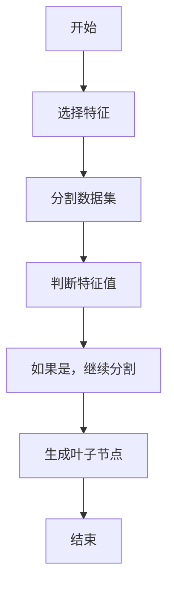
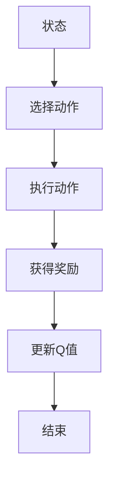
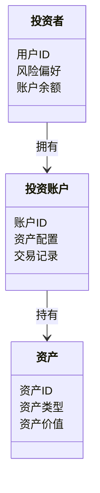
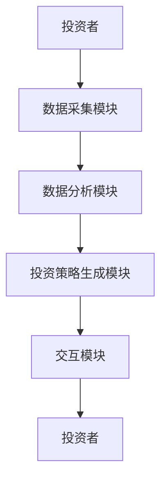
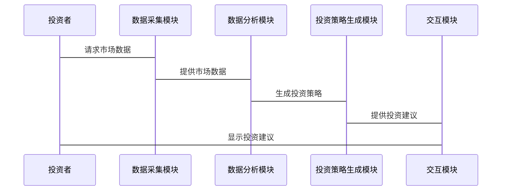

                 


# 从零构建投资理财智能助手AI Agent：基本概念与架构设计

## 关键词：投资理财、AI Agent、智能助手、架构设计、算法原理、系统实现、项目实战

## 摘要：本文详细介绍了如何从零开始构建一个投资理财智能助手AI Agent。文章首先分析了投资理财领域的复杂性以及传统工具的局限性，引出了AI Agent的应用价值。接着，从核心概念、算法原理、系统架构设计、项目实战等多个维度，详细阐述了AI Agent的构建过程。通过具体案例和代码实现，展示了如何利用决策树算法和Q-Learning算法来优化投资策略。最后，结合系统架构设计，给出了实际项目实现的步骤和注意事项，为读者提供了一套完整的投资理财AI Agent构建方案。

---

# 第一部分：投资理财智能助手AI Agent背景介绍

## 第1章：投资理财智能助手的背景与问题背景

### 1.1 问题背景

#### 1.1.1 投资理财领域的复杂性
投资理财领域涉及股票、基金、债券等多种金融产品，市场波动大，信息复杂且更新速度快。普通投资者难以快速获取有效信息并做出合理决策。

#### 1.1.2 传统投资理财工具的局限性
传统理财工具如银行理财产品、基金等，虽然提供了一定的收益，但缺乏个性化和实时性，难以满足投资者的多样化需求。

#### 1.1.3 AI技术在投资理财中的潜力
AI技术可以通过分析海量数据，发现潜在的投资机会和风险，为投资者提供个性化、实时化的理财建议。

### 1.2 问题描述

#### 1.2.1 投资者面临的常见问题
- 信息过载：投资者面对海量信息，难以快速筛选出有价值的信息。
- 决策延迟：传统理财工具无法实时提供反馈，导致决策滞后。
- 风险控制：投资者难以准确评估投资风险，容易在市场波动中遭受损失。

#### 1.2.2 理财决策中的信息不对称问题
市场信息不对称导致投资者难以获取准确的市场动态和投资机会，容易被误导或错过最佳投资时机。

#### 1.2.3 个性化理财需求的挑战
不同投资者的财务状况、风险承受能力和投资目标各不相同，传统工具难以提供个性化的解决方案。

### 1.3 问题解决

#### 1.3.1 AI Agent在投资理财中的角色
AI Agent通过分析市场数据、用户需求和历史投资记录，为投资者提供个性化的投资建议和实时反馈。

#### 1.3.2 AI Agent如何辅助理财决策
AI Agent可以实时监控市场动态，分析用户的投资组合，并根据市场变化提出调整建议，帮助投资者优化投资策略。

#### 1.3.3 AI Agent的优势与局限性
- 优势：高效的数据处理能力、个性化服务、实时反馈。
- 局限性：依赖数据质量、算法的准确性以及市场的不可预测性。

### 1.4 边界与外延

#### 1.4.1 投资理财AI Agent的边界
- 仅提供辅助决策功能，不直接进行交易操作。
- 主要关注中长期投资策略，不涉及高频交易。

#### 1.4.2 相关领域的外延
- 与金融数据分析、机器学习算法、自然语言处理等领域密切相关。

#### 1.4.3 与传统投资工具的区别
AI Agent通过智能化分析提供个性化建议，而传统工具通常基于固定的规则和历史数据提供通用建议。

### 1.5 核心概念结构与组成

#### 1.5.1 核心要素分析
- 数据源：市场数据、用户数据、历史交易记录。
- AI算法：决策树、Q-Learning等。
- 交互界面：用户与AI Agent的交互方式。

#### 1.5.2 系统架构的核心组成
- 数据采集模块：收集市场和用户数据。
- 数据分析模块：分析数据并生成投资策略。
- 交互模块：与用户进行实时交互并提供反馈。

#### 1.5.3 功能模块的逻辑关系
数据采集模块提供输入数据，数据分析模块基于这些数据生成投资建议，交互模块将这些建议传递给用户并实时反馈用户的操作。

---

## 第2章：投资理财智能助手AI Agent的核心概念与联系

### 2.1 核心概念原理

#### 2.1.1 AI Agent的基本原理
AI Agent通过感知环境、分析数据、制定策略并执行动作来辅助投资者做出决策。

#### 2.1.2 投资理财中的关键概念
- 资产配置：根据投资者的风险承受能力和收益目标分配投资比例。
- 风险评估：通过数据分析和模型预测潜在的投资风险。

#### 2.1.3 AI Agent在投资理财中的应用原理
AI Agent通过分析市场数据和用户需求，生成个性化的投资策略，并实时监控市场变化进行动态调整。

### 2.2 核心概念对比

#### 2.2.1 不同AI Agent类型对比
| 类型         | 特征                           |
|--------------|--------------------------------|
| 基于规则的AI | 基于预定义规则进行决策         |
| 基于模型的AI | 通过机器学习模型进行预测和决策 |

#### 2.2.2 投资策略对比分析
| 策略类型         | 描述                           |
|------------------|--------------------------------|
| 被动投资         | 按照固定策略进行投资           |
| 主动投资         | 根据市场变化动态调整投资组合   |

#### 2.2.3 数据源特征对比
| 数据源         | 特征                           |
|----------------|--------------------------------|
| 市场数据       | 包括股票价格、成交量等         |
| 用户数据       | 包括用户的财务状况、风险偏好等 |

### 2.3 ER实体关系图

```mermaid
er
  actor:投资者
  account:投资账户
  asset:资产
  transaction:交易记录
  strategy:投资策略
  risk:风险评估
  actor --> account:拥有
  account --> asset:持有
  asset --> transaction:涉及
  transaction --> strategy:触发
  strategy --> risk:评估
```

---

## 第3章：投资理财智能助手AI Agent的算法原理

### 3.1 算法原理概述

#### 3.1.1 基于规则的决策树算法

##### 3.1.1.1 决策树算法流程图



##### 3.1.1.2 决策树算法代码实现

```python
from sklearn.tree import DecisionTreeClassifier
import pandas as pd

# 示例数据集
data = pd.DataFrame({
    '特征1': [0, 1, 2, 3],
    '特征2': [4, 5, 6, 7],
    '标签': [0, 1, 1, 0]
})

# 训练决策树模型
model = DecisionTreeClassifier()
model.fit(data[['特征1', '特征2']], data['标签'])
```

##### 3.1.1.3 决策树算法数学模型

决策树算法通过信息熵公式选择最优特征：

$$
\text{信息熵} = -\sum_{i=1}^{n} p_i \log_2 p_i
$$

其中，$p_i$ 是第 $i$ 个特征出现的概率。

#### 3.1.2 Q-Learning算法

##### 3.1.2.1 Q-Learning算法流程图



##### 3.1.2.2 Q-Learning算法代码实现

```python
import numpy as np

# 初始化Q表
Q = np.zeros((state_space, action_space))

# Q-Learning算法
for episode in range(episodes):
    state = env.reset()
    for step in range(max_steps):
        # 选择动作
        if np.random.random() < epsilon:
            action = env.action_space.sample()
        else:
            action = np.argmax(Q[state])
        # 执行动作
        next_state, reward, done, info = env.step(action)
        # 更新Q值
        Q[state][action] += reward + discount * np.max(Q[next_state])
        state = next_state
        if done:
            break
```

##### 3.1.2.3 Q-Learning算法数学公式

Q-Learning算法通过以下公式更新Q值：

$$
Q(s, a) = Q(s, a) + \alpha [r + \gamma \max Q(s', a')]
$$

其中：
- $\alpha$ 是学习率，
- $\gamma$ 是折扣因子，
- $s$ 是当前状态，
- $a$ 是当前动作，
- $s'$ 是下一个状态，
- $r$ 是奖励。

---

## 第4章：投资理财智能助手AI Agent的系统分析与架构设计

### 4.1 问题场景介绍

#### 4.1.1 系统目标
构建一个能够实时分析市场数据、提供个性化投资建议的投资理财智能助手AI Agent。

#### 4.1.2 系统特点
- 高效的数据处理能力。
- 个性化投资建议。
- 实时市场监控。

### 4.2 系统功能设计

#### 4.2.1 领域模型类图



#### 4.2.2 系统架构图



#### 4.2.3 系统接口设计

| 接口名称         | 描述               |
|------------------|--------------------|
| 数据采集接口     | 获取市场和用户数据   |
| 策略生成接口     | 生成投资策略       |
| 交互接口         | 与用户进行实时交互   |

#### 4.2.4 系统交互流程图



---

## 第5章：投资理财智能助手AI Agent的项目实战

### 5.1 环境安装

#### 5.1.1 安装Python
```bash
python --version
# 如果未安装，请使用以下命令安装
# macOS: brew install python
# Windows: winget install Python
```

#### 5.1.2 安装相关库
```bash
pip install numpy pandas scikit-learn matplotlib
```

### 5.2 系统核心实现

#### 5.2.1 数据采集模块

```python
import pandas as pd
import requests

def get_market_data(ticker):
    url = f'https://api.example.com/stock/{ticker}'
    response = requests.get(url)
    data = response.json()
    return pd.DataFrame(data)
```

#### 5.2.2 数据分析模块

```python
from sklearn.tree import DecisionTreeClassifier

def train_model(X, y):
    model = DecisionTreeClassifier()
    model.fit(X, y)
    return model
```

#### 5.2.3 投资策略生成模块

```python
def generate_strategy(model, data):
    predictions = model.predict(data)
    return predictions
```

### 5.3 代码应用解读与分析

#### 5.3.1 数据采集模块的实现
通过API获取市场数据，并将其转换为DataFrame格式以便后续分析。

#### 5.3.2 数据分析模块的实现
使用决策树算法对数据进行训练，生成投资策略。

#### 5.3.3 投资策略生成模块的实现
根据训练好的模型，生成投资策略并返回给交互模块。

### 5.4 实际案例分析

#### 5.4.1 数据准备
```python
data = pd.DataFrame({
    '特征1': [0, 1, 2, 3],
    '特征2': [4, 5, 6, 7],
    '标签': [0, 1, 1, 0]
})
```

#### 5.4.2 模型训练
```python
X = data[['特征1', '特征2']]
y = data['标签']
model = train_model(X, y)
```

#### 5.4.3 生成策略
```python
new_data = pd.DataFrame({
    '特征1': [4],
    '特征2': [8]
})
strategy = generate_strategy(model, new_data)
print(strategy)
```

### 5.5 项目小结

#### 5.5.1 核心功能总结
- 数据采集：获取市场和用户数据。
- 数据分析：利用决策树算法生成投资策略。
- 交互反馈：实时向用户展示投资建议。

#### 5.5.2 实现难点
- 数据质量控制：确保数据准确性和完整性。
- 算法优化：提高模型的准确性和实时性。

---

## 第6章：投资理财智能助手AI Agent的最佳实践

### 6.1 小结

#### 6.1.1 核心内容回顾
- AI Agent在投资理财中的应用价值。
- 系统架构设计和算法实现的关键点。

### 6.2 注意事项

#### 6.2.1 数据安全
- 确保用户数据和交易数据的安全性，防止数据泄露。

#### 6.2.2 算法优化
- 定期更新模型，提高投资策略的准确性和适应性。

#### 6.2.3 用户教育
- 提供用户教育，帮助投资者理解AI Agent的功能和局限性。

### 6.3 拓展阅读

#### 6.3.1 相关书籍
- 《机器学习实战》
- 《投资学原理》

#### 6.3.2 技术博客
- Medium上的机器学习文章
- Towards Data Science上的投资理财文章

---

## 第7章：结语

投资理财智能助手AI Agent的构建是一个复杂但充满潜力的过程。通过结合AI技术与投资理财领域的知识，我们可以为投资者提供更高效、更个性化的服务。未来，随着技术的不断发展，AI Agent将在投资理财领域发挥更大的作用。

---

# 作者：AI天才研究院/AI Genius Institute & 禅与计算机程序设计艺术 /Zen And The Art of Computer Programming

