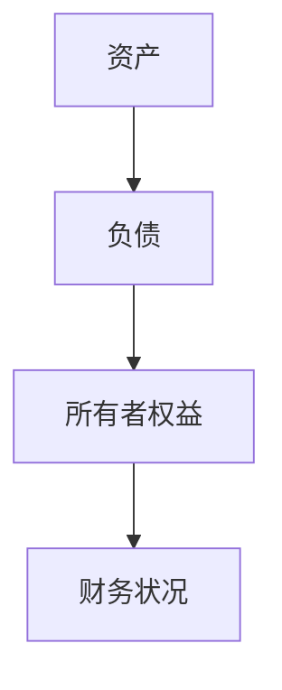
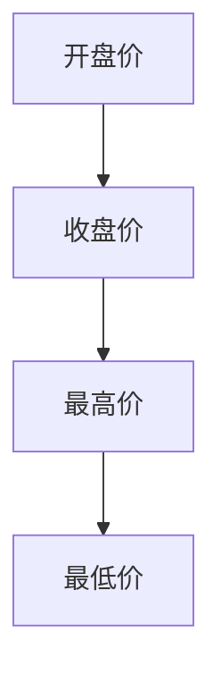

                 

# 价值投资vs投机：理解长期投资的重要性

> 关键词：价值投资、投机、长期投资、风险管理、投资策略

> 摘要：本文通过分析价值投资与投机的核心理念、策略、优缺点，帮助读者理解长期投资的重要性。文章从投资与投机的基本概念出发，深入探讨价值投资的内在逻辑与实践方法，以及投机行为的特点与风险。通过对比分析，帮助投资者根据自身目标与风险承受能力选择合适的投资策略，并强调长期投资在实现财务目标中的关键作用。

---

# 第一部分: 投资与投机的概述

## 第1章: 投资与投机的基本概念

### 1.1 投资与投机的定义

- **投资**：投资是指将资金投入特定资产，以期在未来获得超过本金的收益。投资强调的是资产的内在价值和长期增长潜力，注重基本面分析和风险管理。
- **投机**：投机是指通过预测市场价格波动，短期买卖资产以赚取价差收益。投机强调的是市场情绪、技术分析和短期机会捕捉。

### 1.2 投资与投机的区别

| **维度**         | **投资**               | **投机**               |
|-------------------|-----------------------|-----------------------|
| 时间周期         | 长期（数年甚至更久）   | 短期（数天、数周或数月） |
| 分析方法         | 基本面分析（财务报表、企业价值） | 技术分析（价格走势、成交量） |
| 风险承受能力     | 较低                  | 较高                  |
| 收益来源         | 资产增值、分红收益     | 价格波动带来的价差收益 |

### 1.3 投资者心理与行为

- **理性决策**：投资者通常会根据基本面分析做出决策，追求长期稳定的收益。
- **非理性决策**：投机者往往受市场情绪影响，容易陷入贪婪与恐惧，导致决策失误。

---

# 第二部分: 价值投资的理论与实践

## 第2章: 价值投资的核心理论

### 2.1 价值投资的哲学基础

- 价值投资的核心理念是购买低于其内在价值的资产，等待市场重新发现其价值。
- 格雷厄姆的“安全边际”概念：买入价格低于内在价值的资产，以降低投资风险。

### 2.2 财务分析与估值方法

#### 2.2.1 资产负债表分析

- 重点分析企业的盈利能力、资产负债情况和现金流状况。

#### 2.2.2 现金流分析

- 现金流是企业生存和发展的关键，正向现金流的企业更有可能产生长期价值。

### 2.3 价值投资的策略与风险管理

- **分散投资**：通过投资不同类型资产降低风险。
- **长期持有**：避免频繁交易，减少交易成本和税务负担。

---

# 第三部分: 投机的策略与风险

## 第3章: 投机的核心策略

### 3.1 技术分析与市场情绪

#### 3.1.1 K线图分析

- 通过分析K线图的形态（如趋势线、支撑位、阻力位）预测价格走势。

### 3.2 投机的风险管理

- **止损策略**：设定止损点，避免亏损扩大。
- **杠杆风险**：使用杠杆会放大收益，但也可能加速亏损。

---

# 第四部分: 价值投资与投机的比较分析

## 第4章: 价值投资与投机的优缺点对比

### 4.1 长期与短期的对比

| **维度**         | **价值投资**           | **投机**              |
|-------------------|-----------------------|-----------------------|
| 时间周期         | 长期（数年）           | 短期（数月甚至数天）   |
| 风险承受能力     | 较低                  | 较高                  |
| 收益稳定性       | 较高（长期稳定）      | 较低（波动大，风险高） |

### 4.2 投资者类型与策略选择

- **保守型投资者**：适合价值投资，追求长期稳定的收益。
- **激进型投资者**：适合投机，追求短期高回报，但风险较高。

---

# 第五部分: 长期投资的重要性

## 第5章: 长期投资的核心优势

### 5.1 复利效应

- 复利效应是长期投资的核心优势，通过时间的积累，收益呈指数级增长。

$$ 复利公式：A = P \times (1 + r)^n $$

其中：
- \( A \)：最终金额
- \( P \)：本金
- \( r \)：年收益率
- \( n \)：年数

### 5.2 市场波动与长期趋势

- 短期市场波动不可预测，但长期趋势（如经济发展、技术创新）更有利于价值投资。

---

# 结论

## 6.1 价值投资与投机的总结

- 价值投资适合追求长期稳定收益的投资者，强调基本面分析和风险管理。
- 投机适合愿意承担高风险、追求短期收益的投资者，强调技术分析和市场情绪。

## 6.2 长期投资的重要性

- 长期投资通过复利效应实现财富的稳步增长，是实现财务自由的关键。

---

# 作者信息

作者：AI天才研究院/AI Genius Institute & 禅与计算机程序设计艺术 /Zen And The Art of Computer Programming

---

### **相关资料与工具推荐**

- **书籍**：
  - 《The Intelligent Investor》 - 本杰明·格雷厄姆
  - 《Reminiscences of a Stock Operator》 - 爱德温·勒斐夫
  - 《Poor Charlie's Almanack》 - 查理·芒格

- **工具**：
  - Excel或Google Sheets：用于财务分析和估值计算。
  - Python：用于数据分析和量化投资策略开发。
  - MetaTrader：用于技术分析和交易执行。

---

希望这篇文章能帮助您理解价值投资与投机的本质，并掌握长期投资的核心策略！

