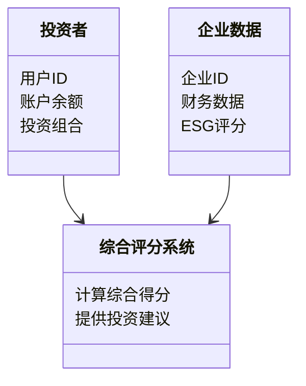
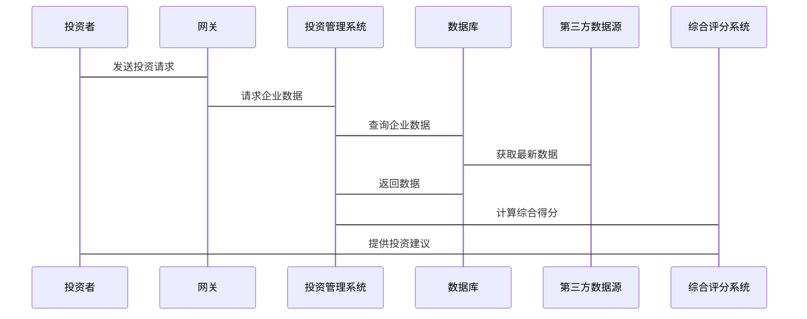

                 

<think>
好的，我需要根据用户的要求，撰写一篇关于《价值投资与ESG投资的结合》的博客文章。首先，我需要理解价值投资和ESG投资的基本概念，以及它们如何结合起来。接着，我需要设计文章的结构，包括背景介绍、核心概念与联系、算法原理、数学模型、系统架构、项目实战等部分。

首先，背景介绍部分，我需要解释什么是价值投资和ESG投资，它们的起源、发展现状，以及为什么现在需要将它们结合起来。接着，在核心概念与联系部分，我需要详细说明两者的定义、核心原理，并比较它们的属性特征。可能还需要用表格和Mermaid流程图来展示它们的关系。

接下来是算法原理部分，我需要将价值投资和ESG投资的筛选标准转化为具体的算法步骤。例如，如何计算市盈率、市净率、股息率，以及如何评估ESG评分。这可能涉及使用Python代码来实现这些计算，帮助读者更好地理解。

数学模型部分，我需要将价值投资和ESG投资的关键指标用公式表示。例如，市盈率（P/E）的计算公式，以及ESG评分模型。这部分需要使用LaTeX格式，确保公式清晰且易于理解。

系统分析与架构设计方案，我需要构建一个综合评分系统，将价值投资和ESG因素结合起来。这部分可能包括问题场景的描述、系统功能设计（如领域模型）、架构设计图，以及接口和交互设计。使用Mermaid图来展示类图、架构图和序列图，帮助读者理解系统设计。

项目实战部分，我需要提供一个具体的案例，比如构建一个综合评分系统。详细说明环境安装、核心代码实现、案例分析等，帮助读者实际操作。可能还需要使用Python代码来展示如何计算ESG评分，并结合价值投资指标进行综合评估。

最后，最佳实践部分，我需要总结结合价值投资和ESG投资的经验，提出一些建议和注意事项，帮助读者在实际投资中避免常见错误，并引导他们进一步学习相关知识。

在撰写过程中，我需要确保每个部分都有足够的细节，并且语言清晰易懂。可能还需要查阅相关文献或案例，确保内容的准确性和深度。此外，要按照用户的要求，使用Markdown格式，并在适当的地方插入代码、表格和Mermaid图，使文章更具专业性和可读性。

总之，我需要系统地分析和解释价值投资与ESG投资的结合，从概念到实践，逐步展开，确保读者能够全面理解并掌握相关内容。
</think>

# 价值投资与ESG投资的结合

## 关键词：价值投资、ESG投资、投资策略、可持续发展、财务指标

## 摘要：  
在当前的经济环境下，投资者越来越关注企业的可持续性和社会责任。价值投资强调企业基本面的分析，而ESG投资关注环境、社会和公司治理因素。本文将详细探讨如何将价值投资与ESG投资结合起来，通过综合分析企业的财务表现和社会责任，为投资者提供更全面的投资决策依据。

---

# 第1章: 价值投资与ESG投资的背景与概念

## 1.1 价值投资的定义与核心理念

### 1.1.1 价值投资的起源与发展  
价值投资起源于20世纪初，由本杰明·格雷厄姆和戴维·多德提出，强调以低于内在价值的价格购买股票。这一理念在2008年金融危机后重新受到关注，尤其是在全球经济不确定性增加的背景下，投资者倾向于寻找具有长期稳定回报的企业。

### 1.1.2 价值投资的核心原则  
- **安全边际**：购买价格低于内在价值，以减少市场波动带来的风险。  
- **长期视角**：关注企业的基本面，如盈利能力、现金流和资产负债表。  
- **逆向思维**：在市场恐慌时寻找被低估的机会。  

### 1.1.3 价值投资的适用场景与局限性  
- **适用场景**：市场低迷、企业估值被低估时。  
- **局限性**：短期波动可能影响股价，且需要较高的市场敏感性。

## 1.2 ESG投资的定义与核心理念

### 1.2.1 ESG投资的起源与发展  
ESG投资起源于20世纪60年代，随着环保运动和民权运动的兴起，投资者开始关注企业的社会责任。近年来，随着气候变化和企业治理问题的突出，ESG投资逐渐成为主流。

### 1.2.2 ESG投资的核心原则  
- **环境（E）**：关注企业的碳排放、能源使用和环保措施。  
- **社会（S）**：评估企业在劳工权益、社区参与和社会责任方面的表现。  
- **治理（G）**：关注公司治理结构、高管薪酬和董事会独立性。  

### 1.2.3 ESG投资的适用场景与局限性  
- **适用场景**：可持续发展目标明确、政策支持较强的行业。  
- **局限性**：ESG评分标准不统一，且短期可能影响投资回报。

## 1.3 价值投资与ESG投资的结合背景

### 1.3.1 当前投资环境的挑战  
- 经济全球化带来不确定性，企业面临更大的外部风险。  
- 投资者关注社会责任，ESG因素成为重要考量。  

### 1.3.2 价值投资与ESG投资结合的必要性  
- 传统价值投资的局限性：忽视企业社会责任和长期可持续性。  
- ESG投资的局限性：缺乏对财务表现的关注。  
- 结合两者的互补优势：平衡短期财务回报与长期可持续发展。

---

# 第2章: 价值投资与ESG投资的核心概念与联系

## 2.1 价值投资的核心概念

### 2.1.1 市盈率（P/E）的计算与应用  
- 公式：$$P/E = \frac{股票价格}{每股净利润}$$  
- 解释：衡量企业股价是否合理，低于行业平均值可能意味着低估。  

### 2.1.2 市净率（P/B）的计算与应用  
- 公式：$$P/B = \frac{股票价格}{每股净资产}$$  
- 解释：用于评估企业资产价值是否被低估。  

### 2.1.3 股息率的计算与应用  
- 公式：$$股息率 = \frac{每股股息}{股票价格} \times 100\%$$  
- 解释：高股息率可能意味着收益稳定，但需关注企业的财务健康状况。  

## 2.2 ESG投资的核心概念

### 2.2.1 环境（E）的评估标准  
- 碳排放强度：$$\text{碳排放强度} = \frac{\text{总碳排放}}{\text{总收入}}$$  
- 可再生能源使用比例：$$\text{使用比例} = \frac{\text{可再生能源使用量}}{\text{总能源使用量}} \times 100\%$$  

### 2.2.2 社会（S）的评估标准  
- 劳工权益：员工福利、工作条件和多样性。  
- 社区参与：企业对当地社区的贡献和支持。  

### 2.2.3 公司治理（G）的评估标准  
- 董事会独立性：独立董事比例。  
- 高管薪酬结构：激励机制是否合理。  

## 2.3 价值投资与ESG投资的联系

### 2.3.1 价值投资中的ESG因素  
- 在筛选低估股票时，优先考虑ESG表现优异的企业。  

### 2.3.2 ESG投资中的价值评估  
- 在评估ESG表现时，结合企业的财务健康状况。  

### 2.3.3 结合两者的优势与潜在问题  
- **优势**：平衡短期财务回报与长期可持续性。  
- **潜在问题**：数据收集和整合的复杂性，可能增加投资成本。  

---

# 第3章: 价值投资与ESG投资的算法原理

## 3.1 价值投资与ESG投资的综合评分算法

### 3.1.1 综合评分模型的设计  
- 财务指标权重：60%（市盈率、市净率、股息率）。  
- ESG指标权重：40%（环境、社会、治理）。  

### 3.1.2 算法流程  
1. 收集目标企业的财务数据和ESG评分。  
2. 计算财务指标得分：$$\text{财务得分} = 0.6 \times (\text{市盈率得分} + \text{市净率得分} + \text{股息率得分})$$  
3. 计算ESG指标得分：$$\text{ESG得分} = 0.4 \times (\text{环境得分} + \text{社会得分} + \text{治理得分})$$  
4. 综合得分：$$\text{综合得分} = \text{财务得分} + \text{ESG得分}$$  

### 3.1.3 Python实现代码  
```python
import pandas as pd

# 假设df为包含财务数据和ESG评分的DataFrame
def calculate_scores(df):
    # 财务指标权重
    financial_weights = {'P/E': 0.3, 'P/B': 0.3, 'Dividend Yield': 0.4}
    # ESG指标权重
    esg_weights = {'Environment': 0.4, 'Social': 0.3, 'Governance': 0.3}
    
    # 计算财务得分
    financial_scores = df[['P/E', 'P/B', 'Dividend Yield']].mean(axis=1)
    financial_score = (financial_scores * financial_weights).sum(axis=1)
    
    # 计算ESG得分
    esg_scores = df[['Environment', 'Social', 'Governance']].mean(axis=1)
    esg_score = (esg_scores * esg_weights).sum(axis=1)
    
    # 综合得分
    total_score = financial_score + esg_score
    return total_score

# 示例数据
data = {
    'P/E': [15, 12, 20],
    'P/B': [2.5, 1.8, 3.2],
    'Dividend Yield': [3, 4, 2],
    'Environment': [80, 70, 90],
    'Social': [75, 85, 60],
    'Governance': [85, 70, 90]
}
df = pd.DataFrame(data)
print(calculate_scores(df))
```

## 3.2 数学模型与公式

### 3.2.1 综合评分公式  
$$\text{综合得分} = 0.6 \times (\text{P/E得分} + \text{P/B得分} + \text{股息率得分}) + 0.4 \times (\text{环境得分} + \text{社会得分} + \text{治理得分})$$  

### 3.2.2 ESG评分模型  
$$\text{ESG评分} = \frac{\text{环境得分} + \text{社会得分} + \text{治理得分}}{3}$$  

---

# 第4章: 系统分析与架构设计方案

## 4.1 问题场景介绍  
假设我们开发一个投资管理系统，需要整合价值投资和ESG投资策略，为投资者提供综合评分和投资建议。

## 4.2 系统功能设计

### 4.2.1 领域模型（Mermaid 类图）  


### 4.2.2 系统架构设计（Mermaid 架构图）  


### 4.2.3 接口与交互设计（Mermaid 序列图）  


---

# 第5章: 项目实战

## 5.1 环境安装

### 5.1.1 安装Python和相关库  
- 安装Python：https://www.python.org/downloads/  
- 安装Pandas：`pip install pandas`  

## 5.2 核心代码实现

### 5.2.1 综合评分系统代码  
```python
import pandas as pd

def calculate_esg_score(environment, social, governance):
    return (environment + social + governance) / 3

def calculate_financial_score(pe, pb, dividend_yield):
    return (pe + pb + dividend_yield) / 3

def calculate_total_score(pe, pb, dividend_yield, environment, social, governance):
    financial_score = calculate_financial_score(pe, pb, dividend_yield)
    esg_score = calculate_esg_score(environment, social, governance)
    return financial_score * 0.6 + esg_score * 0.4

# 示例数据
data = {
    'P/E': [15, 12, 20],
    'P/B': [2.5, 1.8, 3.2],
    'Dividend Yield': [3, 4, 2],
    'Environment': [80, 70, 90],
    'Social': [75, 85, 60],
    'Governance': [85, 70, 90]
}
df = pd.DataFrame(data)

total_scores = []
for index in df.index:
    pe = df['P/E'][index]
    pb = df['P/B'][index]
    dy = df['Dividend Yield'][index]
    env = df['Environment'][index]
    social = df['Social'][index]
    gov = df['Governance'][index]
    total_score = calculate_total_score(pe, pb, dy, env, social, gov)
    total_scores.append(total_score)

df['Total Score'] = total_scores
print(df)
```

## 5.3 案例分析与详细解读  
以某企业为例，计算其综合得分，并分析其投资价值。假设该企业的数据如下：  
- P/E = 12  
- P/B = 1.8  
- 股息率 = 4%  
- 环境得分 = 70  
- 社会得分 = 85  
- 治理得分 = 70  

计算结果：  
- 财务得分 = (12 + 1.8 + 4) / 3 = 6.0667  
- ESG得分 = (70 + 85 + 70) / 3 = 75  
- 综合得分 = 0.6 * 6.0667 + 0.4 * 75 = 3.64 + 30 = 33.64  

该得分高于行业平均水平，说明该企业具备较高的投资价值。

---

# 第6章: 最佳实践与总结

## 6.1 最佳实践 Tips  
- 定期更新企业数据和ESG评分，以反映最新的市场动态。  
- 结合宏观经济环境，调整投资策略。  

## 6.2 小结  
通过将价值投资与ESG投资相结合，投资者可以在追求财务回报的同时，支持可持续发展，实现长期稳健的投资收益。

## 6.3 注意事项  
- 数据的准确性和及时性对投资决策至关重要。  
- 投资者需具备一定的金融知识和数据分析能力。  

## 6.4 拓展阅读  
- 格雷厄姆的《聪明的投资者》  
- 纪录片《The True Cost》  

---

# 作者：AI天才研究院/AI Genius Institute & 禅与计算机程序设计艺术 /Zen And The Art of Computer Programming

