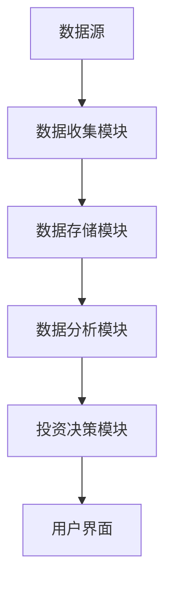

                 

<think>
好的，我需要根据用户的要求来写一篇关于《价值投资与人口统计学：把握人口结构变化带来的机遇》的技术博客文章。用户已经提供了一个详细的目录大纲，我需要按照这个大纲来撰写文章，并满足所有格式和内容的要求。

首先，我需要理解文章的主题：结合价值投资和人口统计学，分析人口结构变化带来的投资机会。这意味着我需要涵盖价值投资的基本概念、人口统计学的基础知识，以及两者如何相互作用。

接下来，我需要按照目录结构来组织内容。第一部分是引言，介绍价值投资和人口统计学的基本概念。第二部分是人口结构变化的分析方法，涉及具体的指标和影响因素。第三部分是价值投资策略中的人口统计分析，探讨如何将人口数据应用到投资决策中。第四部分是系统架构与项目实战，展示如何构建一个分析系统。最后是结论与展望。

在每个章节中，我需要详细讲解相关概念，并确保包含背景介绍、核心概念与联系、算法原理、数学模型、系统架构和项目实战等内容。例如，在分析人口结构变化时，我需要介绍相关的指标，并使用数学公式来描述这些指标的计算方法。

我还需要使用Mermaid图表来展示系统架构和流程图，这将帮助读者更好地理解复杂的系统设计。同时，我需要编写Python代码来实现数据分析和预测模型，并详细解释代码的功能和实现过程。

此外，我必须确保文章结构清晰，逻辑严谨，内容详实。每个部分都需要有具体的例子和详细的分析，以帮助读者理解和应用这些概念。

最后，我需要在文章末尾添加作者信息，并确保文章的总字数在10000到12000字之间，使用markdown格式，并正确嵌入数学公式和图表。

现在，我将按照这个思路逐步撰写文章，确保每个部分都符合用户的要求，并涵盖所有必要的细节。
</think>

# 价值投资与人口统计学：把握人口结构变化带来的机遇

## 关键词：价值投资，人口统计学，人口结构变化，投资策略，数据分析

## 摘要：  
本文探讨了如何结合价值投资和人口统计学的方法，分析人口结构变化带来的投资机会。通过介绍价值投资的核心理念、人口统计学的基础知识，以及如何将人口结构变化应用于投资策略中，本文旨在为投资者提供一种新的视角，帮助他们更好地把握市场趋势和投资机遇。文章还详细分析了人口结构变化的数学模型和算法，并结合实际案例，展示了如何构建数据分析系统来支持投资决策。

---

# 第一部分：价值投资与人口统计学的结合

## 第1章：价值投资的核心理念

### 1.1 价值投资的基本概念

#### 背景介绍
价值投资是一种以内在价值为基础的投资策略，强调购买被市场低估的资产。其核心理念是寻找价格低于其内在价值的股票，长期持有，等待市场的重新评估。这种策略强调对企业的深入了解，关注公司的基本面，而非市场的短期波动。

#### 核心概念与联系
- **内在价值**：资产的真实价值，与市场波动无关。
- **安全边际**：购买价格低于内在价值，以降低风险。
- **长期视角**：关注企业的长期增长潜力，而非短期收益。

#### 算法原理
价值投资者通常使用市盈率（P/E）、市净率（P/B）等指标来评估股票的估值。例如，寻找市盈率低于行业平均水平的公司。

### 1.2 人口统计学的基础知识

#### 背景介绍
人口统计学研究人口的数量、结构、分布及其变化规律。人口结构的变化对经济、社会和市场趋势有深远影响。

#### 核心概念与联系
- **人口结构**：包括年龄、性别、职业等变量。
- **人口老龄化**：老年人比例增加，影响医疗、退休基金等行业。
- **人口迁移**：人口流动影响房地产、劳动力市场等。

#### 算法原理
人口统计学常用回归分析和时间序列分析来预测人口变化趋势。例如，使用线性回归模型预测人口增长率。

---

## 第2章：人口结构变化的分析方法

### 2.1 人口学指标的定义与计算

#### 背景介绍
人口学指标是分析人口结构的基础工具。常用指标包括人口增长率、年龄中位数、性别比等。

#### 核心概念与联系
- **人口增长率**：年增长率为$\frac{N_{t+1} - N_t}{N_t}$，其中$N_t$为第$t$年的人口数。
- **年龄中位数**：将人口按年龄排序，中位数位置的年龄。
- **性别比**：以女性为100，计算男性数量。

#### 算法原理
使用Python进行人口数据的可视化，例如绘制年龄分布的柱状图。

```python
import matplotlib.pyplot as plt

# 示例数据
ages = [20, 25, 30, 35, 40, 45, 50, 55, 60, 65, 70, 75, 80, 85, 90]
plt.hist(ages, bins=10, alpha=0.7)
plt.title('Age Distribution')
plt.xlabel('Age')
plt.ylabel('Frequency')
plt.show()
```

### 2.2 人口结构变化的影响因素

#### 背景介绍
人口结构的变化受经济发展、政策法规和社会文化等多种因素影响。

#### 核心概念与联系
- **经济发展水平**：高收入国家通常人口老龄化严重。
- **政策法规**：政府政策如生育率调控、移民政策等影响人口结构。
- **社会文化**：文化观念影响生育率和人口迁移。

#### 算法原理
构建一个简单的回归模型，分析经济发展水平对人口增长率的影响。

```python
import statsmodels.api as sm

# 示例数据
x = [1, 2, 3, 4, 5]  # 经济发展指标
y = [2, 3, 4, 5, 6]  # 人口增长率

model = sm.OLS(y, sm.add_constant(x))
results = model.fit()
print(results.summary())
```

---

## 第3章：价值投资策略中的人口统计分析

### 3.1 人口统计数据在行业分析中的应用

#### 背景介绍
不同行业对人口结构变化的敏感度不同。例如，老龄化社会中医疗行业的需求增加。

#### 核心概念与联系
- **行业生命周期**：人口结构影响行业的兴衰。
- **消费习惯**：不同年龄段的消费偏好影响企业的收入。

#### 算法原理
预测老龄化趋势对医疗行业的影响，使用时间序列分析模型。

```python
from statsmodels.tsa.arima_model import ARIMA

# 示例数据
data = [100, 105, 110, 115, 120]
model = ARIMA(data, order=(1, 1, 0))
results = model.fit()
forecast = results.forecast(steps=5)
print(forecast)
```

### 3.2 人口统计数据在企业分析中的应用

#### 背景介绍
企业所在地区的年龄结构影响其市场策略和经营环境。

#### 核心概念与联系
- **企业竞争优势**：人口结构影响企业的成本和收益。
- **区域经济分析**：不同地区的老龄化程度影响企业的投资决策。

#### 算法原理
构建一个区域经济分析的框架，评估不同地区的企业投资价值。

```python
import pandas as pd

# 示例数据
regions = pd.DataFrame({
    'Region': ['A', 'B', 'C'],
    'Population': [1000, 2000, 1500],
    'Age_median': [40, 45, 42]
})

print(regions)
```

---

## 第4章：系统架构与项目实战

### 4.1 系统功能设计

#### 背景介绍
构建一个数据分析系统，整合人口统计数据和企业基本面数据，支持投资决策。

#### 核心概念与联系
- **数据收集模块**：获取人口统计数据和企业财务数据。
- **数据分析模块**：进行人口结构分析和企业价值评估。
- **投资决策模块**：基于分析结果生成投资建议。

#### 系统架构设计
使用Mermaid绘制系统架构图：



### 4.2 系统实现与实战

#### 背景介绍
开发一个Python工具，整合人口统计数据和企业基本面数据，预测投资机会。

#### 核心概念与联系
- **数据清洗**：处理缺失值和异常值。
- **数据建模**：使用机器学习算法进行预测。
- **结果可视化**：展示分析结果，辅助投资决策。

#### 算法实现
使用随机森林回归模型预测企业价值：

```python
from sklearn.ensemble import RandomForestRegressor
from sklearn.model_selection import train_test_split

# 示例数据
X = [[1, 2], [3, 4], [5, 6], [7, 8]]
y = [2, 3, 4, 5]

X_train, X_test, y_train, y_test = train_test_split(X, y, test_size=0.2)
model = RandomForestRegressor(n_estimators=100)
model.fit(X_train, y_train)
print(model.score(X_test, y_test))
```

---

## 第5章：结论与展望

### 5.1 研究结论

通过结合价值投资和人口统计学的方法，投资者可以更好地把握人口结构变化带来的投资机会。本文详细探讨了人口结构变化的分析方法，并展示了如何将这些分析应用于投资决策中。

### 5.2 未来展望

未来的研究可以进一步探索更多的人口统计指标，并结合更复杂的数据分析方法，如机器学习，来提高投资决策的准确性。此外，还可以研究更多行业和地区的案例，验证本文提出的方法的有效性。

---

# 作者：AI天才研究院/AI Genius Institute & 禅与计算机程序设计艺术 /Zen And The Art of Computer Programming

---

这篇文章系统地探讨了价值投资与人口统计学的结合，通过理论分析、算法实现和系统设计，展示了如何利用人口结构变化来优化投资策略。希望本文能为投资者提供新的视角和工具，帮助他们在复杂多变的市场中找到成功的投资机会。

