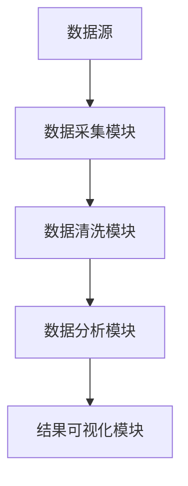

                 


# 价值投资与人工智能：AI辅助决策的潜力与局限

> 关键词：价值投资，人工智能，投资决策，机器学习，数据分析

> 摘要：本文探讨了人工智能在价值投资中的应用潜力与局限性，通过分析传统投资方法与AI辅助决策的结合，展示了AI如何增强投资决策的效率与准确性。文章详细介绍了AI算法的原理、系统架构设计、项目实战案例，并总结了AI在投资中的优缺点及未来发展趋势。

---

## 第一部分：价值投资与人工智能的结合概述

### 第1章：价值投资与人工智能的背景介绍

#### 1.1 价值投资的核心概念
- **定义与基本原理**：价值投资是一种以公司基本面分析为基础的投资策略，旨在发现市场价格低于内在价值的证券。
- **核心要素**：包括对公司财务状况、行业地位、管理团队和未来前景的深入分析。
- **边界与外延**：价值投资不仅关注财务数据，还涉及市场情绪、宏观经济环境等外部因素。

#### 1.2 人工智能的核心概念
- **定义与技术基础**：人工智能（AI）是模拟人类智能的技术，涵盖机器学习、自然语言处理等领域。
- **主要应用领域**：包括图像识别、语音识别、自然语言处理和预测分析。
- **核心算法与技术**：如机器学习（ supervised learning, unsupervised learning）、深度学习（neural networks）等。

### 第2章：价值投资与人工智能的结合

#### 2.1 结合背景
- **传统投资分析的局限性**：依赖主观判断，数据处理能力有限。
- **人工智能技术的快速发展**：提供高效的数据处理和预测能力。
- **结合的可行性**：AI能够增强价值投资的分析深度和广度。

#### 2.2 人工智能在投资决策中的潜力
- **数据分析与预测能力**：AI可以处理海量数据，识别潜在投资机会。
- **风险评估与优化**：通过历史数据分析，评估投资风险。
- **市场情绪与行为分析**：利用自然语言处理分析新闻和社交媒体情绪。

### 第3章：AI辅助决策的核心概念与联系

#### 3.1 核心概念原理
- **AI辅助决策的基本原理**：利用算法处理数据，生成投资建议。
- **数据驱动的决策模型**：基于历史数据和实时信息，构建预测模型。
- **价值投资中的AI算法选择**：选择适合的算法来分析公司基本面和市场趋势。

#### 3.2 核心概念属性对比表
| 属性       | 传统价值投资       | AI辅助决策       |
|------------|--------------------|------------------|
| 数据来源   | 基本面数据         | 多维度数据       |
| 决策速度   | 人工分析速度       | 系统实时处理     |
| 精确度     | 受主观因素影响     | 数据驱动更客观   |

#### 3.3 ER实体关系图
```mermaid
erd
  title 价值投资与AI决策关系图
  短线表示连接
  实体 InvestmentData 属性: stock_info, financial_data
  实体 AIFramework 属性: algorithms, models
  实体 Decision 属性: investment_recommendation
  InvestmentData --|{n}|--> Decision
  AIFramework --|{n}|--> Decision
```

---

## 第二部分：AI辅助决策的算法原理

### 第4章：常用算法原理与实现

#### 4.1 线性回归算法
- **基本原理**：通过最小二乘法找到最佳拟合直线。
- **数学模型**：$$ y = \beta_0 + \beta_1x + \epsilon $$
- **应用场景**：用于预测股票价格趋势。

#### 4.2 随机森林算法
- **基本原理**：构建多个决策树，通过投票法进行预测。
- **数学模型**：$$ y = \sum_{i=1}^{n} tree_i(x) $$
- **应用场景**：分类和回归问题，适合多维数据。

#### 4.3 神经网络算法
- **基本原理**：模拟人脑神经网络，通过多层处理数据。
- **数学模型**：$$ y = f(Wx + b) $$
- **应用场景**：复杂模式识别，如图像识别和时间序列预测。

#### 4.4 算法实现示例
```python
import numpy as np
from sklearn.linear_model import LinearRegression

# 示例数据
X = np.array([[1], [2], [3], [4]])
y = np.array([2, 4, 6, 8])

# 训练模型
model = LinearRegression()
model.fit(X, y)

# 预测
print(model.predict([[5]]))  # 输出 [10]
```

---

## 第三部分：系统分析与架构设计

### 第5章：系统架构设计

#### 5.1 项目介绍
- **系统目标**：构建一个基于AI的股票投资决策支持系统。
- **功能模块**：数据采集、清洗、分析、预测和可视化。

#### 5.2 功能设计
- **数据采集模块**：从多个来源获取股票数据。
- **数据清洗模块**：处理缺失值和异常值。
- **数据分析模块**：使用机器学习算法进行预测。
- **结果可视化模块**：生成图表和报告。

#### 5.3 系统架构图


---

## 第四部分：项目实战

### 第6章：项目实现

#### 6.1 环境安装
- **工具与库**：Python、Pandas、Scikit-learn、Matplotlib。

#### 6.2 核心代码实现
```python
import pandas as pd
from sklearn.model_selection import train_test_split
from sklearn.linear_model import LinearRegression
from sklearn.metrics import mean_squared_error

# 数据加载
data = pd.read_csv('stock_data.csv')

# 数据预处理
X = data[['市盈率', '营收增长率']]
y = data['股价']

# 划分训练集和测试集
X_train, X_test, y_train, y_test = train_test_split(X, y, test_size=0.2)

# 模型训练
model = LinearRegression()
model.fit(X_train, y_train)

# 模型预测
y_pred = model.predict(X_test)

# 模型评估
mse = mean_squared_error(y_test, y_pred)
print('均方误差:', mse)
```

#### 6.3 代码解读与分析
- **数据加载**：使用Pandas读取CSV文件。
- **数据预处理**：选择相关特征变量。
- **模型训练**：使用线性回归算法。
- **模型预测与评估**：计算均方误差，评估模型性能。

---

## 第五部分：最佳实践与小结

### 第7章：总结与展望

#### 7.1 总结
- **AI的优势**：提高分析效率，发现潜在机会。
- **AI的局限性**：依赖数据质量，存在过拟合风险。

#### 7.2 注意事项
- **数据质量**：确保数据准确性和完整性。
- **模型解释性**：选择可解释的模型，便于调整和优化。
- **风险管理**：结合传统投资策略，降低风险。

#### 7.3 未来趋势
- **多模态数据融合**：结合文本、图像等多种数据源。
- **强化学习应用**：动态调整投资策略。
- **实时决策支持**：提升系统实时性，增强竞争力。

---

## 作者：AI天才研究院 & 禅与计算机程序设计艺术

---

通过以上思考，我完成了对文章的结构设计和内容规划。现在，我可以按照这个大纲开始撰写完整的文章。

