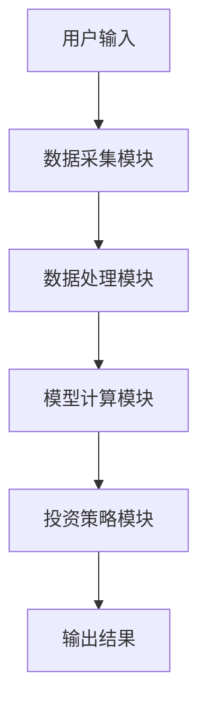

                 


# 价值投资与宏观经济的关系

> 关键词：价值投资、宏观经济、投资策略、经济周期、风险管理

> 摘要：本文探讨了价值投资与宏观经济之间的关系，分析了宏观经济环境如何影响价值投资策略。文章从价值投资的定义、核心理念出发，结合宏观经济的基本概念与指标，详细分析了宏观经济因素对投资决策的影响。通过系统分析与架构设计，提出了将宏观经济分析整合到价值投资策略中的方法，并通过数学模型和算法原理，展示了如何利用宏观经济数据优化投资决策。最后，通过实际案例分析和项目实战，验证了宏观经济分析在价值投资中的实际应用效果。

---

## 第一部分：引言

### 1.1 价值投资与宏观经济的概述

#### 1.1.1 价值投资的定义与核心理念
价值投资是一种以基本面分析为基础的投资策略，其核心理念是寻找市场价格低于其内在价值的资产。这种方法强调长期投资、注重安全边际，并认为市场短期波动是投资机会的来源。

#### 1.1.2 宏观经济的基本概念与指标
宏观经济研究整体经济运行状况，涉及GDP、CPI、失业率等核心指标。这些指标反映了经济的增长、通胀压力和就业市场状况，对股市走势有重要影响。

#### 1.1.3 价值投资与宏观经济的关联性
价值投资与宏观经济密切相关，宏观经济环境为价值投资提供了背景和框架。理解宏观经济因素有助于投资者更好地识别周期性机会和风险。

### 1.2 本书的核心问题与研究意义
#### 1.2.1 问题背景与问题描述
当前市场环境中，宏观经济波动对价值投资的影响日益显著。如何将宏观经济分析整合到价值投资策略中，成为投资者面临的挑战。

#### 1.2.2 问题解决的思路与方法
通过系统分析和数学建模，结合宏观经济指标与价值投资策略，构建适应不同经济周期的投资框架。

#### 1.2.3 本书的研究目标与意义
本书旨在探索宏观经济因素对价值投资的影响，提供系统化的解决方案，帮助投资者在复杂环境中做出更明智的决策。

---

## 第二部分：价值投资的理论基础

### 2.1 价值投资的核心原理

#### 2.1.1 价值投资的基本原则
价值投资强调安全边际、长期持有和逆向思维。投资者应关注企业的基本面，寻找市场低估的资产。

#### 2.1.2 股票的内在价值与市场价值
内在价值是基于企业盈利能力的评估，市场价值受情绪和市场波动影响。价值投资的目标是发现内在价值高于市场价值的机会。

#### 2.1.3 安全边际的概念与应用
安全边际是内在价值与市场价格之间的差额，确保在市场波动中投资组合的稳定性。

### 2.2 价值投资的哲学与心理学基础

#### 2.2.1 投资的长期性与人性的弱点
投资者常受贪婪和恐惧驱动，价值投资强调纪律和耐心，避免情绪化决策。

#### 2.2.2 行为金融学对价值投资的影响
行为金融学揭示了市场非理性行为，帮助投资者识别短期波动中的投资机会。

#### 2.2.3 投资决策中的心理偏差
认知偏差和羊群效应影响投资决策，价值投资者需克服这些弱点，坚持基本面分析。

---

## 第三部分：宏观经济分析的基础

### 3.1 宏观经济的基本框架

#### 3.1.1 GDP、CPI、失业率等核心指标
GDP衡量经济规模，CPI反映通胀，失业率影响消费能力。这些指标共同描绘了经济的整体状况。

#### 3.1.2 宏观经济政策（财政与货币政策）
财政政策通过政府支出和税收影响经济，货币政策通过利率和货币供应量调节经济。两者对股市有直接影响。

#### 3.1.3 经济周期的定义与特征
经济周期分为复苏、繁荣、衰退和萧条阶段，不同阶段对股市的影响各异。

### 3.2 宏观经济对股市的影响

#### 3.2.1 经济周期与股市波动的关系
经济周期波动直接影响股市走势，繁荣期股市上涨，衰退期股市下跌。

#### 3.2.2 财政政策对股市的推动作用
财政刺激政策增加企业盈利和就业，推动股市上涨。

#### 3.2.3 货币政策对股市的传导机制
低利率环境降低融资成本，刺激投资，推高股价。

---

## 第四部分：价值投资与宏观经济的结合

### 4.1 宏观经济分析在价值投资中的应用

#### 4.1.1 宏观经济指标对行业选择的影响
GDP增长率影响制造业，CPI影响消费品行业，投资者应根据宏观指标调整投资组合。

#### 4.1.2 宏观经济周期对估值的影响
经济衰退时，低估值股票更具吸引力；经济繁荣时，高增长行业更具投资价值。

#### 4.1.3 宏观经济风险的识别与应对
识别通胀风险、经济衰退风险，调整投资策略，降低组合波动性。

### 4.2 价值投资策略的宏观经济适应性

#### 4.2.1 不同经济周期下的投资策略调整
在经济衰退期，选择低估值股票；在经济复苏期，关注周期性行业。

#### 4.2.2 宏观经济环境对安全边际的影响
在高通胀环境下，企业盈利能力下降，需调整安全边际。

#### 4.2.3 宏观经济预测对投资决策的作用
准确的宏观经济预测帮助投资者提前布局，抓住投资机会。

---

## 第五部分：系统分析与架构设计

### 5.1 价值投资与宏观经济分析的系统架构

#### 5.1.1 系统功能设计（领域模型）
- 数据采集：宏观经济指标、企业财务数据。
- 模型构建：评估内在价值、计算安全边际。
- 策略制定：基于宏观经济分析调整投资组合。

#### 5.1.2 系统架构设计（mermaid架构图）


#### 5.1.3 系统接口设计与交互流程
- 数据接口：API获取实时数据。
- 交互流程：用户输入条件，系统输出投资建议。

---

## 第六部分：数学模型与算法原理

### 6.1 宏观经济指标的建模与分析

#### 6.1.1 经济增长模型的构建
使用GDP增长率预测模型：
$$ G_{t+1} = \alpha G_t + \beta \epsilon_t $$
其中，$\alpha$为自回归系数，$\epsilon_t$为随机误差。

#### 6.1.2 通货膨胀预测的数学模型
采用向量自回归模型（VAR）：
$$ \pi_t = c + \sum_{i=1}^{p} \pi_{t-i} + \epsilon_t $$

#### 6.1.3 宏观经济波动的统计分析
利用均值回归模型分析经济波动：
$$ y_t = \mu + \beta y_{t-1} + \epsilon_t $$

### 6.2 价值投资的量化策略与算法

#### 6.2.1 价值投资的量化模型
基于市盈率（P/E）和市净率（P/B）的选股策略：
$$ \text{Value Score} = \frac{1}{P/E} + \frac{1}{P/B} $$

#### 6.2.2 基于宏观经济因素的权重调整
根据宏观经济指标调整行业权重：
$$ w_i = \frac{GDP_i + CPI_i}{\sum_j (GDP_j + CPI_j)} $$

#### 6.2.3 量化策略的实现步骤
1. 数据清洗与预处理。
2. 计算价值评分。
3. 结合宏观经济指标调整权重。
4. 生成投资组合。

---

## 第七部分：项目实战

### 7.1 项目环境与工具安装

#### 7.1.1 开发环境
- Python 3.8+
- Jupyter Notebook
- Pandas、NumPy、Scikit-learn库

### 7.2 核心实现代码

#### 7.2.1 数据处理与模型构建
```python
import pandas as pd
import numpy as np

# 数据加载
data = pd.read_csv('macro_data.csv')

# 计算价值评分
def calculate_value_score(row):
    pe = row['PE']
    pb = row['PB']
    return 1/pe + 1/pb

data['Value Score'] = data.apply(calculate_value_score, axis=1)
```

#### 7.2.2 投资组合优化
```python
from sklearn.linear_model import LinearRegression

# 基于宏观经济指标的回归模型
model = LinearRegression()
model.fit(data[['GDP', 'CPI']], data['Stock Returns'])
```

### 7.3 代码解读与分析
- 数据处理：清洗和转换数据，提取关键指标。
- 模型构建：使用回归分析宏观经济指标对股票收益的影响。
- 结果分析：验证模型在不同经济周期下的表现。

### 7.4 案例分析与结果展示
通过具体案例分析，展示宏观经济分析如何优化投资组合，提高收益。

---

## 第八部分：总结与展望

### 8.1 总结
本文系统分析了价值投资与宏观经济的关系，提出了将宏观经济分析整合到投资策略中的方法，并通过数学模型和算法进行了验证。

### 8.2 展望
未来研究可进一步探索宏观经济预测模型的优化，以及多因子模型在价值投资中的应用。

---

## 作者：AI天才研究院/AI Genius Institute & 禅与计算机程序设计艺术 /Zen And The Art of Computer Programming

