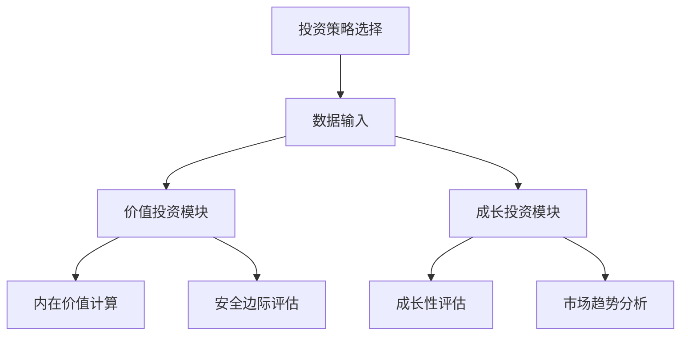

                 


# 价值投资与成长投资的对比

---

## 关键词：价值投资、成长投资、投资策略、内在价值、成长性、安全边际、DCF模型、PEG指标

---

## 摘要：  
价值投资与成长投资是两种截然不同的投资策略，前者注重安全边际和内在价值，适合追求稳定收益的投资者；后者则关注企业的成长潜力和未来盈利能力，适合风险承受能力较高的投资者。本文将从定义、核心理念、分析方法、数学模型、系统架构以及实际案例等方面，深入对比分析价值投资与成长投资的异同，帮助读者更好地理解这两种策略的特点与应用场景。

---

## 第一部分：价值投资与成长投资的背景与基础

### 第1章：价值投资与成长投资的起源与定义

#### 1.1 价值投资的起源与核心理念  
价值投资起源于20世纪初，由本杰明·格雷厄姆和戴维·多德提出，强调以低于内在价值的价格买入优质股票。其核心理念是：市场价格与内在价值的差异是投资机会的来源，投资者应寻找市场价格低于内在价值的股票。

#### 1.2 成长投资的起源与核心理念  
成长投资起源于20世纪60年代，以菲德勒·费希尔为代表，强调投资于具有持续增长潜力的企业，尤其是那些收入和利润快速增长的公司。其核心理念是：企业的成长性是决定股票长期价值的关键因素。

#### 1.3 价值投资与成长投资的对比  
- **核心理念**：价值投资关注价格与价值的匹配，成长投资关注企业的增长潜力。  
- **投资目标**：价值投资追求安全边际，成长投资追求未来增长。  
- **适用场景**：价值投资适合市场低迷或估值过低的情况，成长投资适合高增长行业或经济繁荣时期。  

---

## 第二部分：价值投资与成长投资的核心概念与联系

### 第2章：价值投资的核心概念与原理  

#### 2.1 内在价值的计算  
价值投资的核心是内在价值的评估，常用的方法是现金流折现模型（DCF）。DCF模型通过将未来现金流折现，计算出企业的内在价值。  

公式：  
$$ \text{内在价值} = \sum_{t=1}^{n} \frac{CF_t}{(1+r)^t} + \frac{TV}{(1+r)^n} $$  

其中，$CF_t$ 是第 $t$ 年的现金流，$r$ 是折现率，$TV$ 是终值。  

#### 2.2 安全边际的概念  
安全边际是价值投资中一个重要的概念，指市场价格低于内在价值的部分。安全边际越大，投资风险越小。  

公式：  
$$ \text{安全边际} = \text{内在价值} - \text{市场价格} $$  

### 第3章：成长投资的核心概念与原理  

#### 3.1 成长性的评估  
成长投资的核心是企业的成长潜力，常用指标包括收入增长率、利润增长率和PEG（价格/盈利增长）指标。  

公式：  
$$ \text{PEG} = \frac{\text{市盈率}}{\text{盈利增长率}} $$  

#### 3.2 市场趋势与行业周期  
成长投资强调对市场趋势和行业周期的分析，选择处于上升周期且具备竞争优势的企业。  

### 第4章：价值投资与成长投资的对比分析  

#### 4.1 核心概念对比  
| **维度**       | **价值投资**                     | **成长投资**                     |
|----------------|----------------------------------|----------------------------------|
| 核心目标       | 以低于内在价值的价格买入股票    | 投资于具有持续增长潜力的企业     |
| 关注点         | 当前价格与内在价值               | 未来的成长性和盈利能力           |
| 风险偏好       | 低风险，追求安全边际             | 高风险，追求高增长               |

#### 4.2 投资策略对比  
- **价值投资**：防御性策略，注重安全边际，适合市场低迷时投资。  
- **成长投资**：进攻性策略，注重成长潜力，适合市场繁荣时投资。  

---

## 第三部分：价值投资与成长投资的数学模型与算法原理  

### 第5章：价值投资的数学模型  

#### 5.1 DCF模型的实现  
DCF模型是价值投资中最重要的数学工具，用于计算企业的内在价值。以下是DCF模型的简单实现：  

```python
def dcf_model(cash_flows, discount_rate, terminal_value):
    present_value = 0
    for t, cf in enumerate(cash_flows):
        if t == 0:
            present_value += cf
        else:
            present_value += cf / (1 + discount_rate) ** t
    present_value += terminal_value / (1 + discount_rate) ** len(cash_flows)
    return present_value

# 示例：计算某企业的DCF值
cash_flows = [100, 150, 200, 250]
discount_rate = 0.1
terminal_value = 500
intrinsic_value = dcf_model(cash_flows, discount_rate, terminal_value)
print("内在价值 =", intrinsic_value)
```

#### 5.2 安全边际的计算  

公式：  
$$ \text{安全边际} = \text{内在价值} - \text{市场价格} $$  

### 第6章：成长投资的数学模型  

#### 6.1 PEG指标的实现  

公式：  
$$ \text{PEG} = \frac{\text{市盈率}}{\text{盈利增长率}} $$  

以下是PEG指标的Python实现：  

```python
def calculate_peg(pe_ratio, earnings_growth_rate):
    peg = pe_ratio / earnings_growth_rate
    return peg

# 示例：计算某企业的PEG值
pe_ratio = 20
earnings_growth_rate = 15
peg_value = calculate_peg(pe_ratio, earnings_growth_rate)
print("PEG =", peg_value)
```

---

## 第四部分：价值投资与成长投资的系统架构与项目实战  

### 第7章：价值投资与成长投资的系统架构  

#### 7.1 系统功能设计  
- **价值投资模块**：包括内在价值计算、安全边际评估等功能。  
- **成长投资模块**：包括成长性评估、市场趋势分析等功能。  

#### 7.2 系统架构设计  

以下是一个简单的系统架构图：  



### 第8章：项目实战：价值投资与成长投资的对比分析  

#### 8.1 价值投资案例分析  
以可口可乐为例，计算其内在价值和安全边际。  

#### 8.2 成长投资案例分析  
以苹果为例，计算其PEG值和成长性潜力。  

#### 8.3 对比分析  
从案例分析中可以看出，价值投资更适合稳定型企业，而成长投资更适合高增长企业。  

---

## 第五部分：总结与展望  

### 第9章：总结与最佳实践  

#### 9.1 总结  
价值投资与成长投资各有优劣，选择哪种策略取决于投资者的风险偏好和市场环境。  

#### 9.2 最佳实践  
- **价值投资者**：注重安全边际，选择低估股票，长期持有。  
- **成长投资者**：关注企业成长性，选择高增长股票，耐心持有。  

#### 9.3 注意事项  
- 投资者应根据市场环境调整策略。  
- 避免过度集中投资，保持投资组合的分散性。  

---

## 作者：AI天才研究院 & 禅与计算机程序设计艺术

