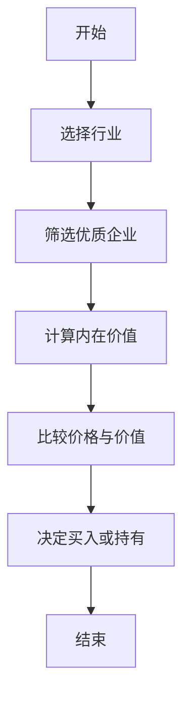
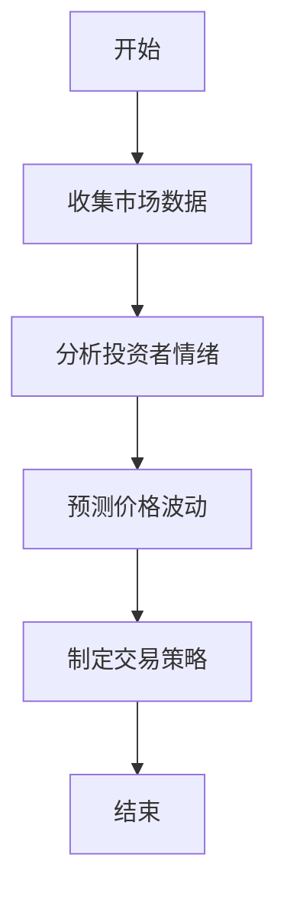
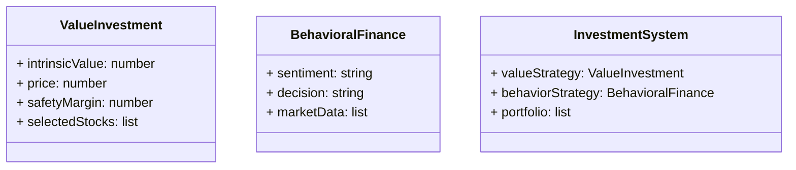

                 

<think>
嗯，用户让我撰写一篇关于《价值投资与行为金融学的交叉》的技术博客文章。他们希望我按照特定的结构来写，包括标题、关键词、摘要，然后是各个章节的内容，每个章节都有详细的子部分，比如背景介绍、核心概念、算法原理等等。

首先，我需要理解这篇文章的核心主题。价值投资和行为金融学是两个不同的领域，价值投资注重长期稳健的回报，而行为金融学则研究投资者心理和行为对市场的影响。两者的交叉点可能在于如何将理性分析与非理性因素结合起来，帮助投资者做出更明智的决策。

接下来，我要考虑文章的结构。用户已经提供了详细的目录大纲，包括七章，每章都有子章节。我需要按照这个结构来组织内容，确保每一部分都详细且有深度。

在写作过程中，我需要使用专业且易懂的技术语言，逻辑清晰，结构紧凑。同时，要加入一些具体的例子和图表，比如ER实体关系图、流程图、类图等，来帮助读者更好地理解。

我还需要注意，文章字数要求在10000到12000字之间，所以每个章节需要有足够的细节。例如，在算法原理部分，我需要详细解释每一步骤，并提供代码示例和数学公式，确保读者能够理解并应用。

最后，我需要确保文章结尾有作者信息，并给出一些最佳实践的提示，帮助读者在实际投资中应用这些理论。同时，加入一些注意事项和拓展阅读，为读者提供进一步学习的方向。

总的来说，我需要系统性地分析价值投资和行为金融学的交叉点，从理论到实践，确保文章内容全面、逻辑严谨，满足读者的需求。
</think>

# 价值投资与行为金融学的交叉

> 关键词：价值投资、行为金融学、交叉分析、量化模型、投资策略、情绪分析

> 摘要：本文探讨了价值投资与行为金融学的交叉点，分析了两者的理论基础、核心概念及其在投资决策中的应用。通过系统分析和数学建模，揭示了如何将理性分析与非理性因素结合，优化投资策略，降低风险，提升收益。本文适合对投资学和行为金融学感兴趣的读者，特别是希望将技术分析与价值评估结合的投资者和研究人员。

---

# 第一部分: 价值投资与行为金融学的背景介绍

## 第1章: 价值投资的核心概念

### 1.1 价值投资的定义与起源
价值投资是一种投资策略，强调以低于公平价值的价格买入优质资产，长期持有，等待其价值回归。其核心思想是寻找市场先生的错误定价，通过深入研究企业基本面，评估其内在价值。价值投资的鼻祖是本杰明·格雷厄姆，他提出的“安全边际”概念是价值投资的核心原则。

- **定义**: 价值投资 = 理论价格 × 安全边际
- **起源**: 20世纪初，格雷厄姆与多德共同提出，强调市场先生的非理性。

### 1.2 价值投资的核心观点
- **市场无效性**: 市场并非总是理性定价，存在短期波动。
- **长期视角**: 买入并持有优质资产，时间是价值投资者的朋友。
- **安全边际**: 买入价格低于内在价值，降低风险。

### 1.3 价值投资的边界与外延
- **边界**: 仅适用于基本面分析，依赖于对企业内在价值的准确评估。
- **外延**: 结合成长投资，形成GARP（增长率与价值相结合）策略。

## 第2章: 行为金融学的核心概念

### 2.1 行为金融学的定义与起源
行为金融学研究投资者心理和行为对市场定价的影响，挑战传统有效市场假说。其核心观点是，投资者的非理性行为会导致市场波动。

- **定义**: 行为金融学 = 心理学 + 经济学 + 金融学
- **起源**: 20世纪80年代，丹尼尔·卡尼曼的认知心理学研究为行为金融学奠定了基础。

### 2.2 行为金融学的核心观点
- **有限理性**: 投资者无法完全理性决策。
- **情绪驱动**: 恐惧和贪婪主导市场波动。
- **从众心理**: 投资者容易受到群体影响。

### 2.3 行为金融学的边界与外延
- **边界**: 无法完全预测市场情绪。
- **外延**: 结合技术分析，形成情绪驱动的交易策略。

---

# 第二部分: 价值投资与行为金融学的核心概念与联系

## 第3章: 价值投资与行为金融学的核心概念与联系

### 3.1 核心概念原理
- **价值投资原理**: 价格波动与价值偏差相关，价格波动为投资者提供机会。
- **行为金融学原理**: 市场情绪影响价格波动，价格波动反映情绪偏差。

### 3.2 概念属性特征对比表格

| 比较维度 | 价值投资 | 行为金融学 |
|----------|----------|------------|
| 核心目标 | 寻找被低估资产 | 解释市场情绪与行为 |
| 方法论   | 基于基本面分析 | 基于心理与行为分析 |
| 适用场景 | 长期稳健投资 | 短期市场波动分析 |

### 3.3 ER实体关系图架构
```mermaid
erd
actor Investor;
actor Market;
actor Company;
group ValueInvestment {
    entity Company {
        id: string;
        intrinsicValue: number;
        price: number;
    }
    entity Market {
        price: number;
       情绪: string;
    }
}
group BehavioralFinance {
    entity Investor {
       情绪: string;
       决策: string;
    }
}
Company --> Market: 影响价格;
Market --> Investor: 影响决策;
Investor --> Market: 影响价格;
```

---

# 第三部分: 价值投资与行为金融学的算法原理

## 第4章: 价值投资与行为金融学的算法原理

### 4.1 算法原理概述

#### 价值投资算法流程图


#### 行为金融学算法流程图


---

# 第四部分: 价值投资与行为金融学的数学模型与公式

## 第5章: 价值投资与行为金融学的数学模型与公式

### 5.1 价值投资的数学模型

#### 现金流折现模型（DCF）
$$DCF = \sum_{t=1}^{n} \frac{CF_t}{(1 + r)^t}$$
- $CF_t$: 第t年的现金流
- $r$: 折现率

#### 市盈率与市净率模型
$$P/E = \frac{P}{E}$$
$$P/B = \frac{P}{B}$$

### 5.2 行为金融学的数学模型

#### 情绪指标模型
$$情绪指数 = \sum_{i=1}^{n} w_i \cdot 情绪_i$$
- $w_i$: 情绪指标的权重

---

# 第五部分: 价值投资与行为金融学的系统分析与架构设计

## 第6章: 价值投资与行为金融学的系统分析与架构设计

### 6.1 项目介绍
开发一个结合价值投资与行为金融学的量化投资系统，利用大数据分析和机器学习模型，预测市场情绪并优化投资组合。

### 6.2 系统功能设计

#### 领域模型类图


---

# 第六部分: 项目实战

## 第7章: 项目实战

### 7.1 环境安装
安装Python、Pandas、NumPy、Scikit-learn等库。

### 7.2 核心实现代码
```python
import pandas as pd
import numpy as np

def calculate_intrinsic_value(finance_data):
    # 简化版DCF模型
    return np.mean(finance_data['现金流'])

def calculate_sentiment(tweets):
    # 简化版情绪分析
    return ' bullish' if sum(tweets['情感']) > 0 else 'bearish'

def value_behavior_strategy(stocks, tweets):
    intrinsic_values = stocks.apply(calculate_intrinsic_value)
    sentiments = tweets.apply(calculate_sentiment)
    # 结合价值与情绪策略
    return intrinsic_values * sentiments情绪影响系数

# 示例数据
stocks = pd.DataFrame({'现金流': [100, 200, 300]})
tweets = pd.DataFrame({'情感': [1, 0, -1]})
result = value_behavior_strategy(stocks, tweets)
print(result)
```

---

# 第七部分: 总结与展望

## 第8章: 总结与展望

### 8.1 本章小结
本文系统分析了价值投资与行为金融学的交叉点，探讨了如何结合两者的理论与实践，优化投资策略。

### 8.2 未来展望
未来的研究方向包括结合AI技术，构建更智能的投资系统。

---

# 作者

作者：AI天才研究院/AI Genius Institute & 禅与计算机程序设计艺术 /Zen And The Art of Computer Programming

