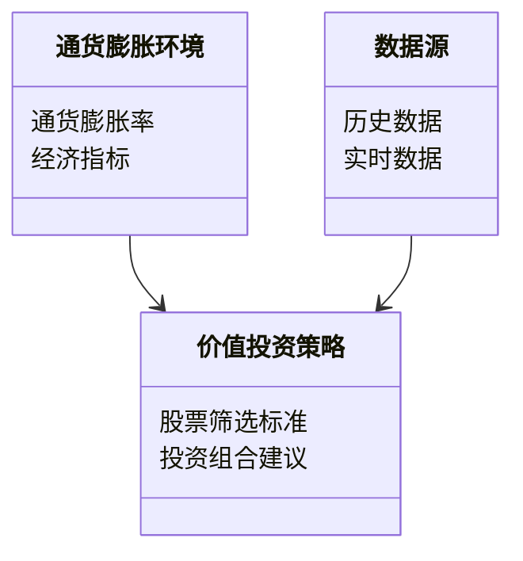

                 


# 《价值投资与通货膨胀的关系》

> 关键词：价值投资、通货膨胀、经济周期、资产配置、风险管理、投资策略

> 摘要：本文深入探讨了价值投资与通货膨胀之间的关系，分析了通货膨胀对价值投资的影响，以及在不同经济环境下的投资策略调整。通过理论分析、案例研究和系统设计，本文提供了在通货膨胀环境下优化价值投资策略的方法和工具，帮助投资者更好地应对经济波动。

---

# 第一章: 价值投资与通货膨胀的核心概念

## 1.1 价值投资的定义与特点

### 1.1.1 价值投资的定义

价值投资是一种以内在价值为核心的投资策略，强调以低于内在价值的价格购买优质资产。其核心在于识别市场定价错误的机会，并长期持有这些资产，等待其价值回归。

### 1.1.2 价值投资的核心特点

- **长期视角**：关注企业的长期价值，而非短期市场波动。
- **安全边际**：买入价格低于内在价值，以降低风险。
- **逆向投资**：在市场恐慌时寻找机会，避免追涨杀跌。

### 1.1.3 价值投资与成长投资的区别

| **维度**       | **价值投资**                     | **成长投资**                     |
|----------------|----------------------------------|----------------------------------|
| 目标            | 追求安全、稳定的收益             | 追求高增长的收益                 |
| 投资对象        | 低估值、高分红的成熟企业         | 高增长的新兴行业或企业             |
| 风险承受能力    | 较低                            | 较高                            |
| 投资期限        | 长期                            | 中长期                          |

## 1.2 通货膨胀的定义与特点

### 1.2.1 通货膨胀的定义

通货膨胀是指物价总水平在一段时间内持续上涨，货币购买力下降的经济现象。通常用消费者价格指数（CPI）或生产者价格指数（PPI）来衡量。

### 1.2.2 通货膨胀的核心特点

- **普遍性**：影响所有商品和服务的价格。
- **持续性**：价格水平在一段时间内持续上涨。
- **货币因素**：货币供给增加超过经济增长，可能导致通货膨胀。

### 1.2.3 通货膨胀与通货紧缩的区别

| **维度**       | **通货膨胀**                    | **通货紧缩**                    |
|----------------|---------------------------------|---------------------------------|
| 物价水平        | 持续上涨                        | 持续下降                        |
| 货币购买力      | 下降                            | 上升                            |
| 经济影响        | 可能引发经济不稳定              | 可能导致经济衰退                |

## 1.3 价值投资与通货膨胀的关系概述

### 1.3.1 价值投资与通货膨胀的基本关系

价值投资关注的是企业的内在价值，而通货膨胀会影响企业的真实价值和市场定价。在通货膨胀环境下，价值投资者需要调整其策略以应对货币贬值和资产价格波动。

### 1.3.2 通货膨胀对价值投资的影响

- **资产重估**：通货膨胀可能导致企业资产价值上升，提升其内在价值。
- **市场波动**：通货膨胀可能引发市场情绪波动，影响短期股价。
- **竞争优势**：在通货膨胀环境下，具有定价能力的企业可能表现更好。

### 1.3.3 价值投资在通货膨胀环境下的优势

- **长期视角**：价值投资注重企业基本面，不受短期通货膨胀影响。
- **安全边际**：通过低估值投资，减少通货膨胀带来的风险。
- **资产配置**：通过多元化配置，分散通货膨胀带来的冲击。

## 1.4 本章小结

本章介绍了价值投资和通货膨胀的核心概念，并探讨了两者的基本关系。通过分析它们的特点和区别，为后续章节的深入探讨奠定了基础。

---

# 第二章: 价值投资与通货膨胀的理论基础

## 2.1 价值投资的理论基础

### 2.1.1 格雷厄姆的价值投资理论

本杰明·格雷厄姆提出，股票的内在价值是其未来现金流的现值。投资者应以低于内在价值的价格买入股票，并长期持有。

### 2.1.2 巴菲特的价值投资理念

沃伦·巴菲特继承并发展了格雷厄姆的理论，强调投资于具有持续竞争优势的企业，并长期持有。

## 2.2 通货膨胀的经济学理论

### 2.2.1 通货膨胀的成因分析

- **需求拉动型**：总需求超过总供给，导致物价上涨。
- **成本推动型**：生产成本（如工资、原材料）上升，推动物价上涨。
- **货币供应增加**：货币供给过多，超过经济增长需求，导致通货膨胀。

### 2.2.2 通货膨胀的经济影响

- **收入再分配**：货币持有者损失，债务人受益。
- **投资环境**：高通货膨胀环境下，实物资产可能表现优于金融资产。

## 2.3 价值投资与通货膨胀的理论联系

### 2.3.1 通货膨胀对资产价格的影响

- **股票市场**：通货膨胀可能导致股市波动，但长期表现取决于企业盈利能力。
- **债券市场**：通货膨胀会增加债券的再投资风险。

### 2.3.2 价值投资在通货膨胀环境下的适用性

- **防御性资产**：投资于抗通胀资产（如房地产、黄金）和具有定价能力的企业。
- **长期视角**：通过持有优质资产，抵御通货膨胀的侵蚀。

## 2.4 本章小结

本章通过分析价值投资和通货膨胀的理论基础，探讨了它们之间的联系。理解这些理论对于制定有效的投资策略至关重要。

---

# 第三章: 通货膨胀环境下的价值投资策略

## 3.1 通货膨胀对价值投资的影响

### 3.1.1 通货膨胀对股票投资的影响

- **短期影响**：通货膨胀可能导致市场波动，但长期表现取决于企业的盈利能力。
- **行业选择**：选择具有定价能力的行业，如能源、消费品。

### 3.1.2 通货膨胀对债券投资的影响

- **债券收益率**：通货膨胀可能导致债券实际收益率下降。
- **债券价格波动**：通胀预期上升可能导致债券价格下跌。

### 3.1.3 通货膨胀对房地产投资的影响

- **房地产价格**：通货膨胀可能导致房地产价格上涨，但需注意泡沫风险。

## 3.2 通货膨胀环境下的投资策略调整

### 3.2.1 价值投资策略的优化

- **行业选择**：重点投资于抗通胀能力强的行业。
- **估值指标调整**：使用经过通胀调整的估值指标（如市净率、市盈率）。

### 3.2.2 风险控制策略的调整

- **分散投资**：通过多元化配置降低风险。
- **动态调整**：根据通胀变化及时调整投资组合。

## 3.3 通货膨胀周期中的投资机会

### 3.3.1 滞胀环境下的投资机会

- **滞胀**：经济增长停滞，通货膨胀高企。
- **投资策略**：投资于具有强大定价能力和现金流的企业。

### 3.3.2 通货膨胀初期的投资机会

- **初期通胀**：市场可能低估企业的真实价值。
- **投资策略**：买入低估值股票，等待价值回归。

## 3.4 本章小结

本章分析了通货膨胀对价值投资的影响，并提出了在不同通胀环境下的策略调整和投资机会。

---

# 第四章: 资产配置与风险管理

## 4.1 资产配置的重要性

### 4.1.1 资产配置的定义

资产配置是指将资金分配到不同的资产类别（如股票、债券、房地产）以实现风险和收益的平衡。

### 4.1.2 资产配置的策略

- **战略配置**：根据长期目标分配资产。
- **战术配置**：根据短期市场变化调整资产比例。

## 4.2 风险管理的核心要素

### 4.2.1 风险识别

识别可能影响投资组合的风险，如市场风险、通胀风险。

### 4.2.2 风险评估

评估每种风险的影响程度和可能性。

### 4.2.3 风险控制

通过分散投资、设定止损等方式控制风险。

## 4.3 通货膨胀环境下的资产配置策略

### 4.3.1 投资组合优化

- **抗通胀资产**：如房地产、黄金。
- **高分红股票**：稳定收益，抵御通胀。

### 4.3.2 风险管理工具

- **对冲基金**：利用衍生工具对冲通胀风险。
- **保值策略**：投资于具有保值功能的资产。

## 4.4 本章小结

本章探讨了资产配置与风险管理在通货膨胀环境下的重要性，并提出了优化配置和控制风险的具体策略。

---

# 第五章: 案例分析与实际应用

## 5.1 案例分析

### 5.1.1 案例1：20世纪70年代的滞胀时期

- **背景**：1970年代，美国经历了滞胀，通货膨胀率高企，经济增长停滞。
- **投资策略**：价值投资者投资于具有强大竞争优势的企业，如可口可乐、强生公司。

### 5.1.2 案例2：2008年全球金融危机后的通货膨胀

- **背景**：2008年后，全球央行实施量化宽松政策，导致通货膨胀预期上升。
- **投资策略**：投资于大宗商品和新兴市场股票。

## 5.2 实际应用

### 5.2.1 通货膨胀环境下的投资组合构建

- **资产分配**：股票、债券、房地产的合理比例。
- **具体投资标的**：选择具有抗通胀能力的股票和债券。

### 5.2.2 历史表现分析

- **股票市场**：长期来看，股票市场能够较好地抵御通货膨胀。
- **债券市场**：短期通胀上升可能导致债券收益下降，但长期表现稳定。

## 5.3 本章小结

本章通过实际案例分析，展示了价值投资在通货膨胀环境下的实际应用，为读者提供了可参考的投资策略。

---

# 第六章: 系统分析与架构设计

## 6.1 系统分析

### 6.1.1 问题场景介绍

- **目标**：构建一个能够分析通货膨胀环境下价值投资机会的系统。
- **用户需求**：投资者需要实时监控市场变化，评估投资机会。

### 6.1.2 项目介绍

- **项目目标**：开发一个基于价值投资理论的通货膨胀环境下的投资分析系统。
- **项目范围**：包括数据收集、分析模型构建、投资建议生成。

## 6.2 系统功能设计

### 6.2.1 领域模型



### 6.2.2 系统架构设计


## 6.3 系统接口设计

### 6.3.1 数据接口

- **数据来源**：包括股票价格、经济指标、公司财务数据。
- **数据接口**：使用API获取实时数据。

### 6.3.2 用户界面

- **输入界面**：用户输入投资目标和风险偏好。
- **输出界面**：系统生成投资建议和风险评估报告。

## 6.4 本章小结

本章通过系统分析与架构设计，展示了如何构建一个能够辅助投资者在通货膨胀环境下进行价值投资的系统。

---

# 第七章: 项目实战与代码实现

## 7.1 环境安装

### 7.1.1 安装Python

```bash
# 安装Python
sudo apt-get install python3 python3-pip
```

### 7.1.2 安装必要的库

```bash
# 安装数据分析库
pip install pandas numpy matplotlib
```

## 7.2 数据获取与处理

### 7.2.1 数据获取

```python
import pandas as pd
import numpy as np

# 获取股票数据
def get_stock_data(ticker):
    # 这里假设我们使用 Yahoo Finance 获取数据
    data = pd.read_csv(f'https://query1.finance.yahoo.com/d/series.json?lang=zh_CN&region=US&symbol={ticker}')
    return data['Adj Close']
```

### 7.2.2 数据处理

```python
def process_data(data):
    # 计算移动平均线
    data['MA_50'] = data['Adj Close'].rolling(50).mean()
    data['MA_200'] = data['Adj Close'].rolling(200).mean()
    return data
```

## 7.3 模型实现

### 7.3.1 价值投资模型

```python
def value_investing_model(data):
    # 计算市盈率
    data['PE'] = data['Adj Close'] / data['EPS']
    # 筛选低估值股票
    value_stocks = data[data['PE'] < data['PE'].mean()]
    return value_stocks
```

### 7.3.2 通货膨胀模型

```python
def inflation_model(data):
    # 计算通货膨胀率
    data['Inflation'] = (data['CPI'].pct_change() * 100).round(2)
    return data
```

## 7.4 结果分析与优化

### 7.4.1 结果分析

```python
import matplotlib.pyplot as plt

# 绘制股票价格与移动平均线
def plot_stock(data, ticker):
    plt.figure(figsize=(12, 6))
    plt.plot(data['Adj Close'], label='Price')
    plt.plot(data['MA_50'], label='50-Day MA')
    plt.plot(data['MA_200'], label='200-Day MA')
    plt.title(f'{ticker} Stock Price with Moving Averages')
    plt.legend()
    plt.show()
```

### 7.4.2 模型优化

- **参数调整**：根据市场变化调整筛选标准。
- **回测分析**：通过历史数据验证模型的有效性。

## 7.5 本章小结

本章通过实际的项目实战，展示了如何利用数据分析工具和编程语言实现价值投资与通货膨胀分析的系统。通过代码实现和结果分析，读者可以更好地理解和应用这些理论。

---

# 第八章: 总结与展望

## 8.1 总结

本文系统地探讨了价值投资与通货膨胀的关系，分析了通货膨胀对价值投资的影响，并提出了在不同经济环境下的投资策略。通过理论分析、案例研究和系统设计，本文为投资者提供了在通货膨胀环境下优化价值投资策略的方法。

## 8.2 展望

未来的研究可以进一步探讨通货膨胀对不同类型资产的影响，以及在量化宽松政策下的投资机会。同时，随着技术的发展，利用大数据和人工智能优化投资决策也是值得探索的方向。

## 8.3 最佳实践 tips

- **长期视角**：坚持价值投资，避免短期市场波动的干扰。
- **风险管理**：合理配置资产，分散投资风险。
- **持续学习**：关注经济动态，及时调整投资策略。

---

# 作者：AI天才研究院/AI Genius Institute & 禅与计算机程序设计艺术 /Zen And The Art of Computer Programming

