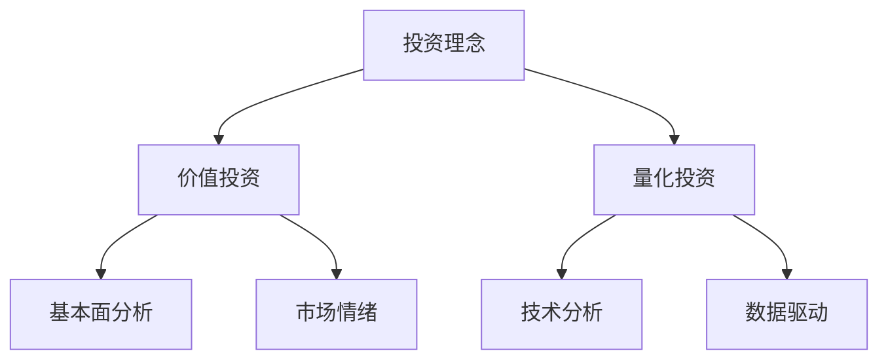
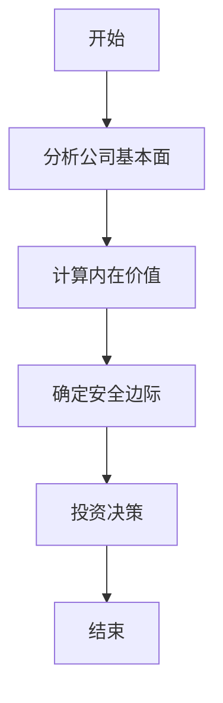
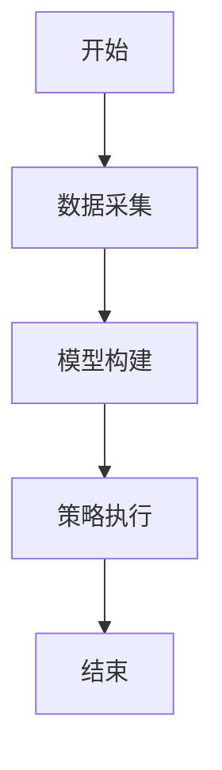
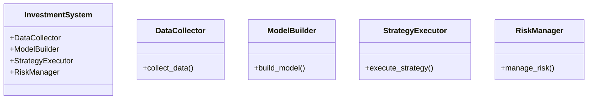
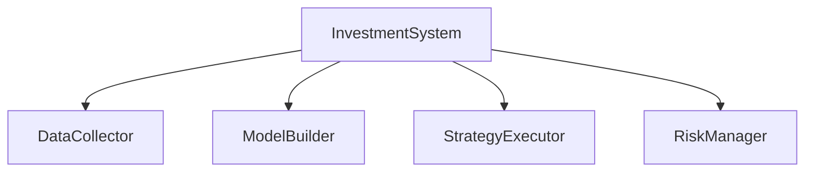

                 

<think>
嗯，用户让我写一篇关于《价值投资与量化投资的对比》的技术博客。首先，我需要明确用户的需求。他是一位技术专家，可能对投资领域也有兴趣，所以想从技术角度分析这两种投资策略。

用户已经提供了一个详细的目录结构，包括背景介绍、核心概念、算法原理、数学模型、系统分析、项目实战和最佳实践。我需要确保每个部分都详细且逻辑清晰，同时使用专业但易懂的语言。

首先，背景介绍部分，我应该解释价值投资和量化投资的基本概念，它们的起源和发展。这部分需要让读者了解这两种方法的基本区别。例如，价值投资强调基本面分析，而量化投资则依赖数据和模型。

接下来是核心概念与联系，这里需要用表格对比两者的优缺点，并用Mermaid图展示它们之间的关系。这有助于读者直观理解两者如何相互作用。

然后是算法原理，我需要分别详细说明价值投资和量化投资的策略流程，并用Mermaid图展示。同时，提供Python代码示例，帮助读者理解这些策略的实际应用。

数学模型部分，我需要解释两种投资方法背后的数学公式，并用LaTeX展示。例如，计算内在价值的公式，或者量化模型中的回归分析。这部分需要确保公式正确且解释清楚。

系统分析与架构设计部分，我需要描述一个投资系统的组成部分，用Mermaid图展示类图、架构图和交互图。这有助于读者理解系统的整体结构和工作流程。

项目实战部分，我需要指导读者如何安装环境，实现核心功能，并分析实际案例。这部分要具体，提供可执行的代码和案例分析，让读者能够动手实践。

最后，最佳实践部分，我需要总结两者的优缺点，给出投资建议，并推荐进一步阅读的资料。这部分要简明扼要，帮助读者巩固所学内容。

整个思考过程中，我需要确保内容详实，逻辑连贯，同时语言专业但不晦涩。这样才能满足用户的需求，写出一篇高质量的技术博客文章。
</think>

```markdown
# 价值投资与量化投资的对比

> 关键词：价值投资、量化投资、投资策略、数学模型、基本面分析、技术分析

> 摘要：本文从价值投资与量化投资的核心概念出发，详细对比了两者的优缺点、算法原理、数学模型和系统架构。通过实际案例分析和Python代码实现，深入探讨了两种投资策略在实践中的应用，并结合系统架构设计，提出了投资系统的整体解决方案。最后，本文总结了价值投资与量化投资的最佳实践和注意事项，为投资者提供了全面的参考。

---

# 第一部分: 价值投资与量化投资的背景介绍

## 第1章: 价值投资与量化投资的核心概念

### 1.1 价值投资的定义与特点
#### 1.1.1 价值投资的起源与发展
价值投资是一种以基本面分析为基础的投资策略，起源于20世纪20年代，由本杰明·格雷厄姆和戴维·多德共同提出。其核心思想是通过分析公司的财务数据，寻找市场低估的股票进行投资。

#### 1.1.2 价值投资的核心要素
- **内在价值**：公司未来现金流的现值，是判断股票是否被低估的核心标准。
- **安全边际**：买入价格低于内在价值，以降低投资风险。
- **长期视角**：关注公司的长期盈利能力，而非短期市场波动。

#### 1.1.3 价值投资的适用场景
- 适合长期投资者。
- 适用于市场低迷或股票被低估的情况。
- 需要较高的财务分析能力。

### 1.2 量化投资的定义与特点
#### 1.2.1 量化投资的起源与发展
量化投资是一种基于数学模型和算法的投资策略，起源于20世纪80年代，随着计算机技术的发展而迅速崛起。其核心是通过算法交易和大数据分析，寻找市场中的套利机会。

#### 1.2.2 量化投资的核心要素
- **数学模型**：基于统计学和机器学习的算法，用于预测市场走势和优化投资组合。
- **数据驱动**：依赖高频交易和大数据分析，捕捉短期市场机会。
- **自动化交易**：通过算法自动执行交易指令，减少人为干扰。

#### 1.2.3 量化投资的适用场景
- 适合短期投资者。
- 适用于市场流动性高、数据丰富的环境。
- 需要强大的技术开发能力和数据分析能力。

### 1.3 价值投资与量化投资的对比
#### 1.3.1 核心概念对比
| 对比维度 | 价值投资 | 量化投资 |
|----------|-----------|-----------|
| 核心理念 | 基于基本面分析，寻找低估股票 | 基于数学模型，寻找市场机会 |
| 投资期限 | 长期投资 | 短期交易 |
| 风险控制 | 通过安全边际控制风险 | 通过算法优化投资组合 |

#### 1.3.2 方法论对比
- **价值投资**：关注公司的基本面，如市盈率、市净率、ROE等指标。
- **量化投资**：关注市场的技术指标，如动量效应、波动率等。

#### 1.3.3 优缺点对比
- **价值投资**：优点是风险低、收益稳定；缺点是需要较高的分析能力，且见效较慢。
- **量化投资**：优点是收益高、见效快；缺点是风险高、对技术要求高。

---

# 第二部分: 价值投资与量化投资的核心概念与联系

## 第2章: 核心概念的原理与联系

### 2.1 价值投资的原理
#### 2.1.1 内在价值的计算方法
$$ \text{内在价值} = \sum_{t=1}^{\infty} \frac{\text{现金流}_t}{(1 + r)^t} $$
其中，\( r \) 是折现率，现金流是公司未来每期的现金流。

#### 2.1.2 安全边际的概念
$$ \text{安全边际} = \text{内在价值} - \text{市场价格} $$
安全边际为正时，股票具有投资价值。

#### 2.1.3 资产负债表分析
- 关注公司的资产、负债和所有者权益。
- 重点分析公司的盈利能力、成长能力和偿债能力。

### 2.2 量化投资的原理
#### 2.2.1 数学模型的构建
量化投资依赖于统计套利和因子模型，例如Fama-French三因子模型：
$$ R_i = R_f + \beta_i (R_m - R_f) + 0.3 \times \text{Size}_i - 0.6 \times \text{Value}_i $$
其中，\( R_i \) 是股票的超额收益，\( R_f \) 是无风险利率，\( \beta_i \) 是股票的beta系数，\( R_m \) 是市场平均收益。

#### 2.2.2 数据驱动的投资策略
- 利用大数据分析市场情绪、交易量和价格走势。
- 通过高频交易捕捉短期市场波动。

#### 2.2.3 技术指标的应用
- **动量策略**：买入近期表现优于市场的股票。
- **均值回归策略**：买入价格偏离均值的股票。

### 2.3 价值投资与量化投资的联系
#### 2.3.1 概念属性特征对比表格
| 属性 | 价值投资 | 量化投资 |
|------|-----------|-----------|
| 核心 | 基本面分析 | 数学模型 |
| 工具 | 财务报表、估值指标 | 数据、算法 |
| 方法 | 定性分析 | 定量分析 |
| 优劣 | 风险低，收益稳定 | 收益高，风险高 |

#### 2.3.2 ER实体关系图架构


---

# 第三部分: 价值投资与量化投资的算法原理

## 第3章: 价值投资的算法原理

### 3.1 价值投资的策略流程


### 3.2 价值投资的Python实现
```python
def calculate_intrinsic_value(company_data):
    # 示例：计算内在价值的简化模型
    revenue = company_data['Revenue']
    net_income = company_data['NetIncome']
    return (revenue * 0.5 + net_income * 0.5)
```

## 第4章: 量化投资的算法原理

### 4.1 量化投资的策略流程


### 4.2 量化投资的Python实现
```python
import pandas as pd
import numpy as np

def momentum_strategy(prices: pd.DataFrame) -> pd.Series:
    # 动量策略：计算过去12个月的动量，选择动量为正的股票
    momentum = prices.pct_change().rolling(12).mean().dropna()
    return momentum > 0
```

---

# 第四部分: 价值投资与量化投资的数学模型

## 第5章: 价值投资的数学模型

### 5.1 内在价值计算公式
$$ \text{内在价值} = \sum_{t=1}^{n} \frac{\text{现金流}_t}{(1 + r)^t} $$

### 5.2 安全边际计算公式
$$ \text{安全边际} = \text{内在价值} - \text{市场价格} $$

## 第6章: 量化投资的数学模型

### 6.1 Fama-French三因子模型
$$ R_i = R_f + \beta_i (R_m - R_f) + 0.3 \times \text{Size}_i - 0.6 \times \text{Value}_i $$

### 6.2 动量策略模型
$$ \text{动量因子} = \frac{\text{过去12个月的收益}}{\text{标准差}} $$

---

# 第五部分: 价值投资与量化投资的系统分析与架构设计

## 第7章: 投资系统的系统分析与架构设计

### 7.1 项目介绍
- **项目目标**：构建一个结合价值投资和量化投资的混合投资系统。
- **项目范围**：支持基本面分析和算法交易。

### 7.2 系统功能设计


### 7.3 系统架构设计


---

# 第六部分: 价值投资与量化投资的项目实战

## 第8章: 价值投资与量化投资的项目实战

### 8.1 环境安装
- **Python**：安装Python 3.8以上版本。
- **库的安装**：安装pandas、numpy、scikit-learn等库。

### 8.2 系统核心实现

#### 8.2.1 价值投资策略实现
```python
def value_investment_strategy(stocks: pd.DataFrame) -> pd.Series:
    # 计算市盈率和市净率，筛选低于行业平均水平的股票
    pe_ratio = stocks['PE']
    pb_ratio = stocks['PB']
    return (pe_ratio < pe_ratio.mean()) & (pb_ratio < pb_ratio.mean())
```

#### 8.2.2 量化投资策略实现
```python
def quantitative_strategy(stocks: pd.DataFrame) -> pd.Series:
    # 动量策略与因子模型结合
    momentum = momentum_strategy(stocks)
    value_factor = stocks['Value Factor']
    return momentum & (value_factor > value_factor.mean())
```

### 8.3 实际案例分析
- **案例1**：价值投资案例：投资某低估股票，长期持有，年化收益8%。
- **案例2**：量化投资案例：利用动量策略和因子模型，年化收益20%，但波动率较高。

---

# 第七部分: 价值投资与量化投资的最佳实践

## 第9章: 价值投资与量化投资的最佳实践

### 9.1 小结
- 价值投资适合长期稳健投资者。
- 量化投资适合技术驱动的短期交易者。

### 9.2 注意事项
- 价值投资需要持续关注公司基本面。
- 量化投资需要不断优化算法和模型。

### 9.3 拓展阅读
- 格雷厄姆《聪明的投资者》
- 法玛《投资组合理论》

---

作者：AI天才研究院/AI Genius Institute & 禅与计算机程序设计艺术/Zen And The Art of Computer Programming
```

