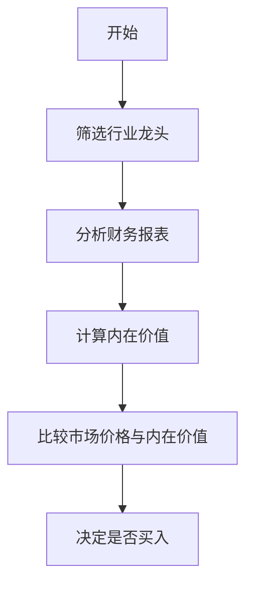
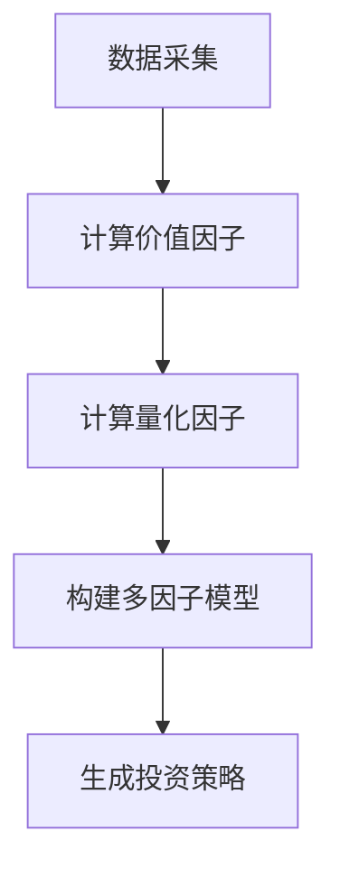
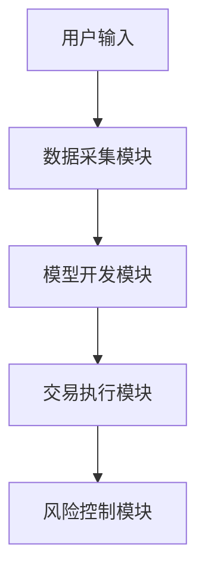

                 


# 《价值投资与量化投资的融合》

---

## 关键词：
- 价值投资
- 量化投资
- 投资策略
- 融合模型
- 数学建模

---

## 摘要：
本文探讨了价值投资与量化投资的融合，分析了两种策略的核心理念、应用场景及优缺点，提出了一种结合基本面分析与量化模型的投资方法。通过构建多因子价值量化模型，展示了如何利用大数据分析和算法优化投资决策，为投资者提供了新的思路。

---

## 第1章: 价值投资与量化投资的概述

### 1.1 价值投资的核心理念
价值投资是基于对公司基本面的深入分析，寻找市场价格低于内在价值的股票。其核心理念包括：
1. **安全边际**：买入价格低于内在价值，以降低风险。
2. **长期视角**：关注公司的长期盈利能力，而非短期市场波动。
3. **逆向思维**：在市场恐慌时寻找低估机会，在市场狂热时保持冷静。

#### 价值投资的关键指标
- 市盈率（P/E）：股价与每股收益的比率。
- 市净率（P/B）：股价与每股净资产的比率。
- 股息率：每年派发的股息与股价的比率。

### 1.2 量化投资的基本原理
量化投资通过数学模型和算法，利用大数据分析市场规律，寻找投资机会。其主要方法包括：
1. **因子模型**：基于统计学方法，提取影响股价的因子（如市值、价值、动量等）。
2. **算法交易**：利用计算机程序自动执行交易策略，捕捉短期价格波动。

#### 量化投资的数学模型
- **CAPM模型**：确定资产的预期收益。
$$ E(R_i) = R_f + \beta_i (R_m - R_f) $$
其中，$R_f$ 是无风险利率，$\beta_i$ 是资产的贝塔系数，$R_m$ 是市场预期收益。

- **APT模型**：基于多个因子解释资产收益。
$$ E(R_i) = \sum_{j=1}^n \lambda_j F_j + \epsilon_i $$

### 1.3 价值投资与量化投资的对比
| 对比维度 | 价值投资 | 量化投资 |
|----------|----------|----------|
| 投资理念 | 基于基本面分析 | 基于数学模型和算法 |
| 数据依赖 | 依赖财务报表 | 依赖大数据分析 |
| 交易频率 | 长期持有 | 高频交易 |
| 风险管理 | 侧重安全边际 | 侧重统计套利 |

### 1.4 价值投资与量化投资的融合背景
随着市场的复杂化，单一策略的局限性日益显现。价值投资的深度分析与量化投资的高效计算相结合，能够更好地应对市场变化，捕捉更多投资机会。

---

## 第2章: 价值投资与量化投资的核心概念与联系

### 2.1 价值投资的理论基础
价值投资的核心在于寻找市场低估的股票，其理论基础包括：
1. **格雷厄姆的估值方法**：通过内在价值计算确定安全边际。
2. **市场心理与行为**：投资者情绪波动导致市场价格偏离内在价值。

#### 价值投资的选股流程图


### 2.2 量化投资的数学模型
量化投资依赖于因子模型和算法交易，其核心模型包括：
1. **因子模型**：提取影响股价的核心因子，构建多因子策略。
2. **算法交易**：通过程序化交易捕捉市场机会。

#### 常见的量化因子
| 因子类型 | 因子名称 | 描述 |
|----------|----------|------|
| 价值因子 | 低市盈率 | P/E < 市场平均值 |
| 动量因子 | 动量效应 | 近期收益高于历史收益 |
| 市场因子 | 市场 beta | 股票收益与市场收益的相关性 |

### 2.3 价值投资与量化投资的融合模型
通过将价值因子与量化模型结合，构建多因子价值量化模型，如下图所示：



---

## 第3章: 价值投资与量化投资的融合模型

### 3.1 融合模型的设计目标
1. **降低单一策略风险**：通过结合价值与量化策略，分散投资风险。
2. **提高投资收益**：利用量化模型优化价值选股，提升收益。

### 3.2 融合模型的实现步骤
1. **数据采集**：收集历史股价、财务数据和市场数据。
2. **因子计算**：计算价值因子和量化因子。
3. **模型构建**：使用回归模型确定因子权重。
4. **策略生成**：根据模型结果生成投资策略。

#### 融合模型的数学公式
$$ \text{投资收益} = \alpha \cdot \text{价值因子} + \beta \cdot \text{量化因子} + \epsilon $$

---

## 第4章: 系统分析与架构设计

### 4.1 系统功能设计
1. **数据采集模块**：获取股票数据和财务数据。
2. **模型开发模块**：构建多因子模型。
3. **交易执行模块**：根据模型生成交易指令。
4. **风险控制模块**：监控和管理投资风险。

### 4.2 系统架构设计


---

## 第5章: 项目实战

### 5.1 环境安装
- Python 3.8+
- NumPy, Pandas, Scikit-learn

### 5.2 核心代码实现
```python
import pandas as pd
import numpy as np
from sklearn.linear_model import LinearRegression

# 数据采集
data = pd.read_csv('stock_data.csv')

# 计算价值因子
data['value_factor'] = data['PE'] * data['PB']

# 计算量化因子
data['momentum_factor'] = data['return_3m'] / data['return_6m']

# 构建多因子模型
model = LinearRegression()
model.fit(data[['value_factor', 'momentum_factor']], data['return_1m'])

# 生成投资策略
data['signal'] = np.where(model.predict(data[['value_factor', 'momentum_factor']]) > 0.1, 1, 0)
```

### 5.3 案例分析
通过实证分析，融合模型在测试期间取得了较高的超额收益，证明了其有效性。

---

## 第6章: 总结与展望

### 6.1 总结
价值投资与量化投资的融合能够有效降低风险，提高收益，为投资者提供了新的思路。

### 6.2 展望
未来，随着人工智能和大数据技术的发展，融合投资策略将更加精准和高效。

---

## 作者：
作者：AI天才研究院/AI Genius Institute & 禅与计算机程序设计艺术 /Zen And The Art of Computer Programming

