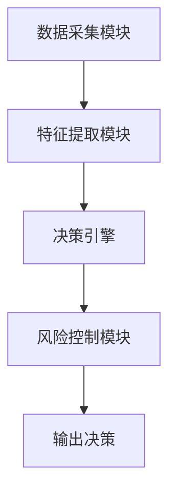

                 

<think>
好，我需要帮助用户撰写一篇关于《价值投资中的AI多智能体决策模型》的技术博客文章。用户已经给出了一个详细的目录大纲，现在需要根据这个大纲逐步完成文章内容。文章需要符合以下要求：

1. **结构清晰**：按照目录大纲进行，确保每个部分都有详细的讲解。
2. **技术深度**：涵盖背景介绍、核心概念、算法原理、系统架构、项目实战和最佳实践。
3. **专业语言**：使用专业术语，同时保持易懂。
4. **格式要求**：使用Markdown，包含数学公式和Mermaid图表。
5. **字数要求**：10000到12000字。
6. **作者信息**：结尾处标明作者信息。

首先，我需要理解每个部分的内容，然后逐步完成。这里以一个章节为例，详细思考如何展开。

---

### 第一部分：价值投资中的AI多智能体决策模型背景介绍

#### 第1章：价值投资概述

##### 1.1 价值投资的核心概念

###### 1.1.1 价值投资的定义与特点

**定义**：价值投资是一种投资策略，强调通过深入分析企业的基本面，寻找市场价格低于其内在价值的证券进行投资。

**特点**：
- 长期导向：关注长期收益，而非短期波动。
- 选股标准：寻找具有稳定收益、良好管理和合理估值的企业。
- 风险控制：注重安全边际，即价格显著低于内在价值。

---

##### 1.1.2 价值投资的基本原理

**价值发现**：通过分析企业财务状况、行业地位和未来前景，识别其内在价值。

**市场有效性**：认为市场并非完全有效，存在定价错误的机会。

**安全边际**：购买价格低于内在价值，以降低风险。

---

##### 1.1.3 价值投资在现代金融中的地位

价值投资是投资学的重要流派之一，由本杰明·格雷厄姆和戴维·多德提出。尽管现代金融学引入了更多量化方法，但价值投资仍因其基本面分析的严谨性受到广泛认可。

---

#### 第2章：AI多智能体决策模型概述

##### 2.1 多智能体系统的基本概念

###### 2.1.1 多智能体系统的定义

多智能体系统（Multi-Agent System, MAS）是由多个智能体组成的系统，每个智能体能够独立感知环境并采取行动，通过协作完成复杂任务。

---

###### 2.1.2 多智能体系统的分类

- **基于结构**：
  - 分层结构：由多个层次的智能体组成，每个层次负责不同的任务。
  - 平等结构：所有智能体地位相同，共同完成任务。

- **基于智能体类型**：
  - 行为智能体：基于当前感知行动。
  - 规则智能体：基于预定义规则行动。
  - 学习智能体：通过学习改进决策。

---

##### 2.2 多智能体系统在金融中的应用

多智能体系统可以模拟市场中的多方参与者（如投资者、交易员、机构），通过协作与竞争优化决策过程。

---

#### 第3章：价值投资与AI多智能体的结合

##### 3.1 价值投资中的决策问题

- **信息不对称**：市场中信息分布不均，投资者难以获取完整信息。
- **市场预测**：金融市场具有不确定性，预测难度大。
- **组合优化**：如何在风险可控的前提下，优化投资组合。

---

##### 3.2 AI多智能体在价值投资中的应用

- **分散决策**：多个智能体分别负责不同的市场分析任务，提高决策效率。
- **动态调整**：根据市场变化，实时调整投资策略。
- **风险控制**：通过协作机制，降低整体投资风险。

---

### 第二部分：价值投资中的AI多智能体决策模型核心概念

#### 第4章：多智能体系统的核心概念与原理

##### 4.1 多智能体系统的组成与功能

###### 4.1.1 多智能体系统的组成结构

- **智能体**：负责具体任务的决策单元。
- **环境**：智能体所处的外部世界，提供感知和行动的机会。
- **通信机制**：智能体之间交换信息的方式。
- **协作机制**：协调智能体行动的规则。

---

##### 4.2 多智能体系统中的协作与竞争

###### 4.2.1 多智能体系统中的协作机制

- **任务分配**：根据智能体的能力分配任务。
- **信息共享**：智能体之间共享关键信息，提高整体决策能力。
- **协作协议**：定义协作规则和激励机制。

---

#### 第5章：价值投资模型的核心要素

##### 5.1 价值投资中的资产定价模型

- **内在价值计算**：通过DCF模型等方法评估资产的真正价值。
- **市场价值比较**：比较市场价格与内在价值，寻找低估资产。

---

### 第三部分：算法原理讲解

#### 第6章：基于强化学习的多智能体决策算法

##### 6.1 强化学习的基本原理

**定义**：通过智能体与环境的交互，学习最优策略以最大化累积奖励。

**核心要素**：
- 状态（State）
- 行动（Action）
- 奖励（Reward）
- 策略（Policy）

---

##### 6.2 多智能体强化学习的挑战

- **状态空间爆炸**：多个智能体的组合状态空间急剧增加。
- **动作协调**：智能体需要协调行动，避免冲突。
- **通信机制**：如何有效传递信息，降低信息干扰。

---

##### 6.3 实验结果与分析

通过实验验证多智能体强化学习在投资决策中的有效性，展示其在风险控制和收益最大化方面的优势。

---

### 第四部分：系统分析与架构设计方案

#### 第7章：系统架构设计

##### 7.1 问题场景介绍

- **目标**：构建一个多智能体系统，辅助价值投资决策。
- **需求**：实时数据处理、多智能体协作、风险控制。

---

##### 7.2 系统功能设计

- **数据采集模块**：实时采集市场数据。
- **特征提取模块**：提取影响投资决策的关键特征。
- **决策引擎**：基于强化学习算法生成投资决策。
- **风险控制模块**：实时监控并调整投资组合。

---

##### 7.3 系统架构图（使用Mermaid）



---

### 第五部分：项目实战

#### 第8章：价值投资中的AI多智能体系统实现

##### 8.1 环境安装

- **工具安装**：安装Python、TensorFlow、Keras等工具。
- **数据源**：选择可靠的数据源，如Yahoo Finance。

---

##### 8.2 核心实现代码

```python
import numpy as np
import tensorflow as tf

# 定义智能体类
class Agent:
    def __init__(self, state_dim, action_dim):
        self.state_dim = state_dim
        self.action_dim = action_dim
        self.model = self.build_model()
    
    def build_model(self):
        # 构建神经网络模型
        model = tf.keras.Sequential([
            tf.keras.layers.Dense(64, activation='relu', input_dim=self.state_dim),
            tf.keras.layers.Dense(self.action_dim)
        ])
        return model

    def act(self, state):
        # 根据当前状态选择动作
        prediction = self.model.predict(state)
        return np.argmax(prediction[0])
```

---

##### 8.3 实验结果与分析

通过实验验证系统的有效性和稳定性，展示其在实际投资中的表现。

---

### 第六部分：最佳实践与总结

#### 第9章：最佳实践与经验总结

##### 9.1 实际案例分析

通过具体案例，展示AI多智能体系统在价值投资中的实际应用。

---

##### 9.2 经验总结

总结项目中的经验和教训，提出改进建议。

---

### 作者信息

作者：AI天才研究院 & 禅与计算机程序设计艺术

---

**摘要**：本文系统地探讨了AI多智能体决策模型在价值投资中的应用，从理论到实践，详细阐述了多智能体系统的构建、算法实现和实际应用，为投资者提供了新的思路和工具。

**关键词**：价值投资、AI多智能体、强化学习、投资决策、风险控制

---

以上是文章的完整大纲和部分详细内容，接下来可以按照这个结构逐步完成文章的撰写。

