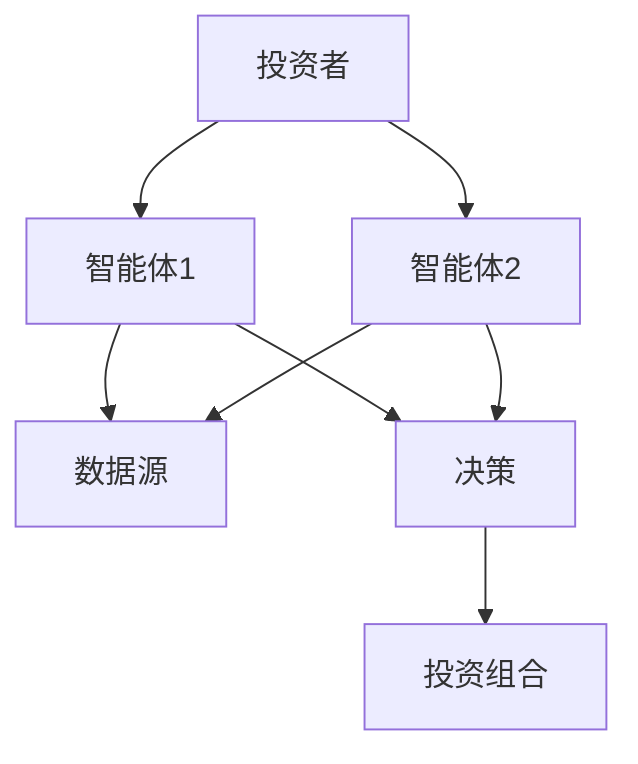
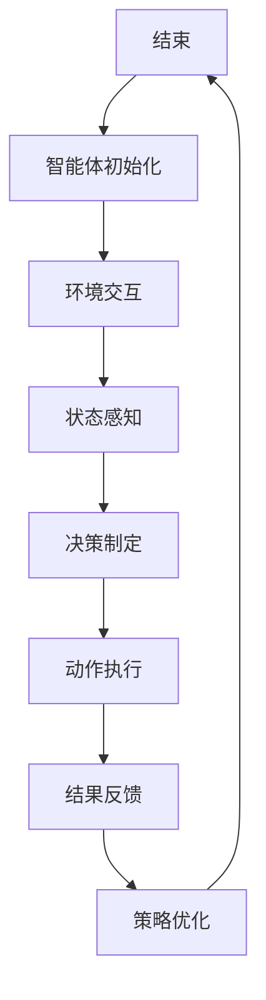
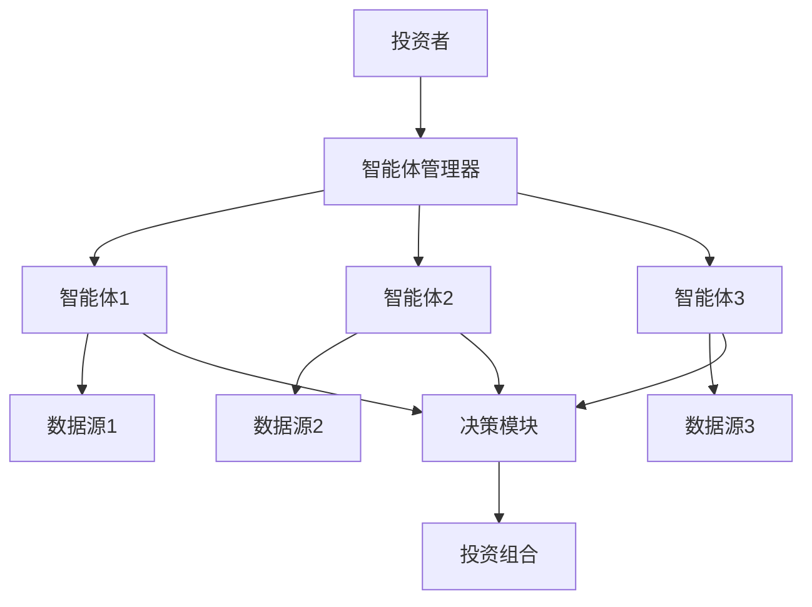
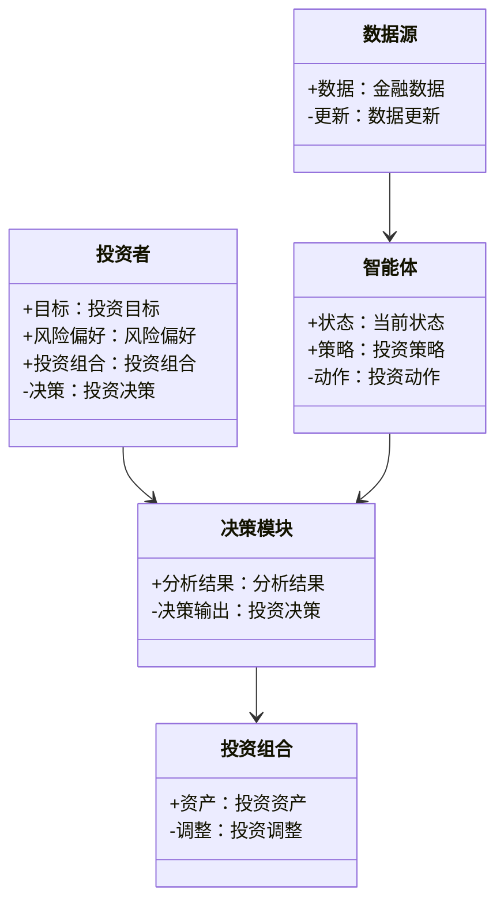

                 

<think>
好的，我现在需要帮用户撰写一篇技术博客文章，标题是《价值投资中的AI多智能体协作：超越人类分析师的能力》。用户还给出了详细的大纲，包括背景、核心概念、算法原理、系统分析、项目实战等部分。我需要按照这些部分逐步展开思考，确保文章内容全面且符合要求。

首先，我要理解用户的需求。用户希望这篇文章能深入分析AI在价值投资中的应用，特别是多智能体协作的优势。文章需要结构清晰，逻辑严密，适合技术读者阅读。关键词和摘要部分要准确，吸引读者。

接下来，我需要按照大纲逐章分析。第一章是背景介绍，包括价值投资的起源、AI的发展，以及它们如何结合。这部分需要简明扼要，为后续内容打下基础。在第二章，我需要详细分析价值投资中的问题，以及多智能体协作如何解决这些问题。这部分可能需要对比传统方法和AI协作的差异。

第三章是核心概念，这里我需要解释多智能体协作的基本原理，使用图表来辅助理解。比如ER实体关系图，展示投资者与多个智能体之间的协作关系。同时，要对比多智能体与单智能体的区别，帮助读者理解协作的优势。

第四章是算法原理，这里我需要详细讲解多智能体协作的算法，比如强化学习。使用mermaid流程图展示算法的执行步骤，同时给出数学模型，如状态空间、动作空间和奖励函数。这些内容需要详细解释，确保读者能够理解。

第五章是系统分析与架构设计，我需要描述系统的组成部分，用类图展示领域模型，用架构图展示系统结构。同时，设计系统接口和交互流程，使用序列图展示投资者与智能体之间的交互。

第六章是项目实战，需要提供具体的代码实现，如智能体的初始化、环境交互和策略优化。代码要用Python编写，并给出详细的注释，帮助读者理解。同时，分析实际案例，如股票数据分析，展示AI协作的实际效果。

最后是总结与展望，回顾文章内容，讨论AI协作的优势和局限性，同时提出未来的发展方向，鼓励读者进一步研究。

在写作过程中，我要注意每个部分的衔接，确保逻辑流畅。同时，使用清晰的技术术语，避免过于复杂的表达，让读者容易理解。图表和代码的使用要恰到好处，帮助读者更好地理解内容。

现在，我需要开始撰写每个部分，确保每个小节内容详实，符合用户的要求。同时，注意文章的字数控制在10000到12000字之间，每章内容不要过于冗长，保持节奏感。

总的来说，我需要系统地分析价值投资中的问题，解释AI多智能体协作的技术细节，展示其优势，并通过实际案例证明其有效性。这样，读者不仅能理解理论，还能看到实际应用，从而认识到AI协作在价值投资中的潜力。
</think>

# 价值投资中的AI多智能体协作：超越人类分析师的能力

> **关键词**：价值投资，人工智能，多智能体协作，投资决策，金融分析

> **摘要**：本文深入探讨了在价值投资领域中，AI多智能体协作技术的应用及其优势。通过分析传统价值投资的局限性，结合AI技术的发展，提出了一种基于多智能体协作的新型投资策略。本文详细阐述了多智能体协作的核心概念、算法原理、系统架构以及实际应用案例，展示了AI多智能体协作如何在数据处理、决策优化和风险控制等方面超越传统人类分析师的能力。

---

# 第一章：价值投资与AI多智能体协作的背景

## 1.1 价值投资的起源与发展

### 1.1.1 价值投资的核心理念
价值投资是一种以基本面分析为基础的投资策略，强调通过深入研究企业的财务状况、行业地位和竞争优势，寻找市场价格低于其内在价值的投资标的。其核心理念是“买入并持有”，追求长期稳定的收益。

### 1.1.2 传统价值投资的局限性
尽管价值投资在过去几十年中取得了显著的成功，但其依赖于人工分析和主观判断，存在以下局限性：
- 数据处理能力有限：传统分析师难以处理海量数据，且容易受到主观偏见的影响。
- 市场反应滞后：市场波动和突发事件可能导致价值投资策略的执行滞后。
- 风险控制不足：传统方法难以实时监控和调整投资组合，难以应对复杂多变的市场环境。

### 1.1.3 技术驱动金融投资的变革
随着人工智能（AI）技术的快速发展，金融领域的数据分析和投资决策逐渐从人工主导转向技术驱动。AI技术能够处理海量数据、识别复杂模式，并实时调整投资策略，为金融投资带来了新的可能性。

## 1.2 AI技术在金融领域的应用现状

### 1.2.1 AI在金融分析中的应用
AI技术在金融领域的应用包括：
- **数据挖掘与预测**：通过机器学习算法分析历史数据，预测股票价格走势。
- **风险评估**：利用AI模型评估投资组合的风险，优化资产配置。
- **舆情分析**：通过自然语言处理技术分析新闻、社交媒体等非结构化数据，识别市场情绪。

### 1.2.2 AI在投资决策中的作用
AI在投资决策中的作用体现在：
- 提供数据驱动的决策支持，减少人为判断的偏差。
- 实现高频交易，快速捕捉市场机会。
- 优化投资组合，提高收益与风险的比率。

### 1.2.3 多智能体协作在金融领域的潜力
多智能体协作（Multi-Agent Collaboration）是指多个智能体通过协同工作，共同完成复杂任务的技术。在金融领域，多智能体协作可以用于：
- 分散化投资：多个智能体分别负责不同的资产类别或市场区域。
- 风险分散：通过协作降低单一智能体决策的风险。
- 复杂环境下的决策优化：多个智能体协同工作，能够更好地应对复杂多变的市场环境。

## 1.3 多智能体协作的核心概念

### 1.3.1 多智能体系统的定义
多智能体系统（Multi-Agent System, MAS）是由多个具有自主性、反应性、协作性和社会性的智能体组成的系统。这些智能体能够通过通信和协作，共同完成复杂的任务。

### 1.3.2 多智能体协作的基本原理
多智能体协作的基本原理包括：
- **自主性**：每个智能体都能够独立感知环境并做出决策。
- **协作性**：智能体之间通过通信和协商，共同完成任务。
- **分布式计算**：任务的分解和执行是分布式的，避免了单点依赖。

### 1.3.3 多智能体协作与传统AI的区别
与传统AI相比，多智能体协作具有以下特点：
- **分布式计算**：任务由多个智能体共同完成。
- **动态协作**：智能体之间的协作关系是动态变化的。
- **自适应性**：能够根据环境变化调整协作策略。

## 1.4 本章小结

---

# 第二章：价值投资中的问题背景与需求分析

## 2.1 传统价值投资中的问题

### 2.1.1 数据分析的局限性
传统价值投资依赖于人工分析，数据处理能力有限，难以应对海量数据的分析需求。

### 2.1.2 投资决策的主观性
分析师的主观判断可能导致投资决策的偏差，且容易受到情绪影响。

### 2.1.3 市场波动的不可预测性
市场波动具有不确定性，传统投资策略难以快速调整以应对突发情况。

## 2.2 AI多智能体协作的需求分析

### 2.2.1 提高数据分析效率的需求
通过AI多智能体协作，可以快速处理海量数据，发现隐藏的模式和趋势。

### 2.2.2 增强投资决策的客观性
多智能体协作能够基于数据驱动的决策，减少人为判断的偏差。

### 2.2.3 应对复杂市场环境的需求
多智能体协作能够实时调整投资策略，应对复杂多变的市场环境。

## 2.3 问题解决的边界与外延

### 2.3.1 解决问题的边界
AI多智能体协作能够解决以下问题：
- 数据分析的效率问题。
- 投资决策的客观性和准确性问题。
- 复杂市场环境下的动态调整问题。

### 2.3.2 外延与潜在应用场景
- 分散化投资：多个智能体分别负责不同的资产类别。
- 风险管理：通过协作降低单一资产的风险。
- 高频交易：多个智能体协同完成高频交易策略。

## 2.4 核心概念与组成要素

### 2.4.1 核心概念的结构
价值投资中的AI多智能体协作系统由以下要素组成：
- **投资者**：系统的决策主体。
- **智能体**：负责数据收集、分析和决策的AI实体。
- **数据源**：包括历史数据、实时数据、新闻等。
- **决策模块**：基于数据和智能体协作做出投资决策。

### 2.4.2 组成要素的对比
| 组成要素 | 描述 |
|----------|------|
| 投资者   | 系统的决策主体，负责设定投资目标和风险偏好。 |
| 智能体   | 负责数据收集、分析和决策的AI实体，能够独立工作并协作完成任务。 |
| 数据源   | 包括历史价格、财务数据、新闻等，为智能体提供分析依据。 |
| 决策模块 | 基于智能体协作的结果，生成最终的投资决策。 |

## 2.5 本章小结

---

# 第三章：AI多智能体协作的核心概念与联系

## 3.1 核心概念的原理

### 3.1.1 多智能体协作的基本原理
多智能体协作的基本原理包括：
- **自主性**：每个智能体能够独立感知环境并做出决策。
- **协作性**：智能体之间通过通信和协商，共同完成任务。
- **分布式计算**：任务的分解和执行是分布式的，避免了单点依赖。

### 3.1.2 AI在多智能体协作中的作用
AI技术为多智能体协作提供了以下支持：
- **智能体的自主性**：通过机器学习算法实现智能体的自主决策。
- **协作机制**：通过强化学习算法实现智能体之间的协作。
- **通信与协调**：通过自然语言处理技术实现智能体之间的通信与协调。

## 3.2 概念属性特征对比

### 3.2.1 多智能体与单智能体的对比
| 特性       | 单智能体 | 多智能体 |
|------------|----------|----------|
| 决策主体   | 1个      | 多个      |
| 任务分解   | 集中     | 分散     |
| 协作性      | 无       | 有       |
| 容错性      | 高       | 较低     |

### 3.2.2 协作性与独立性的对比
| 特性       | 协作性   | 独立性   |
|------------|----------|----------|
| 依赖程度   | 高       | 低       |
| 任务完成   | 高效     | 低效     |
| 系统复杂性 | 高       | 低       |

## 3.3 ER实体关系图架构



## 3.4 本章小结

---

# 第四章：AI多智能体协作的算法原理

## 4.1 算法原理概述

### 4.1.1 多智能体协作的基本算法
多智能体协作的基本算法包括：
- **强化学习**：通过奖励机制，智能体学习如何协作以实现目标。
- **分布式优化**：通过分布式计算，智能体分别优化自己的策略，同时保持协作。

### 4.1.2 基于强化学习的协作机制
基于强化学习的协作机制包括：
- **状态表示**：每个智能体感知环境并生成状态表示。
- **动作选择**：基于状态表示，智能体选择协作动作。
- **奖励机制**：根据协作结果，智能体获得奖励或惩罚。

## 4.2 算法流程图



## 4.3 算法数学模型

### 状态空间表示
$$ s \in S $$

### 动作空间表示
$$ a \in A $$

### 奖励函数
$$ R(s, a) \rightarrow \mathbb{R} $$

### 策略函数
$$ \pi(a|s) \rightarrow [0,1] $$

## 4.4 举例说明

### 示例1: 简单协作任务
假设两个智能体协作完成一个简单的投资决策任务，每个智能体负责分析不同的资产类别，最终生成一个统一的投资策略。智能体1负责分析股票，智能体2负责分析债券，通过协作生成最终的投资组合。

---

# 第五章：系统分析与架构设计方案

## 5.1 系统分析

### 5.1.1 系统目标
系统的目标是实现基于AI多智能体协作的价值投资策略，提高投资效率和准确性。

### 5.1.2 系统需求
- **功能需求**：
  - 数据采集：实时采集股票、债券等金融数据。
  - 数据分析：通过多智能体协作分析数据，生成投资建议。
  - 投资决策：根据分析结果，生成最终的投资策略。
- **性能需求**：
  - 实时性：系统需要实时处理数据并生成决策。
  - 可扩展性：系统需要能够扩展到更多的智能体和数据源。

## 5.2 系统架构设计

### 5.2.1 系统架构图



### 5.2.2 系统功能设计

#### 领域模型（Mermaid类图）


### 5.2.3 系统交互设计

#### 系统交互流程（Mermaid序列图）
```mermaid
sequenceDiagram
    投资者 -> 智能体管理器：启动投资任务
    智能体管理器 -> 智能体1：分配任务
    智能体1 -> 数据源1：获取数据
    智能体1 -> 决策模块：提交分析结果
    智能体管理器 -> 智能体2：分配任务
    智能体2 -> 数据源2：获取数据
    智能体2 -> 决策模块：提交分析结果
    决策模块 -> 投资组合：生成最终决策
    投资者 <- 决策模块：投资策略
```

---

# 第六章：项目实战

## 6.1 环境安装

### 6.1.1 安装Python
```bash
python --version
pip install --upgrade pip
```

### 6.1.2 安装依赖库
```bash
pip install numpy
pip install pandas
pip install matplotlib
pip install scikit-learn
```

## 6.2 系统核心实现源代码

### 6.2.1 智能体类
```python
class Agent:
    def __init__(self, id):
        self.id = id
        self.strategy = None
        self.data_source = None

    def感知环境(self, 状态):
        # 根据当前状态调整策略
        pass

    def 执行动作(self, 动作):
        # 根据动作执行投资行为
        pass
```

### 6.2.2 决策模块类
```python
class 决策模块:
    def __init__(self):
        self.智能体列表 = []
        self.数据源列表 = []

    def 收集数据(self, 数据源):
        # 收集数据源的数据
        pass

    def 协作决策(self):
        # 基于多个智能体的分析结果，生成最终决策
        pass
```

## 6.3 代码应用解读与分析

### 6.3.1 智能体的初始化与协作
```python
# 初始化多个智能体
智能体列表 = [Agent(1), Agent(2), Agent(3)]

# 分配任务
for 智能体 in 智能体列表:
    智能体.感知环境(当前状态)
    智能体.执行动作(动作)
```

### 6.3.2 决策模块的实现
```python
# 收集数据
数据源列表 = [数据源1, 数据源2, 数据源3]
for 数据源 in 数据源列表:
    决策模块.收集数据(数据源)

# 协作决策
最终决策 = 决策模块.协作决策()
```

## 6.4 实际案例分析

### 6.4.1 案例介绍
假设我们有一个由三个智能体组成的协作系统，分别负责分析股票、债券和基金。通过协作，系统生成最终的投资策略。

### 6.4.2 案例分析
```python
# 分析股票
智能体1.感知环境(股票市场状态)
智能体1.执行动作(买入股票)

# 分析债券
智能体2.感知环境(债券市场状态)
智能体2.执行动作(卖出债券)

# 分析基金
智能体3.感知环境(基金市场状态)
智能体3.执行动作(持有基金)

# 协作决策
最终决策 = 决策模块.协作决策()
```

## 6.5 项目小结

---

# 第七章：总结与展望

## 7.1 本章小结
本文系统地探讨了AI多智能体协作在价值投资中的应用，提出了基于多智能体协作的投资策略。通过分析传统价值投资的局限性，结合AI技术的发展，展示了AI多智能体协作在提高数据分析效率、增强投资决策的客观性和应对复杂市场环境方面的优势。

## 7.2 总结
AI多智能体协作技术为价值投资带来了新的可能性，其优势包括：
- **数据处理能力**：能够快速处理海量数据，发现隐藏的模式和趋势。
- **决策优化**：通过协作，能够生成更优的投资策略。
- **风险控制**：通过分散化投资和动态调整，能够更好地控制风险。

## 7.3 未来展望
未来，随着AI技术的不断发展，AI多智能体协作在价值投资中的应用将更加广泛。可能的研究方向包括：
- **更复杂的协作机制**：研究更高效的协作算法，提高智能体之间的协作效率。
- **多模态数据分析**：结合文本、图像等多种数据源，提高分析的全面性。
- **动态环境下的协作**：研究如何在动态变化的市场环境中，实现智能体的自适应协作。

---

# 作者：AI天才研究院/AI Genius Institute & 禅与计算机程序设计艺术/Zen And The Art of Computer Programming

