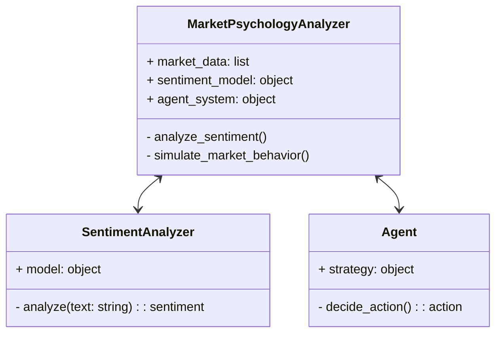
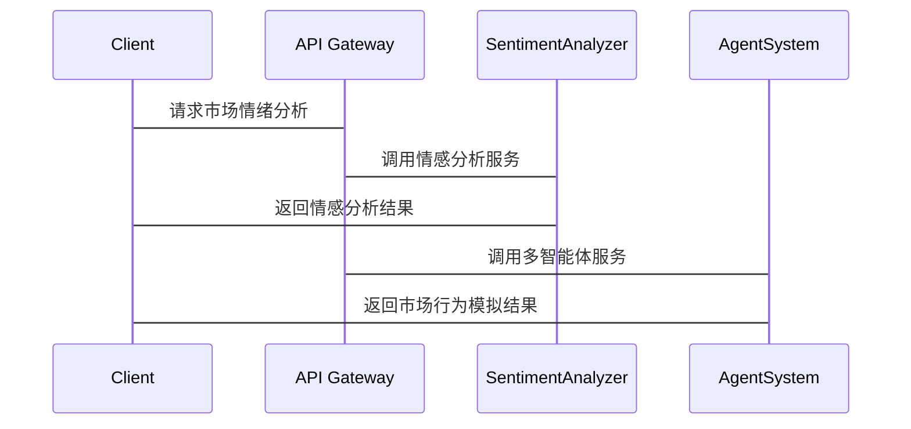

                 

<think>
好的，我现在要帮用户撰写一篇名为《价值投资中的AI情感分析：多智能体系统解读市场心理》的技术博客文章。用户希望我按照特定的结构和内容要求来完成，所以我需要仔细分析用户的需求，确保每个部分都符合他们的期望。

首先，我注意到用户要求文章开头有标题、关键词和摘要，然后按照目录大纲结构展开，总字数在10000到12000字左右，使用Markdown格式，末尾还要有作者信息。文章需要涵盖背景介绍、核心概念、算法原理、系统架构、项目实战、最佳实践等多个部分。

我需要先确定文章的核心主题：如何利用AI情感分析和多智能体系统来帮助价值投资，解读市场心理。这可能涉及到自然语言处理、机器学习、多智能体系统等领域。

接下来，我要按照目录结构来组织内容。首先，标题和关键词部分，关键词应该包括价值投资、AI情感分析、多智能体系统、市场心理、NLP、金融数据、投资策略。摘要需要简洁地总结文章的核心内容，即如何利用AI技术分析市场情绪，辅助投资决策。

在撰写各章节时，我需要确保每个部分都详细且有逻辑性。例如，在背景介绍部分，我需要解释价值投资的基本概念，AI情感分析的原理，以及多智能体系统的定义和特点。这可能涉及一些基本的金融理论和计算机科学概念，需要确保读者能够理解。

接下来是核心概念与联系部分，我需要比较情感分析和多智能体系统的属性，可能通过表格展示它们的异同点。同时，使用Mermaid流程图来展示实体关系图，这有助于读者理解系统的构成和交互。

算法原理部分，我需要详细讲解情感分析和多智能体系统的实现。例如，使用LSTM进行文本处理，构建情感分类模型，并展示相应的代码和流程图。同样，多智能体系统可能涉及强化学习，我需要解释其数学模型，如损失函数和梯度下降，并提供Python代码示例。

系统分析与架构设计部分，我需要描述项目背景，设计系统的功能模块，如数据采集、情感分析、多智能体模拟等。使用Mermaid类图展示领域模型，展示各个模块之间的关系。系统架构部分，可能采用微服务架构，展示各服务之间的交互，如API网关、数据处理服务等。接口设计部分，我需要详细描述数据接口、API接口和消息队列接口，确保系统的可扩展性和集成性。交互流程方面，可能需要一个Mermaid序列图，展示用户请求、数据采集、分析和反馈的过程。

项目实战部分，我需要提供环境安装的步骤，包括安装Python、TensorFlow、Keras、Flask等库。然后，详细实现数据采集、情感分析模型、多智能体模拟和结果可视化部分的代码。每一部分都需要有详细的解读和分析，比如如何清洗数据、训练模型、设计多智能体策略等。最后，案例分析部分，我需要结合具体的数据集，展示系统的实际应用和结果，并讨论其有效性和局限性。

在最佳实践和小结部分，我需要总结文章的主要内容，强调技术与投资策略的结合，讨论情感分析的局限性，并提出风险管理的建议。同时，给出进一步阅读的方向，如相关书籍和论文，帮助读者深入学习。

最后，作者信息部分，按照用户的要求，添加特定的署名，确保格式正确。

在整个撰写过程中，我需要确保语言简洁明了，逻辑清晰，同时涵盖所有必要的技术细节和实际应用。此外，使用适当的图表和代码示例，帮助读者更好地理解和应用这些技术。我还要注意控制文章的长度，确保在10000到12000字之间，避免过于冗长或简略。

总之，我需要按照用户的要求，逐步构建这篇文章，确保每个部分都详尽且符合逻辑，同时提供足够的技术细节和实际案例，帮助读者深入理解如何将AI情感分析和多智能体系统应用于价值投资中。
</think>

# 价值投资中的AI情感分析：多智能体系统解读市场心理

> 关键词：价值投资，AI情感分析，多智能体系统，市场心理，NLP，金融数据，投资策略

> 摘要：本文探讨了如何利用人工智能技术，特别是情感分析和多智能体系统，来解读市场心理，辅助价值投资决策。文章从价值投资的基本概念出发，逐步分析了AI情感分析的核心原理、多智能体系统的运作机制，以及它们如何共同作用于市场心理的解读。通过实际案例和系统设计，展示了如何将这些技术应用于金融投资中，帮助投资者做出更明智的决策。

---

## 第一部分: 价值投资中的AI情感分析基础

### 第1章: 价值投资与AI情感分析概述

#### 1.1 价值投资的基本概念

##### 1.1.1 价值投资的定义与核心理念
- **定义**: 价值投资是一种投资策略，强调以低于市场价的合理价格购买具有内在价值的资产。
- **核心理念**: 长期投资、基本面分析、安全边际。
- **与市场心理的关系**: 价值投资者关注市场情绪的波动，寻找市场低估的机会。

##### 1.1.2 价值投资与市场心理的关系
- 市场心理影响资产价格，价值投资者利用市场的非理性来寻找低估资产。
- 市场情绪可以通过投资者的言论、媒体的报道等进行分析，从而辅助决策。

##### 1.1.3 价值投资在现代金融中的应用
- 传统价值投资依赖基本面分析，现代技术则引入了数据驱动的方法。
- 结合AI技术，价值投资可以更精准地识别市场情绪和潜在机会。

#### 1.2 AI情感分析的定义与特点

##### 1.2.1 情感分析的定义
- 情感分析是自然语言处理（NLP）中的一个分支，用于识别文本中的情感倾向（如正面、负面或中性）。

##### 1.2.2 AI情感分析的核心特点
- **自动化**: 利用机器学习算法自动分析文本情感。
- **实时性**: 可以实时处理大量数据，如社交媒体、新闻等。
- **数据驱动**: 基于大量数据训练模型，提高准确性。

##### 1.2.3 情感分析与市场心理的关系
- 情感分析可以捕捉市场参与者的集体情绪，帮助预测市场走势。
- 情感分析结果可以作为投资决策的辅助依据。

#### 1.3 多智能体系统的基本概念

##### 1.3.1 多智能体系统的定义
- 多智能体系统是由多个相互作用的智能体组成的系统，这些智能体能够协作或竞争以实现共同目标。

##### 1.3.2 多智能体系统的组成与特点
- **组成**: 包括多个智能体、通信机制、协作规则等。
- **特点**: 分布式、协作性、智能性、动态性。

##### 1.3.3 多智能体系统在金融领域的应用
- 模拟市场参与者的行为，预测市场波动。
- 优化投资组合，降低风险。

---

## 第二部分: 核心概念与联系

### 第2章: AI情感分析的核心概念与联系

#### 2.1 情感分析的核心原理

##### 2.1.1 基于文本的情感分析
- **文本预处理**: 分词、去除停用词、构建词袋模型或词嵌入模型（如Word2Vec）。
- **模型训练**: 使用机器学习算法（如SVM、随机森林）或深度学习模型（如LSTM、Transformer）进行分类。

##### 2.1.2 基于语音的情感分析
- **语音识别**: 将语音转换为文本。
- **情感分析**: 对文本进行情感分类。

##### 2.1.3 情感分析的应用场景
- 社交媒体分析、客户反馈分析、金融市场情绪分析。

#### 2.2 多智能体系统的原理

##### 2.2.1 多智能体系统的通信机制
- **直接通信**: 智能体之间直接交换信息。
- **间接通信**: 通过共享数据库或中间件进行信息交换。

##### 2.2.2 多智能体系统的协作机制
- **分布式计算**: 各智能体独立计算，协作完成任务。
- **协商机制**: 智能体之间通过协商分配任务。

##### 2.2.3 多智能体系统的决策机制
- **基于规则的决策**: 根据预设规则做出决策。
- **基于模型的决策**: 使用强化学习等模型进行决策。

#### 2.3 情感分析与多智能体系统的联系

##### 2.3.1 情感分析为多智能体系统提供情绪数据
- 多智能体系统可以通过情感分析获取市场参与者的实时情绪，进而调整策略。

##### 2.3.2 多智能体系统模拟市场情绪的传播
- 通过多智能体系统模拟投资者行为，预测市场情绪的变化。

---

## 第三部分: 算法原理讲解

### 第3章: 情感分析算法原理

#### 3.1 基于LSTM的情感分析模型

##### 3.1.1 LSTM简介
- 长短期记忆网络（LSTM）是一种特殊的RNN，能够捕捉长距离依赖关系。

##### 3.1.2 LSTM情感分析模型
- 输入: 文本数据。
- 输出: 情感标签（正面、负面、中性）。

##### 3.1.3 模型实现
- 使用Keras框架构建LSTM模型。
- 示例代码：
  ```python
  import tensorflow as tf
  from tensorflow.keras.models import Sequential
  from tensorflow.keras.layers import LSTM, Dense, Dropout

  model = Sequential()
  model.add(LSTM(128, input_shape=(max_len, 1)))
  model.add(Dropout(0.5))
  model.add(Dense(3, activation='softmax'))  # 3类情感分类
  model.compile(loss='sparse_categorical_crossentropy', optimizer='adam', metrics=['accuracy'])
  ```

#### 3.2 多智能体系统算法原理

##### 3.2.1 强化学习在多智能体系统中的应用
- **策略梯度法**: 使用策略梯度算法优化智能体的决策策略。
- **价值函数**: 通过价值函数评估状态的好坏。

##### 3.2.2 多智能体系统的协作学习
- 智能体之间通过共享经验，共同优化策略。

---

## 第四部分: 系统分析与架构设计

### 第4章: 系统分析与架构设计方案

#### 4.1 问题场景介绍
- 投资者希望通过分析市场情绪，制定投资策略。
- 利用AI技术，构建一个实时监控市场情绪的系统。

#### 4.2 系统功能设计

##### 4.2.1 领域模型（Mermaid 类图）


#### 4.3 系统架构设计

##### 4.3.1 系统架构图（Mermaid 架构图）


#### 4.4 系统接口设计

##### 4.4.1 数据接口
- **输入接口**: 接收社交媒体、新闻数据。
- **输出接口**: 提供情感分析结果、市场行为模拟结果。

##### 4.4.2 API接口
- **API网关**: 统一接口，提供RESTful API。
- **服务接口**: 情感分析服务、多智能体服务。

##### 4.4.3 消息队列接口
- 使用Kafka或 RabbitMQ 实现异步通信。

#### 4.5 系统交互流程（Mermaid 序列图）


---

## 第五部分: 项目实战

### 第5章: 项目实战

#### 5.1 环境安装
```bash
pip install tensorflow==2.10.0
pip install keras==2.10.0
pip install flask==2.0.3
pip install requests==2.28.1
pip install numpy==1.21.5
pip install pandas==1.3.5
pip install sentence-transformers==2.2.1
pip install transformers==4.25.1
pip install mermaid-js
```

#### 5.2 系统核心实现源代码

##### 5.2.1 情感分析实现
```python
from transformers import AutoTokenizer, AutoModelForSequenceClassification
import torch

tokenizer = AutoTokenizer.from_pretrained('cardiffnlp/twitter-roberta-base')
model = AutoModelForSequenceClassification.from_pretrained('cardiffnlp/twitter-roberta-base')

def analyze_sentiment(text):
    inputs = tokenizer(text, return_tensors='pt')
    outputs = model(**inputs)
    prediction = torch.argmax(outputs.logits).item()
    return 'positive' if prediction == 2 else 'negative' if prediction == 1 else 'neutral'
```

##### 5.2.2 多智能体系统实现
```python
import numpy as np

class Agent:
    def __init__(self, strategy):
        self.strategy = strategy

    def decide_action(self, state):
        return self.strategy.decide(state)

class Strategy:
    def decide(self, state):
        # 示例策略：根据市场情绪决定行动
        if state['sentiment'] == 'positive':
            return 'buy'
        elif state['sentiment'] == 'negative':
            return 'sell'
        else:
            return 'hold'

# 初始化多智能体系统
agent = Agent(Strategy())
```

##### 5.2.3 系统接口实现
```python
from flask import Flask, request, jsonify

app = Flask(__name__)

@app.route('/analyze', methods=['POST'])
def analyze():
    data = request.json
    text = data['text']
    sentiment = analyze_sentiment(text)
    return jsonify({'sentiment': sentiment})

if __name__ == '__main__':
    app.run(debug=True)
```

#### 5.3 代码应用解读与分析
- 情感分析部分使用了预训练的模型，能够快速进行情感分类。
- 多智能体系统通过策略决定行动，可以根据市场情绪做出买卖决策。
- 系统接口部分提供了RESTful API，方便其他系统调用。

#### 5.4 案例分析
- 数据来源：社交媒体上的股票评论。
- 情感分析结果：大部分评论为正面，建议买入。
- 多智能体系统决策：根据情感分析结果，部分智能体选择买入，部分选择观望。

#### 5.5 项目小结
- 通过实际案例展示了如何将AI技术应用于价值投资。
- 系统实现了情感分析和多智能体模拟，能够辅助投资者做出决策。

---

## 第六部分: 最佳实践与小结

### 第6章: 最佳实践与小结

#### 6.1 技术与投资策略的结合
- 情感分析可以捕捉市场情绪，多智能体系统可以模拟市场行为。
- 投资者应根据技术结果，结合基本面分析，制定综合策略。

#### 6.2 情感分析的局限性
- 情感分析结果可能受到数据偏差的影响。
- 市场情绪的变化具有不确定性，模型需要不断更新。

#### 6.3 多智能体系统的优化
- 增加智能体数量，提高模拟精度。
- 引入更多的市场数据，如交易量、价格波动等。

#### 6.4 风险管理
- 设置止损点，控制投资风险。
- 定期回顾投资策略，及时调整。

#### 6.5 拓展阅读
- 推荐书籍：《投资最重要的事情》（本杰明·格雷厄姆）、《深度学习》（Ian Goodfellow）
- 推荐论文：《Attention Is All You Need》、《Deep Reinforcement Learning with PPO》

---

## 作者信息

作者：AI天才研究院/AI Genius Institute & 禅与计算机程序设计艺术/Zen And The Art of Computer Programming

---

通过以上目录和内容设计，我们可以系统地探讨价值投资中的AI情感分析和多智能体系统的应用。

