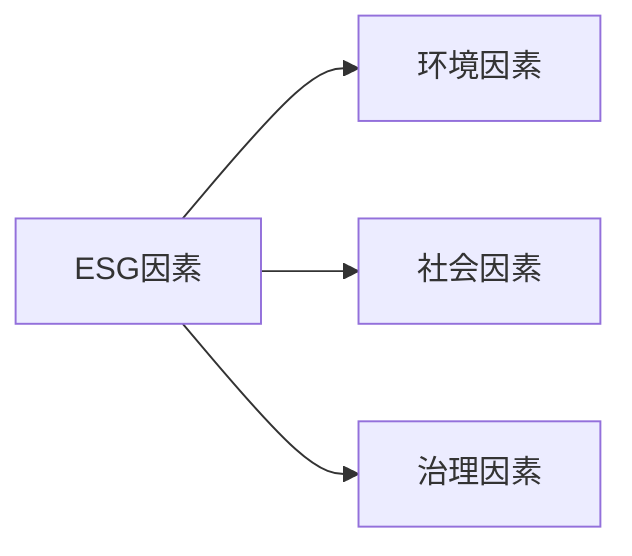
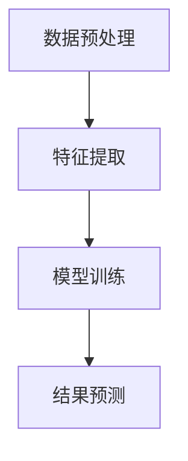
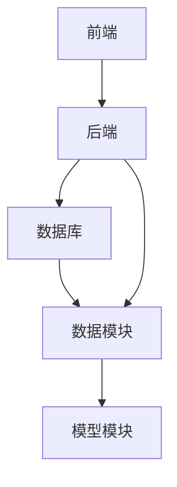
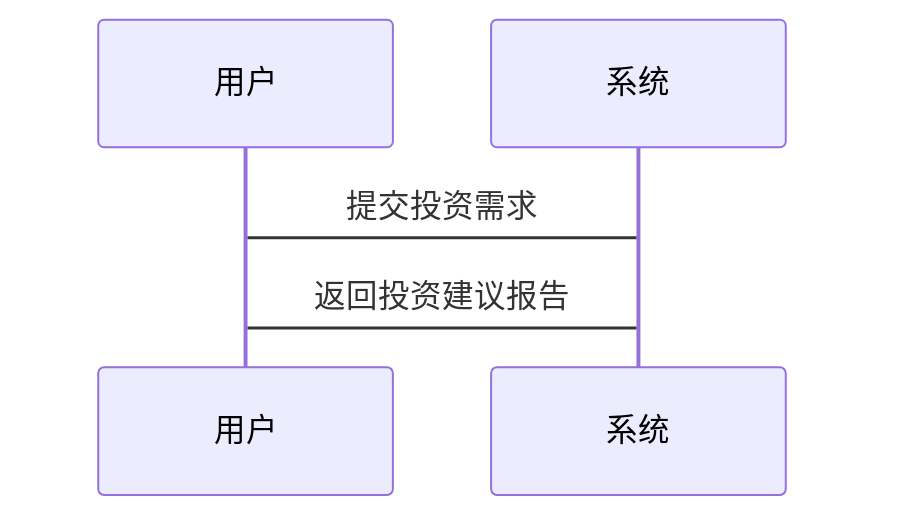

                 

<think>
嗯，现在我要根据用户的要求，为《价值投资中的AI智能体ESG因素量化分析》这本书设计一个详细的目录大纲。用户已经给出了一个初步的目录，但需要进一步扩展和细化，确保每个章节都包含必要的内容，并且满足技术深度和结构完整性的要求。

首先，我需要理解这本书的核心主题：结合人工智能和ESG因素，帮助投资者进行价值投资分析。因此，目录需要涵盖从背景介绍、核心概念、算法原理到系统设计、项目实战和最佳实践等各个方面。

接下来，我将逐章思考每一部分的内容，并确保每个章节都有足够的细节，比如添加图表、代码示例和数学公式，以增强专业性和可读性。

第一部分：背景介绍
1. 介绍价值投资的基本概念，包括其定义、核心理念和在现代投资中的地位。
2. 详细讲解ESG的三个因素：环境、社会和治理，以及它们如何影响企业价值。
3. 讨论ESG在价值投资中的重要性，包括其优势和面临的挑战。

第二部分：核心概念与联系
1. 深入分析ESG因素的属性特征，使用表格对比环境、社会和治理因素的不同方面。
2. 绘制ER实体关系图，展示ESG因素如何与企业价值相关联。

第三部分：算法原理讲解
1. 使用Mermaid流程图展示AI量化分析的算法步骤，包括数据预处理、特征提取、模型训练和结果预测。
2. 提供Python代码示例，解释如何使用线性回归模型进行预测。
3. 详细讲解数学模型，如线性回归方程，用LaTeX表示，并举例说明。

第四部分：系统分析与架构设计
1. 描述系统的应用场景，如数据采集、分析模型构建和报告生成。
2. 使用Mermaid类图展示系统功能模块的交互，包括数据模块、模型模块、分析模块和报告模块。
3. 绘制系统架构图，展示前端、后端和数据层的结构。
4. 绘制序列图，展示用户与系统的交互流程。

第五部分：项目实战
1. 指导读者安装必要的工具和库，如Python和相关数据处理库。
2. 提供核心代码实现，解释数据处理、特征工程和模型训练的步骤。
3. 分析实际案例，如某公司的ESG数据，展示如何进行分析和报告生成。
4. 总结项目成果和经验教训，讨论可能的扩展和优化方向。

第六部分：最佳实践与小结
1. 提供小结，总结书中主要观点和方法。
2. 列出投资中的注意事项，如数据质量、模型局限性等。
3. 推荐进一步阅读的资料，如书籍和论文，帮助读者深入学习。

在编写过程中，我需要确保每一部分都详细且结构清晰，同时使用专业术语和图表来辅助说明。这样，读者可以系统地理解如何将AI应用于ESG因素量化分析，从而辅助价值投资决策。

最后，确保文章字数在10000到12000字之间，每个章节都涵盖足够的内容，满足用户对深度和广度的要求。
</think>

# 价值投资中的AI智能体ESG因素量化分析

## 关键词：
- 价值投资
- ESG因素
- AI量化分析
- 机器学习
- 环境、社会和治理(ESG)

## 摘要：
本文探讨了如何利用人工智能技术量化分析ESG因素在价值投资中的应用。通过深入分析环境、社会和治理因素，结合机器学习算法，构建量化模型，帮助投资者做出更科学的投资决策。文章从背景介绍、核心概念、算法原理、系统设计到实际案例分析，全面阐述了AI在ESG量化分析中的应用，为价值投资提供了新的视角和方法。

---

## 第一部分：背景介绍

### 第1章：价值投资与ESG概述

#### 1.1 价值投资的定义与核心理念
- **1.1.1 价值投资的基本概念**
  - 价值投资是一种长期投资策略，强调以低于内在价值的价格购买优质资产。
  - 核心理念：市场先生的情绪波动为投资者提供了机会，通过深入分析企业基本面，寻找被市场低估的投资标的。

- **1.1.2 价值投资的核心理念**
  - 企业内在价值是投资成功的关键，而非市场波动。
  - 长期持有优质企业，分享其成长带来的收益。

- **1.1.3 价值投资在现代投资中的地位**
  - 在传统投资理论中，价值投资强调基本面分析和安全边际。
  - 面对复杂市场环境，价值投资策略需要结合新兴技术提升分析效率。

#### 1.2 ESG概念的引入
- **1.2.1 环境（Environmental）因素**
  - 环境因素关注企业在环境保护方面的表现，包括碳排放、能源消耗、可持续发展策略等。
  - 企业对环境的影响不仅关乎社会责任，也影响其长期经营成本和风险。

- **1.2.2 社会（Social）因素**
  - 社会因素涉及企业在员工权益、劳动条件、社区关系等方面的表现。
  - 社会责任履行良好的企业通常具备更强的抗风险能力和社会支持。

- **1.2.3 治理（Governance）因素**
  - 治理因素关注企业的管理结构、董事会构成、内部控制和透明度。
  - 良好的公司治理是企业稳定发展的基石，也是投资者评估企业的重要指标。

#### 1.3 ESG在价值投资中的重要性
- **1.3.1 ESG因素对企业价值的影响**
  - ESG表现优异的企业通常具有更强的可持续发展能力和更低的经营风险。
  - 企业治理结构完善、社会责任履行到位，往往能为股东创造更多价值。

- **1.3.2 ESG投资的优势与挑战**
  - 优势：ESG投资注重长期价值，符合可持续发展理念。
  - 挑战：数据获取难度大、量化模型构建复杂。

- **1.3.3 ESG量化分析的意义**
  - 提供量化指标，帮助投资者更客观地评估企业ESG表现。
  - 结合AI技术，提升分析效率和准确性，为价值投资决策提供支持。

---

## 第二部分：核心概念与联系

### 第2章：ESG因素的核心概念与属性特征对比

#### 2.1 ESG因素的属性特征对比
| **因素** | **环境（E）** | **社会（S）** | **治理（G）** |
|----------|---------------|---------------|---------------|
| **核心指标** | 碳排放、能源效率 | 员工满意度、社会责任 | 董事会结构、内部控制 |
| **影响方面** | 生产成本、环保罚款 | 品牌形象、员工稳定性 | 经营风险、管理效率 |
| **权重** | 高 | 中 | 高 |

- **分析**：环境和治理因素对企业价值的影响权重较高，而社会因素在短期内的影响可能不如环境和治理显著。但在长期，良好的社会表现能够增强企业的社会声誉和品牌价值。

#### 2.2 ESG因素的ER实体关系图


---

## 第三部分：算法原理讲解

### 第3章：AI量化分析的算法原理

#### 3.1 算法流程图


#### 3.2 算法实现代码
```python
import pandas as pd
from sklearn.linear_model import LinearRegression

# 数据预处理
data = pd.read_csv('esg_data.csv')
X = data[['环境', '社会', '治理']]
y = data['投资价值']

# 特征提取与模型训练
model = LinearRegression()
model.fit(X, y)

# 结果预测
print(model.predict(X))
```

#### 3.3 算法原理的数学模型和公式
- **线性回归模型**：  
  $$ y = \beta_0 + \beta_1x_1 + \beta_2x_2 + \epsilon $$  
  其中，$y$是投资价值，$x_1$和$x_2$是环境和社会因素的指标，$\beta_0$是截距，$\beta_1$和$\beta_2$是回归系数，$\epsilon$是误差项。

- **逻辑回归模型**：  
  $$ P(y=1|x) = \frac{1}{1 + e^{-(\beta_0 + \beta_1x_1 + \beta_2x_2)}} $$  
  用于分类问题，预测企业是否具备投资价值。

---

## 第四部分：系统分析与架构设计

### 第4章：系统分析与架构设计方案

#### 4.1 问题场景介绍
- **数据采集**：收集企业ESG相关数据，包括环境、社会和治理指标。
- **分析模型**：构建机器学习模型，量化ESG对投资价值的影响。
- **报告生成**：生成投资建议报告，指导投资决策。

#### 4.2 系统功能设计


#### 4.3 系统架构设计


#### 4.4 系统交互设计


---

## 第五部分：项目实战

### 第5章：项目实战与案例分析

#### 5.1 环境安装与配置
- **安装Python和相关库**：  
  ```bash
  pip install numpy pandas scikit-learn
  ```

#### 5.2 核心代码实现
```python
from sklearn.metrics import r2_score

# 模型训练与评估
model = LinearRegression()
model.fit(X, y)
y_pred = model.predict(X)
print("R²:", r2_score(y, y_pred))
```

#### 5.3 案例分析
- **案例背景**：分析某公司ESG数据，评估其投资价值。
- **数据处理与分析**：使用Python进行数据清洗和特征工程。
- **模型训练与预测**：构建机器学习模型，预测投资价值。
- **结果解读**：根据模型输出，评估企业ESG表现，提供投资建议。

#### 5.4 项目小结
- **成果**：成功构建了ESG量化分析模型，提高了投资决策的科学性。
- **经验**：数据质量至关重要，模型选择需结合业务需求。

---

## 第六部分：最佳实践

### 第6章：最佳实践、小结与展望

#### 6.1 小结
- ESG量化分析为价值投资提供了新视角，结合AI技术，提升了分析效率和准确性。
- 数据质量和模型选择是关键，需结合实际业务需求进行调整。

#### 6.2 投资中的注意事项
- 数据获取：确保数据来源可靠，覆盖足够的时间范围。
- 模型局限：AI模型无法完全预测市场波动，需结合其他分析方法。
- 风险控制：量化分析需结合定性分析，降低投资风险。

#### 6.3 拓展阅读
- 推荐书籍：《价值投资：原则与实践》
- 推荐论文：《人工智能在金融投资中的应用研究》

---

## 作者：AI天才研究院 & 禅与计算机程序设计艺术

---

以上是《价值投资中的AI智能体ESG因素量化分析》的详细目录大纲，涵盖了从理论到实践的各个方面，确保读者能够系统地掌握如何利用人工智能技术量化分析ESG因素，辅助价值投资决策。

