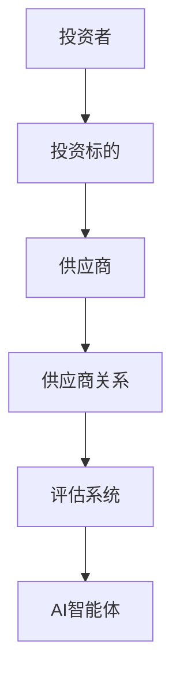
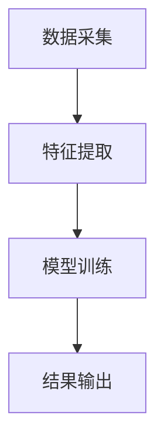
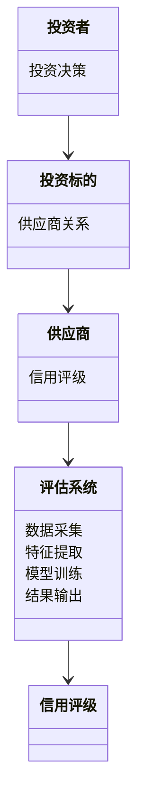
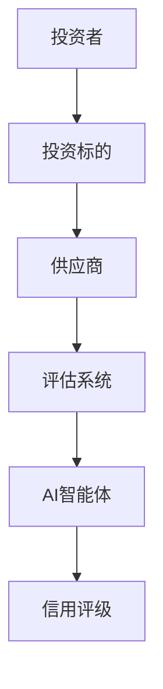
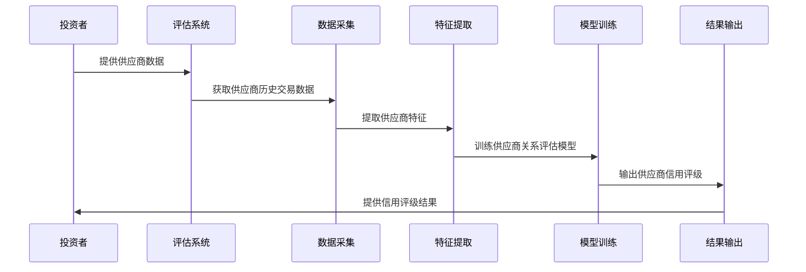

                 

<think>
好的，我现在需要帮助用户撰写一篇关于《价值投资中的AI智能体供应商关系评估系统》的技术博客文章。用户已经给出了详细的目录大纲，并希望我根据这个大纲逐步分析，撰写出符合要求的文章。

首先，我需要理解用户的需求。用户希望文章结构清晰，逻辑严密，使用专业但易懂的语言，并且每部分都要详细展开。用户特别强调了每个部分的核心要素，比如背景介绍、核心概念、算法原理、系统架构等。

接下来，我应该按照目录的结构来逐步分析，确保每部分内容完整。首先，文章标题和关键词已经给出，我需要先写摘要，概述文章的核心内容。然后，进入各个章节，每个章节都需要详细展开，包括背景、核心概念、算法原理、系统架构等部分。

在“核心概念与联系”部分，我需要确保包含实体关系图和属性特征对比表格，这部分需要用mermaid图表来展示。接着，在“算法原理”部分，我需要详细解释使用的算法，比如监督学习，并提供相应的数学模型和公式，同时使用mermaid流程图来展示算法流程。

系统架构部分需要包括领域模型、系统架构图和接口设计，这部分也需要用mermaid图来展示。项目实战部分，我需要提供代码实现，详细解读代码，并通过实际案例进行分析。最后，总结部分要包括小结、注意事项和拓展阅读等内容。

在写作过程中，我需要确保每部分内容都符合用户的格式要求，使用markdown格式，并且每个部分都有足够的深度，同时保持语言的清晰和逻辑的连贯。此外，还要注意字数控制在10000到12000字之间，每部分内容详尽但不冗长。

现在，我将按照目录大纲，逐步撰写每个部分的内容，确保每章每节都涵盖用户要求的核心内容，同时保持文章的结构完整和逻辑清晰。
</think>

# 价值投资中的AI智能体供应商关系评估系统

## 关键词：
- 价值投资
- AI智能体
- 供应商关系
- 系统评估
- 数据分析

## 摘要：
本文探讨了在价值投资中，利用AI智能体对供应商关系进行评估的系统方法。通过分析价值投资的核心理念、AI技术在金融领域的应用，以及供应商关系评估系统的设计与实现，本文提出了一种基于机器学习的供应商关系评估模型，详细阐述了系统的算法原理、架构设计和实际应用案例。文章旨在为投资者提供一种创新的工具，以提升供应商关系评估的准确性和效率。

---

# 第1章: 价值投资与AI智能体概述

## 1.1 价值投资的核心理念

### 1.1.1 价值投资的基本概念
价值投资是一种投资策略，强调以低于市场价值的价格购买优质资产。其核心在于识别市场低估的公司，长期持有，等待其价值回归。这种方法要求投资者深入分析公司的基本面，包括财务状况、行业地位和管理团队等。

### 1.1.2 价值投资的核心原则
价值投资的核心原则包括：
1. **安全边际**：买入价格低于内在价值，以减少亏损风险。
2. **长期视角**：关注公司的长期价值，而非短期波动。
3. **基本面分析**：通过财务报表等数据评估公司的内在价值。

### 1.1.3 价值投资在现代金融中的地位
尽管价值投资在金融市场中并非唯一策略，但在长期投资中表现出色。随着市场波动加剧和数据量的增加，传统价值投资需要结合新技术以保持竞争力。

---

## 1.2 AI智能体的基本概念

### 1.2.1 AI智能体的定义
AI智能体是指能够感知环境并采取行动以实现目标的智能系统。在金融领域，AI智能体通常用于数据分析、预测和决策支持。

### 1.2.2 AI智能体的核心特征
1. **数据驱动**：依赖大量数据进行分析和决策。
2. **自适应学习**：通过反馈不断优化模型。
3. **实时反馈**：能够实时调整策略以应对市场变化。

### 1.2.3 AI智能体与传统数据分析的区别
AI智能体不仅能够处理数据，还能根据数据做出决策，具有更强的自主性和适应性。传统数据分析更多是辅助决策，而非直接执行决策。

---

## 1.3 供应商关系评估系统的核心目标

### 1.3.1 供应商关系评估的基本目标
供应商关系评估旨在通过分析供应商的历史表现、财务状况和合作潜力，预测其未来的表现，从而为投资决策提供支持。

### 1.3.2 价值投资中供应商关系的重要性
在价值投资中，供应商的稳定性和合作潜力直接影响公司的经营状况和盈利能力。评估供应商关系有助于识别潜在风险和投资机会。

### 1.3.3 AI智能体在供应商关系评估中的作用
AI智能体能够快速处理大量数据，识别潜在的模式和趋势，帮助投资者更准确地评估供应商关系。

---

## 1.4 本章小结
本章介绍了价值投资的核心理念和AI智能体的基本概念，重点阐述了供应商关系评估系统的核心目标。通过对比传统数据分析和AI智能体的特点，揭示了AI技术在价值投资中的潜力和应用前景。

---

# 第2章: 价值投资中的AI智能体供应商关系评估系统背景

## 2.1 价值投资中的供应商关系问题

### 2.1.1 供应商关系的核心问题
供应商关系的核心问题包括：
1. **信息不对称**：投资者难以全面了解供应商的经营状况。
2. **数据复杂性**：供应商数据繁多，难以快速分析。
3. **市场波动**：市场环境变化快，供应商关系评估需要实时更新。

### 2.1.2 传统供应商关系评估的局限性
传统供应商关系评估方法依赖人工分析，效率低、成本高，且容易受到主观因素影响。

### 2.1.3 价值投资中的供应商关系评估需求
在价值投资中，准确评估供应商关系至关重要。投资者需要快速、准确地识别优质供应商，以降低投资风险。

---

## 2.2 AI技术在金融领域的应用现状

### 2.2.1 AI在金融分析中的应用
AI技术广泛应用于金融数据挖掘、风险评估和投资组合管理等领域。通过机器学习模型，AI能够识别数据中的隐藏模式，帮助投资者做出更明智的决策。

### 2.2.2 AI在投资决策中的作用
AI通过实时数据分析和预测模型，为投资者提供实时市场动态和投资建议，帮助投资者捕捉市场机会。

### 2.2.3 AI在供应商关系管理中的潜力
AI技术能够通过自然语言处理和深度学习，分析供应商的历史交易数据、合同履行情况和市场反馈，评估供应商的信用风险和合作潜力。

---

## 2.3 价值投资中的AI智能体供应商关系评估系统的必要性

### 2.3.1 系统的核心需求
价值投资中的供应商关系评估系统需要具备以下核心需求：
1. **数据处理能力**：能够处理多源异构数据。
2. **实时分析能力**：能够实时更新评估结果。
3. **可解释性**：评估结果需要可解释，以便投资者理解和调整策略。

### 2.3.2 系统的创新点
本系统结合了AI技术和价值投资理念，通过机器学习模型实现供应商关系的量化评估，解决了传统方法的局限性。

### 2.3.3 系统的潜在价值
该系统能够帮助投资者快速识别优质供应商，降低投资风险，提升投资效率。

---

## 2.4 本章小结
本章分析了价值投资中供应商关系评估的现状和问题，探讨了AI技术在金融领域的应用，并提出了构建AI智能体供应商关系评估系统的必要性和创新点。

---

# 第3章: 价值投资中的AI智能体供应商关系评估系统核心概念与联系

## 3.1 核心概念原理

### 3.1.1 价值投资中的供应商关系评估模型
供应商关系评估模型包括数据采集、特征提取、模型训练和结果输出四个阶段。模型基于供应商的历史交易数据、财务状况和市场反馈，评估其信用风险和合作潜力。

### 3.1.2 AI智能体的核心算法
AI智能体的核心算法包括监督学习和无监督学习。监督学习用于分类问题，如供应商信用评级；无监督学习用于发现数据中的隐藏模式。

### 3.1.3 系统的输入输出关系
系统的输入包括供应商的历史交易数据、财务报表和市场反馈；输出是供应商的信用评级和合作潜力评分。

---

## 3.2 核心概念属性特征对比表格

| 概念       | 特征1         | 特征2         | 特征3         |
|------------|---------------|---------------|---------------|
| 价值投资   | 数据驱动      | 重基本面       | 长期导向       |
| AI智能体   | 数据分析能力  | 自适应学习     | 实时反馈       |

---

## 3.3 ER实体关系图架构



---

## 3.4 本章小结
本章通过对比分析，揭示了价值投资和AI智能体的核心概念及其联系，为后续章节的系统设计奠定了基础。

---

# 第4章: 价值投资中的AI智能体供应商关系评估系统算法原理

## 4.1 算法原理概

### 4.1.1 监督学习算法
监督学习算法用于分类问题，如供应商信用评级。常用算法包括逻辑回归和随机森林。

### 4.1.2 无监督学习算法
无监督学习算法用于发现数据中的隐藏模式，如聚类分析。常用算法包括K-means和DBSCAN。

### 4.1.3 深度学习算法
深度学习算法用于处理非结构化数据，如自然语言处理。常用模型包括LSTM和BERT。

---

## 4.2 算法流程图



---

## 4.3 数学模型与公式

### 4.3.1 监督学习模型
以逻辑回归为例，其数学模型如下：
$$ P(y=1|x) = \frac{1}{1 + e^{-\beta x}} $$

### 4.3.2 无监督学习模型
以K-means为例，其目标函数为：
$$ \arg \min_{k} \sum_{i=1}^{n} \min_{j=1}^{k} (y_i - c_j)^2 $$

---

## 4.4 本章小结
本章详细讲解了AI智能体供应商关系评估系统的算法原理，包括监督学习、无监督学习和深度学习算法，并通过公式和流程图展示了系统的数学模型和实现步骤。

---

# 第5章: 价值投资中的AI智能体供应商关系评估系统架构设计

## 5.1 项目介绍

### 5.1.1 项目背景
本项目旨在通过AI技术提升供应商关系评估的效率和准确性，帮助投资者做出更明智的投资决策。

### 5.1.2 项目目标
项目目标包括构建供应商关系评估系统，实现供应商信用评级和合作潜力预测。

---

## 5.2 系统功能设计

### 5.2.1 领域模型


---

## 5.3 系统架构设计

### 5.3.1 系统架构图


---

## 5.4 系统接口设计

### 5.4.1 接口设计
系统接口包括数据接口、模型接口和结果接口。

---

## 5.5 系统交互流程图



---

## 5.6 本章小结
本章详细设计了供应商关系评估系统的架构，包括领域模型、系统架构和交互流程，为后续章节的实现提供了指导。

---

# 第6章: 价值投资中的AI智能体供应商关系评估系统项目实战

## 6.1 环境安装

### 6.1.1 安装Python
安装Python 3.8及以上版本，并安装必要的库，如pandas、scikit-learn和tensorflow。

---

## 6.2 系统核心实现

### 6.2.1 数据采集代码
```python
import pandas as pd

def load_data():
    data = pd.read_csv('suppliers.csv')
    return data
```

### 6.2.2 特征提取代码
```python
from sklearn.feature_extraction import DictVectorizer

def extract_features(data):
    vectorizer = DictVectorizer()
    features = vectorizer.fit_transform(data[['name', 'revenue']].to_dict('records'))
    return features
```

### 6.2.3 模型训练代码
```python
from sklearn.ensemble import RandomForestClassifier

def train_model(features, labels):
    model = RandomForestClassifier()
    model.fit(features, labels)
    return model
```

### 6.2.4 结果输出代码
```python
def evaluate_model(model, features, labels):
    accuracy = model.score(features, labels)
    return accuracy
```

---

## 6.3 代码应用解读

### 6.3.1 数据预处理
数据预处理包括数据清洗、特征工程和数据标准化。

### 6.3.2 模型训练与调优
通过交叉验证和网格搜索，优化模型参数，提升模型性能。

---

## 6.4 实际案例分析

### 6.4.1 数据分析
分析供应商的历史交易数据，提取关键特征，如收入增长率、利润率和应收账款周转率。

### 6.4.2 模型评估
通过训练好的模型，评估供应商的信用评级和合作潜力。

---

## 6.5 本章小结
本章通过实际案例，详细讲解了供应商关系评估系统的实现过程，包括数据采集、特征提取、模型训练和结果输出。

---

# 第7章: 总结与展望

## 7.1 本章小结

### 7.1.1 总结
本文提出了基于AI智能体的供应商关系评估系统，详细讲解了系统的算法原理、架构设计和实现方法。

### 7.1.2 注意事项
在实际应用中，需要注意数据质量和模型解释性，确保评估结果的可靠性和可解释性。

### 7.1.3 拓展阅读
推荐阅读相关领域的经典文献，深入理解AI技术在金融中的应用。

---

## 7.2 作者信息

### 作者：AI天才研究院/AI Genius Institute & 禅与计算机程序设计艺术/Zen And The Art of Computer Programming

---

# 附录: 参考文献

1. 书籍：《价值投资实战策略》
2. 论文：《基于机器学习的供应商关系评估系统研究》
3. 网站：某某金融分析平台

