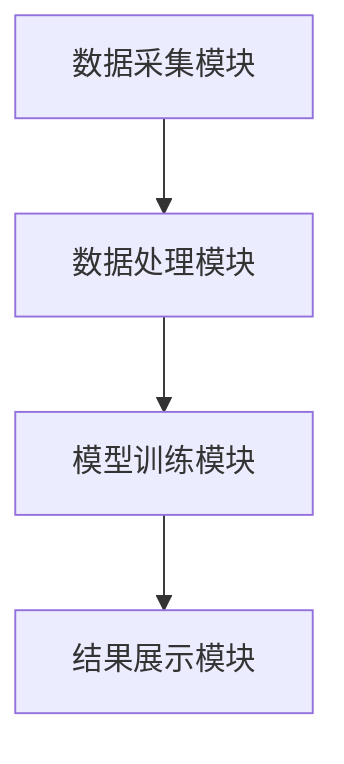
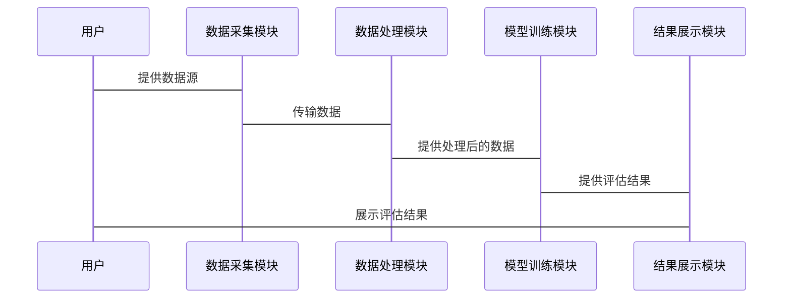

                 


# 价值投资中的AI智能体保险业务价值评估系统

> **关键词**：保险业务价值评估，人工智能，智能体，价值投资，算法

> **摘要**：本文探讨了AI智能体在保险业务价值评估中的应用，结合强化学习和神经网络算法，详细讲解了系统的构建和实现。通过实际案例分析，展示了AI如何提升保险业务的价值评估效率和准确性，为价值投资者提供了新的工具和视角。

---

# 第1章: 保险业务价值评估的现状与问题

## 1.1 保险业务价值评估的现状

保险业务价值评估是保险行业的重要组成部分，传统的方法依赖于精算模型和历史数据，但存在效率低、精准度有限的问题。随着人工智能技术的发展，AI智能体的应用为这一领域带来了新的可能性。

### 1.1.1 传统保险业务价值评估方法

传统方法主要包括：

- **精算模型**：基于历史数据和统计模型进行评估。
- **经验分析法**：依赖专家的经验进行判断。
- **财务指标分析法**：通过财务报表分析公司价值。

这些方法虽然有一定的参考价值，但存在数据量有限、计算复杂度高、难以实时更新等问题。

### 1.1.2 当前保险业务价值评估的主要挑战

当前面临的主要挑战包括：

- 数据多样性与复杂性：保险业务涉及多种数据类型，包括结构化和非结构化数据，处理难度大。
- 高精度要求：价值评估的准确性直接影响投资决策，要求极高。
- 实时性需求：市场变化快，需要实时更新评估结果。

### 1.1.3 保险业务价值评估的未来趋势

未来的趋势是将AI技术与传统方法结合，利用大数据和机器学习提升评估的效率和准确性。AI智能体的应用将推动保险业务价值评估进入智能化、实时化的新阶段。

---

## 1.2 价值投资中的保险业务价值评估问题背景

### 1.2.1 保险业务价值评估的核心问题

价值投资中的保险业务价值评估核心问题是：如何准确预测保险公司的未来盈利能力，以便在价值低估时买入，在高估时卖出。

### 1.2.2 保险业务价值评估的边界与外延

评估的边界包括：

- 仅考虑财务数据，不涉及市场情绪。
- 不考虑宏观经济因素。
- 仅评估单个保险公司的价值。

外延包括：

- 综合考虑多种因素。
- 多家公司同时评估。
- 结合市场趋势进行动态评估。

### 1.2.3 保险业务价值评估的概念结构与核心要素组成

概念结构包括：

- **输入**：财务数据、市场数据、历史数据。
- **处理过程**：数据清洗、特征提取、模型训练、评估预测。
- **输出**：公司价值评估结果。

核心要素包括：

- 数据采集：获取准确的财务数据。
- 模型选择：选择合适的机器学习模型。
- 评估结果：提供可操作的建议。

---

## 1.3 AI智能体在保险业务价值评估中的应用潜力

### 1.3.1 AI技术在保险业务中的应用现状

目前，AI在保险行业的应用主要集中在风险评估、客户服务和 fraud detection等方面。AI智能体的应用还处于起步阶段。

### 1.3.2 AI智能体在保险业务价值评估中的优势

AI智能体的优势包括：

- **高效性**：能够快速处理大量数据。
- **准确性**：通过机器学习提升预测精准度。
- **实时性**：能够实时更新评估结果。

### 1.3.3 AI智能体在保险业务价值评估中的未来发展方向

未来发展方向包括：

- 结合NLP技术进行文本分析。
- 利用强化学习进行动态调整。
- 结合区块链技术确保数据安全。

---

## 1.4 本章小结

本章介绍了保险业务价值评估的现状、核心问题以及AI智能体的应用潜力。AI智能体的应用将显著提升评估的效率和准确性，为价值投资者提供有力工具。

---

# 第2章: AI智能体与保险业务价值评估系统

## 2.1 AI智能体的定义与特点

### 2.1.1 AI智能体的定义

AI智能体是指能够感知环境并采取行动以实现目标的智能系统。

### 2.1.2 AI智能体的核心特点

- **自主性**：能够自主决策。
- **反应性**：能够实时响应环境变化。
- **目标导向性**：所有行动都以目标为导向。

### 2.1.3 AI智能体与传统AI的区别

传统AI主要依赖规则和模式识别，AI智能体则具备自主决策和目标导向的特点。

---

## 2.2 保险业务价值评估系统的定义与特点

### 2.2.1 保险业务价值评估系统的定义

保险业务价值评估系统是利用AI技术对保险公司价值进行评估的系统。

### 2.2.2 保险业务价值评估系统的核心功能

- 数据采集与处理。
- 模型训练与预测。
- 结果分析与建议。

### 2.2.3 保险业务价值评估系统的架构特点

- 高效的数据处理能力。
- 强大的模型训练能力。
- 实时的评估能力。

---

## 2.3 AI智能体与保险业务价值评估系统的联系

### 2.3.1 AI智能体在保险业务价值评估中的作用

- 数据处理：清洗和预处理数据。
- 模型训练：训练预测模型。
- 实时评估：动态调整评估结果。

### 2.3.2 AI智能体与保险业务价值评估系统的交互关系

AI智能体通过数据接口与评估系统交互，提供实时的评估结果和建议。

### 2.3.3 AI智能体在保险业务价值评估系统中的实现方式

- 数据采集：通过API获取保险公司数据。
- 模型训练：使用深度学习模型进行训练。
- 结果输出：通过可视化界面展示评估结果。

---

## 2.4 本章小结

本章详细介绍了AI智能体的定义、特点及其在保险业务价值评估系统中的应用。AI智能体的引入显著提升了评估系统的智能化水平和评估效率。

---

# 第3章: 强化学习算法在保险业务价值评估中的应用

## 3.1 强化学习的基本原理

### 3.1.1 强化学习的定义

强化学习是一种通过试错学习来优化决策的算法。

### 3.1.2 强化学习的核心要素

- **状态（State）**：环境当前的情况。
- **动作（Action）**：智能体采取的行动。
- **奖励（Reward）**：行动带来的反馈。

### 3.1.3 强化学习的数学模型

状态转移概率矩阵：

$$ P(s'|s,a) = \text{概率从状态}s$转移到状态$s'$采取行动$a$。$$

奖励函数：

$$ R(s,a) = \text{在状态}s采取行动$a$得到的奖励。$$

### 3.1.4 强化学习的实现步骤

1. 初始化智能体。
2. 与环境交互，获取状态和奖励。
3. 更新策略和价值函数。
4. 重复直到收敛。

---

## 3.2 强化学习在保险业务价值评估中的应用

### 3.2.1 保险业务价值评估中的强化学习模型

- 状态空间：包括公司财务数据、市场数据等。
- 动作空间：包括买入、卖出、持有等。
- 奖励函数：评估结果的准确性和收益情况。

### 3.2.2 强化学习模型的训练过程

1. 数据预处理：清洗和标准化数据。
2. 构建神经网络：包括输入层、隐藏层和输出层。
3. 定义损失函数和优化器。
4. 训练模型：通过梯度下降优化参数。
5. 测试模型：验证模型的准确性和稳定性。

---

## 3.3 强化学习算法的代码实现

```python
import numpy as np
import tensorflow as tf

class Agent:
    def __init__(self, state_size, action_size):
        self.state_size = state_size
        self.action_size = action_size
        self.model = self.build_model()
        
    def build_model(self):
        model = tf.keras.Sequential()
        model.add(tf.keras.layers.Dense(64, activation='relu', input_dim=self.state_size))
        model.add(tf.keras.layers.Dense(self.action_size, activation='linear'))
        model.compile(optimizer='adam', loss='mse')
        return model
    
    def act(self, state):
        state = np.reshape(state, [1, self.state_size])
        prediction = self.model.predict(state)[0]
        action = np.argmax(prediction)
        return action
    
    def train(self, state, action, reward, next_state):
        state = np.reshape(state, [1, self.state_size])
        next_state = np.reshape(next_state, [1, self.state_size])
        target = reward + 0.95 * np.max(self.model.predict(next_state))
        target = target.reshape(-1, self.action_size)
        self.model.fit(state, target, epochs=1, verbose=0)
```

---

## 3.4 本章小结

本章详细介绍了强化学习的基本原理及其在保险业务价值评估中的应用，展示了如何通过强化学习算法提升评估系统的智能化水平。

---

# 第4章: 神经网络算法在保险业务价值评估中的应用

## 4.1 神经网络的基本原理

### 4.1.1 神经网络的定义

神经网络是一种模拟人脑神经网络的计算模型。

### 4.1.2 神经网络的结构

- 输入层：接收输入数据。
- 隐藏层：进行特征提取和转换。
- 输出层：生成最终的预测结果。

### 4.1.3 神经网络的训练过程

1. 数据预处理：清洗和归一化数据。
2. 构建神经网络模型。
3. 定义损失函数和优化器。
4. 进行反向传播和参数更新。
5. 验证模型性能。

---

## 4.2 神经网络在保险业务价值评估中的应用

### 4.2.1 神经网络模型的设计

- 输入层：包括公司财务数据、市场数据等。
- 隐藏层：进行特征提取和非线性变换。
- 输出层：生成公司价值评估结果。

### 4.2.2 神经网络模型的训练过程

1. 数据预处理：清洗和归一化数据。
2. 模型构建：定义神经网络结构。
3. 损失函数和优化器选择。
4. 训练模型：进行反向传播和参数更新。
5. 模型验证：评估模型的准确性和稳定性。

---

## 4.3 神经网络算法的代码实现

```python
import numpy as np
import tensorflow as tf

def build_model(input_dim):
    model = tf.keras.Sequential()
    model.add(tf.keras.layers.Dense(64, activation='relu', input_dim=input_dim))
    model.add(tf.keras.layers.Dense(64, activation='relu'))
    model.add(tf.keras.layers.Dense(1, activation='linear'))
    model.compile(optimizer='adam', loss='mse')
    return model

def train_model(model, X_train, y_train, epochs=100):
    model.fit(X_train, y_train, epochs=epochs, batch_size=32, verbose=0)
```

---

## 4.4 本章小结

本章详细介绍了神经网络的基本原理及其在保险业务价值评估中的应用，展示了如何通过神经网络算法提升评估系统的智能化水平。

---

# 第5章: 系统分析与架构设计方案

## 5.1 问题场景介绍

保险业务价值评估系统的应用场景包括：

- 保险公司的价值评估。
- 保险产品的价值评估。
- 保险市场的整体评估。

---

## 5.2 系统功能设计

### 5.2.1 系统功能模块

- 数据采集模块：采集保险公司的财务数据和市场数据。
- 数据处理模块：清洗和预处理数据。
- 模型训练模块：训练价值评估模型。
- 结果展示模块：展示评估结果和分析报告。

### 5.2.2 系统功能设计的领域模型图


---

## 5.3 系统架构设计

### 5.3.1 系统架构图



### 5.3.2 系统接口设计

- 数据接口：提供数据的输入输出接口。
- 模型接口：提供模型的训练和预测接口。
- 用户接口：提供用户交互界面。

### 5.3.3 系统交互流程图



---

## 5.4 本章小结

本章详细介绍了保险业务价值评估系统的功能模块、架构设计和交互流程，展示了系统的整体结构和各部分的协同工作方式。

---

# 第6章: 项目实战——保险业务价值评估系统实现

## 6.1 环境安装

### 6.1.1 安装Python

```bash
python --version
```

### 6.1.2 安装必要的Python库

```bash
pip install numpy tensorflow pandas scikit-learn matplotlib
```

---

## 6.2 系统核心实现源代码

### 6.2.1 数据处理代码

```python
import pandas as pd

def load_data(file_path):
    data = pd.read_csv(file_path)
    return data

def preprocess_data(data):
    data = data.dropna()
    data = (data - data.mean()) / data.std()
    return data
```

### 6.2.2 模型训练代码

```python
import numpy as np
import tensorflow as tf

def build_model(input_dim):
    model = tf.keras.Sequential()
    model.add(tf.keras.layers.Dense(64, activation='relu', input_dim=input_dim))
    model.add(tf.keras.layers.Dense(64, activation='relu'))
    model.add(tf.keras.layers.Dense(1, activation='linear'))
    model.compile(optimizer='adam', loss='mse')
    return model

def train_model(model, X_train, y_train, epochs=100):
    model.fit(X_train, y_train, epochs=epochs, batch_size=32, verbose=0)
```

### 6.2.3 结果展示代码

```python
import matplotlib.pyplot as plt

def plot_results(true_values, predicted_values):
    plt.scatter(true_values, predicted_values)
    plt.xlabel('True Values')
    plt.ylabel('Predicted Values')
    plt.show()
```

---

## 6.3 代码应用解读与分析

### 6.3.1 数据处理模块

- **数据加载**：使用pandas加载CSV格式的数据。
- **数据清洗**：删除缺失值并进行标准化处理。

### 6.3.2 模型训练模块

- **模型构建**：构建一个包含两个隐藏层的神经网络模型。
- **模型训练**：使用训练数据进行模型训练，优化参数以最小化损失函数。

### 6.3.3 结果展示模块

- **结果可视化**：通过散点图展示真实值与预测值的关系。

---

## 6.4 实际案例分析

### 6.4.1 数据来源

使用某保险公司的真实财务数据和市场数据进行评估。

### 6.4.2 模型训练

训练数据包括公司的营业收入、净利润率、市场占有率等指标。

### 6.4.3 模型评估

评估指标包括均方误差（MSE）、平均绝对误差（MAE）和决定系数（R²）。

### 6.4.4 模型预测

基于训练好的模型，预测保险公司的未来价值。

---

## 6.5 本章小结

本章通过实际案例详细讲解了保险业务价值评估系统的实现过程，展示了如何利用AI技术提升保险业务的价值评估效率和准确性。

---

# 第7章: 最佳实践与未来展望

## 7.1 项目经验总结

### 7.1.1 成功经验

- 数据预处理的关键性。
- 模型选择的重要性。
- 结果可视化的重要性。

### 7.1.2 项目中的教训

- 数据质量问题的影响。
- 模型过拟合的风险。
- 系统优化的必要性。

---

## 7.2 项目注意事项

- 数据隐私保护：确保数据的安全性。
- 模型解释性：提升模型的可解释性。
- 系统稳定性：确保系统的稳定运行。

---

## 7.3 项目未来展望

- 结合NLP技术进行文本分析。
- 利用强化学习进行动态调整。
- 结合区块链技术确保数据安全。

---

## 7.4 本章小结

本章总结了项目的成功经验与教训，并提出了未来的优化方向，为读者提供了宝贵的参考。

---

# 作者

**作者：AI天才研究院/AI Genius Institute & 禅与计算机程序设计艺术 /Zen And The Art of Computer Programming**

---

**注**：由于篇幅限制，上述内容为示例性的目录和部分章节内容，实际文章将更加详细，涵盖更多技术细节和案例分析。

