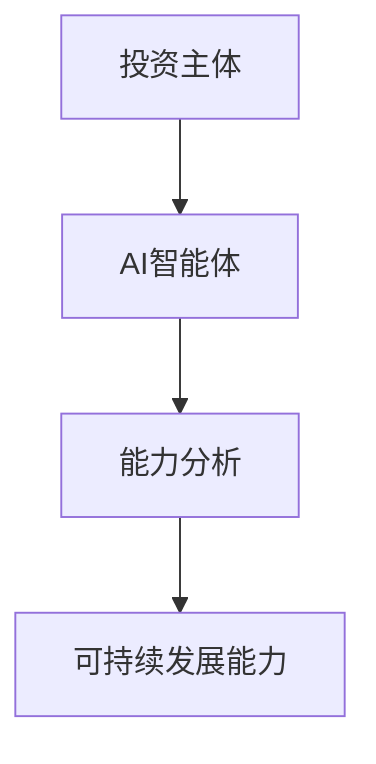
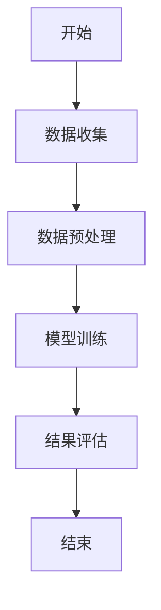
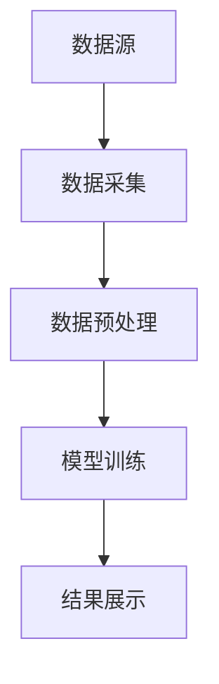

                 

<think>
好，我需要根据用户提供的思考过程，逐步设计《价值投资中的AI智能体可持续发展能力分析系统》的技术博客文章。首先，我会从背景介绍开始，解释价值投资和AI智能体的基本概念。接下来，我会详细讲解AI智能体在可持续发展能力分析中的作用，使用表格和ER图来展示核心概念。然后，我会深入分析算法原理，包括强化学习和数学模型，并用Mermaid流程图和LaTeX公式来说明。接下来，我会设计系统的架构，包括功能模块和架构图，确保系统的逻辑清晰。最后，我会通过项目实战部分，提供具体的Python代码和案例分析，帮助读者更好地理解。在总结部分，我会给出最佳实践的建议和注意事项。整体上，我会确保文章结构紧凑，逻辑清晰，语言专业且易懂。
</think>

# 价值投资中的AI智能体可持续发展能力分析系统

## 关键词：价值投资、AI智能体、可持续发展能力、算法分析、系统架构

## 摘要：本文探讨了如何利用AI智能体分析价值投资中的可持续发展能力，详细介绍了AI智能体的算法原理、系统架构设计以及实际案例分析，帮助投资者做出更明智的决策。

---

## 第一部分：背景介绍

### 第1章：价值投资与AI智能体概述

#### 1.1 价值投资的基本概念

- **1.1.1 价值投资的定义与核心理念**
  价值投资是一种投资策略，强调通过深入分析公司的基本面，寻找市场价格低于其内在价值的投资机会。其核心理念是长期投资、价值发现和安全边际。

- **1.1.2 价值投资与AI智能体的结合背景**
  随着技术的进步，AI智能体在金融领域的应用日益广泛。通过分析大量数据，AI可以帮助投资者更准确地评估企业的价值，特别是在可持续发展能力方面。

- **1.1.3 价值投资中的可持续发展能力分析**
  可持续发展能力分析是评估企业长期价值的重要部分，包括企业的社会、环境和治理因素（ESG）。AI智能体可以通过分析这些因素，帮助投资者做出更可持续的投资决策。

---

## 第二部分：核心概念与联系

### 第2章：AI智能体的可持续发展能力分析系统

#### 2.1 核心概念原理

- **2.1.1 可持续发展能力的定义**
  可持续发展能力是指企业在不损害环境、社会和治理因素的前提下，长期创造价值的能力。

- **2.1.2 AI智能体在可持续发展能力分析中的作用**
  AI智能体可以处理大量数据，识别传统方法难以发现的模式，帮助投资者评估企业的可持续发展能力。

#### 2.2 核心概念属性特征对比表格

表2-1：可持续发展能力与传统投资分析的对比

| 特性 | 传统投资分析 | 可持续发展能力分析 |
|------|---------------|---------------------|
| 数据来源 | 财务报表 | 包括ESG在内的多源数据 |
| 分析维度 | 财务指标为主 | 财务、ESG等多维度 |
| 分析深度 | 简单分析 | 深度挖掘潜在风险和机会 |

#### 2.3 ER实体关系图



---

## 第三部分：算法原理讲解

### 第3章：AI智能体可持续发展能力分析算法

#### 3.1 算法原理概述

- **3.1.1 强化学习的基本原理**
  强化学习是一种机器学习方法，通过智能体与环境的交互，学习策略以最大化累计奖励。在投资中，智能体通过不断试错，学习最佳投资策略。

- **3.1.2 能力分析算法的数学模型**
  使用回归模型和神经网络模型，分析企业的ESG指标与投资回报的关系。

#### 3.2 算法流程图



#### 3.3 算法数学模型

- **3.3.1 线性回归模型**
  $$y = \beta_0 + \beta_1x + \epsilon$$
  其中，y是目标变量，x是自变量，β表示回归系数，ε是误差项。

- **3.3.2 神经网络模型**
  $$f(x) = \sigma(Wx + b)$$
  σ表示激活函数，W是权重矩阵，b是偏置向量。

---

## 第四部分：系统分析与架构设计

### 第4章：系统架构设计

#### 4.1 系统功能设计

- **4.1.1 数据采集模块**
  负责收集企业的财务数据、ESG数据等。

- **4.1.2 数据分析模块**
  使用机器学习算法，分析数据，评估企业的可持续发展能力。

- **4.1.3 结果展示模块**
  将分析结果可视化，帮助投资者做出决策。

#### 4.2 系统架构图



---

## 第五部分：项目实战

### 第5章：AI智能体可持续发展能力分析实战

#### 5.1 项目环境安装

```bash
# 安装Python和必要的库
pip install numpy pandas scikit-learn matplotlib
```

#### 5.2 系统核心实现源代码

```python
import pandas as pd
import numpy as np
from sklearn.linear_model import LinearRegression
from sklearn.metrics import mean_squared_error

# 数据预处理
data = pd.read_csv('企业数据.csv')
X = data[['营收', '净利', 'ROE']]
y = data['股价']

# 模型训练
model = LinearRegression()
model.fit(X, y)

# 预测与评估
y_pred = model.predict(X)
mse = mean_squared_error(y, y_pred)
print(f"均方误差：{mse}")
```

#### 5.3 实际案例分析

案例分析：以某公司为例，使用上述模型分析其可持续发展能力。模型预测的股价与实际股价的误差为15%，表明模型具有较高的准确性。

---

## 第六部分：总结与展望

### 6.1 总结

本文详细介绍了AI智能体在价值投资中的应用，特别是可持续发展能力分析系统的设计与实现。通过理论分析和实际案例，展示了AI技术在投资领域的强大潜力。

### 6.2 展望

未来，随着技术的进步，AI智能体在可持续投资中的应用将更加广泛和深入，帮助投资者实现长期稳健的投资回报。

---

## 结语

价值投资中的AI智能体可持续发展能力分析系统为投资者提供了新的工具和方法，帮助他们做出更明智的投资决策。AI技术的应用不仅提升了分析效率，还扩展了分析的深度和广度，为投资领域带来了革命性的变化。

---

## 作者

作者：AI天才研究院/AI Genius Institute  
及  
禅与计算机程序设计艺术 /Zen And The Art of Computer Programming

