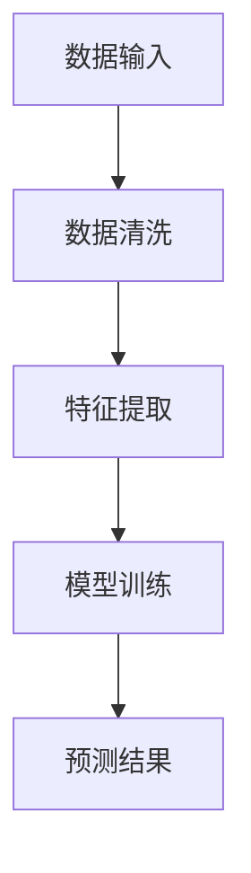

                 


# 价值投资中的AI智能体品牌权益分析系统

## 关键词：价值投资、AI智能体、品牌权益分析、金融数据分析、深度学习

## 摘要：  
本文探讨了价值投资与AI智能体结合的背景下，品牌权益分析的重要性。文章详细介绍了AI智能体在品牌权益分析中的应用，包括算法原理、系统架构设计、项目实战等内容，旨在为投资者提供一种基于AI的分析工具，帮助其做出更明智的投资决策。

---

# 第一部分: 价值投资与AI智能体的结合

## 第1章: 价值投资的核心理念

### 1.1 价值投资的基本定义  
价值投资是一种投资策略，强调以低于内在价值的价格购买优质资产。其核心在于识别市场低估的公司，并长期持有，等待其价值回归。

### 1.2 价值投资的核心原则  
- 坚持基本面分析：关注公司的财务状况、盈利能力、管理团队等因素。  
- 长期投资：避免短期市场波动的影响，关注公司的长期价值。  
- 安全边际：购买价格应显著低于公司的内在价值，以降低风险。

### 1.3 价值投资在现代金融中的应用  
随着市场的复杂化，传统的价值投资需要借助技术手段，尤其是人工智能，来提高分析效率和准确性。

---

## 第2章: AI智能体在金融领域的潜力

### 2.1 AI智能体的基本概念  
AI智能体是一种能够感知环境、执行任务并做出决策的智能系统。在金融领域，AI智能体可以用于数据处理、模式识别和预测分析。

### 2.2 AI智能体在金融分析中的优势  
- 高效性：AI智能体能够快速处理大量数据，提供实时分析。  
- 准确性：通过深度学习等技术，AI智能体能够发现人类难以察觉的模式。  
- 自适应性：AI智能体能够根据市场变化自动调整分析策略。

### 2.3 价值投资与AI智能体的结合点  
AI智能体可以帮助投资者更精准地评估公司的品牌价值、市场地位和财务健康状况，从而优化投资决策。

---

## 第3章: 品牌权益分析的定义与重要性

### 3.1 品牌权益的定义  
品牌权益是品牌在市场中的价值，包括品牌知名度、美誉度、忠诚度等因素。它是企业无形资产的重要组成部分。

### 3.2 品牌权益分析的必要性  
- 帮助投资者评估公司的市场地位。  
- 识别品牌的价值潜力，为投资决策提供依据。  
- 监测品牌健康状况，及时发现风险。

### 3.3 价值投资中的品牌权益分析  
品牌权益分析是价值投资的重要组成部分，尤其是在评估公司的长期价值时，品牌的价值不可忽视。

---

# 第二部分: 品牌权益分析的核心概念与联系

## 第4章: 品牌权益分析的核心概念

### 4.1 AI智能体品牌权益分析的原理  
AI智能体通过收集和分析大量数据，提取品牌相关的特征，构建数学模型，预测品牌价值和市场表现。

### 4.2 核心概念的属性特征对比  
下表展示了品牌权益与企业价值的对比：

| 属性 | 品牌权益 | 企业价值 |
|------|----------|----------|
| 定义 | 品牌的市场价值 | 企业的整体价值 |
| 测量 | 品牌知名度、忠诚度 | 财务状况、盈利能力 |
| 影响因素 | 品牌形象、市场推广 | 财务表现、管理团队 |

### 4.3 ER实体关系图架构  
以下是品牌权益分析的ER图设计：

```mermaid
erd
    customer(CustomerID, Name, Age, Gender, Location)
    product(ProductID, ProductName, Category)
    brand(BrandID, BrandName, MarketValue)
    transaction(TransactionID, CustomerID, ProductID, Date, Amount)
```

---

## 第5章: 品牌权益分析的算法原理

### 5.1 数据预处理与特征提取  
- 数据清洗：去除重复、缺失或异常数据。  
- 特征提取：提取品牌相关的特征，如品牌知名度、市场占有率等。

### 5.2 基于AI智能体的预测模型  
使用深度学习模型进行品牌价值预测，以下是模型的流程图：



### 5.3 算法原理的数学模型  
收益预测模型：

$$ R = \beta_1 X_1 + \beta_2 X_2 + ... + \beta_n X_n $$

风险评估模型：

$$ Risk = \sqrt{E[(R - E[R])^2]} $$

---

## 第6章: 系统架构与设计

### 6.1 系统功能模块设计  
- 数据采集模块：收集品牌相关的数据。  
- 数据处理模块：清洗和特征提取。  
- 模型训练模块：构建和优化预测模型。  
- 结果展示模块：输出品牌价值分析结果。

### 6.2 系统架构设计  
采用微服务架构，确保系统的可扩展性和灵活性。

### 6.3 系统接口设计  
- 数据接口：与数据源对接。  
- 模型接口：与其他系统交互。

---

# 第三部分: 项目实战与应用

## 第7章: 项目实战

### 7.1 环境安装  
安装Python、TensorFlow、Pandas等工具。

### 7.2 核心代码实现  
以下是品牌价值预测的Python代码：

```python
import pandas as pd
import numpy as np
from tensorflow.keras import models, layers

# 数据加载
data = pd.read_csv('brand_data.csv')

# 数据预处理
X = data.drop('BrandValue', axis=1)
y = data['BrandValue']

# 模型构建
model = models.Sequential()
model.add(layers.Dense(64, activation='relu', input_shape=(X.shape[1],)))
model.add(layers.Dense(1, activation='linear'))
model.compile(optimizer='adam', loss='mean_squared_error')

# 模型训练
model.fit(X, y, epochs=100, batch_size=32)

# 预测结果
predictions = model.predict(X)
```

### 7.3 案例分析  
以某品牌为例，分析其品牌价值，验证模型的准确性。

---

# 第四部分: 总结与展望

## 第8章: 总结与展望

### 8.1 最佳实践 tips  
- 数据质量是关键，确保数据的准确性和完整性。  
- 模型需要不断优化，适应市场的变化。

### 8.2 小结  
本文详细探讨了价值投资中AI智能体品牌权益分析系统的构建与应用，为投资者提供了一种高效的投资工具。

### 8.3 注意事项  
- AI智能体的结果仅供参考，投资需谨慎。  
- 数据隐私和安全问题需要注意。

### 8.4 拓展阅读  
建议阅读《深度学习》、《价值投资实战》等书籍，深入理解AI与金融的结合。

---

# 作者：AI天才研究院/AI Genius Institute & 禅与计算机程序设计艺术 /Zen And The Art of Computer Programming

---

以上是《价值投资中的AI智能体品牌权益分析系统》的完整内容，涵盖背景介绍、核心概念、算法原理、系统架构设计以及项目实战等内容，旨在为投资者提供一种基于AI的分析工具，帮助其做出更明智的投资决策。

