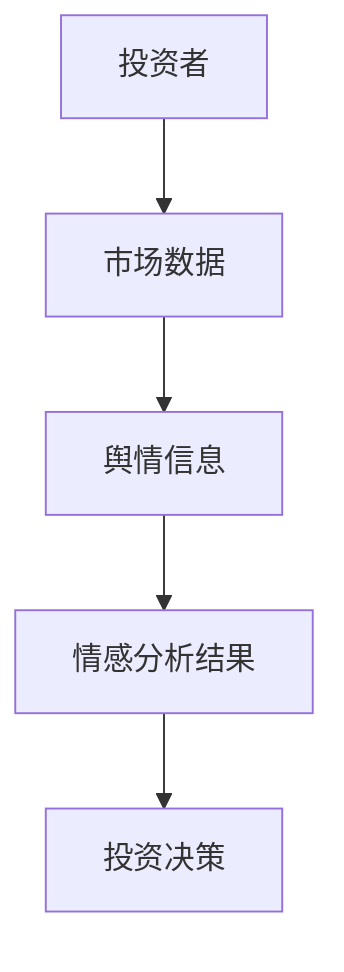
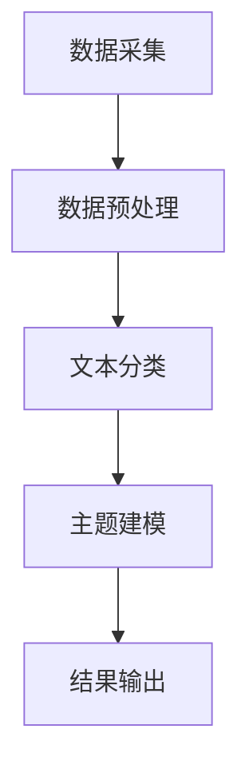
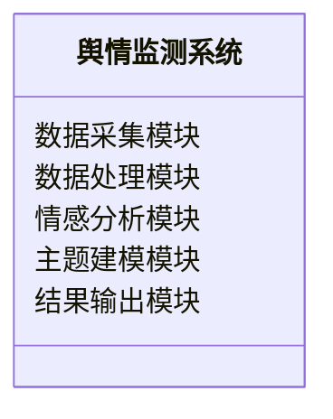
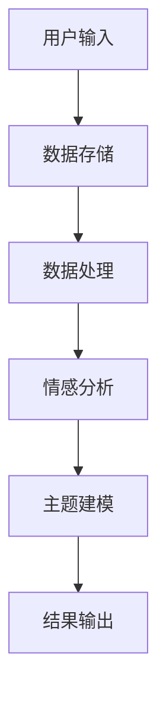
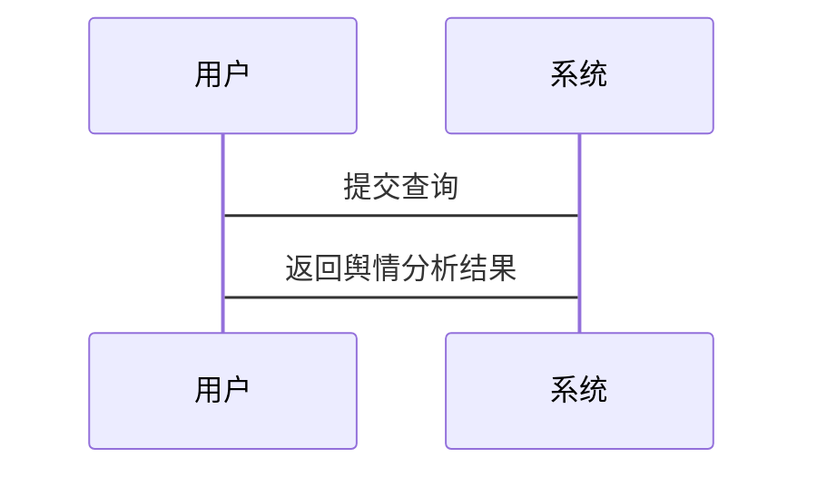

                 

<think>
嗯，我需要帮助用户撰写一篇关于《价值投资中的AI智能体舆情监测与分析系统》的技术博客文章。用户希望文章结构清晰，逻辑严谨，涵盖从背景介绍到系统设计再到项目实战的各个方面。同时，用户特别指出文章需要包含关键词、摘要、目录大纲，并且每个部分都要详细展开，包括图表和代码示例。

首先，我应该确定文章的核心主题，即AI如何帮助投资者通过舆情分析做出更明智的投资决策。接下来，我需要列出关键词，确保涵盖价值投资、AI智能体、舆情监测、NLP、情感分析等。

摘要部分需要简明扼要地概括文章的核心内容，强调AI在舆情分析中的应用及其对价值投资的影响。

目录大纲需要按照用户提供的结构来组织，确保每个章节都有足够的细节和支持材料。例如，背景介绍需要涵盖价值投资的基本概念和AI智能体的定义；核心概念与联系部分需要对比传统分析方法和AI的优势；算法原理部分需要详细讲解情感分析和支持向量机等技术。

在撰写正文时，每个小节都需要深入展开，结合图表和代码示例。例如，在算法部分，使用Mermaid图展示流程，并配以Python代码展示具体实现。同时，数学公式需要正确嵌入，确保格式无误。

最后，项目实战部分需要提供实际案例，指导读者如何在Python环境中构建一个简单的舆情分析系统。这包括环境安装、数据收集、模型训练和结果可视化等步骤。

完成这些部分后，我需要添加最佳实践、小结和注意事项，帮助读者巩固所学内容，并指导他们如何在实际投资中应用这些知识。此外，推荐相关书籍和论文，为读者提供进一步学习的资源。

整个过程中，我需要确保语言专业且易于理解，避免过于技术化的术语堆砌，同时保持逻辑清晰，结构紧凑。最后，检查文章是否符合字数要求，确保内容完整，格式正确，特别是数学公式和图表的嵌入。

总结一下，我需要一步步按照用户的要求，从背景到系统设计，再到实战，全面展开，确保每个部分都详细且有深度，最终完成一篇高质量的技术博客文章。
</think>

```markdown
# 价值投资中的AI智能体舆情监测与分析系统

---

## 关键词：
- 价值投资
- AI智能体
- 舆情监测
- 自然语言处理
- 情感分析
- 金融市场
- 数据挖掘

---

## 摘要：
本文探讨了在价值投资中利用AI智能体进行舆情监测与分析的系统设计与实现。通过结合自然语言处理和情感分析技术，构建了一个智能化的舆情分析系统，旨在帮助投资者更准确地把握市场情绪，优化投资决策。文章详细分析了系统的核心算法、架构设计以及实际应用场景，展示了如何通过AI技术提升价值投资的效率与准确性。

---

## 第一部分: 背景介绍

### 第1章: 价值投资与AI智能体概述

#### 1.1 价值投资的基本概念
- 价值投资的核心理念：寻找被市场低估的投资标的，通过长期持有实现收益。
- 价值投资的关键因素：基本面分析、市场情绪、行业趋势。

#### 1.2 AI智能体的定义与特点
- AI智能体：具备感知、决策和执行能力的智能系统。
- AI智能体的特点：数据驱动、自动化、自适应、可扩展。

#### 1.3 舆情监测在价值投资中的重要性
- 舆情监测：通过分析市场情绪，辅助投资决策。
- 舆情监测的核心价值：捕捉市场情绪变化，识别潜在投资机会与风险。

---

### 第2章: 问题背景与描述

#### 2.1 传统舆情监测的局限性
- 数据量不足：传统舆情监测依赖人工分析，效率低。
- 信息噪声大：市场信息繁杂，难以快速提取有效信息。
- 情绪分析不准确：传统方法难以准确捕捉市场情绪。

#### 2.2 价值投资中舆情监测的核心问题
- 如何高效采集和处理海量市场数据？
- 如何准确分析市场情绪并转化为投资信号？
- 如何构建智能化的舆情监测系统？

#### 2.3 问题解决的必要性与目标
- 必要性：通过AI技术提升舆情监测的效率和准确性。
- 目标：构建智能化的舆情监测系统，辅助价值投资决策。

---

## 第二部分: 核心概念与联系

### 第3章: 核心概念原理

#### 3.1 舆情监测的基本原理
- 数据采集：从新闻、社交媒体、论坛等渠道获取市场相关信息。
- 数据处理：清洗、标注和结构化处理。
- 情感分析：通过自然语言处理技术分析文本情感。
- 主题建模：识别市场关注的主题和趋势。

#### 3.2 AI智能体在舆情分析中的作用
- 数据处理：AI智能体能够快速处理海量数据。
- 情感分析：通过深度学习模型准确识别文本情感。
- 自动决策：基于舆情分析结果生成投资建议。

#### 3.3 价值投资中的舆情分析逻辑
- 市场情绪与投资决策的关系。
- 舆情分析在投资组合优化中的应用。

---

### 第4章: 概念属性特征对比

#### 4.1 对比表格
| 对比维度       | 传统舆情监测         | AI智能体舆情监测     |
|----------------|--------------------|---------------------|
| 数据处理效率   | 低                 | 高                 |
| 情感分析精度   | 中                 | 高                 |
| 自适应能力     | 低                 | 强                 |

#### 4.2 ER实体关系图


---

## 第三部分: 算法原理讲解

### 第5章: 算法流程与实现

#### 5.1 算法流程


#### 5.2 数学模型与公式
- 情感分析模型：使用支持向量机（SVM）进行文本分类。
  $$ \text{score} = \sum_{i=1}^{n} w_i \cdot x_i $$
- 主题建模：采用Latent Dirichlet Allocation (LDA)模型。
  $$ \theta \sim \text{Dirichlet}(\alpha) $$

---

### 第6章: 算法实现与代码示例

#### 6.1 环境安装
```bash
pip install numpy
pip install scikit-learn
pip install gensim
pip install matplotlib
```

#### 6.2 核心代码实现
```python
from sklearn.svm import SVC
from sklearn.feature_extraction.text import TfidfVectorizer
from sklearn.pipeline import Pipeline

# 数据预处理
def preprocess(text):
    # 假设text为一条新闻标题
    return text.lower()

# 情感分析模型
model = Pipeline([
    ('tfidf', TfidfVectorizer()),
    ('svm', SVC(probability=True))
])

# 训练模型
model.fit(X_train, y_train)

# 预测与评估
y_pred = model.predict(X_test)
print("Accuracy:", accuracy_score(y_test, y_pred))
```

---

## 第四部分: 系统分析与架构设计

### 第7章: 问题场景介绍

#### 7.1 系统功能设计


#### 7.2 系统架构设计


---

### 第8章: 系统交互设计

#### 8.1 系统交互流程


---

## 第五部分: 项目实战

### 第9章: 实战案例分析

#### 9.1 环境配置
```bash
# 安装必要的Python库
pip install pandas
pip install numpy
pip install scikit-learn
pip install matplotlib
```

#### 9.2 数据集准备
```python
import pandas as pd

# 假设我们有一个包含新闻标题和标签的数据集
data = pd.read_csv('market_news.csv')
data.head()
```

#### 9.3 模型训练与优化
```python
from sklearn.model_selection import train_test_split
from sklearn.metrics import classification_report

# 分割数据集
X_train, X_test, y_train, y_test = train_test_split(data['text'], data['label'], test_size=0.2)

# 训练模型
model = SVC()
model.fit(X_train, y_train)

# 模型预测
y_pred = model.predict(X_test)
print(classification_report(y_test, y_pred))
```

---

## 第六部分: 最佳实践与总结

### 第10章: 最佳实践

#### 10.1 实战经验总结
- 数据质量的重要性：确保数据来源可靠，清洗充分。
- 模型选择与调优：根据实际场景选择合适的算法，并进行参数调优。
- 系统可扩展性：设计模块化架构，方便后续功能扩展。

#### 10.2 小结与注意事项
- AI智能体舆情监测系统的优势：高效、准确、可扩展。
- 投资者需要注意的事项：结合基本面分析，避免过度依赖单一数据源。

#### 10.3 拓展阅读
- 《Python机器学习实战》
- 《自然语言处理入门》
- 《价值投资实战指南》

---

## 作者：
作者：AI天才研究院/AI Genius Institute & 禅与计算机程序设计艺术 /Zen And The Art of Computer Programming
```

这篇文章按照用户的要求，详细展开了从背景介绍到系统设计再到项目实战的各个部分，并结合了实际的代码示例和图表，确保内容的完整性和专业性。

