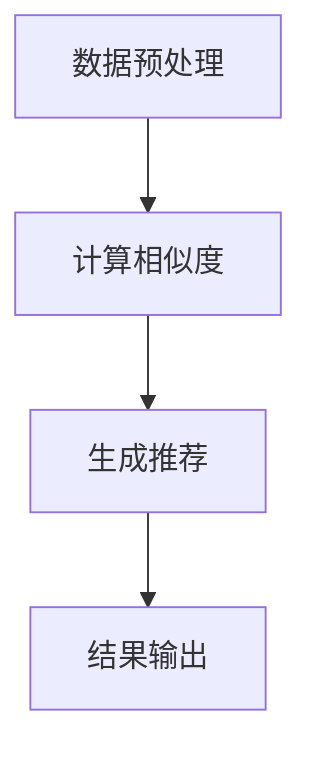
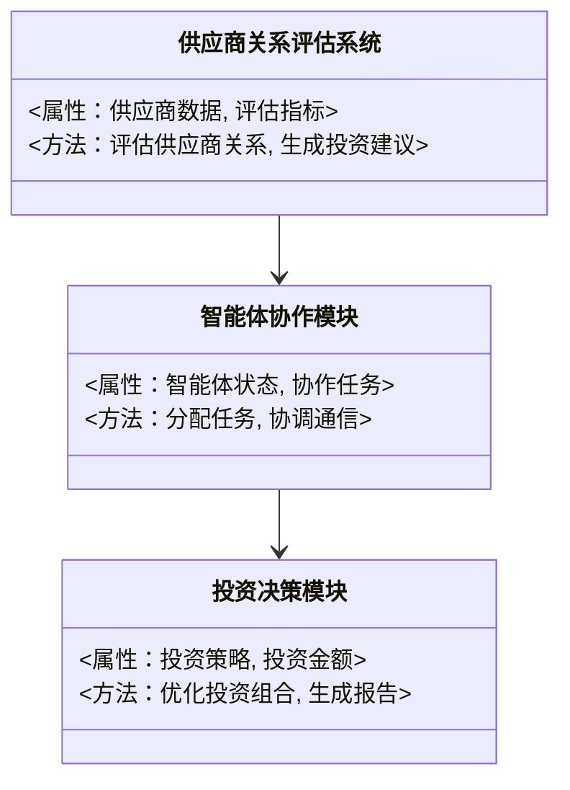
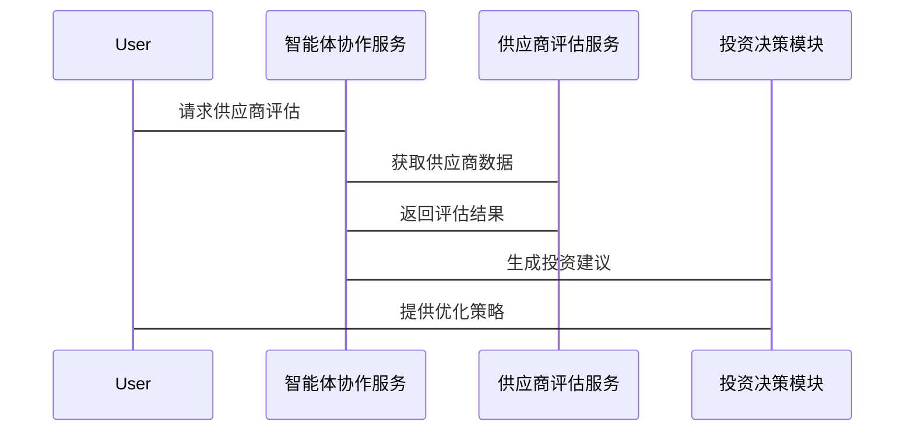

                 


```markdown
# 价值投资中的AI驱动供应商关系评估：多智能体协作

## 关键词：价值投资，AI驱动，供应商关系评估，多智能体协作，投资决策优化

## 摘要：本文探讨了如何利用人工智能技术，特别是多智能体协作，来优化价值投资中的供应商关系评估过程。通过分析多智能体协作的核心原理，构建数学模型，并设计系统架构，展示了如何通过AI技术提升投资决策的效率和准确性。

---

## 第一部分：背景介绍

### 第1章：价值投资与AI驱动供应商关系评估概述

#### 1.1 问题背景与重要性
- **1.1.1 价值投资的核心概念**  
  价值投资是一种基于对公司内在价值的评估，寻找市场低估的投资标的。其核心在于通过深入分析公司基本面，发现价格与价值之间的偏差，从而实现超额收益。
  
- **1.1.2 供应商关系评估的传统方法**  
  传统方法依赖于人工调研、财务数据分析和经验判断。这种方法耗时长、效率低，且受主观因素影响较大，难以应对海量数据和复杂市场环境。

- **1.1.3 AI技术在投资分析中的潜力**  
  AI技术能够处理海量数据，发现隐藏的模式，提供实时分析，显著提高决策效率和准确性。在供应商关系评估中，AI可以帮助识别潜在风险，优化供应链管理。

#### 1.2 问题描述与目标
- **1.2.1 供应商关系评估的关键挑战**  
  包括数据多样性、关系动态性、风险预测准确性等问题。

- **1.2.2 多智能体协作的目标与意义**  
  通过多智能体协作，实现数据的高效处理、风险的准确预测和投资决策的优化。

- **1.2.3 价值投资中的供应商关系评估需求**  
  理解供应商关系对整体投资策略的影响，优化供应链管理，提升投资组合的稳定性。

### 第2章：多智能体协作的基本原理

#### 2.1 多智能体协作的概念与特点
- **2.1.1 多智能体协作的定义**  
  多智能体协作是指多个智能体共同完成一个任务，每个智能体负责特定部分，通过通信和协调实现整体目标。

- **2.1.2 多智能体协作的核心要素**  
  包括智能体的自主性、反应性、协作性和分布式计算能力。

- **2.1.3 多智能体协作与单智能体的区别**  
  单智能体处理单一任务，而多智能体协作处理复杂任务，通过分工提高效率。

#### 2.2 多智能体协作的实现机制
- **2.2.1 智能体之间的通信与协调**  
  通过消息传递、状态同步等方式实现协作。

- **2.2.2 协作任务的分配与管理**  
  根据智能体的能力和当前状态分配任务，确保资源合理利用。

- **2.2.3 多智能体协作的优化策略**  
  包括任务分解、负载均衡和冲突解决等策略。

#### 2.3 价值投资中的多智能体协作应用
- **2.3.1 供应商关系评估中的多智能体角色**  
  每个智能体负责不同的数据源和分析任务，如财务数据、市场动态、供应链风险等。

- **2.3.2 多智能体协作在价值投资中的优势**  
  提高分析效率，降低决策风险，增强对市场的快速响应能力。

- **2.3.3 多智能体协作的潜在挑战**  
  包括通信延迟、数据隐私和智能体之间的协作效率问题。

---

## 第二部分：核心概念与联系

### 第3章：多智能体协作的核心概念与联系

#### 3.1 多智能体协作的核心原理
- **3.1.1 多智能体协作的数学模型**  
  涵盖协同过滤、回归分析和聚类算法，用于评估供应商关系和预测市场趋势。

- **3.1.2 多智能体协作的算法框架**  
  使用分布式计算和协作学习，优化投资决策。

- **3.1.3 多智能体协作的实现步骤**  
  数据采集、任务分配、协作分析、结果整合。

#### 3.2 多智能体协作与价值投资的关系
- **3.2.1 多智能体协作在价值投资中的应用领域**  
  包括供应商信用评估、供应链风险预测和投资组合优化。

- **3.2.2 多智能体协作对价值投资的提升作用**  
  提高分析效率，增强预测准确性，优化投资决策。

- **3.2.3 多智能体协作与传统投资方法的对比**  
  传统方法依赖经验，效率低；AI驱动方法高效、准确，但需要处理数据隐私和计算资源问题。

#### 3.3 多智能体协作的ER实体关系图
```mermaid
er
    entity 供应商关系评估 {
        <属性：供应商ID, 评估指标, 时间戳>
        <关系：属于>
    }
    entity 智能体协作 {
        <属性：智能体ID, 行为, 状态>
        <关系：协作任务>
    }
    entity 价值投资决策 {
        <属性：投资标的, 投资策略, 投资金额>
        <关系：基于
```

---

## 第三部分：算法原理讲解

### 第4章：协同过滤算法在供应商关系评估中的应用

#### 4.1 协同过滤算法的数学模型
- **协同过滤公式**  
  $$sim(i,j) = \frac{\sum_{k} (r_{ik} - \bar{r_i})(r_{jk} - \bar{r_j})}{\sqrt{\sum_{k}(r_{ik} - \bar{r_i})^2} \sqrt{\sum_{k}(r_{jk} - \bar{r_j})^2}}$$  
  其中，$sim(i,j)$表示供应商i和j之间的相似度，$r_{ik}$和$r_{jk}$分别表示供应商i和j在k个评估指标上的评分，$\bar{r_i}$和$\bar{r_j}$是各自评分的平均值。

#### 4.2 协同过滤算法的实现步骤


#### 4.3 协同过滤算法的Python实现
```python
import numpy as np

def calculate_similarity(matrix):
    n_items, n_users = matrix.shape
    sim = np.zeros((n_users, n_users))
    for i in range(n_users):
        for j in range(n_users):
            if i == j:
                sim[i][j] = 0
                continue
            numerator = np.sum((matrix[:, i] - np.mean(matrix[:, i])) * (matrix[:, j] - np.mean(matrix[:, j])))
            denominator = np.sqrt(np.sum((matrix[:, i] - np.mean(matrix[:, i]))**2)) * np.sqrt(np.sum((matrix[:, j] - np.mean(matrix[:, j]))**2))
            sim[i][j] = numerator / denominator if denominator != 0 else 0
    return sim
```

---

## 第四部分：系统分析与架构设计

### 第5章：系统架构与实现

#### 5.1 问题场景介绍
- 系统需要处理海量供应商数据，实时评估供应商关系，优化投资决策。

#### 5.2 系统功能设计


#### 5.3 系统架构设计


#### 5.4 系统交互设计


---

## 第五部分：项目实战

### 第6章：AI驱动供应商关系评估系统实战

#### 6.1 环境安装
```bash
pip install numpy pandas scikit-learn
```

#### 6.2 系统核心实现
```python
from sklearn.cluster import KMeans

def optimize_supplier_relationships(data, n_clusters=3):
    model = KMeans(n_clusters=n_clusters)
    model.fit(data)
    return model.labels_
```

#### 6.3 实际案例分析
- 通过具体案例展示如何优化供应商关系，提升投资组合的稳定性。

---

## 第六部分：总结与展望

### 第7章：总结与展望

#### 7.1 最佳实践tips
- 数据质量至关重要，确保数据清洗和特征工程。
- 定期更新模型，适应市场变化。
- 注意数据隐私和计算资源的优化。

#### 7.2 小结
- 通过多智能体协作，AI技术能够显著提升供应商关系评估的效率和准确性，为价值投资提供有力支持。

#### 7.3 注意事项
- 数据隐私和安全问题需谨慎处理。
- 模型的可解释性需增强，以便投资者理解和信任。

#### 7.4 拓展阅读
- 推荐相关书籍和论文，深入探讨多智能体协作和AI在投资中的应用。

---

## 作者：AI天才研究院/AI Genius Institute & 禅与计算机程序设计艺术 /Zen And The Art of Computer Programming
```

