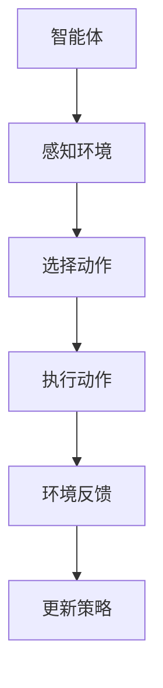

                 


# 价值投资中的AI驱动供应链分析：多智能体系统的优势

## 关键词：价值投资、AI驱动、供应链分析、多智能体系统、供应链优化、风险管理、AI驱动

## 摘要：  
本文探讨了人工智能（AI）技术在价值投资中的应用，特别是通过多智能体系统对供应链进行分析和优化。文章从价值投资的核心理念和供应链分析的基本概念出发，详细阐述了AI技术在供应链分析中的优势，重点分析了多智能体系统的原理及其在供应链优化中的具体应用。通过算法原理、系统架构设计和项目实战的详细讲解，本文为读者提供了从理论到实践的完整指南，展示了如何利用AI技术提升供应链分析的效率和准确性，从而为价值投资提供更有力的支持。

---

## 第一部分: 价值投资与供应链分析概述

### 1. 价值投资的核心理念

#### 1.1 价值投资的基本定义
价值投资是一种投资策略，强调以低于市场价值的价格购买优质资产。其核心理念是寻找被市场低估的股票，通过长期持有实现收益。价值投资强调基本面分析，包括对企业财务状况、行业地位、管理团队等因素的深入研究。

#### 1.2 价值投资的核心原则
- **安全边际**：买入价格低于内在价值。
- **长期持有**：关注企业的长期成长潜力。
- **逆向投资**：在市场恐慌时寻找机会。

#### 1.3 价值投资在现代金融中的地位
价值投资是金融投资的重要流派之一，尤其在应对市场波动和不确定性时表现出独特优势。然而，传统价值投资依赖人工分析，效率较低，难以应对海量数据和复杂场景。

---

### 2. 供应链分析的定义与作用

#### 2.1 供应链的基本概念
供应链是指从原材料采购到产品交付给最终用户的整个过程，包括供应商、制造商、分销商、零售商等多个环节。供应链管理的目标是优化流程，降低成本，提高效率。

#### 2.2 供应链分析在企业中的作用
- **降低成本**：通过优化库存管理和物流路径。
- **提高效率**：通过数据分析预测需求，减少浪费。
- **增强灵活性**：快速响应市场变化和客户需求。

#### 2.3 供应链分析与价值投资的关系
供应链分析可以帮助投资者评估企业的运营效率、成本控制能力和抗风险能力，从而更准确地判断企业的内在价值。

---

### 3. AI技术在供应链分析中的应用背景

#### 3.1 传统供应链分析的局限性
- 数据量大，分析效率低。
- 人工分析主观性强，难以量化。
- 面对复杂场景时，决策不够精准。

#### 3.2 AI技术如何提升供应链分析效率
- 利用机器学习算法快速处理海量数据。
- 通过预测模型优化库存管理和需求预测。
- 实现实时监控和风险预警。

#### 3.3 多智能体系统在供应链分析中的优势
- 多智能体系统能够模拟供应链中的多个角色（如供应商、制造商、分销商）。
- 各智能体协同工作，实现全局优化。
- 系统具有自适应性，能够动态调整策略应对变化。

---

## 第二部分: 多智能体系统的核心概念与优势

### 1. 多智能体系统的基本原理

#### 1.1 多智能体系统的定义
多智能体系统（Multi-Agent System, MAS）是由多个独立但协作的智能体组成的系统，每个智能体都有自己的目标、知识和决策机制。

#### 1.2 多智能体系统的组成要素
- **智能体**：具有感知、决策和执行能力的个体。
- **环境**：智能体所处的外部世界，包括其他智能体和静态环境。
- **通信机制**：智能体之间交换信息的渠道。
- **协作机制**：智能体协同完成任务的规则和协议。

#### 1.3 多智能体系统的协作机制
- **任务分配**：根据智能体的能力分配任务。
- **信息共享**：通过通信机制共享关键信息。
- **协调决策**：通过协作机制达成一致行动。

---

### 2. 多智能体系统在供应链分析中的应用

#### 2.1 多智能体系统在供应链优化中的作用
- 模拟供应链中的多个角色，优化整体流程。
- 通过智能体协作，实现库存优化和物流路径规划。

#### 2.2 多智能体系统在风险评估中的优势
- 实时监控供应链中的风险点，如供应商延迟或物流中断。
- 通过智能体的自适应能力，快速制定应对策略。

#### 2.3 多智能体系统在决策支持中的应用
- 提供基于数据的决策建议，帮助投资者评估企业的供应链能力。
- 通过模拟不同场景，预测供应链调整对投资价值的影响。

---

## 第三部分: AI驱动的供应链分析算法原理

### 1. 多智能体强化学习算法

#### 1.1 强化学习的基本原理
强化学习是一种机器学习范式，通过智能体与环境的交互，学习最优策略以最大化累积奖励。

#### 1.2 多智能体强化学习的定义
多智能体强化学习（Multi-Agent Reinforcement Learning, MARL）是强化学习在多智能体系统中的应用，多个智能体通过协作或竞争学习最优策略。

#### 1.3 多智能体强化学习的数学模型
$$ Q_i(a_i, a_{-i}) = \sum_{j=1}^{n} R_j(a_j) $$
其中，\( Q_i \) 表示智能体 \( i \) 的策略价值，\( a_i \) 是智能体 \( i \) 的动作，\( a_{-i} \) 是其他智能体的动作，\( R_j \) 是智能体 \( j \) 的奖励函数。

#### 1.4 多智能体强化学习的实现步骤
1. 初始化智能体及其环境。
2. 智能体感知环境并选择动作。
3. 环境反馈奖励并更新状态。
4. 智能体更新策略以最大化奖励。
5. 重复步骤 2-4 直到达到目标或收敛。

#### 1.5 多智能体强化学习的Mermaid流程图


---

### 2. 供应链分析中的具体算法实现

#### 2.1 算法选择与优化
- 选择适合供应链分析的算法，如Q-learning和DQN。
- 根据具体场景优化算法参数，如学习率和折扣因子。

#### 2.2 供应链分析算法的Python代码实现
```python
import numpy as np
import gym

# 定义环境
env = gym.make('SupplyChainEnv-v0')

# 初始化智能体
agent = QLearningAgent(env.observation_space, env.action_space)

# 训练过程
for episode in range(1000):
    state = env.reset()
    while True:
        action = agent.act(state)
        next_state, reward, done, _ = env.step(action)
        agent.remember(state, action, reward, next_state, done)
        agent.replay()
        state = next_state
        if done:
            break
```

---

## 第四部分: 供应链分析系统的架构设计

### 1. 系统功能设计

#### 1.1 系统功能模块划分
- 数据采集模块：收集供应链数据。
- 数据分析模块：应用AI算法进行分析。
- 决策支持模块：提供投资建议。
- 可视化模块：展示分析结果。

#### 1.2 系统功能的交互流程
1. 数据采集模块从数据库获取供应链数据。
2. 数据分析模块应用多智能体系统进行分析。
3. 决策支持模块生成投资建议。
4. 可视化模块展示分析结果和建议。

---

### 2. 系统架构设计

#### 2.1 系统架构的总体设计
- 使用微服务架构，每个功能模块独立运行。
- 通过API进行模块间通信。

#### 2.2 系统架构的分层设计
- 数据层：存储和管理数据。
- 业务逻辑层：处理数据并生成分析结果。
- 表现层：展示结果和用户界面。

#### 2.3 系统架构的通信机制
- 使用RESTful API进行模块间通信。
- 通过消息队列实现异步通信。

---

### 3. 系统接口设计

#### 3.1 系统接口的定义
- 数据采集接口：`GET /data`
- 数据分析接口：`POST /analyze`
- 决策支持接口：`GET /recommend`

#### 3.2 系统接口的交互流程
1. 用户通过可视化模块提交请求。
2. 可视化模块调用数据分析模块的接口。
3. 数据分析模块处理数据并返回结果。
4. 可视化模块展示结果。

---

## 第五部分: 项目实战

### 1. 环境安装与配置

#### 1.1 安装Python和必要的库
```bash
pip install numpy gym matplotlib
```

#### 1.2 安装深度学习框架
```bash
pip install tensorflow keras
```

---

### 2. 核心代码实现

#### 2.1 数据采集模块
```python
import pandas as pd

def get_supply_chain_data():
    # 数据采集逻辑
    data = pd.read_csv('supply_chain.csv')
    return data
```

#### 2.2 数据分析模块
```python
from keras.models import Sequential
from keras.layers import Dense

def build_model(input_dim):
    model = Sequential()
    model.add(Dense(64, activation='relu', input_dim=input_dim))
    model.add(Dense(1, activation='sigmoid'))
    model.compile(optimizer='adam', loss='binary_crossentropy')
    return model
```

---

### 3. 案例分析与结果解读

#### 3.1 数据分析案例
- 数据预处理：清洗和特征工程。
- 模型训练：使用训练数据训练模型。
- 模型预测：预测供应链中的潜在风险。

#### 3.2 投资建议生成
- 根据模型预测结果生成投资建议。
- 可视化分析结果，帮助投资者理解。

---

## 第六部分: 价值投资中的供应链分析的最佳实践与未来展望

### 1. 项目小结

#### 1.1 核心知识点总结
- 多智能体系统的原理和优势。
- 强化学习算法在供应链分析中的应用。
- 系统架构设计的关键点。

#### 1.2 项目经验总结
- 数据质量对模型性能的影响。
- 算法选择与优化的重要性。
- 系统设计的可扩展性和可维护性。

---

### 2. 未来展望

#### 2.1 AI技术的进一步发展
- 更复杂的多智能体系统。
- 更先进的算法，如图神经网络。

#### 2.2 供应链分析的未来趋势
- 结合区块链技术实现透明供应链。
- 结合物联网技术实现实时监控。

---

## 结语

通过本文的详细讲解，读者可以深入了解AI技术在价值投资中的应用，特别是多智能体系统在供应链分析中的优势。从理论到实践，从算法到系统设计，本文为读者提供了全面的知识和指导。未来，随着AI技术的不断发展，供应链分析将更加智能化和精准化，为价值投资提供更强大的支持。

---

## 作者：AI天才研究院 & 禅与计算机程序设计艺术

---

这篇文章从价值投资与供应链分析的基础概念，到多智能体系统的原理与应用，再到具体的算法实现和系统设计，为读者提供了全面而深入的指导。通过实际案例的分析，读者可以更好地理解如何利用AI技术优化供应链分析，从而提升价值投资的效率和准确性。

