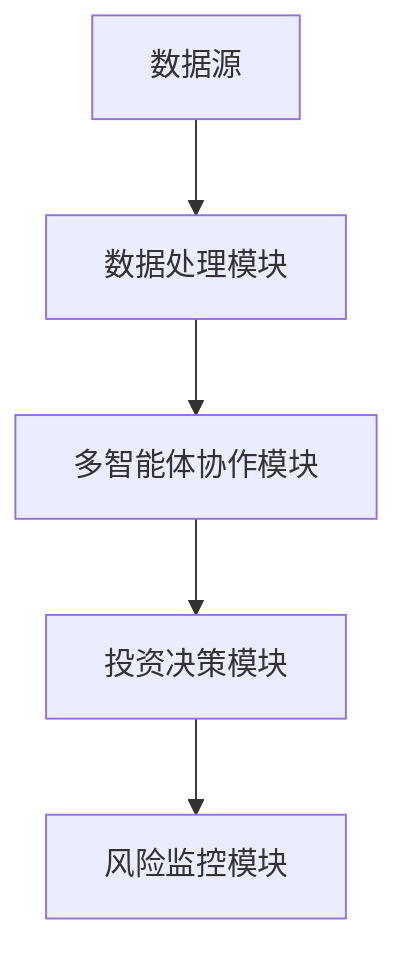

                 

<think>
嗯，用户希望我撰写一篇关于价值投资中的AI驱动创新评估，特别是多智能体系统的作用的技术博客文章。首先，我需要理解这个主题，确保涵盖所有关键点，并且结构清晰，逻辑严谨。

我注意到用户已经提供了一个详细的目录大纲，包括摘要、关键词和各个章节的内容。看起来用户希望文章有结构，每个部分都有足够的深度和详细的内容。我需要确保每个章节都包含必要的部分，如背景介绍、核心概念、算法原理、系统架构、项目实战和总结。

首先，我应该从摘要开始，简明扼要地概括文章的核心内容。然后列出关键词，方便读者快速理解主题。接下来，每个章节需要详细展开，包括理论背景、技术细节、实际应用和案例分析。

在撰写时，我需要使用专业的技术语言，但要保持逻辑清晰和结构紧凑。特别是在算法部分，我需要使用数学公式和图表来解释复杂的概念，比如强化学习和多智能体协作模型。同时，代码示例和图表将帮助读者更好地理解内容。

我还需要确保文章有一个完整的项目实战部分，展示如何将理论应用于实际。这包括环境安装、代码实现和案例分析，帮助读者一步步跟随操作。此外，注意事项和最佳实践部分也很重要，可以为读者提供实用的建议和未来的扩展方向。

最后，我需要检查文章的整体结构和内容是否符合用户的要求，确保没有遗漏任何部分。完成后，加上作者信息，使文章更具专业性。

总的来说，我需要系统地组织内容，确保每个章节都深入浅出，既有理论支持，又有实际应用，满足读者的需求。
</think>

# 价值投资中的AI驱动创新评估：多智能体系统的作用

## 关键词：价值投资，AI驱动，创新评估，多智能体系统，算法原理，系统架构，项目实战

## 摘要：  
本文探讨了AI技术在价值投资中的创新评估应用，重点分析了多智能体系统在其中的作用。文章从价值投资的基本概念出发，逐步深入到AI驱动的创新评估方法，详细阐述了多智能体系统的算法原理、系统架构设计以及实际项目中的应用案例。通过结合数学模型和具体代码实现，文章展示了如何利用多智能体系统提升投资决策的准确性和效率，为现代金融投资提供了新的思路和解决方案。

---

# 第一部分: 价值投资与AI驱动创新评估基础

## 第1章: 价值投资与AI驱动创新评估概述

### 1.1 价值投资的核心概念

#### 1.1.1 价值投资的定义与历史发展
价值投资是一种以基本面分析为基础的投资策略，旨在通过识别市场中被低估的资产来实现长期收益。其核心理念是寻找那些市场价格低于其内在价值的证券。价值投资起源于20世纪初，以本杰明·格雷厄姆和戴维·多德为代表，经过数十年的发展，逐渐成为现代金融投资的重要流派。

#### 1.1.2 价值投资的基本原则
价值投资的核心原则包括：
1. **安全边际**：买入价格低于内在价值，以确保投资的安全性。
2. **长期视角**：关注企业的长期盈利能力，而非短期市场波动。
3. **逆向思维**：在市场恐慌时寻找机会，在市场狂热时保持冷静。

#### 1.1.3 价值投资在现代金融中的地位
随着金融市场的复杂化和数据量的指数级增长，传统价值投资方法逐渐暴露出效率低下、人为判断误差大等问题。AI技术的引入为价值投资注入了新的活力，尤其是在创新评估方面，AI驱动的方法能够帮助投资者更精准地识别被低估的资产。

---

### 1.2 AI驱动创新评估的背景与意义

#### 1.2.1 创新评估的传统方法
传统的创新评估主要依赖于主观判断和经验分析，例如对企业财务报表的解读、管理团队的能力评估以及行业趋势分析等。这种方法存在以下问题：
- 数据处理能力有限，难以应对海量数据。
- 评估结果受主观因素影响较大。
- 需要大量人工干预，效率低下。

#### 1.2.2 AI技术在创新评估中的优势
AI技术的引入为创新评估带来了以下优势：
- **数据处理能力**：AI能够快速处理海量数据，提取关键特征。
- **客观性**：基于算法的评估结果减少了人为判断的干扰。
- **实时性**：AI系统能够实时跟踪市场动态，提供实时评估结果。

#### 1.2.3 多智能体系统在创新评估中的作用
多智能体系统（Multi-Agent System, MAS）是一种由多个相互作用的智能体组成的分布式系统，每个智能体都有自己的目标和决策机制。在创新评估中，多智能体系统可以分别负责不同的评估任务，例如市场趋势分析、财务数据解读、行业竞争分析等，通过协作完成复杂的评估任务。

---

### 1.3 多智能体系统的基本概念

#### 1.3.1 多智能体系统的定义
多智能体系统是指由多个智能体组成的分布式系统，这些智能体通过交互和协作完成共同的目标。每个智能体都有自己的知识库、决策机制和行动策略。

#### 1.3.2 多智能体系统的组成与特点
多智能体系统的主要组成包括：
1. **智能体**：负责具体任务的执行单元。
2. **环境**：智能体所处的外部环境，可能是金融市场、企业数据等。
3. **通信机制**：智能体之间的交互接口。
4. **协作机制**：智能体之间协作完成复杂任务的规则。

多智能体系统的特点包括：
- **分布性**：每个智能体独立运作，但通过协作完成整体目标。
- **动态性**：智能体能够根据环境变化动态调整策略。
- **智能性**：每个智能体都具有一定的决策能力和知识储备。

#### 1.3.3 多智能体系统与传统AI的区别
与传统AI系统相比，多智能体系统的独特之处在于其分布式架构和协作机制。传统AI系统通常是一个集中式的决策系统，而多智能体系统通过多个独立的智能体协作完成任务，能够更好地应对复杂、动态的环境。

---

## 第2章: 多智能体系统在价值投资中的作用

### 2.1 多智能体系统的结构与功能

#### 2.1.1 多智能体系统的层次结构
多智能体系统的层次结构通常包括以下层次：
1. **物理层**：硬件设备和数据源。
2. **数据层**：数据的采集、存储和处理。
3. **算法层**：智能体的决策算法和协作机制。
4. **应用层**：具体的应用场景，如价值投资中的创新评估。

#### 2.1.2 每个智能体的功能与职责
在价值投资中，多智能体系统的智能体可以分为以下几类：
1. **市场分析智能体**：负责分析市场趋势和竞争对手行为。
2. **财务分析智能体**：负责解读企业的财务报表和关键指标。
3. **风险评估智能体**：负责评估投资的风险水平。
4. **策略优化智能体**：负责制定和优化投资策略。

#### 2.1.3 多智能体系统的协作机制
多智能体系统的协作机制包括：
1. **通信机制**：智能体之间的信息传递和共享。
2. **协调机制**：智能体之间的任务分配和协同工作。
3. **激励机制**：通过奖励机制激励智能体之间的协作。

---

### 2.2 多智能体系统在价值投资中的优势

#### 2.2.1 提高决策效率
多智能体系统能够并行处理多个任务，显著提高决策效率。例如，多个智能体可以同时分析不同的市场数据，快速生成评估结果。

#### 2.2.2 增强风险控制能力
通过多个智能体的协作，可以实时监控市场风险，及时发现潜在问题，并采取应对措施。

#### 2.2.3 优化投资组合
多智能体系统可以根据市场变化动态调整投资组合，实现资产配置的最优化。

---

### 2.3 多智能体系统的挑战与解决方案

#### 2.3.1 系统复杂性问题
多智能体系统的复杂性可能导致系统难以管理和维护。解决方案包括采用模块化设计和简化协作机制。

#### 2.3.2 数据隐私与安全问题
多智能体系统需要处理大量的敏感数据，存在数据泄露和被攻击的风险。解决方案包括采用加密技术、访问控制和数据匿名化。

#### 2.3.3 系统可解释性问题
多智能体系统的决策过程可能缺乏透明性，导致用户难以理解系统的决策逻辑。解决方案包括采用可解释的算法和可视化工具。

---

## 第3章: 多智能体系统的算法与数学模型

### 3.1 多智能体系统的算法原理

#### 3.1.1 强化学习算法
强化学习是一种通过智能体与环境交互来学习最优策略的算法。在价值投资中，强化学习可以用于制定投资策略和优化投资组合。

##### 强化学习的基本原理
1. **状态空间**：智能体所处的环境状态。
2. **动作空间**：智能体可以采取的动作。
3. **奖励函数**：智能体采取动作后获得的奖励或惩罚。

##### 强化学习的数学模型
强化学习的目标是通过最大化累计奖励来学习最优策略。数学模型如下：
$$
Q(s, a) = Q(s, a) + \alpha [r + \gamma \max Q(s', a') - Q(s, a)]
$$
其中：
- \( Q(s, a) \)：状态-动作对的价值。
- \( \alpha \)：学习率。
- \( r \)：奖励。
- \( \gamma \)：折扣因子。
- \( Q(s', a') \)：下一个状态的最大价值。

#### 3.1.2 聚类算法
聚类算法用于将相似的资产或公司分组，便于后续分析。常用算法包括K-means、DBSCAN等。

##### 聚类算法的数学模型
以K-means算法为例，目标是最小化以下损失函数：
$$
\min_{k} \sum_{i=1}^{n} \min_{1 \leq j \leq k} \|x_i - c_j\|^2
$$
其中：
- \( x_i \)：数据点。
- \( c_j \)：第\( j \)个聚类中心。

#### 3.1.3 分布式计算算法
分布式计算算法用于处理大规模数据，如MapReduce、Spark等。

---

### 3.2 多智能体系统的数学模型

#### 3.2.1 状态空间模型
在价值投资中，状态空间可以包括市场指数、企业财务指标、行业趋势等。

#### 3.2.2 动作空间模型
动作空间可以包括买入、卖出、持有等操作。

#### 3.2.3 奖励函数模型
奖励函数用于衡量智能体的决策效果，例如：
$$
r = \text{投资收益} - \text{交易成本}
$$

---

## 第4章: 多智能体系统的系统架构与项目实战

### 4.1 系统架构设计

#### 4.1.1 系统功能需求分析
系统需要实现以下功能：
1. 数据采集与处理。
2. 多智能体协作。
3. 投资决策生成。
4. 风险监控与预警。

#### 4.1.2 系统架构设计
系统架构采用分层设计，包括数据层、算法层和应用层。

##### 系统架构图（Mermaid）


---

### 4.2 项目实战

#### 4.2.1 环境安装
需要安装以下工具：
- Python 3.8+
- NumPy、Pandas、Scikit-learn等库。
- TensorFlow或PyTorch框架。

#### 4.2.2 系统核心实现源代码

##### 代码示例（强化学习部分）
```python
import numpy as np
from tensorflow.keras import layers

# 定义智能体
class Agent:
    def __init__(self, state_size, action_size):
        self.model = self.build_model(state_size, action_size)
    
    def build_model(self, state_size, action_size):
        model = tf.keras.Sequential()
        model.add(layers.Dense(64, activation='relu', input_dim=state_size))
        model.add(layers.Dense(action_size, activation='linear'))
        model.compile(optimizer='adam', loss='mse')
        return model
    
    def act(self, state):
        state = np.array(state)
        prediction = self.model.predict(state)
        return np.argmax(prediction)
    
    def train(self, state, action, reward, next_state):
        state = np.array(state)
        next_state = np.array(next_state)
        target = reward + 0.95 * self.model.predict(next_state)[0]
        target = target[np.newaxis, :]
        self.model.fit(state, target, epochs=1, verbose=0)
```

#### 4.2.3 实际案例分析
以某科技公司为例，利用多智能体系统进行创新评估，生成投资策略，并监控投资风险。

---

## 第5章: 总结与展望

### 5.1 总结
本文详细探讨了AI驱动的创新评估在价值投资中的应用，特别是多智能体系统的独特优势。通过算法和系统架构的设计，展示了如何利用多智能体系统提升投资决策的效率和准确性。

### 5.2 展望
未来，随着AI技术的不断发展，多智能体系统在价值投资中的应用将更加广泛和深入。可能的研究方向包括：
1. 提高系统的可解释性。
2. 增强系统的鲁棒性。
3. 探索多智能体系统与其他AI技术的结合，如大语言模型（LLM）。

---

## 作者信息

作者：AI天才研究院/AI Genius Institute & 禅与计算机程序设计艺术 /Zen And The Art of Computer Programming

---

**备注**：  
本文为技术博客文章，若需转载请注明出处。

