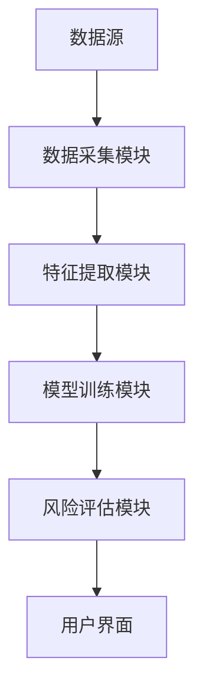

                 


# 价值投资中的AI驱动技术颠覆风险评估：多智能体协作

> **关键词**：价值投资、AI驱动、技术颠覆、风险评估、多智能体协作、强化学习、系统架构

> **摘要**：本文深入探讨了AI驱动技术在价值投资中的应用，特别是多智能体协作在风险评估中的作用。通过分析AI技术的核心优势、多智能体协作的基本原理、强化学习算法的应用、系统架构设计以及项目实战案例，本文为读者提供了从理论到实践的全面指南，帮助投资者理解和应对技术颠覆带来的风险。

---

## 第一部分：价值投资与AI驱动技术基础

### 第1章：价值投资的核心概念

#### 1.1 价值投资的定义与核心理念
- **价值投资**是一种投资策略，强调以低于内在价值的价格买入优质资产，长期持有，等待市场回归理性。
- **核心理念**：寻找被市场低估的资产，关注企业的基本面，而非短期市场波动。
- **与传统投资的区别**：传统投资依赖市场趋势和短期波动，而价值投资注重长期价值和企业内在质量。

#### 1.2 AI驱动技术的核心优势
- **数据处理能力**：AI能够快速处理海量数据，提取有价值的信息。
- **预测能力**：通过机器学习算法，AI可以预测市场趋势和资产价格。
- **自动化决策**：AI能够实现自动化交易和投资决策，减少人为干扰。

#### 1.3 多智能体协作的基本概念
- **多智能体协作**：多个智能体通过协同工作，共同完成复杂任务。
- **特征**：智能体之间通过通信和协作，实现任务分解和资源优化。
- **在金融领域的应用**：多智能体协作可以用于风险评估、投资组合优化和市场预测。

---

## 第二部分：技术颠覆风险评估的核心要素

### 第2章：技术颠覆风险的来源与特征

#### 2.1 技术颠覆风险的定义
- **技术颠覆风险**：由于新技术的出现和应用，导致传统投资模式失效或被取代的风险。
- **特征**：突发性、不可预测性和高影响性。

#### 2.2 价值投资中的技术颠覆风险来源
- **AI技术的进步**：AI算法的不断优化可能导致传统价值投资策略失效。
- **数据量的爆炸式增长**：大数据技术的发展使得传统数据处理方式难以应对。
- **市场参与者行为的改变**：AI驱动的交易算法可能导致市场行为的变化，影响价值投资的核心假设。

#### 2.3 技术颠覆风险的评估方法
- **定量评估**：通过数学模型和数据分析，量化风险的可能性和影响程度。
- **定性评估**：通过专家判断和场景分析，评估风险的潜在影响。

---

## 第三部分：AI驱动技术的风险评估应用

### 第3章：强化学习算法在风险评估中的应用

#### 3.1 强化学习的基本原理
- **强化学习**：通过智能体与环境的交互，学习最优策略，最大化累积奖励。
- **在风险评估中的应用**：通过模拟市场环境，智能体学习最优的投资策略。

#### 3.2 多智能体协作的强化学习框架
- **多智能体协作的强化学习**：多个智能体协同工作，共同完成复杂任务。
- **实现方式**：通过通信和协作，智能体共享信息，优化决策。

#### 3.3 强化学习算法的实现步骤
1. **定义状态空间**：确定智能体的观测环境。
2. **定义动作空间**：确定智能体可以执行的操作。
3. **定义奖励函数**：设计奖励机制，引导智能体学习最优策略。
4. **训练模型**：通过不断与环境交互，更新策略，优化奖励。

---

## 第四部分：系统架构与设计

### 第4章：系统架构设计

#### 4.1 系统功能模块
- **数据采集模块**：采集市场数据和企业基本面数据。
- **特征提取模块**：提取影响投资决策的关键特征。
- **模型训练模块**：训练AI模型，预测市场趋势和风险。
- **风险评估模块**：基于模型输出，评估投资组合的风险。

#### 4.2 系统架构图


#### 4.3 系统接口设计
- **输入接口**：接收市场数据和用户指令。
- **输出接口**：输出风险评估结果和投资建议。

---

## 第五部分：项目实战与总结

### 第5章：项目实战

#### 5.1 环境安装
- **Python环境**：安装Python 3.8及以上版本。
- **库的安装**：安装NumPy、Pandas、TensorFlow和Keras。

#### 5.2 核心代码实现
```python
import numpy as np
import pandas as pd
import tensorflow as tf
from tensorflow.keras import layers

# 数据预处理
data = pd.read_csv('market_data.csv')
X = data.drop('target', axis=1)
y = data['target']

# 模型构建
model = tf.keras.Sequential()
model.add(layers.Dense(64, activation='relu', input_dim=X.shape[1]))
model.add(layers.Dense(1, activation='sigmoid'))
model.compile(optimizer='adam', loss='binary_crossentropy', metrics=['accuracy'])

# 模型训练
model.fit(X, y, epochs=10, batch_size=32)
```

#### 5.3 案例分析
- **案例背景**：假设我们有一个包含市场数据和企业基本面数据的 dataset。
- **模型训练**：使用强化学习算法，训练一个多智能体协作的AI模型，评估投资组合的风险。
- **结果分析**：通过模型输出，评估不同投资组合的风险，优化投资策略。

---

## 第六部分：总结与展望

### 6.1 总结
- 本文深入探讨了AI驱动技术在价值投资中的应用，特别是多智能体协作在风险评估中的作用。
- 通过强化学习算法和系统架构设计，本文展示了如何利用AI技术优化投资策略，降低技术颠覆风险。

### 6.2 注意事项
- **数据质量**：AI模型的性能依赖于高质量的数据，数据偏差可能导致模型失效。
- **模型解释性**：复杂的AI模型可能缺乏解释性，影响投资者对风险的理解和决策。
- **市场变化**：市场环境的变化可能导致模型失效，需要定期更新和优化。

### 6.3 拓展阅读
- **推荐书籍**：《机器学习实战》、《深度学习》、《价值投资入门》。
- **推荐论文**：关于强化学习和多智能体协作的经典论文。

---

## 作者：AI天才研究院 & 禅与计算机程序设计艺术

---

以上是文章的完整大纲和内容，您可以根据实际需求调整内容的深度和广度。

