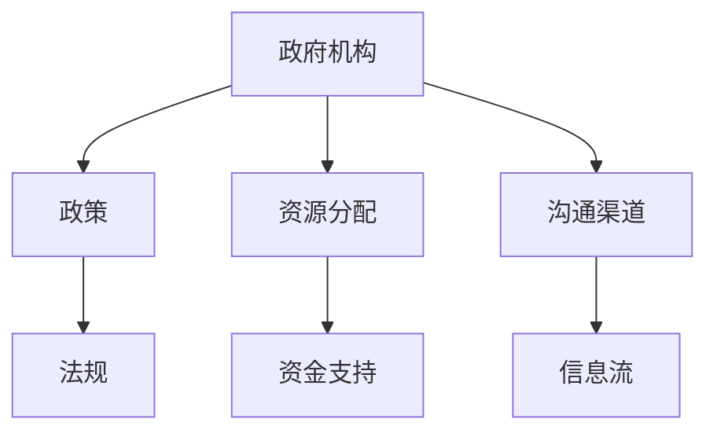

                 


# 价值投资中的AI驱动政府关系分析：多智能体系统

> 关键词：价值投资，政府关系分析，AI驱动，多智能体系统，强化学习，图神经网络

> 摘要：本文深入探讨了如何利用人工智能技术，特别是多智能体系统，来驱动政府关系分析，以辅助价值投资决策。文章从政府关系分析的核心概念出发，详细阐述了多智能体系统在其中的应用原理，并通过具体的算法实现和系统架构设计，展示了如何利用AI技术提升政府关系分析的效率和准确性。

---

## 第一部分：价值投资中的政府关系分析背景

### 第1章：政府关系分析的背景与价值投资概述

#### 1.1 政府关系分析的背景
- **1.1.1 政府关系分析的定义与核心要素**
  - 政府关系分析是指对政府政策、法规、资源分配等与企业经营相关的因素进行系统性分析，以评估其对企业和投资的影响。
  - 核心要素包括：政策变化、法规调整、政府资源分配、政府沟通渠道等。

- **1.1.2 政府关系分析在价值投资中的作用**
  - 政府政策直接影响企业的经营环境和盈利能力。
  - 通过分析政府关系，投资者可以更好地预测政策变化对企业的影响，从而做出更明智的投资决策。

- **1.1.3 政府关系分析的边界与外延**
  - 政府关系分析的边界包括直接与企业相关的政策和法规。
  - 外延则涉及更广泛的政府行为，如国际合作、经济政策调整等。

#### 1.2 价值投资的核心概念
- **1.2.1 价值投资的基本原理**
  - 价值投资是一种投资策略，旨在通过寻找被市场低估的企业进行投资，以实现长期收益。

- **1.2.2 价值投资与政府关系的关联**
  - 政府政策的变化可能影响企业的估值，从而影响价值投资的决策。

- **1.2.3 价值投资中的政府关系分析框架**
  - 包括政策分析、法规解读、政府资源分配评估等多个方面。

#### 1.3 多智能体系统与AI驱动的政府关系分析
- **1.3.1 多智能体系统的定义与特点**
  - 多智能体系统是由多个相互作用的智能体组成的系统，每个智能体都有自己的目标和决策机制。

- **1.3.2 AI在政府关系分析中的应用潜力**
  - AI技术可以用于数据挖掘、模式识别、预测建模等方面，帮助分析政府关系。

- **1.3.3 多智能体系统在价值投资中的优势**
  - 多智能体系统可以模拟政府、企业、市场等多个主体的互动，提供更全面的分析。

---

## 第二部分：政府关系分析的核心概念与AI驱动的联系

### 第2章：政府关系分析的核心概念

#### 2.1 政府关系分析的核心要素
- **政策依赖性**：政府政策对分析结果的影响程度。
- **信息复杂性**：数据来源的多样性和复杂性。
- **动态变化性**：政府关系随时间的变化特征。
- **风险敏感性**：政府关系变化对投资风险的影响。

#### 2.2 政府关系分析的属性特征对比
| 属性 | 描述 |
|------|------|
| 政策依赖性 | 政府政策对分析结果的影响程度 |
| 信息复杂性 | 数据来源的多样性和复杂性 |
| 动态变化性 | 政府关系随时间的变化特征 |
| 风险敏感性 | 政府关系变化对投资风险的影响 |

#### 2.3 政府关系分析的ER实体关系图


#### 2.4 本章小结
- 本章详细介绍了政府关系分析的核心概念和关键要素，为后续的AI驱动分析奠定了基础。

---

## 第三部分：AI驱动政府关系分析的算法原理

### 第3章：多智能体系统与AI驱动的政府关系分析算法

#### 3.1 多智能体系统的基本原理
- **3.1.1 多智能体系统的组成与功能**
  - 多智能体系统由多个智能体组成，每个智能体负责不同的任务。
- **3.1.2 多智能体系统的通信机制**
  - 智能体之间通过消息传递进行通信。
- **3.1.3 多智能体系统的协作策略**
  - 协作策略包括任务分配、信息共享等。

#### 3.2 AI驱动的政府关系分析算法
- **3.2.1 基于强化学习的政府关系分析**
  - 强化学习用于模拟智能体在政府关系中的决策过程。
  - 示例算法：Q-learning
  - 算法流程：
    1. 状态识别：识别政府关系中的关键状态。
    2. 动作选择：智能体根据当前状态选择动作。
    3. 奖励机制：根据动作的结果给予奖励或惩罚。
    4. 状态转移：根据动作结果更新状态。

  - 算法数学模型：
  $$ Q(s, a) = r + \gamma \max_{a'} Q(s', a') $$

- **3.2.2 基于图神经网络的政府关系网络分析**
  - 图神经网络用于分析政府关系网络的结构和关系强度。
  - 示例网络：政府机构之间的关系网络。

  - 网络结构：
  ```mermaid
  graph TD
      N1[节点1] --> N2[节点2]
      N2 --> N3[节点3]
      N3 --> N4[节点4]
  ```

  - 边权重计算：
  $$ W_{ij} = \frac{1}{1 + |i - j|} $$

#### 3.3 算法数学模型与公式
- **3.3.1 强化学习的数学模型**
  $$ Q(s, a) = r + \gamma \max_{a'} Q(s', a') $$
- **3.3.2 图神经网络的边权重计算**
  $$ W_{ij} = \frac{1}{1 + |i - j|} $$

---

## 第四部分：政府关系分析系统的架构与实现

### 第4章：系统架构设计与实现

#### 4.1 问题场景介绍
- 政府关系分析系统的目标是通过AI技术，帮助投资者更好地理解政府政策对企业的影响。

#### 4.2 项目介绍
- **项目目标**：构建一个基于多智能体系统的政府关系分析平台。
- **项目范围**：包括政策分析、法规解读、资源分配评估等功能。

#### 4.3 系统功能设计
- **领域模型**：
  ```mermaid
  classDiagram
      class 政府机构 {
          - 政策
          - 法规
          - 资源分配
          + get_policy()
          + get_regulation()
          + allocate_resources()
      }
      class 智能体 {
          - 状态
          - 动作
          + choose_action()
          + update_state()
      }
      class 投资者 {
          - 估值
          - 投资决策
          + make_investment()
      }
      政府机构 <--o 智能体
      智能体 <--o 投资者
  ```

- **系统架构图**：
  ```mermaid
  architecture
  title 政府关系分析系统架构
  client --> API Gateway
  API Gateway --> Government Policy Database
  API Gateway --> Regulation Database
  API Gateway --> Resource Allocation Database
  API Gateway --> Multi-Agent System
  Multi-Agent System --> Reinforcement Learning Engine
  Multi-Agent System --> Graph Neural Network Engine
  ```

- **系统接口设计**：
  - API接口：提供政策、法规、资源分配等数据接口。
  - 智能体接口：提供智能体之间的通信接口。

- **系统交互流程图**：
  ```mermaid
  sequenceDiagram
      投资者 -> 政府机构: 请求政策分析
      政府机构 -> 智能体: 分配任务
      智能体 -> 智能体: 通信与协作
      智能体 -> 投资者: 提供分析结果
  ```

#### 4.4 项目实战
- **环境安装**：
  ```bash
  pip install numpy
  pip install tensorflow
  pip install networkx
  pip install matplotlib
  ```

- **系统核心实现源代码**：
  ```python
  import numpy as np
  import tensorflow as tf
  import networkx as nx
  import matplotlib.pyplot as plt

  # 强化学习部分
  class Agent:
      def __init__(self, state_size, action_size):
          self.state_size = state_size
          self.action_size = action_size
          self.gamma = 0.99
          self.model = self.build_model()

      def build_model(self):
          model = tf.keras.Sequential([
              tf.keras.layers.Dense(32, activation='relu', input_dim=self.state_size),
              tf.keras.layers.Dense(self.action_size, activation='linear')
          ])
          return model

      def act(self, state):
          prediction = self.model.predict(np.array([state]))
          action = np.argmax(prediction[0])
          return action

  # 图神经网络部分
  class GraphNN:
      def __init__(self):
          self.G = nx.Graph()

      def add_nodes(self, nodes):
          self.G.add_nodes_from(nodes)

      def add_edges(self, edges):
          self.G.add_edges_from(edges)

      def compute_weights(self):
          for edge in self.G.edges():
              i, j = edge
              weight = 1 / (1 + abs(i - j))
              self.G[edge[0]][edge[1]]['weight'] = weight

      def visualize(self):
          nx.draw(self.G, with_labels=True)
          plt.show()

  # 系统实现
  def main():
      # 初始化智能体
      state_size = 4
      action_size = 2
      agent = Agent(state_size, action_size)
      graph = GraphNN()

      # 添加节点和边
      nodes = ['政策', '法规', '资源分配', '资金支持']
      graph.add_nodes(nodes)
      graph.add_edges([('政策', '法规'), ('政策', '资源分配'), ('资源分配', '资金支持')])
      graph.compute_weights()
      graph.visualize()

      # 智能体决策测试
      state = np.random.random(state_size)
      action = agent.act(state)
      print(f"动作选择：{action}")

  if __name__ == "__main__":
      main()
  ```

- **代码应用解读与分析**
  - **强化学习部分**：智能体通过强化学习算法选择最优动作。
  - **图神经网络部分**：分析政府关系网络的结构和权重。

- **实际案例分析**
  - 案例：假设某政府出台新政策，影响企业的资金分配。
  - 分析：通过系统分析，预测政策对企业的影响，并提供投资建议。

#### 4.5 本章小结
- 本章详细介绍了政府关系分析系统的架构设计和实现过程，展示了如何利用AI技术构建一个多智能体系统来辅助价值投资决策。

---

## 第五部分：总结与展望

### 第5章：总结与展望

#### 5.1 最佳实践 tips
- 数据质量是政府关系分析的关键，确保数据来源可靠。
- 模型的可解释性是实际应用的重要考量，避免过于复杂的模型。

#### 5.2 小结
- 本文详细探讨了AI驱动的政府关系分析在价值投资中的应用，展示了多智能体系统的优势和实现方法。

#### 5.3 注意事项
- 政府政策的变化具有不确定性，模型需要不断更新和优化。
- 数据隐私和合规性是实际应用中需要重点关注的问题。

#### 5.4 拓展阅读
- 推荐阅读《强化学习入门》、《图神经网络原理与应用》等书籍。

---

## 作者：AI天才研究院/AI Genius Institute & 禅与计算机程序设计艺术 /Zen And The Art of Computer Programming

