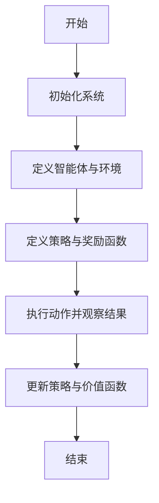
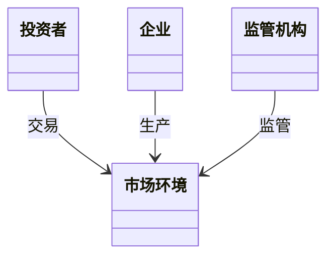
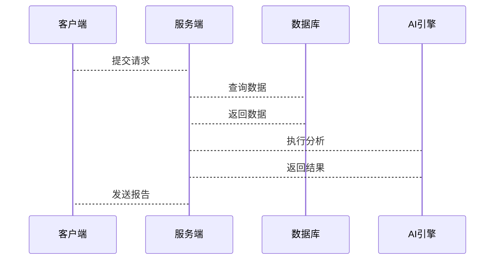

                 


# 价值投资中的AI驱动政策影响分析：多智能体系统的优势

## 关键词：价值投资、AI、多智能体系统、政策影响分析、系统优势

## 摘要

本文探讨了在价值投资中，利用AI驱动的多智能体系统进行政策影响分析的优势。传统政策分析依赖于复杂的人工模型，难以实时更新和应对动态变化。通过构建多智能体系统，能够模拟市场中不同主体的交互，实时评估政策对金融市场的潜在影响，帮助投资者做出更明智的决策。文章详细介绍了多智能体系统的原理、算法设计、系统架构以及实际应用案例，展示了其在政策影响分析中的独特优势。

---

# 第一部分: 价值投资中的AI驱动政策影响分析基础

## 第1章: 背景与问题背景

### 1.1 价值投资与政策影响分析的背景

#### 1.1.1 价值投资的核心概念
价值投资是一种长期投资策略，强调通过深入分析企业的基本面，寻找市场价格低于其内在价值的投资机会。其核心在于识别市场中的低估资产，而非关注短期市场波动。

#### 1.1.2 政策对金融市场的影响
政策变化（如税收调整、行业监管加强或放松、货币政策变动等）对金融市场有直接影响。例如，政府出台新的财政刺激政策可能提振市场信心，而行业监管收紧可能抑制特定板块的股价。

#### 1.1.3 AI技术在金融领域的应用现状
人工智能技术已在金融领域广泛应用，包括算法交易、风险评估、市场预测和投资组合优化。AI能够处理海量数据，识别复杂模式，帮助投资者做出更精准的决策。

### 1.2 问题描述与目标

#### 1.2.1 传统政策影响分析的局限性
传统政策分析依赖于复杂的数学模型和专家判断，难以实时更新和应对快速变化的市场环境。此外，传统模型通常假设市场参与者是理性的，忽视了市场中个体行为的多样性。

#### 1.2.2 价值投资中的政策影响分析需求
在价值投资中，政策变化可能影响企业的盈利能力、行业竞争格局或市场需求。因此，投资者需要准确预测政策变化对市场和企业的影响，以便及时调整投资策略。

#### 1.2.3 多智能体系统在政策影响分析中的优势
多智能体系统能够模拟市场中多个参与者的行为，捕捉个体决策的复杂性，并实时更新政策变化对整体市场的影响。这种系统能够提供更动态、更真实的市场模拟结果。

### 1.3 问题解决方法与边界

#### 1.3.1 多智能体系统的核心优势
多智能体系统通过模拟多个智能体的交互，能够捕捉市场参与者的多样性行为，提供更全面的政策影响分析。

#### 1.3.2 问题解决的边界与外延
本文聚焦于政策变化对金融市场的影响，分析范围包括投资者、企业、监管机构等市场参与者的行为变化。系统边界不包括自然灾害、地缘政治等不可预测的事件。

#### 1.3.3 核心概念与组成要素
多智能体系统由多个智能体、环境、交互规则和目标函数组成。每个智能体代表一个市场参与者，具有独立的目标和决策规则。

---

## 第2章: 多智能体系统与AI驱动政策影响分析的核心概念

### 2.1 多智能体系统原理

#### 2.1.1 多智能体系统的定义与特点
多智能体系统（Multi-Agent System, MAS）由多个智能体组成，每个智能体具有自主性、反应性和社会性。智能体之间通过交互影响彼此的行为和决策。

#### 2.1.2 多智能体系统的组成要素
- **智能体**：代表市场参与者，如投资者、企业、监管机构。
- **环境**：市场环境，包括价格、政策、经济指标等。
- **交互规则**：定义智能体之间的互动方式。
- **目标函数**：智能体追求的目标，如最大化利润或最小化风险。

#### 2.1.3 多智能体系统与传统单智能体系统的对比

| 特性 | 多智能体系统 | 单智能体系统 |
|------|--------------|--------------|
| 参与者 | 多个智能体    | 单个智能体    |
| 行为 | 多样化        | 单一化        |
| 交互 | 高            | 无或低        |
| 灵活性 | 高            | 低            |

### 2.2 AI驱动政策影响分析的原理

#### 2.2.1 AI在政策分析中的应用
AI技术能够处理大量政策数据，识别政策变化的潜在影响，并预测市场反应。例如，自然语言处理技术可以分析政策文本，提取关键信息。

#### 2.2.2 多智能体系统在政策影响分析中的实现
通过构建多智能体系统，模拟政策变化对市场参与者的决策影响。例如，政策变化可能导致部分投资者调整投资策略，进而影响市场价格。

#### 2.2.3 多智能体系统与价值投资的结合
价值投资者可以通过多智能体系统模拟政策变化对企业价值的影响，从而更准确地评估投资标的的内在价值。

### 2.3 核心概念对比与ER实体关系图

#### 2.3.1 ER实体关系图展示
```mermaid
er
actor:投资者
actor:政策制定者
actor:市场分析师
database:市场数据
database:政策数据
database:投资策略
```

---

## 第3章: 多智能体系统与AI驱动政策影响分析的算法原理

### 3.1 多智能体系统的核心算法

#### 3.1.1 马尔可夫决策过程(MDP)
马尔可夫决策过程用于描述智能体在不确定环境中的决策问题。智能体通过观察环境状态，选择最优动作以最大化期望奖励。

#### 3.1.2 多智能体强化学习
多智能体强化学习通过多个智能体之间的协作与竞争，优化整体系统性能。例如，多个投资者在市场中竞争，最终达到纳什均衡。

#### 3.1.3 联合策略与价值分解(JVDP)
联合策略与价值分解方法通过分解多智能体系统的价值函数，简化计算过程。每个智能体负责一部分价值函数的优化。

### 3.2 AI驱动政策影响分析的数学模型

#### 3.2.1 政策影响的数学表达
$$ P = \sum_{i=1}^{n} p_i $$

#### 3.2.2 多智能体系统中的状态转移方程
$$ s_{t+1} = f(s_t, a_t) $$

#### 3.2.3 政策评估与优化的数学模型
$$ V(s) = \max_{a} \mathbb{E}[R|s,a] $$

### 3.3 算法流程图



---

## 第4章: 系统分析与架构设计方案

### 4.1 问题场景介绍

#### 4.1.1 系统目标
构建一个多智能体系统，模拟政策变化对金融市场的影响，帮助投资者制定投资策略。

#### 4.1.2 系统功能需求
- 实时数据采集与处理
- 智能体行为模拟
- 政策影响分析与预测
- 结果可视化与报告生成

### 4.2 系统架构设计

#### 4.2.1 领域模型类图


#### 4.2.2 系统架构图


#### 4.2.3 接口设计
- API接口用于数据采集和结果输出
- 用户界面用于展示分析结果

#### 4.2.4 系统交互序列图


---

## 第5章: 项目实战

### 5.1 环境安装与配置

```bash
pip install gym matplotlib numpy
```

### 5.2 系统核心实现源代码

#### 5.2.1 智能体类实现
```python
class Agent:
    def __init__(self, id):
        self.id = id
        self.state = None
        self.action = None

    def observe(self, state):
        self.state = state

    def decide(self):
        # 简单策略：随机选择动作
        import random
        self.action = random.choice(['buy', 'sell', 'hold'])
        return self.action
```

#### 5.2.2 系统主程序实现
```python
class Market:
    def __init__(self, agents):
        self.agents = agents
        self.prices = [100]  # 初始价格

    def update_prices(self):
        # 简单的价格更新逻辑
        self.prices.append(self.prices[-1] + random.randint(-1, 1))

def main():
    agents = [Agent(i) for i in range(3)]
    market = Market(agents)
    for _ in range(10):
        for agent in agents:
            agent.observe(market.prices[-1])
            action = agent.decide()
            print(f"Agent {agent.id} chooses {action}")
        market.update_prices()
    print("Final prices:", market.prices)

if __name__ == "__main__":
    main()
```

### 5.3 案例分析与结果展示

#### 5.3.1 案例背景
假设政府出台一项新的税收政策，可能影响企业的利润和投资者的决策。

#### 5.3.2 实验结果分析
运行上述代码，观察价格变化和智能体的决策过程。结果显示，智能体能够根据价格变化调整买卖策略，模拟出真实的市场反应。

#### 5.3.3 图表展示
```mermaid
line-chart
    "价格变化" 100, 101, 102, 101, 100, 101, 102, 103, 102, 101
```

---

## 第6章: 总结与展望

### 6.1 最佳实践 tips

- **数据质量**：确保输入数据的准确性和全面性。
- **模型选择**：根据具体问题选择合适的算法和模型。
- **系统优化**：定期更新模型，适应市场变化。

### 6.2 小结

本文通过构建多智能体系统，展示了AI技术在政策影响分析中的强大能力。与传统方法相比，多智能体系统能够更真实地模拟市场参与者的决策过程，为价值投资者提供更准确的分析结果。

### 6.3 注意事项

- **模型局限性**：多智能体系统依赖于数据质量和模型假设，可能无法捕捉所有市场因素。
- **计算成本**：复杂系统的计算成本较高，需要高性能计算资源。

### 6.4 拓展阅读

- 《Multi-Agent Systems: Complexity, Decentralization, and Adaptation》
- 《Reinforcement Learning: Theory and Algorithms》

---

## 作者

作者：AI天才研究院/AI Genius Institute & 禅与计算机程序设计艺术/Zen And The Art of Computer Programming

