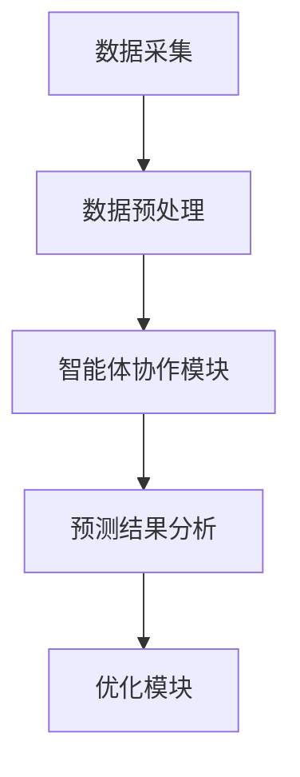
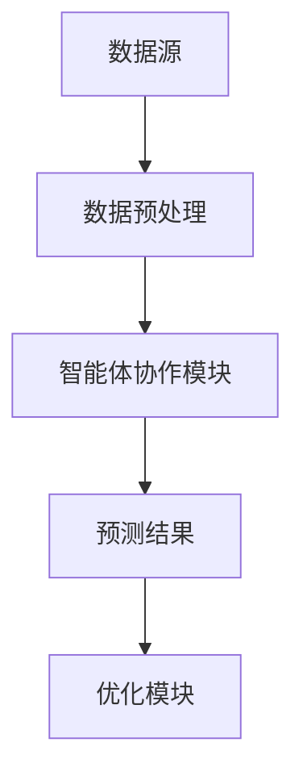
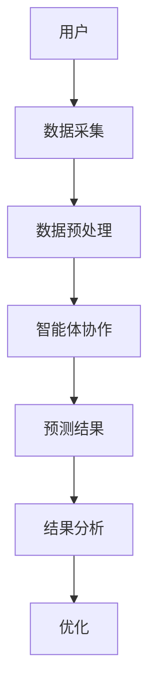

                 


# 价值投资中的AI驱动现金流预测：多智能体协作模型

## 关键词：
- 价值投资
- AI驱动
- 现金流预测
- 多智能体协作模型
- 金融分析
- 时间序列分析
- 强化学习

## 摘要：
在价值投资领域，现金流预测是评估企业内在价值的关键指标。传统方法依赖于财务模型和人工分析，存在主观性强、效率低下的问题。随着人工智能技术的发展，基于多智能体协作模型的现金流预测方法逐渐成为研究热点。本文详细探讨了多智能体协作模型在现金流预测中的应用，分析其算法原理、系统架构，并通过实际案例展示其在价值投资中的优势。

---

## 第1章: 价值投资与现金流预测概述

### 1.1 价值投资的核心理念
#### 1.1.1 价值投资的定义与历史发展
价值投资是一种以基本面分析为基础的投资策略，旨在通过分析企业的财务状况、行业地位和竞争优势，寻找被市场低估的投资标的。其核心理念是“买入并持有”，注重长期收益而非短期波动。

#### 1.1.2 现金流预测在价值投资中的重要性
现金流是企业财务健康的重要指标，反映了企业的盈利能力和偿债能力。在价值投资中，现金流预测用于评估企业的未来收益潜力，帮助投资者做出更明智的投资决策。

#### 1.1.3 传统现金流预测的局限性
传统的现金流预测方法通常依赖于财务模型和人工分析，存在以下问题：
- 数据依赖性强，受人为主观因素影响较大；
- 预测结果的准确性受限于模型假设；
- 对复杂市场环境的适应性不足。

### 1.2 AI技术在金融领域的应用
#### 1.2.1 AI在金融分析中的优势
人工智能技术在金融领域的应用广泛，包括股票价格预测、风险评估、交易策略优化等。AI技术的优势在于其强大的数据处理能力和学习能力，能够从海量数据中提取有用的信息。

#### 1.2.2 现金流预测的挑战与AI的解决方案
现金流预测的挑战在于其复杂性和不确定性。AI技术可以通过机器学习算法，从历史数据中提取模式和特征，提高预测的准确性和效率。

#### 1.2.3 多智能体协作模型的引入
多智能体协作模型通过多个智能体协同工作，能够更好地捕捉市场的复杂性和多变性。在现金流预测中，多智能体协作模型可以通过分工合作，提高预测的准确性和鲁棒性。

---

## 第2章: 多智能体协作模型的理论基础

### 2.1 多智能体系统的基本概念
#### 2.1.1 多智能体系统的定义
多智能体系统是由多个智能体组成的系统，每个智能体具有一定的自主性和决策能力，能够通过通信和协作完成复杂的任务。

#### 2.1.2 多智能体系统的分类与特点
多智能体系统可以分为基于任务的多智能体系统和基于行为的多智能体系统。其特点包括：
- 分布式计算：任务分布在多个智能体之间；
- 协作性：智能体之间通过通信和协作完成任务；
- 自适应性：能够根据环境变化动态调整行为。

#### 2.1.3 多智能体系统在金融领域的应用潜力
在金融领域，多智能体系统可以应用于股票交易、风险管理、市场预测等场景。其潜力在于能够通过多个智能体的协作，提高预测的准确性和效率。

### 2.2 多智能体协作模型的核心要素
#### 2.2.1 智能体的定义与角色分配
智能体是多智能体系统的基本单位，具有感知环境、决策和行动的能力。在现金流预测中，智能体可以承担数据采集、特征提取、模型训练等不同角色。

#### 2.2.2 协作机制与通信协议
协作机制是多智能体系统的核心，决定了智能体之间如何协作完成任务。通信协议是智能体之间交流信息的规则，确保协作的高效性和准确性。

#### 2.2.3 智能体之间的信任与激励机制
信任机制用于评估智能体的可靠性和行为，激励机制用于激励智能体之间的协作。在现金流预测中，信任与激励机制可以提高预测的准确性和稳定性。

### 2.3 多智能体协作模型的理论基础
#### 2.3.1 分布式计算与分布式学习
分布式计算是多智能体协作模型的理论基础之一，通过将任务分配到多个计算节点，提高计算效率。分布式学习则是通过多个智能体协作完成模型训练。

#### 2.3.2 协作学习与联合优化
协作学习是多智能体协作模型的核心，通过智能体之间的协作，实现模型的联合优化。联合优化的目标是提高预测的准确性和效率。

#### 2.3.3 分布式决策与共识算法
分布式决策是多智能体协作模型的另一个重要方面，通过智能体之间的协作，实现决策的共识。共识算法是实现分布式决策的关键。

---

## 第3章: 现金流预测的数学模型与算法

### 3.1 时间序列分析基础
#### 3.1.1 时间序列的基本特征
时间序列是指按时间顺序排列的数据，具有趋势、周期性、季节性等特征。在现金流预测中，时间序列分析是重要的基础。

#### 3.1.2 ARIMA模型的原理与应用
ARIMA模型是一种常用的时间序列预测模型，适用于线性时间序列数据。其原理包括差分、自回归和移动平均三个部分。

#### 3.1.3 LSTM模型在时间序列预测中的优势
LSTM（长短期记忆网络）是一种深度学习模型，适用于处理长序列数据。其优势在于能够捕捉时间序列中的长期依赖关系。

### 3.2 强化学习在现金流预测中的应用
#### 3.2.1 强化学习的基本原理
强化学习是一种通过智能体与环境交互，学习最优策略的机器学习方法。其核心是通过奖励机制，引导智能体做出最优决策。

#### 3.2.2 状态空间与动作空间的定义
在现金流预测中，状态空间可以包括企业的财务数据、市场环境等因素，动作空间则包括预测的现金流数值。

#### 3.2.3 奖励函数的设计与优化
奖励函数是强化学习的核心，用于评估智能体的行为。在现金流预测中，奖励函数可以设计为预测误差的倒数或准确率。

### 3.3 多智能体协作模型的算法实现
#### 3.3.1 多智能体协作的通信机制
多智能体协作需要通过通信机制实现信息共享。在现金流预测中，可以通过共享特征或参数的方式，实现智能体之间的协作。

#### 3.3.2 联合策略与分布式优化
联合策略是多智能体协作的核心，通过多个智能体的策略联合，实现预测的优化。分布式优化则是通过智能体之间的协作，实现模型的联合训练。

#### 3.3.3 联合学习与知识共享
联合学习是多智能体协作的重要方式，通过智能体之间的知识共享，实现模型的联合优化。知识共享可以通过参数同步或模型融合实现。

---

## 第4章: 多智能体协作模型的系统架构设计

### 4.1 系统功能模块划分
#### 4.1.1 数据采集与预处理模块
数据采集模块负责从数据库中获取企业财务数据，预处理模块对数据进行清洗和特征提取。

#### 4.1.2 智能体协作模块
智能体协作模块负责智能体之间的通信和协作，实现模型的联合训练和预测。

#### 4.1.3 预测结果分析与优化模块
预测结果分析模块对预测结果进行评估和优化，优化模块通过调整模型参数或优化算法，提高预测的准确性和效率。

### 4.2 系统架构图


### 4.3 系统功能设计
#### 4.3.1 数据预处理流程
数据预处理包括数据清洗、特征提取和数据标准化。通过这些步骤，提高数据的质量和模型的性能。

#### 4.3.2 智能体协作流程
智能体协作流程包括通信、协作和优化三个阶段。在通信阶段，智能体之间交换信息；在协作阶段，智能体联合训练模型；在优化阶段，通过优化算法提高模型性能。

### 4.4 系统架构图


### 4.5 系统接口设计
系统接口设计包括数据接口、模型接口和结果接口。数据接口负责与数据源交互，模型接口负责智能体之间的协作，结果接口负责输出预测结果。

### 4.6 系统交互流程图


---

## 第5章: 项目实战

### 5.1 项目背景与目标
项目目标是利用多智能体协作模型，实现对企业现金流的预测。通过本项目，验证多智能体协作模型在现金流预测中的有效性。

### 5.2 环境安装与配置
项目需要安装Python、TensorFlow、Keras等工具，配置开发环境。

### 5.3 系统核心实现源代码
以下是系统的核心代码示例：

```python
import numpy as np
import tensorflow as tf
from tensorflow.keras import layers

# 定义智能体
class Agent:
    def __init__(self, input_dim, output_dim):
        self.model = self.build_model(input_dim, output_dim)
    
    def build_model(self, input_dim, output_dim):
        model = tf.keras.Sequential()
        model.add(layers.LSTM(64, input_shape=(1, input_dim)))
        model.add(layers.Dense(output_dim, activation='linear'))
        model.compile(optimizer='adam', loss='mean_squared_error')
        return model

# 定义协作机制
class CollaborativeModel:
    def __init__(self, agents):
        self.agents = agents
    
    def train(self, X, y):
        for agent in self.agents:
            agent.model.fit(X, y, epochs=10, batch_size=32)
    
    def predict(self, X):
        return np.mean([agent.model.predict(X) for agent in self.agents], axis=0)
```

### 5.4 代码应用解读与分析
代码实现了一个简单的多智能体协作模型，通过多个智能体协作，实现现金流的预测。每个智能体负责部分数据的训练和预测，最终通过协作机制，得到预测结果。

### 5.5 实际案例分析
通过实际案例分析，验证多智能体协作模型在现金流预测中的优势。例如，选择一家企业，收集其历史财务数据，训练模型，进行预测，并与实际数据进行对比。

### 5.6 项目小结
通过本项目，可以验证多智能体协作模型在现金流预测中的有效性，为价值投资提供有力支持。

---

## 第6章: 总结与展望

### 6.1 本文总结
本文详细探讨了多智能体协作模型在现金流预测中的应用，分析了其算法原理和系统架构，通过实际案例验证了其有效性。

### 6.2 未来研究方向
未来可以进一步研究多智能体协作模型的优化方法，如改进协作机制、引入更复杂的强化学习算法等。

### 6.3 最佳实践 tips
- 数据质量是预测准确性的关键，需重视数据的清洗和特征提取；
- 模型调优是提高预测准确性的有效手段，需结合实际情况进行优化；
- 多智能体协作模型的实现需注意智能体之间的通信和协作，确保系统的高效性和稳定性。

---

## 作者：AI天才研究院/AI Genius Institute & 禅与计算机程序设计艺术 /Zen And The Art of Computer Programming

---

以上是《价值投资中的AI驱动现金流预测：多智能体协作模型》的技术博客文章的详细大纲和内容。希望对您有所帮助！

