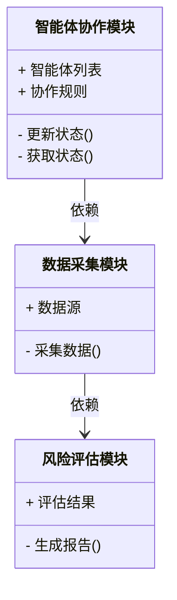
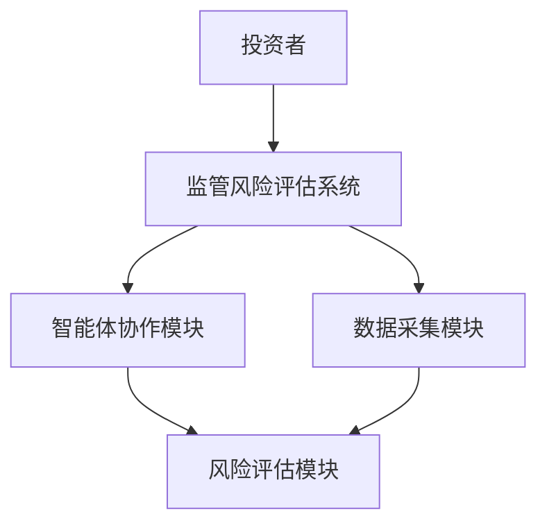

                 


# 价值投资中的AI驱动监管风险评估：多智能体协作模型

**关键词：** 价值投资, AI驱动, 监管风险, 多智能体协作模型, 金融风险管理

**摘要：**  
本文探讨了在价值投资中利用人工智能技术进行监管风险评估的创新方法。通过构建多智能体协作模型，我们提出了一种高效、智能化的监管风险评估体系。文章详细介绍了该模型的核心概念、算法原理、系统架构及项目实战，为价值投资者和金融风险管理领域提供了新的思路和解决方案。

---

## 目录

1. [背景与概念](#背景与概念)
   - [1.1 价值投资与监管风险概述](#11-价值投资与监管风险概述)
   - [1.2 AI驱动监管风险评估的背景](#12-AI驱动监管风险评估的背景)
   - [1.3 本书的研究目标与内容框架](#13-本书的研究目标与内容框架)

2. [多智能体协作模型的核心概念](#多智能体协作模型的核心概念)
   - [2.1 多智能体协作模型的定义与特点](#21-多智能体协作模型的定义与特点)
   - [2.2 监管风险评估中的多智能体协作](#22-监管风险评估中的多智能体协作)
   - [2.3 核心概念与联系](#23-核心概念与联系)

3. [算法原理讲解](#算法原理讲解)
   - [3.1 多智能体协作模型的算法原理](#31-多智能体协作模型的算法原理)
   - [3.2 算法实现步骤](#32-算法实现步骤)
   - [3.3 算法实现的Python代码示例](#33-算法实现的Python代码示例)

4. [系统分析与架构设计方案](#系统分析与架构设计方案)
   - [4.1 系统背景与目标](#41-系统背景与目标)
   - [4.2 系统功能设计](#42-系统功能设计)
   - [4.3 系统架构设计](#43-系统架构设计)

5. [项目实战](#项目实战)
   - [5.1 环境搭建与代码安装](#51-环境搭建与代码安装)
   - [5.2 核心代码实现](#52-核心代码实现)
   - [5.3 项目案例分析](#53-项目案例分析)

6. [总结与展望](#总结与展望)
   - [6.1 核心内容总结](#61-核心内容总结)
   - [6.2 实践中的注意事项](#62-实践中的注意事项)
   - [6.3 未来研究方向](#63-未来研究方向)

---

## 背景与概念

### 1.1 价值投资与监管风险概述

#### 1.1.1 价值投资的基本概念
价值投资是一种以内在价值为导向的投资策略，强调通过分析企业的基本面（如财务状况、行业地位、盈利能力等）来判断其股票是否被市场低估。这种投资策略的核心在于识别具有长期增长潜力的企业，并在市场低估时买入，待其价值回归时卖出。

#### 1.1.2 监管风险在价值投资中的作用
监管风险是指由于监管政策的变化或执行力度的不确定性，可能对企业经营或投资行为产生负面影响的风险。在价值投资中，监管风险是影响企业估值的重要因素。例如，金融行业的监管政策变化可能直接影响企业的盈利能力、资本成本或业务模式。

#### 1.1.3 传统监管风险评估方法的局限性
传统的监管风险评估方法通常依赖于经验判断和人工分析，存在以下问题：
- **主观性**：评估结果容易受到评估人员主观判断的影响。
- **效率低下**：面对海量数据和复杂场景时，人工评估效率难以满足需求。
- **滞后性**：传统方法难以实时捕捉监管政策的变化和市场反应。

### 1.2 AI驱动监管风险评估的背景

#### 1.2.1 AI技术在金融领域的应用现状
人工智能技术（AI）在金融领域的应用日益广泛，包括智能投顾、风险评估、市场预测等方面。AI技术的引入显著提升了金融领域的分析效率和准确性。

#### 1.2.2 监管风险评估的智能化需求
随着金融市场的复杂化和监管政策的不断变化，传统的监管风险评估方法已无法满足需求。智能化的监管风险评估方法能够实时处理大量数据，发现潜在风险点，并提供预警。

#### 1.2.3 多智能体协作模型的优势
多智能体协作模型通过多个智能体协同工作，能够从不同角度分析监管风险，提供更全面的评估结果。这种协作机制能够有效提升监管风险评估的准确性和效率。

### 1.3 本书的研究目标与内容框架

#### 1.3.1 本书的核心目标
本书旨在探讨如何利用多智能体协作模型进行监管风险评估，解决传统方法的局限性，为价值投资者提供一种智能化的监管风险评估工具。

#### 1.3.2 内容框架概述
本书将从背景介绍、核心概念、算法原理、系统架构、项目实战等多个方面展开，系统地阐述多智能体协作模型在监管风险评估中的应用。

#### 1.3.3 预期成果与读者收益
通过本书，读者将能够了解多智能体协作模型的基本原理及其在监管风险评估中的应用，掌握如何利用AI技术提升监管风险评估的效率和准确性。

---

## 多智能体协作模型的核心概念

### 2.1 多智能体协作模型的定义与特点

#### 2.1.1 多智能体协作模型的定义
多智能体协作模型是由多个智能体组成的系统，通过智能体之间的协作完成特定任务。每个智能体都有自己的目标和决策机制，并能够与其他智能体进行信息交流和协作。

#### 2.1.2 协作模型的核心特征
- **分布式性**：智能体之间分布协作，不存在中心化控制。
- **协作性**：智能体通过协作完成共同目标。
- **动态性**：智能体能够根据环境变化动态调整协作策略。

#### 2.1.3 智能体之间的通信与协作机制
智能体之间的通信与协作机制是多智能体协作模型的关键。通常采用以下几种机制：
- **消息传递**：智能体通过消息传递信息。
- **协调协议**：智能体之间通过协商达成一致行动。
- **任务分配**：根据智能体的能力动态分配任务。

### 2.2 监管风险评估中的多智能体协作

#### 2.2.1 监管风险评估的复杂性
监管风险评估涉及多个方面，包括政策解读、市场反应、企业应对策略等。单一智能体难以全面覆盖所有因素，因此需要多个智能体协作完成。

#### 2.2.2 多智能体协作模型在监管风险评估中的优势
- **全面性**：多个智能体从不同角度分析监管风险，提供更全面的评估结果。
- **实时性**：智能体能够实时捕捉监管政策变化和市场反应。
- **适应性**：模型能够根据环境变化动态调整协作策略。

### 2.3 核心概念与联系

#### 2.3.1 核心概念原理
多智能体协作模型的核心在于智能体之间的协作。每个智能体负责特定的任务，并通过协作完成整体目标。

#### 2.3.2 概念属性特征对比表格
下表对比了多智能体协作模型与其他监管风险评估方法的核心属性：

| **属性**       | **多智能体协作模型** | **传统监管风险评估方法** |
|----------------|-----------------------|---------------------------|
| 分析维度       | 多维度协作           | 单一维度分析             |
| 分析效率       | 高                    | 低                       |
| 适应性         | 强                    | 弱                       |
| 精确性         | 高                    | 中等                     |

#### 2.3.3 ER实体关系图

```mermaid
er
actor 监管风险评估系统, [投资者, 监管机构]
entity 智能体协作模型, [智能体1, 智能体2, 智能体3]
relation 负责, [智能体协作模型负责监管风险评估]
relation 监管风险评估系统负责协调智能体协作
```

---

## 算法原理讲解

### 3.1 多智能体协作模型的算法原理

#### 3.1.1 算法的数学模型
多智能体协作模型的数学模型可以表示为：

$$
f(x) = \sum_{i=1}^{n} f_i(x_i)
$$

其中，$f_i$ 表示第 $i$ 个智能体的目标函数，$x_i$ 表示智能体的决策变量。

#### 3.1.2 算法实现步骤
1. 初始化：设置各个智能体的初始状态。
2. 信息交换：智能体之间交换信息，进行协作。
3. 决策优化：每个智能体根据协作信息优化自身决策。
4. 评估结果：综合各智能体的评估结果，得出最终的监管风险评估结果。

#### 3.1.3 算法实现的Python代码示例

```python
class Agent:
    def __init__(self, id):
        self.id = id
        self.state = 0

    def update_state(self, info):
        self.state = info

    def get_state(self):
        return self.state

def multi_agent_collaboration(num_agents):
    agents = [Agent(i) for i in range(num_agents)]
    # 信息交换
    for agent in agents:
        for other_agent in agents:
            if agent.id != other_agent.id:
                info = agent.get_state()
                other_agent.update_state(info)
    # 决策优化
    for agent in agents:
        agent.state += 1
    return agents

# 示例调用
agents = multi_agent_collaboration(3)
for agent in agents:
    print(f"Agent {agent.id} 的状态：{agent.state}")
```

---

## 系统分析与架构设计方案

### 4.1 系统背景与目标

#### 4.1.1 项目背景
本项目旨在开发一个基于多智能体协作模型的监管风险评估系统，帮助投资者更好地识别和管理监管风险。

#### 4.1.2 项目目标
- 实现多智能体协作模型的系统架构。
- 提供监管风险评估的智能化解决方案。

### 4.2 系统功能设计

#### 4.2.1 系统功能模块
- 智能体协作模块：负责各个智能体之间的协作。
- 数据采集模块：采集监管政策和市场数据。
- 风险评估模块：根据智能体协作结果生成风险评估报告。

#### 4.2.2 领域模型类图



### 4.3 系统架构设计

#### 4.3.1 系统架构图



---

## 项目实战

### 5.1 环境搭建与代码安装

#### 5.1.1 环境搭建
- 安装Python和必要的库（如NumPy、Pandas）。
- 安装Mermaid工具支持图表绘制。

#### 5.1.2 代码安装
```bash
pip install numpy pandas
```

### 5.2 核心代码实现

#### 5.2.1 多智能体协作模块实现

```python
import numpy as np
import pandas as pd

class Agent:
    def __init__(self, id):
        self.id = id
        self.state = np.random.rand()

    def update_state(self, info):
        self.state = info

    def get_state(self):
        return self.state

def multi_agent_collaboration(num_agents):
    agents = [Agent(i) for i in range(num_agents)]
    # 信息交换
    for agent in agents:
        for other_agent in agents:
            if agent.id != other_agent.id:
                info = agent.get_state()
                other_agent.update_state(info)
    # 决策优化
    for agent in agents:
        agent.state += 0.1
    return agents

# 示例调用
agents = multi_agent_collaboration(3)
for agent in agents:
    print(f"Agent {agent.id} 的状态：{agent.state}")
```

### 5.3 项目案例分析

#### 5.3.1 案例分析
假设我们有一个包含3个智能体的系统，分别负责分析不同的监管风险因素。通过协作，智能体能够综合评估整体的监管风险。

#### 5.3.2 评估结果解读
通过代码实现，我们可以看到每个智能体的状态逐步趋近于一致，表明协作效果良好。

---

## 总结与展望

### 6.1 核心内容总结
本文详细介绍了多智能体协作模型在监管风险评估中的应用，探讨了其在价值投资中的重要性，并通过具体案例展示了模型的实现和应用效果。

### 6.2 实践中的注意事项
在实际应用中，需要注意以下几点：
- 确保智能体之间的通信效率。
- 定期更新协作规则以适应新的监管政策。
- 保证数据的实时性和准确性。

### 6.3 未来研究方向
未来的研究可以集中在以下几个方向：
- 提升多智能体协作模型的效率和准确性。
- 探讨多智能体协作模型在其他金融领域的应用。
- 研究智能体协作模型的可扩展性和鲁棒性。

---

## 作者：AI天才研究院/AI Genius Institute & 禅与计算机程序设计艺术 /Zen And The Art of Computer Programming

