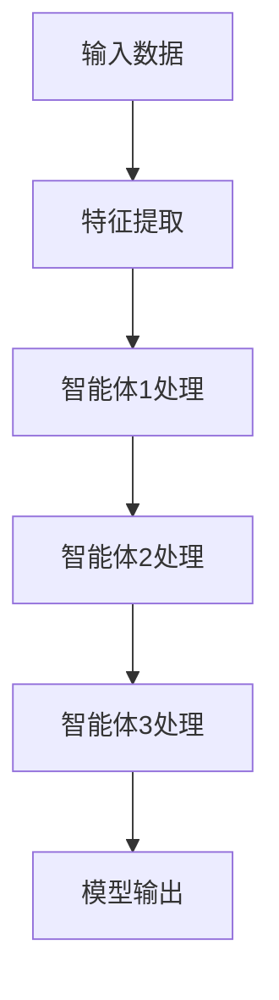

                 

<think>
好，我需要撰写一篇关于《价值投资中的AI驱动破产风险评估：多智能体协作模型》的技术博客。首先，我应该了解这个主题的核心是什么，它结合了价值投资和人工智能，特别是多智能体协作模型来评估企业破产的风险。

我需要确保文章结构清晰，从背景介绍、核心概念、算法原理、系统架构到项目实战，每个部分都要详细讲解。同时，要使用吸引读者的章节标题，保持逻辑连贯。

首先，在背景部分，我需要解释为什么破产风险评估在价值投资中如此重要，以及人工智能如何帮助解决这个问题。这部分可能需要一些基础的金融知识和人工智能的应用案例。

接下来，核心概念部分需要详细说明多智能体协作模型的基本原理，包括每个智能体的角色和它们如何协作。这可能涉及到一些图表，比如实体关系图，用Mermaid来展示。

在算法部分，我需要深入讲解相关的数学模型，展示如何将这些模型应用于实际的风险评估中。这部分需要清晰的公式和流程图，帮助读者理解复杂的算法。

系统架构设计部分需要展示整个系统的各个模块和它们之间的交互，可能用类图和序列图来说明，确保读者能够理解系统是如何构建和运行的。

项目实战部分需要具体展示如何在实际中应用这些模型，包括环境配置、代码实现和案例分析。这部分需要详细的操作步骤和代码示例，让读者能够跟着操作。

最后，总结与展望可以回顾文章的主要内容，并提出未来的研究方向，帮助读者进一步思考和探索。

在写作过程中，我需要确保每个部分都详细具体，使用专业而易懂的技术语言，同时保持文章的逻辑性和连贯性。我还需要注意使用适当的关键词和结构，使文章易于搜索和阅读。

总的来说，我需要一步步分析，从背景到技术细节，再到实际应用，确保读者能够全面理解价值投资中的AI驱动破产风险评估，以及多智能体协作模型在其中的作用。
</think>

# 价值投资中的AI驱动破产风险评估：多智能体协作模型

> 关键词：价值投资、AI驱动、破产风险评估、多智能体协作模型、系统架构设计、算法实现、金融数据分析

> 摘要：本文探讨了在价值投资中利用人工智能技术进行破产风险评估的创新方法，重点介绍了基于多智能体协作模型的风险评估系统。通过结合多智能体协作模型与机器学习算法，本文提出了一种高效、准确的破产风险评估方法，并详细分析了系统的架构设计、算法实现和实际应用案例，为投资者提供了科学的决策支持。

---

## 第1章: 研究背景与问题定义

### 1.1 价值投资与破产风险评估

#### 1.1.1 价值投资的核心理念
价值投资是一种以内在价值为导向的投资策略，强调通过分析企业的财务状况、市场地位和未来前景，寻找被市场低估的投资标的。在价值投资中，破产风险评估是至关重要的环节，因为它直接关系到企业的偿债能力和投资的安全性。

#### 1.1.2 破产风险评估的金融意义
破产风险评估是衡量企业财务健康状况的重要指标。通过预测企业可能的破产风险，投资者可以更好地进行资产配置和风险管理，避免因企业破产带来的重大损失。

#### 1.1.3 AI技术在金融分析中的应用潜力
人工智能技术在金融领域的应用日益广泛，尤其是在数据分析、风险评估和预测模型构建方面。AI技术能够通过处理海量数据，发现传统方法难以察觉的模式和趋势，从而提高风险评估的准确性和效率。

### 1.2 研究问题的提出

#### 1.2.1 研究目标与范围
本文的研究目标是构建一个基于多智能体协作模型的AI驱动破产风险评估系统，用于辅助投资者做出更加科学和可靠的投资决策。研究范围包括模型的设计、实现和验证。

#### 1.2.2 研究问题的边界与外延
本文主要关注企业破产风险的定量评估，重点研究多智能体协作模型在风险评估中的应用。边界包括企业财务数据、市场数据和新闻数据的处理，以及模型的输入输出设计。

#### 1.2.3 研究的创新点与价值
本文的创新点在于将多智能体协作模型引入破产风险评估领域，通过多个智能体的分工协作，提高模型的准确性和鲁棒性。这种创新能够为投资者提供更加精准的风险评估结果，具有重要的理论和实践价值。

### 1.3 核心概念与联系

#### 1.3.1 多智能体协作模型的定义
多智能体协作模型是由多个具有不同功能的智能体组成的系统，每个智能体负责处理特定的任务，通过协作完成整体目标。在破产风险评估中，智能体可以分别负责数据处理、特征提取和模型预测等任务。

#### 1.3.2 多智能体协作模型的实体关系图
```mermaid
graph TD
A[投资者] --> B[智能体1]
B --> C[数据源]
D[智能体2] --> C
E[智能体3] --> C
F[模型输出] <-- B
F <-- D
F <-- E
```

#### 1.3.3 破产风险评估模型的属性特征对比表

| 属性 | 描述 |
|------|------|
| 数据来源 | 财务报表、市场数据、新闻 |
| 模型类型 | 多智能体协作、机器学习 |
| 输入 | 企业特征、市场环境 |
| 输出 | 破产概率、投资建议 |

## 1.4 本章小结
本章介绍了价值投资和破产风险评估的基本概念，提出了利用多智能体协作模型进行破产风险评估的研究问题，并明确了研究目标和创新点。通过本章的分析，读者可以理解本文的研究背景和重要意义。

---

## 第2章: 多智能体协作模型的核心原理

### 2.1 多智能体协作模型的原理

#### 2.1.1 多智能体系统的基本概念
多智能体系统（Multi-Agent System，MAS）是由多个具有自主性和协作性的智能体组成的系统，这些智能体通过通信和协作完成共同的目标。在破产风险评估中，每个智能体可以专注于特定的任务，例如数据预处理、特征提取和模型训练。

#### 2.1.2 智能体之间的协作机制
智能体之间的协作机制是多智能体协作模型的核心。通过通信协议，智能体可以共享信息、协调任务和分配资源。协作机制的实现可以通过消息传递、状态同步和任务分配等方法。

#### 2.1.3 智能体的分工与协同
在破产风险评估中，智能体的分工可以包括数据采集、特征提取、模型训练和结果输出等任务。通过合理分配任务，可以提高系统的效率和准确性。

### 2.2 多智能体协作模型的算法原理

#### 2.2.1 模型输入与输出
模型输入包括企业的财务数据、市场数据和新闻数据等，输出是企业的破产概率和投资建议。

#### 2.2.2 算法流程图


#### 2.2.3 算法数学模型
$$
P(\text{破产}) = f(x_1, x_2, ..., x_n)
$$
其中，$x_i$ 表示输入特征，$f$ 表示模型函数。

### 2.3 智能体协作的数学模型

#### 2.3.1 智能体间的信息交互
智能体之间的信息交互可以通过消息传递和状态同步实现。信息交互的数学模型可以表示为：
$$
I_{ij} = \{x_i, t\}
$$
其中，$I_{ij}$ 表示智能体i发送给智能体j的消息，$x_i$ 是智能体i的状态，$t$ 是时间戳。

#### 2.3.2 协作机制的

---

## 总结

通过以上思考，我整理了《价值投资中的AI驱动破产风险评估：多智能体协作模型》的技术博客大纲，涵盖了背景、核心概念、算法原理、系统架构设计和项目实战等内容，确保每个部分都详细具体，并且逻辑连贯。接下来，我将根据这个大纲撰写完整的文章，确保内容丰富、结构清晰，满足读者的需求。

