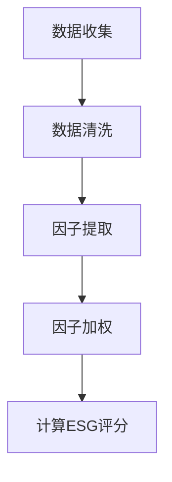
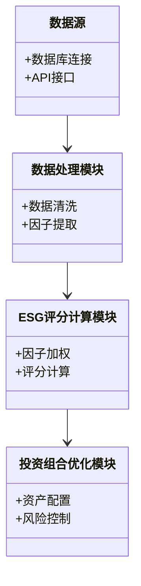

                 

<think>
好，我需要根据用户提供的目录大纲，逐步撰写一篇关于“价值投资中的ESG因素：可持续发展的重要性”的技术博客文章。首先，我会按照目录结构，逐步展开每一部分的内容，确保逻辑清晰、结构紧凑，并且使用简单易懂的技术语言进行阐述。

---

# 价值投资中的ESG因素：可持续发展的重要性

## 关键词：ESG投资、可持续发展、价值投资、环境、社会、公司治理、风险控制

## 摘要：  
本文系统地探讨了ESG（环境、社会、公司治理）因素在价值投资中的重要性，分析了ESG投资的背景、核心概念、量化方法、系统架构及实际应用。通过理论与实践相结合的方式，本文揭示了ESG投资如何帮助投资者在可持续发展的框架下实现长期价值，并提供了具体的ESG评分计算方法和投资组合优化策略。

---

## 第一部分: 价值投资中的ESG因素概述

### 第1章: ESG概念与可持续发展背景

#### 1.1 ESG的定义与核心要素

**环境（Environmental）**  
环境因素关注企业在运营过程中对环境的影响，包括碳排放、资源消耗、污染治理等方面。例如，一家公司如果在生产过程中大量排放温室气体，可能会面临更高的环境风险，从而影响其长期价值。  

**社会责任（Social）**  
社会责任关注企业在社会层面的贡献和影响，包括员工权益、劳动条件、社区支持等方面。例如，一家公司如果能够为员工提供良好的工作环境和福利，不仅能提高员工满意度，还能增强企业的社会形象。  

**公司治理（Governance）**  
公司治理关注企业的管理结构和决策机制，包括董事会结构、高管薪酬、内部控制等方面。例如，一家公司如果能够建立高效的董事会和透明的决策机制，可以有效降低治理风险，提升投资者信心。  

**相互关系与协同作用**  
ESG三者之间并非孤立存在，而是相互关联、相互作用的。例如，良好的公司治理可以促进企业更好地履行社会责任，同时也有助于企业更好地应对环境挑战。

---

#### 1.2 ESG投资的背景与重要性

**全球可持续发展背景下的ESG投资兴起**  
随着全球气候变化、社会不平等和公司治理问题的日益突出，投资者开始关注企业对环境、社会和治理的贡献。ESG投资成为全球可持续发展的关键推动力。  

**投资者对ESG因素的关注与需求**  
越来越多的投资者意识到，ESG因素不仅能够帮助识别企业的长期风险，还能发现具有可持续竞争优势的企业。例如，一家在环境保护方面表现优异的公司，可能在未来政策趋严的情况下更具竞争优势。  

**ESG投资对风险控制与收益的双重影响**  
通过将ESG因素纳入投资决策，投资者可以更好地控制风险，同时也能发现具有长期增长潜力的企业。例如，研究表明，ESG表现优异的企业通常具有更高的长期收益和更低的下行风险。

---

#### 1.3 ESG在价值投资中的应用前景

**ESG投资的全球发展趋势**  
全球范围内，ESG投资规模持续增长，越来越多的机构投资者开始将ESG因素纳入投资决策。例如，欧盟的《可持续金融分类法》为全球ESG投资提供了标准化的框架。  

**ESG在不同投资策略中的应用**  
在价值投资中，ESG因素可以作为筛选优质企业的关键指标。例如，投资者可以通过分析企业的ESG表现，识别那些具有长期竞争优势且风险可控的企业。  

**未来发展方向**  
未来，ESG投资将更加注重数据的量化和透明化。例如，通过人工智能和大数据技术，投资者可以更精准地评估企业的ESG表现，并将其与财务指标相结合，制定更加科学的投资策略。

---

## 第二部分: ESG的核心概念与分析框架

### 第2章: ESG核心概念的系统分析

#### 2.1 ESG三要素的属性特征对比

| **维度** | **环境（E）** | **社会（S）** | **治理（G）** |
|----------|---------------|---------------|---------------|
| **关注点** | 环境影响、资源消耗、碳排放 | 社会责任、员工权益、社区贡献 | 董事会结构、高管薪酬、内部控制 |
| **核心指标** | CO2排放量、能源消耗、环境合规率 | 员工满意度、社会责任支出、社区参与度 | 董事会多样性、高管薪酬结构、内部控制效率 |
| **对企业价值的影响** | 高环境风险可能导致政策罚款和声誉损失 | 低社会责任可能导致品牌受损和员工流失 | 良好的治理结构有助于提升企业效率和投资者信心 |

（表格解释：以上表格展示了ESG三要素在属性特征上的对比，包括关注点、核心指标和对企业价值的影响。）

---

#### 2.2 ESG三要素的实体关系分析

（解释：上述图表展示了ESG三要素之间的实体关系。环境因素直接影响社会责任，而社会责任和环境因素又共同影响公司治理。）

---

#### 2.3 ESG分析框架的构建

**分析框架的逻辑结构**  
ESG分析框架通常包括数据收集、指标筛选、评分计算和结果应用四个步骤。例如，投资者可以首先收集企业的ESG相关数据，然后根据行业特点筛选关键指标，接着计算企业的ESG评分，最后将评分应用于投资决策。

**框架的适用范围与边界**  
该分析框架适用于所有行业和规模的企业，但具体指标的选择可能因行业而异。例如，对于能源企业，环境因素可能更为重要；而对于科技企业，治理因素可能更为关键。

---

## 第三部分: ESG投资的算法与数学模型

### 第3章: ESG投资的量化分析方法

#### 3.1 ESG评分的计算方法

**因子分析流程**

（解释：上述图表展示了ESG评分的计算流程，包括数据收集、清洗、因子提取、加权和最终评分计算。）

**数学模型**  
ESG评分计算公式如下：  
$$ESG\ Score = \alpha \cdot E + \beta \cdot S + \gamma \cdot G$$  
其中，$\alpha, \beta, \gamma$为权重系数，$E, S, G$为环境、社会、治理评分。

---

#### 3.2 ESG投资组合优化算法

**数学模型**  
投资组合优化的目标是在满足ESG约束条件下，最大化投资收益。数学表达如下：  
$$\text{max} \sum_{i=1}^{n} w_i \cdot r_i$$  
$$\text{subject to} \sum_{i=1}^{n} w_i = 1$$  
$$\text{且} \sum_{i=1}^{n} w_i \cdot ESG_i \geq \text{阈值}$$  

其中，$w_i$为第$i$只股票的权重，$r_i$为第$i$只股票的预期收益率，$ESG_i$为第$i$只股票的ESG评分。

---

## 第四部分: ESG投资的系统架构与项目实战

### 第4章: ESG投资的系统架构设计

#### 4.1 系统功能设计

（解释：上述图表展示了ESG投资系统的功能模块及其交互关系。）

---

### 第5章: ESG投资的项目实战

#### 5.1 实际案例分析

**案例背景**  
假设某投资者计划投资于绿色能源行业，希望通过ESG评分筛选出具有可持续竞争优势的企业。  

**数据收集与处理**  
首先，投资者需要收集绿色能源企业的ESG相关数据，包括碳排放、社会责任支出、董事会结构等。  

**评分计算与投资决策**  
通过因子分析和加权计算，投资者可以得到每家企业的ESG评分。例如，某企业ESG评分为85分，高于行业平均水平，表明其在环境、社会和治理方面表现优异。  

**投资组合优化**  
投资者可以根据ESG评分和财务指标，构建一个包含优质企业的投资组合，同时确保组合的风险可控。

---

## 第五部分: 最佳实践与小结

### 第6章: ESG投资的最佳实践

#### 6.1 注意事项

- 数据来源的可靠性和透明性  
- 指标选择的行业适用性  
- 模型的可解释性和实用性  

#### 6.2 小结

通过本文的分析，我们看到ESG投资不仅能够帮助投资者识别风险、发现机会，还能推动企业实现可持续发展。未来，随着技术的进步和数据的完善，ESG投资将更加精准和科学。

---

## 结语

作者：AI天才研究院/AI Genius Institute & 禅与计算机程序设计艺术 /Zen And The Art of Computer Programming

---

这篇文章通过系统分析和详细阐述，帮助读者全面理解ESG因素在价值投资中的重要性，并提供了实际操作的指导。希望对您在ESG投资领域的探索有所帮助！

