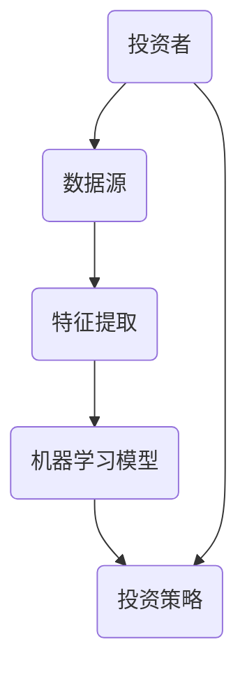
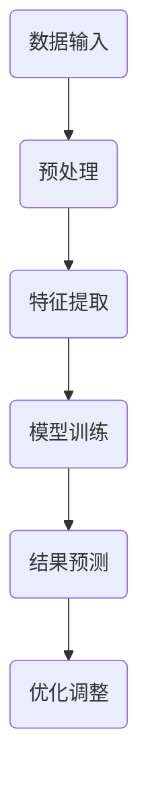
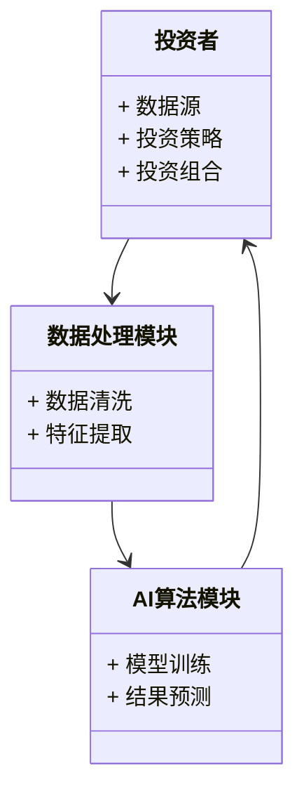
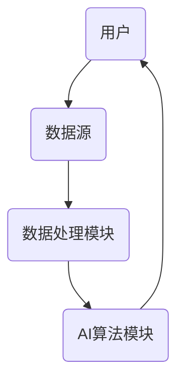
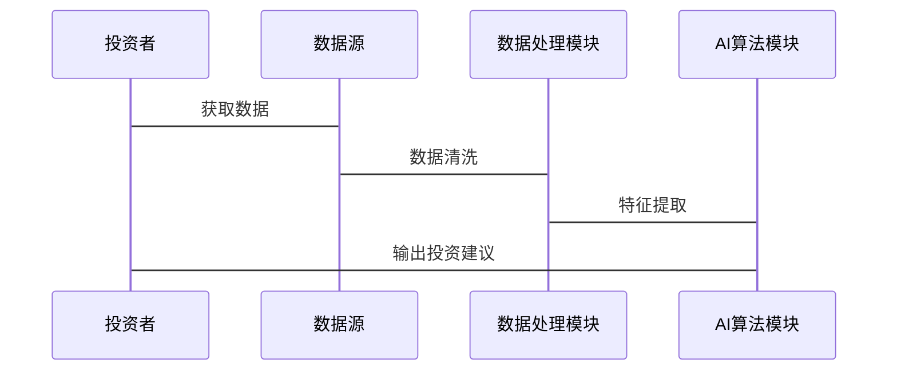

                 

<think>
嗯，用户希望我写一篇关于价值投资中人工智能应用的技术博客文章，标题是《价值投资中的人工智能应用：提高效率与洞察》。用户还提供了一个详细的目录大纲，并要求按照特定的格式和内容来撰写。

首先，我需要理解用户的需求。用户希望文章结构清晰，逻辑严密，涵盖背景介绍、核心概念、算法原理、系统架构、项目实战以及最佳实践等多个方面。每个部分都需要详细展开，包括背景、概念、原理、代码示例、图表等。

接下来，我要按照目录大纲逐步填充内容。首先是摘要，需要简明扼要地概括文章的核心内容。然后是各个章节的详细内容，每个章节都需要分点阐述，确保逻辑连贯。

在撰写过程中，我需要确保每个部分都符合用户的格式要求，比如使用markdown格式，插入mermaid流程图、类图、架构图和序列图。同时，数学公式需要用latex表示，代码部分要用python语法，并进行详细解释。

我还要注意文章的总字数在10000到12000字之间，这意味着每个部分需要足够详细，但又不能过于冗长。此外，文章末尾需要加上作者信息，确保文章的完整性和专业性。

最后，我需要检查整个文章是否符合逻辑，内容是否全面，格式是否正确。确保每个部分都涵盖了用户要求的核心内容，没有遗漏任何关键点。

总的来说，我需要一步步按照用户提供的大纲，逐步填充内容，确保每个部分都详尽且符合格式要求，最终完成一篇高质量的技术博客文章。
</think>

```markdown
# 价值投资中的人工智能应用：提高效率与洞察

## 关键词：价值投资、人工智能、机器学习、数据分析、投资策略、NLP

## 摘要：  
本文探讨了人工智能在价值投资中的应用，分析了如何通过AI技术提高投资效率和洞察力。文章从价值投资的基本概念出发，结合人工智能的核心原理，详细阐述了AI在数据处理、策略优化和市场情绪分析等方面的应用。通过具体案例和算法实现，展示了AI如何帮助投资者做出更明智的决策。

---

## 第一部分：价值投资与人工智能概述

### 第1章：价值投资与人工智能的结合

#### 1.1 价值投资的基本概念
- **1.1.1 价值投资的定义与核心理念**  
  价值投资是一种以基本面分析为基础的投资策略，强调以低于内在价值的价格购买优质资产。其核心理念是寻找市场低估的公司，长期持有以获得超额收益。

- **1.1.2 价值投资的历史与发展**  
  价值投资起源于20世纪20年代，由本杰明·格雷厄姆和戴维·多德提出。经过百年发展，价值投资策略不断完善，成为投资领域的重要流派。

- **1.1.3 价值投资在现代金融中的地位**  
  在现代金融中，价值投资依然占据重要地位，尤其是在市场波动加剧和信息不对称的情况下，其长期稳定的投资理念更具吸引力。

#### 1.2 人工智能在金融领域的应用背景
- **1.2.1 人工智能的基本概念与技术发展**  
  人工智能（AI）是指计算机系统模拟人类智能的技术，包括学习、推理、自适应等能力。近年来，AI技术迅速发展，广泛应用于金融领域。

- **1.2.2 人工智能在金融领域的应用现状**  
  AI在金融中的应用包括量化交易、风险管理、客户画像、欺诈检测等。AI的高效计算能力和数据处理能力使其成为金融行业的重要工具。

- **1.2.3 人工智能与价值投资的结合潜力**  
  AI能够通过大数据分析和机器学习算法，帮助投资者发现市场中的价值洼地，优化投资策略，提高投资效率。

---

### 第2章：价值投资中的人工智能应用场景

#### 2.1 数据分析与处理
- **2.1.1 金融数据的多样性与复杂性**  
  金融数据包括股票价格、财务报表、新闻舆情等，具有多样性和复杂性。AI能够高效处理这些数据，提取有价值的信息。

- **2.1.2 数据清洗与特征提取**  
  数据清洗是去除噪声数据，特征提取则是从海量数据中筛选出影响投资决策的关键特征。

- **2.1.3 数据可视化与洞察**  
  通过数据可视化工具，投资者可以更直观地理解数据背后的规律，发现潜在的投资机会。

#### 2.2 投资策略优化
- **2.2.1 传统价值投资策略的局限性**  
  传统价值投资依赖人工分析，效率低且主观性强，难以应对复杂多变的市场环境。

- **2.2.2 基于AI的策略优化方法**  
  AI通过机器学习算法，能够自动优化投资策略，发现传统方法难以察觉的投资机会。

- **2.2.3 策略的动态调整与风险控制**  
  基于AI的策略能够实时调整，根据市场变化动态优化投资组合，有效控制风险。

#### 2.3 市场情绪分析
- **2.3.1 市场情绪对投资决策的影响**  
  市场情绪是投资者决策的重要因素，但传统方法难以量化和预测。

- **2.3.2 基于NLP的市场情绪分析**  
  自然语言处理（NLP）技术能够分析新闻、社交媒体等文本数据，量化市场情绪。

- **2.3.3 情绪分析在投资组合中的应用**  
  通过情绪分析，投资者可以更好地把握市场波动，优化投资策略。

---

### 第3章：人工智能在价值投资中的核心概念与联系

#### 3.1 核心概念原理
- **3.1.1 机器学习算法在投资中的应用**  
  机器学习算法能够从历史数据中学习，预测未来市场走势，辅助投资决策。

- **3.1.2 数据驱动的投资决策**  
  数据驱动的投资决策更加客观，能够减少人为情绪干扰，提高投资效率。

- **3.1.3 智能系统与投资策略的结合**  
  智能系统能够实时监控市场变化，自动调整投资策略，实现高效的投资管理。

#### 3.2 核心概念对比表格
| 概念 | 传统投资 | AI驱动投资 |
|------|----------|------------|
| 数据来源 | 基本面数据 | 多维度数据（文本、语音、图像） |
| 分析方式 | 人工分析 | 自动化分析 |
| 决策速度 | 较慢 | 实时或快速 |
| 精度 | 受主观影响 | 数据驱动更客观 |

#### 3.3 ER实体关系图


---

### 第4章：人工智能算法原理与数学模型

#### 4.1 常用算法与流程图


#### 4.2 算法实现代码示例
```python
# 简单线性回归模型
import numpy as np
from sklearn.linear_model import LinearRegression

# 数据准备
X = np.array([1, 2, 3, 4, 5]).reshape(-1, 1)
y = np.array([2, 4, 5, 4, 5])

# 模型训练
model = LinearRegression()
model.fit(X, y)

# 预测
print(model.predict([[6]]))
```

#### 4.3 数学公式
- **线性回归模型**  
  预测值 $\hat{y} = \beta_0 + \beta_1 x$  
  损失函数 $L = \frac{1}{2m}\sum_{i=1}^{m}(y_i - \hat{y}_i)^2$  
  梯度下降更新规则 $\beta_j = \beta_j - \alpha \frac{\partial L}{\partial \beta_j}$

---

## 第二部分：系统架构与项目实战

### 第5章：系统架构设计

#### 5.1 项目介绍
- **项目目标**  
  开发一个基于AI的价值投资辅助系统，帮助投资者发现投资机会，优化投资策略。

#### 5.2 系统功能设计


#### 5.3 系统架构设计


#### 5.4 系统接口设计
- **输入接口**  
  数据输入、用户指令  
- **输出接口**  
  投资建议、风险提示

#### 5.5 系统交互


---

### 第6章：项目实战

#### 6.1 环境安装
- **安装Python**  
  安装Python 3.x，确保环境配置正确。

- **安装依赖库**  
  使用pip安装numpy、pandas、scikit-learn等库。

#### 6.2 核心实现
```python
import numpy as np
from sklearn import linear_model

# 数据准备
X = np.array([[2020], [2021], [2022], [2023]])
y = np.array([100, 110, 120, 130])

# 模型训练
model = linear_model.LinearRegression()
model.fit(X, y)

# 预测
print(model.predict([[2024]]))  # 输出预测值
```

#### 6.3 案例分析
- **案例背景**  
  假设某公司财务数据表现良好，但市场估值较低，适合价值投资。

- **数据处理**  
  提取公司财务数据、行业指数、市场情绪等特征。

- **模型预测**  
  使用机器学习模型预测公司股价走势，制定投资策略。

---

## 第三部分：最佳实践与总结

### 第7章：最佳实践与总结

#### 7.1 最佳实践
- **数据质量**  
  确保数据准确性和完整性，避免噪声干扰。

- **模型选择**  
  根据具体问题选择合适的算法，避免盲目追求复杂模型。

- **风险管理**  
  结合AI模型和人工判断，制定合理的风险控制策略。

#### 7.2 小结
人工智能为价值投资提供了新的工具和方法，能够提高投资效率，发现潜在机会。但AI并非万能的，需要结合人类的智慧和经验。

#### 7.3 注意事项
- AI模型可能存在过拟合风险，需进行充分验证和测试。  
- 投资有风险，AI辅助决策需谨慎对待。

#### 7.4 拓展阅读
- 格雷厄姆《证券分析》  
- 《机器学习实战》  
- 《金融数据分析与Python编程》

---

## 作者：AI天才研究院 / AI Genius Institute & 禅与计算机程序设计艺术 / Zen And The Art of Computer Programming
```

