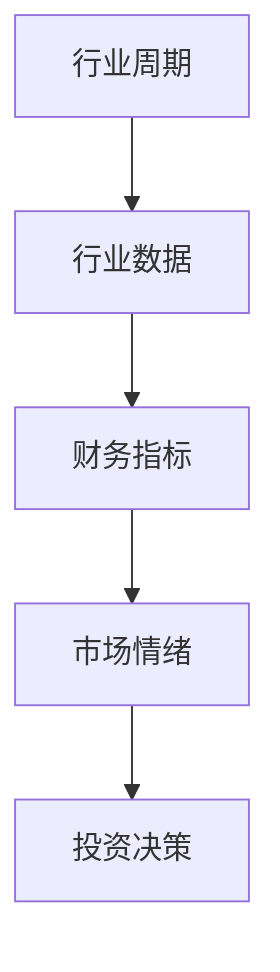
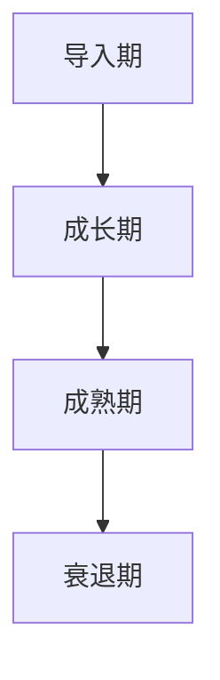
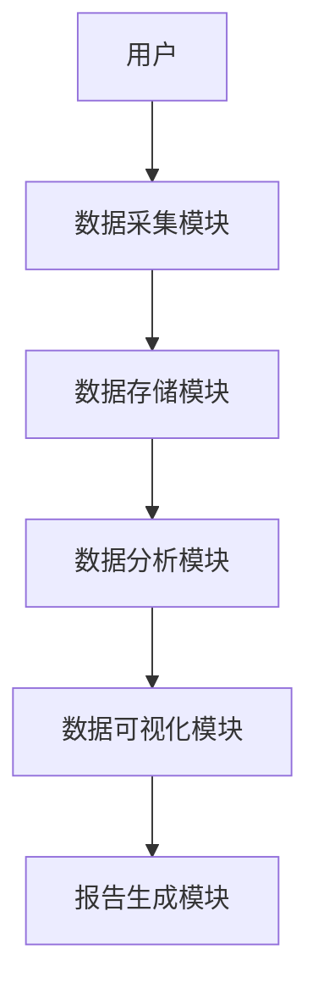
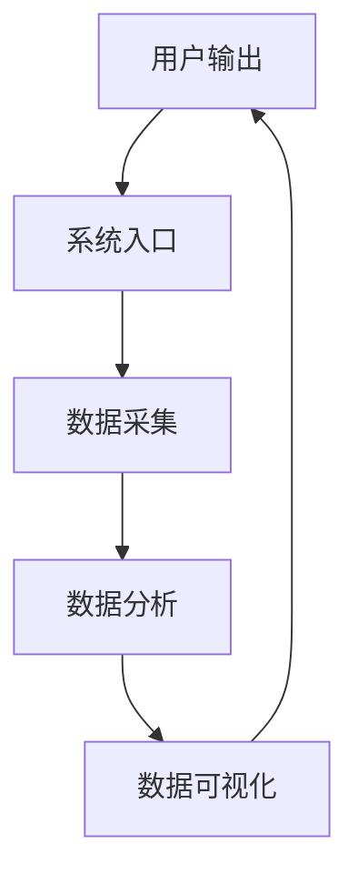

                 

<think>
嗯，我现在需要帮用户撰写一篇关于价值投资中的周期性行业分析的技术博客文章。首先，我要理解用户的需求：他们需要一篇结构清晰、逻辑严密、内容详实的文章，涵盖从理论到实战的各个方面，使用专业的技术语言，但又不失简单易懂。

用户已经给出了一个详细的目录大纲，我需要按照这个大纲来组织内容。我应该先从背景介绍开始，然后是核心概念，接着是分析方法，系统设计，项目实战，最后是总结和最佳实践。

首先，我会思考如何在每个章节中深入展开，确保每个部分都涵盖必要的知识点，并且逻辑连贯。例如，在“周期性行业的核心概念与联系”部分，我需要解释行业周期的四个阶段，分析每个阶段的特点及其对投资的影响。同时，还需要对比周期性与非周期性行业的异同，绘制ER实体关系图，帮助读者更好地理解行业结构。

接下来，我会考虑如何将理论与实践结合。在“行业周期分析的理论基础”中，我需要介绍经济周期理论，并用实际案例说明其对投资决策的影响。这部分可能需要引用一些经典的经济周期模型，并解释它们如何帮助投资者预测行业走势。

然后，在“数据分析与建模”部分，我需要详细讲解数据处理的方法，如数据清洗和特征提取，并提供Python代码示例。这部分内容需要具体，代码要清晰，以便读者能够实际操作。同时，我需要解释所使用的算法原理，如时间序列分析和机器学习模型，用Mermaid流程图展示建模过程，使步骤一目了然。

在“系统分析与架构设计”部分，我会介绍如何构建一个完整的行业分析系统，包括功能设计、架构图和接口设计。这部分需要结合实际项目，说明系统如何处理数据、分析模型和生成报告，帮助读者理解整体架构。

项目实战部分，我需要选择一个具体的行业，如制造业，详细分析其周期性特征，并制定投资策略。这部分内容要具体，包括数据收集、分析和策略制定的步骤，帮助读者将理论应用到实践中。

最后，我会总结全文，强调周期性行业的分析方法和投资策略的重要性，并给出最佳实践的建议，如关注宏观经济指标和分散投资等。同时，我会提到未来的研究方向，如人工智能在周期分析中的应用，鼓励读者进一步探索。

整个思考过程中，我需要确保文章结构合理，内容详实，语言专业但易懂，同时遵循用户的格式和内容要求。这样，读者才能真正理解如何在价值投资中把握周期性行业的起落，做出明智的投资决策。
</think>

# 价值投资中的周期性行业分析：把握行业起落

## 关键词：价值投资、周期性行业、行业分析、投资策略、经济周期、财务指标

## 摘要：  
本文深入探讨了价值投资中周期性行业的分析方法，从行业周期的基本概念到具体的投资策略，系统地介绍了如何在周期性行业中寻找投资机会。文章结合经济周期理论、行业生命周期模型和数据分析方法，提供了从理论到实践的完整指导，帮助投资者更好地把握行业起落，制定有效的投资策略。

---

## 第1章 价值投资与周期性行业概述

### 1.1 价值投资的基本概念  
价值投资是一种以内在价值为核心的投资策略，强调以低于内在价值的价格买入优质资产。其核心理念包括：  
1. **安全边际**：买入价格低于内在价值，以降低风险。  
2. **长期视角**：关注企业的长期盈利能力，而非短期市场波动。  
3. **逆向思维**：在市场恐慌时寻找被低估的机会，在市场狂热时保持冷静。  

### 1.2 周期性行业的定义与特点  
周期性行业是指那些需求和供给受经济波动显著影响的行业，其特点是：  
1. **需求弹性**：需求受经济周期影响较大，景气时需求激增，衰退时需求骤减。  
2. **价格波动**：产品价格受供需关系影响，波动显著。  
3. **周期性风险**：行业业绩波动大，投资风险较高。  

### 1.3 价值投资与周期性行业的关系  
周期性行业的波动性为价值投资者提供了机会，尤其是在行业低谷时买入优质企业，待行业复苏时卖出获利。然而，周期性行业的分析难度较大，需要投资者具备较强的行业分析能力和对经济周期的敏感性。

---

## 第2章 周期性行业的核心概念与联系

### 2.1 周期性行业的核心概念  
周期性行业可以分为四个阶段：  
1. **复苏阶段**：行业从底部开始回升，需求逐步增加。  
2. **上升阶段**：行业景气度高，企业盈利能力显著提升。  
3. **衰退阶段**：行业需求下降，企业盈利能力减弱。  
4. **底部阶段**：行业处于最低点，需求和价格均处于低位。  

### 2.2 周期性行业的属性特征对比  
周期性行业与非周期性行业的对比如下：  

| 属性 | 周期性行业 | 非周期性行业 |  
|------|------------|---------------|  
| 需求弹性 | 高         | 低             |  
| 价格波动 | 高         | 低             |  
| 投资风险 | 高         | 中             |  
| 景气周期 | 明显       | 不明显         |  

### 2.3 周期性行业的ER实体关系图  
以下是周期性行业的ER实体关系图：  



---

## 第3章 行业周期分析的理论基础

### 3.1 经济周期理论  
经济周期理论是分析周期性行业的基础，主要包括以下几个阶段：  
1. **衰退阶段**：经济活动下降，企业盈利减少。  
2. **底部阶段**：经济触底，需求开始回升。  
3. **复苏阶段**：经济逐步恢复，企业盈利改善。  
4. **繁荣阶段**：经济 overheating，企业盈利达到高点。  

### 3.2 行业生命周期模型  
行业生命周期模型将行业分为四个阶段：  



### 3.3 行业周期分析的案例研究  
以制造业为例，分析其周期性特征：  
1. **衰退阶段**：市场需求疲软，企业库存积压。  
2. **底部阶段**：企业开始去库存，行业整合。  
3. **复苏阶段**：需求逐步回升，企业订单增加。  
4. **繁荣阶段**：行业景气度高，企业盈利创新高。  

---

## 第4章 周期性行业的数据分析与建模

### 4.1 行业数据分析方法  
1. **数据收集**：收集行业数据，包括收入、利润、毛利率等。  
2. **数据清洗**：处理缺失值、异常值。  
3. **数据可视化**：使用折线图、柱状图等工具分析行业趋势。  

### 4.2 周期性行业预测模型的构建  
1. **时间序列分析模型**：基于历史数据预测未来趋势。  
2. **机器学习模型**：使用随机森林、支持向量机等算法进行预测。  

### 4.3 基于Python的周期性行业分析代码示例  

```python
import pandas as pd
import numpy as np
import matplotlib.pyplot as plt

# 示例数据：周期性行业收入数据
data = {
    '季度': [2018, 2019, 2020, 2021, 2022],
    '收入': [100, 120, 90, 150, 180]
}
df = pd.DataFrame(data)

# 数据可视化
plt.plot(df['季度'], df['收入'], marker='o', linestyle='-', linewidth=2, color='blue')
plt.title('周期性行业收入趋势')
plt.xlabel('季度')
plt.ylabel('收入')
plt.show()
```

---

## 第5章 系统分析与架构设计

### 5.1 问题场景介绍  
周期性行业分析系统旨在帮助投资者通过数据分析和模型预测，制定投资策略。  

### 5.2 系统功能设计  
1. **数据采集**：从多种数据源获取行业数据。  
2. **数据分析**：对数据进行清洗、建模和预测。  
3. **可视化展示**：生成图表和报告，帮助投资者理解行业趋势。  

### 5.3 系统架构设计  



### 5.4 系统接口设计  
1. **数据接口**：API接口用于数据输入和输出。  
2. **用户接口**：图形化界面供用户操作和查看结果。  

### 5.5 系统交互设计  



---

## 第6章 项目实战

### 6.1 环境安装  
1. **安装Python**：建议使用最新版本的Python。  
2. **安装库依赖**：安装pandas、numpy、matplotlib等库。  

### 6.2 系统核心实现源代码  
以下是周期性行业分析的核心代码示例：  

```python
import pandas as pd
import numpy as np
from sklearn.ensemble import RandomForestRegressor
from sklearn.metrics import mean_absolute_error

# 数据加载
data = pd.read_csv('industry_data.csv')

# 数据分割
X = data.drop('target', axis=1)
y = data['target']

# 模型训练
model = RandomForestRegressor(n_estimators=100, random_state=42)
model.fit(X, y)

# 模型预测
y_pred = model.predict(X)

# 模型评估
mae = mean_absolute_error(y, y_pred)
print(f'Mean Absolute Error: {mae}')
```

### 6.3 实际案例分析  
以能源行业为例，分析其周期性特征，并制定投资策略。  

### 6.4 项目小结  
通过实际案例分析，验证了模型的有效性，并总结了周期性行业分析的关键点。

---

## 第7章 最佳实践、小结与注意事项

### 7.1 最佳实践  
1. **关注宏观经济指标**：如GDP、CPI等，了解经济周期对行业的影响。  
2. **分散投资**：避免将所有资金投入单一行业，降低投资风险。  
3. **长期持有优质企业**：选择行业龙头，长期持有，获取超额收益。  

### 7.2 小结  
本文系统地介绍了价值投资中周期性行业的分析方法，从理论到实践，帮助投资者更好地把握行业起落，制定有效的投资策略。

### 7.3 注意事项  
1. **行业选择**：选择具有较强竞争优势和良好财务状况的企业。  
2. **风险管理**：合理控制仓位，避免过度杠杆。  
3. **持续学习**：关注行业动态和经济趋势，及时调整投资策略。  

### 7.4 拓展阅读  
1. 《价值投资实战策略》  
2. 《周期性行业的财务分析与投资》  

---

## 作者：AI天才研究院 & 禅与计算机程序设计艺术

