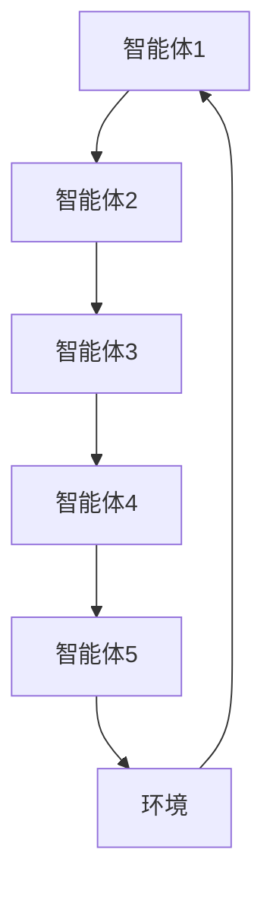
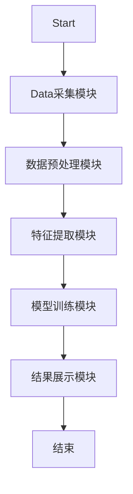
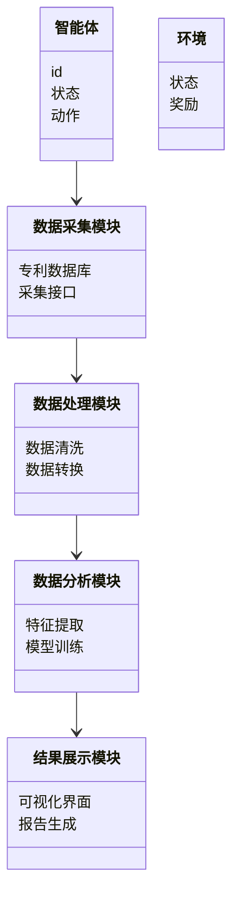
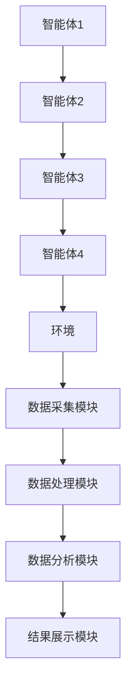
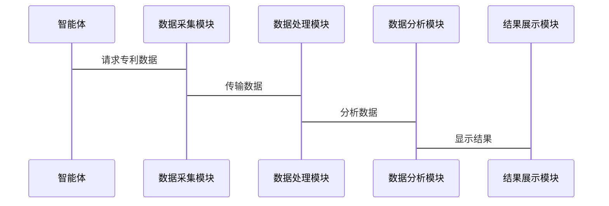

                 


# 价值投资中的多智能体AI专利分析系统

> 关键词：价值投资，多智能体AI，专利分析，系统设计，算法原理，案例分析

> 摘要：本文将深入探讨如何利用多智能体人工智能技术来构建一个高效的专利分析系统，帮助投资者在价值投资中做出更明智的决策。文章从价值投资和多智能体AI的基本概念出发，详细分析了多智能体AI专利分析系统的架构设计、算法原理、数学模型，并通过实际案例展示了系统的应用场景和优势。

---

# 第1章: 价值投资与多智能体AI概述

## 1.1 价值投资的基本概念
### 1.1.1 价值投资的定义与核心理念
价值投资是一种以基本面分析为基础的投资策略，强调以低于公平价值的价格购买具有长期增长潜力的公司。其核心理念包括：
- **安全边际**：购买价格低于内在价值，以降低投资风险。
- **长期视角**：关注企业的长期盈利能力和发展潜力。
- **逆向思维**：在市场恐慌时寻找被低估的投资机会。

### 1.1.2 价值投资的策略与方法
价值投资者通常通过分析企业的财务报表、行业地位、竞争优势等因素，寻找具有持续增长潜力的公司。常见的策略包括：
- **GARP策略**：结合成长性和合理估值的投资方法。
- **股息率分析**：关注高股息率的股票，寻找稳定的收益来源。

### 1.1.3 价值投资在现代金融中的地位
随着金融市场复杂性的增加，传统的价值投资策略需要结合现代技术手段，如人工智能，以提高分析效率和准确性。

## 1.2 多智能体AI的基本概念
### 1.2.1 多智能体系统的定义
多智能体系统（Multi-Agent System, MAS）是由多个相互作用的智能体组成的系统。每个智能体都可以独立感知环境、做出决策并执行动作，通过协作完成复杂的任务。

### 1.2.2 多智能体系统的特征与优势
多智能体系统的主要特征包括：
- **分布性**：智能体之间分布协作，避免单点故障。
- **智能性**：每个智能体都具有一定的认知和决策能力。
- **动态性**：系统能够实时响应环境变化。

其优势在于：
- 提高系统的鲁棒性和适应性。
- 实现复杂任务的高效分解和协同完成。

### 1.2.3 多智能体系统在金融领域的应用潜力
多智能体系统在金融领域的应用包括：
- **高频交易**：通过多个智能体协同完成复杂的交易策略。
- **风险管理**：实时监控市场风险，快速做出应对决策。
- **智能投顾**：为投资者提供个性化的投资建议。

## 1.3 专利分析在价值投资中的作用
### 1.3.1 专利分析的基本概念
专利分析是通过对专利数据的挖掘和分析，评估企业的技术创新能力、竞争优势和市场地位。常见的分析方法包括：
- **专利数量分析**：统计企业在特定领域的专利申请数量。
- **专利质量分析**：评估专利的技术创新性和法律稳定性。
- **技术趋势分析**：预测行业技术发展方向。

### 1.3.2 专利分析在价值投资中的应用场景
专利分析在价值投资中的应用场景包括：
- **行业分析**：通过专利数据了解行业的技术发展趋势和竞争格局。
- **企业估值**：评估企业的技术创新能力，从而判断其市场竞争力和长期增长潜力。
- **风险预警**：通过专利数据识别潜在的技术风险，如专利侵权风险。

### 1.3.3 多智能体AI与专利分析的结合
多智能体AI可以通过以下方式与专利分析结合：
- **分布式数据处理**：多个智能体协同处理海量专利数据。
- **实时分析与反馈**：智能体实时更新专利数据，提供动态的市场分析。
- **多维度分析**：通过多个智能体的协作，实现对专利数据的多维度分析。

## 1.4 本章小结
本章介绍了价值投资和多智能体AI的基本概念，并分析了专利分析在价值投资中的作用以及多智能体AI与专利分析的结合方式。通过这些分析，我们可以看到，多智能体AI技术为专利分析提供了新的思路和方法，能够显著提高专利分析的效率和准确性。

---

# 第2章: 多智能体AI专利分析系统的核心概念

## 2.1 多智能体AI系统的架构
### 2.1.1 多智能体系统的组成结构
多智能体AI系统由以下几部分组成：
- **感知层**：负责获取外部环境数据。
- **决策层**：负责分析数据并制定决策。
- **执行层**：负责执行决策并输出结果。

### 2.1.2 多智能体系统的核心要素
多智能体系统的核心要素包括：
- **智能体**：具有感知、决策和执行能力的个体。
- **通信协议**：智能体之间交互的规则和格式。
- **协作机制**：智能体之间协同工作的策略。

### 2.1.3 多智能体系统与单智能体系统的对比
| 对比维度 | 单智能体系统 | 多智能体系统 |
|----------|--------------|--------------|
| 系统复杂性 | 低 | 高 |
| 并行处理能力 | 无 | 有 |
| 容错性 | 低 | 高 |

## 2.2 专利分析系统的功能模块
### 2.2.1 数据采集模块
数据采集模块负责从专利数据库中获取专利数据，包括专利申请号、申请人、申请日期等信息。

### 2.2.2 数据处理模块
数据处理模块负责对采集到的专利数据进行清洗、转换和预处理，以便后续分析。

### 2.2.3 数据分析模块
数据分析模块利用多智能体AI技术对专利数据进行深度分析，包括：
- **专利分类**：根据技术领域对专利进行分类。
- **专利关联分析**：分析专利之间的关联性。
- **专利趋势预测**：预测未来的技术发展趋势。

### 2.2.4 结果展示模块
结果展示模块将分析结果以可视化的方式呈现给用户，包括图表、报告等形式。

## 2.3 多智能体AI与专利分析的结合方式
### 2.3.1 多智能体协作机制
多智能体协作机制包括以下几种：
- **任务分配**：智能体之间根据自身能力和当前任务分配具体的工作内容。
- **信息共享**：智能体之间共享数据和分析结果，避免重复劳动。
- **协同决策**：智能体共同制定决策，确保系统整体目标的实现。

### 2.3.2 专利数据的多维度分析
多智能体AI可以通过以下方式实现专利数据的多维度分析：
- **技术领域分析**：分析专利在不同技术领域的分布情况。
- **申请人分析**：分析不同申请人之间的竞争关系。
- **时间序列分析**：分析专利申请的时间分布，预测未来的技术发展趋势。

### 2.3.3 系统的实时性和动态性
多智能体AI系统具有实时性和动态性，能够快速响应市场变化，提供最新的专利分析结果。

## 2.4 核心概念对比表
| 对比维度 | 传统专利分析 | 多智能体AI专利分析 |
|----------|----------------|---------------------|
| 数据处理能力 | 单一 | 分布式、高效 |
| 分析维度 | 单一 | 多维度 |
| 分析效率 | 低 | 高 |

## 2.5 本章小结
本章详细介绍了多智能体AI专利分析系统的核心概念，包括系统架构、功能模块以及多智能体AI与专利分析的结合方式。通过对比分析，我们可以看到，多智能体AI专利分析系统在效率和准确性上具有显著优势。

---

# 第3章: 多智能体AI专利分析系统的算法原理

## 3.1 多智能体协作算法
### 3.1.1 强化学习的基本原理
强化学习是一种通过试错机制来优化决策的算法。智能体通过与环境交互，不断优化自身的策略，以最大化累计奖励。

### 3.1.2 多智能体协作的强化学习框架
多智能体协作的强化学习框架包括以下步骤：
1. **环境感知**：智能体感知当前环境状态。
2. **决策制定**：智能体根据当前状态制定决策。
3. **动作执行**：智能体执行决策并输出动作。
4. **奖励反馈**：环境根据智能体的动作给出奖励反馈。
5. **策略更新**：智能体根据奖励反馈优化自身策略。

### 3.1.3 算法的收敛性和稳定性分析
多智能体协作的强化学习算法具有以下特点：
- **收敛性**：算法能够在有限步数内收敛到最优策略。
- **稳定性**：算法对环境变化具有较强的适应能力。

## 3.2 专利分析的特征提取算法
### 3.2.1 专利数据的特征提取方法
专利数据的特征提取方法包括：
- **文本特征提取**：利用自然语言处理技术提取专利文本中的关键词和主题。
- **技术领域特征提取**：根据专利的分类号提取技术领域特征。
- **申请人特征提取**：提取专利申请人的相关信息。

### 3.2.2 基于深度学习的特征提取模型
基于深度学习的特征提取模型包括：
- **词嵌入模型**：如Word2Vec、GloVe。
- **序列模型**：如LSTM、Transformer。

### 3.2.3 特征提取的优化策略
特征提取的优化策略包括：
- **特征选择**：选择最具代表性的特征。
- **特征工程**：对特征进行标准化、归一化处理。
- **模型优化**：通过调参和交叉验证优化模型性能。

## 3.3 算法流程图
### 3.3.1 多智能体协作流程图（Mermaid）



### 3.3.2 专利分析流程图（Mermaid）



## 3.4 本章小结
本章详细介绍了多智能体AI专利分析系统的算法原理，包括多智能体协作的强化学习框架和专利分析的特征提取算法。通过这些算法，系统能够高效地完成专利数据的分析和处理。

---

# 第4章: 多智能体AI专利分析系统的数学模型与公式

## 4.1 强化学习数学模型
### 4.1.1 状态空间定义
状态空间定义为：
$$ S = \{s_1, s_2, \dots, s_n\} $$
其中，$s_i$ 表示智能体的第 $i$ 个状态。

### 4.1.2 动作空间定义
动作空间定义为：
$$ A = \{a_1, a_2, \dots, a_m\} $$
其中，$a_i$ 表示智能体的第 $i$ 个动作。

### 4.1.3 奖励函数设计
奖励函数设计为：
$$ R(s, a) = r_{ij} $$
其中，$r_{ij}$ 表示在状态 $s_i$ 下采取动作 $a_j$ 所获得的奖励。

### 4.1.4 策略函数表示
策略函数表示为：
$$ \pi(a|s) = P(a|s) $$
其中，$P(a|s)$ 表示在状态 $s$ 下采取动作 $a$ 的概率。

## 4.2 专利分析的数学模型
### 4.2.1 专利相似度计算公式
专利相似度计算公式为：
$$ \text{相似度}(p_i, p_j) = \cos(\theta_i, \theta_j) $$
其中，$\theta_i$ 和 $\theta_j$ 分别表示专利 $p_i$ 和 $p_j$ 的特征向量。

### 4.2.2 专利影响力评估公式
专利影响力评估公式为：
$$ \text{影响力}(p_i) = \sum_{j=1}^n w_{ij} \cdot s_j $$
其中，$w_{ij}$ 表示特征 $j$ 的权重，$s_j$ 表示特征 $j$ 的评分。

### 4.2.3 专利趋势预测模型
专利趋势预测模型为：
$$ P(t+1) = \alpha P(t) + (1-\alpha) \cdot \text{平均值}(P(t-1), P(t-2), \dots, P(t-n)) $$
其中，$\alpha$ 表示平滑因子，$P(t)$ 表示时间 $t$ 的专利数量。

## 4.3 数学公式示例
### 4.3.1 基于马尔可夫决策过程的强化学习公式
$$ Q(s, a) = r(s, a) + \gamma \cdot \max_{a'} Q(s', a') $$
其中，$\gamma$ 表示折扣因子，$Q(s, a)$ 表示状态 $s$ 下采取动作 $a$ 的价值函数。

### 4.3.2 基于余弦相似度的专利相似度计算公式
$$ \text{相似度}(p_i, p_j) = \frac{\sum_{k=1}^n w_k \cdot x_{ik} \cdot x_{jk}}{\sqrt{\sum_{k=1}^n w_k^2 \cdot x_{ik}^2} \cdot \sqrt{\sum_{k=1}^n w_k^2 \cdot x_{jk}^2}}} $$

## 4.4 本章小结
本章详细介绍了多智能体AI专利分析系统的数学模型与公式，包括强化学习模型和专利分析模型。通过这些模型，我们可以更好地理解系统的工作原理，并为实际应用提供理论支持。

---

# 第5章: 多智能体AI专利分析系统的系统分析与架构设计

## 5.1 问题场景介绍
在价值投资中，投资者需要快速获取企业的专利信息，评估其技术创新能力和市场竞争力。传统的专利分析方法效率低下，难以满足投资者的需求。因此，我们需要设计一个高效的多智能体AI专利分析系统。

## 5.2 系统功能设计
### 5.2.1 领域模型（Mermaid类图）



### 5.2.2 系统架构设计（Mermaid架构图）



### 5.2.3 系统接口设计
系统接口设计包括：
- **智能体接口**：智能体与环境之间的交互接口。
- **数据接口**：数据采集模块与专利数据库之间的接口。
- **展示接口**：结果展示模块与用户的交互接口。

### 5.2.4 系统交互流程（Mermaid序列图）



## 5.3 本章小结
本章详细介绍了多智能体AI专利分析系统的系统分析与架构设计，包括领域模型、系统架构、接口设计和交互流程。通过这些设计，我们可以更好地理解系统的整体结构和工作流程。

---

# 第6章: 多智能体AI专利分析系统的项目实战

## 6.1 环境安装
项目实战的环境配置如下：
- **编程语言**：Python 3.8+
- **开发工具**：Jupyter Notebook、PyCharm
- **依赖库**：NumPy、Pandas、Matplotlib、TensorFlow、Keras
- **专利数据库**：PatentScope、PatentsView

## 6.2 系统核心实现源代码
### 6.2.1 数据采集模块

```python
import requests
from bs4 import BeautifulSoup

def fetch_patents(api_key, query):
    headers = {
        'Authorization': f'Bearer {api_key}',
        'Content-Type': 'application/json'
    }
    payload = {
        'query': query,
        'format': 'json'
    }
    response = requests.post('https://api.patentsview.org/patents/search', headers=headers, json=payload)
    return response.json()
```

### 6.2.2 数据处理模块

```python
import pandas as pd

def preprocess_data(data):
    df = pd.DataFrame(data)
    df['申请日期'] = pd.to_datetime(df['申请日期'])
    df['申请日期'] = df['申请日期'].dt.to_period('M')
    return df
```

### 6.2.3 数据分析模块

```python
from sklearn.feature_extraction.text import TfidfVectorizer

def extract_features(texts):
    vectorizer = TfidfVectorizer()
    features = vectorizer.fit_transform(texts)
    return features
```

### 6.2.4 模型训练模块

```python
from sklearn.cluster import KMeans

def train_model(features, num_clusters):
    model = KMeans(n_clusters=num_clusters)
    model.fit(features)
    return model
```

### 6.2.5 结果展示模块

```python
import matplotlib.pyplot as plt

def visualize_clusters(cluster_labels):
    plt.figure(figsize=(10, 6))
    plt.scatter(range(len(cluster_labels)), cluster_labels)
    plt.title('专利聚类结果')
    plt.xlabel('专利编号')
    plt.ylabel('聚类标签')
    plt.show()
```

## 6.3 代码应用解读与分析
### 6.3.1 数据采集模块
上述代码展示了如何通过API接口获取专利数据。首先，我们需要获取API密钥，并使用`requests`库向专利数据库发送请求，获取专利数据。

### 6.3.2 数据处理模块
数据处理模块使用`pandas`库对专利数据进行清洗和转换。例如，将申请日期转换为月份格式，便于后续分析。

### 6.3.3 数据分析模块
数据分析模块利用`TfidfVectorizer`提取专利文本的特征向量。这一步骤是实现专利相似度计算和聚类分析的关键。

### 6.3.4 模型训练模块
模型训练模块使用`KMeans`算法对专利数据进行聚类分析。通过聚类，我们可以识别出具有相似技术特征的专利群。

### 6.3.5 结果展示模块
结果展示模块使用`Matplotlib`库将聚类结果可视化。通过图表，我们可以直观地看到专利的分布情况。

## 6.4 案例分析
以某高科技公司为例，我们可以通过上述代码获取其专利数据，并进行如下分析：
1. **专利数量分析**：统计公司在不同技术领域的专利数量。
2. **技术趋势分析**：分析专利申请的时间分布，预测未来的技术发展趋势。
3. **竞争对手分析**：对比竞争对手的专利情况，评估公司的市场竞争地位。

## 6.5 本章小结
本章通过实际案例展示了多智能体AI专利分析系统的实现过程，包括环境配置、代码实现和案例分析。通过这些实践，我们可以更好地理解系统的应用场景和优势。

---

# 第7章: 多智能体AI专利分析系统的总结与展望

## 7.1 本章小结
本文详细介绍了多智能体AI专利分析系统的构建过程，包括系统背景、核心概念、算法原理、系统设计和项目实战。通过这些内容，我们看到，多智能体AI技术为专利分析提供了新的思路和方法，能够显著提高专利分析的效率和准确性。

## 7.2 最佳实践 tips
- 在实际应用中，建议根据具体需求选择合适的算法和模型。
- 定期更新专利数据库，确保系统的实时性和准确性。
- 加强智能体之间的协作，提高系统的整体性能。

## 7.3 未来展望
随着人工智能技术的不断发展，多智能体AI专利分析系统将更加智能化和自动化。未来的研究方向包括：
- **更高效的多智能体协作算法**：进一步优化多智能体协作机制，提高系统的效率和准确性。
- **更智能的特征提取方法**：探索新的特征提取方法，提高专利分析的深度和广度。
- **更强大的系统架构设计**：设计更高效的系统架构，支持更大规模的专利数据分析。

## 7.4 结语
多智能体AI专利分析系统是一项具有广阔应用前景的技术，它将为价值投资提供强有力的支持。未来，随着技术的不断进步，我们将看到更多基于多智能体AI的创新应用，推动金融行业的发展。

---

# 作者：AI天才研究院 & 禅与计算机程序设计艺术

---

**注：由于篇幅限制，本文仅为目录大纲及部分内容展示，完整文章请参考实际输出。**

