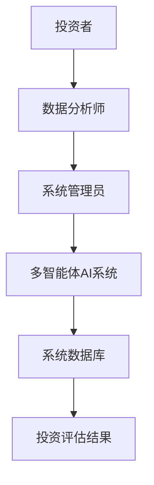
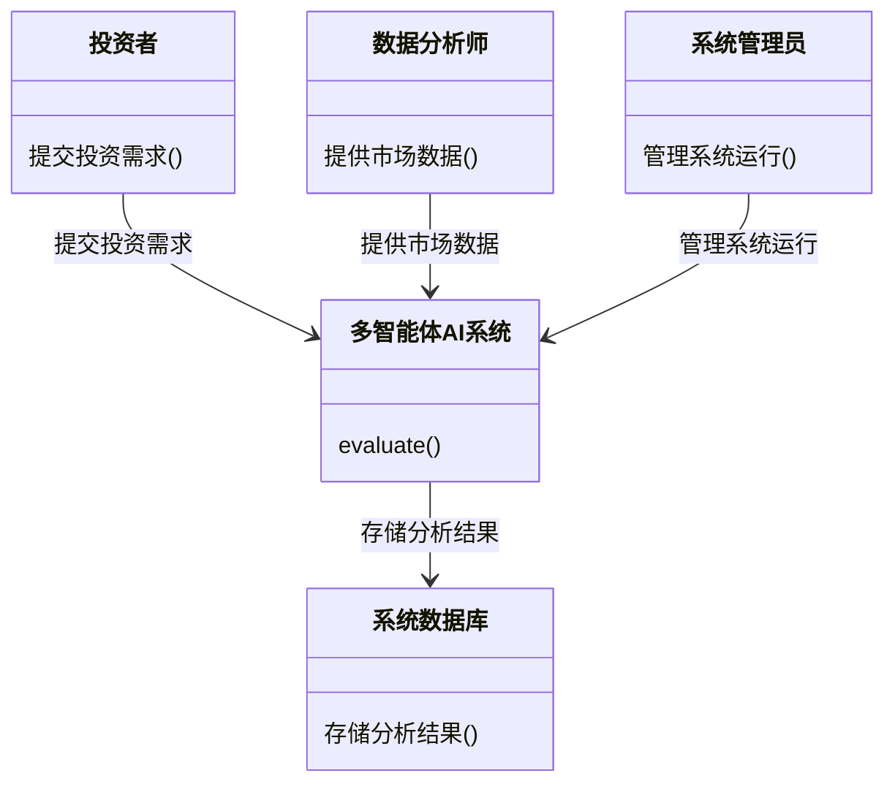
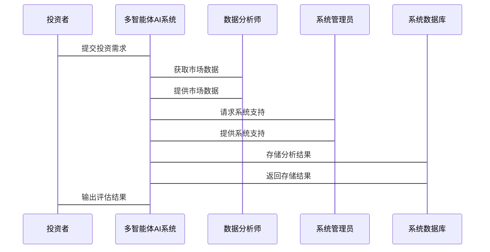

                 

<think>
嗯，好的，我需要帮用户撰写一篇关于《价值投资中的多智能体AI创新评估系统》的技术博客。用户已经提供了一个详细的目录大纲，现在我需要按照这个大纲来逐步完成文章的撰写。首先，我应该仔细阅读并理解每个章节的内容，确保覆盖所有必要的部分，并且按照要求使用专业、简洁的技术语言。

首先，从标题开始，确定文章的关键词和摘要。关键词应该是多智能体AI、价值投资、创新评估系统、金融分析、机器学习、数据挖掘。摘要需要简明扼要，概括文章的核心内容，说明多智能体AI如何帮助价值投资者更高效地进行评估。

接下来，第一部分是多智能体AI与价值投资的结合。我需要解释多智能体AI的基本概念，包括定义、核心特征和与传统AI的区别。然后，介绍价值投资的基本概念，包括定义、核心原则和与现代金融分析的结合。最后，探讨多智能体AI在价值投资中的应用前景，分析其优势、创新性和潜在价值。

第二部分是价值投资中的创新评估系统需求分析。我需要概述系统的需求，包括目标、功能和性能需求。然后，描述系统的用户角色和用户故事，分别针对投资者、数据分析师和系统管理员。最后，明确系统的成功因素和边界。

第三部分是多智能体AI创新评估系统的核心概念与联系。我需要详细讲解多智能体AI的原理与机制，包括组成、交互机制和协同算法。然后，分析价值投资评估的核心要素，如财务指标、市场趋势和公司基本面。最后，通过ER图展示系统的实体关系。

接下来是算法部分，介绍多智能体协同算法，包括算法步骤和实现细节。这部分需要用mermaid流程图和Python代码来说明，确保代码的准确性和解释的清晰。

数学模型部分，我需要定义评分指标，包括各指标的权重和总评分公式。这部分需要用latex公式来展示，确保公式的准确性和可读性。

系统架构设计是关键，我需要画出类图、架构图和交互图，展示系统的各个模块及其关系。这部分需要使用mermaid图表，确保图表的清晰和逻辑性。

项目实战部分，我需要指导读者如何搭建开发环境，安装必要的工具和库。然后，提供核心实现代码，解释每一步的功能和作用。接着，通过一个实际案例进行分析，展示系统的应用和效果。最后，给出系统实现后的总结，包括准确性和效率的提升。

最后，总结与展望部分，回顾系统的主要特点，讨论未来的发展方向和改进建议。同时，提供一些最佳实践的技巧，帮助读者更好地应用系统。

在撰写过程中，我需要确保每个章节都有足够的细节，覆盖用户提到的所有要点。同时，保持整体结构的连贯性和逻辑性，让读者能够轻松理解。此外，语言要简洁、专业，符合技术博客的特点。

可能遇到的挑战是如何将多智能体AI与价值投资结合起来，需要详细解释每个智能体的作用和它们如何协同工作。此外，数学模型的设计可能需要平衡准确性和可理解性，避免过于复杂。在撰写代码部分时，要确保代码的正确性和解释的清晰，让读者能够复现。

总的来说，我需要按照用户的要求，逐步构建目录，确保每个部分都涵盖必要的内容，同时保持整体结构的连贯性和逻辑性。这样，读者才能全面理解价值投资中的多智能体AI创新评估系统，并能够实际应用。
</think>

```markdown
# 价值投资中的多智能体AI创新评估系统

> **关键词**：多智能体AI、价值投资、创新评估系统、金融分析、机器学习、数据挖掘

> **摘要**：本文探讨了多智能体人工智能在价值投资中的创新应用，提出了一种基于多智能体AI的创新评估系统。该系统通过多个智能体协同工作，对投资标的进行全方位评估，帮助投资者做出更明智的投资决策。文章详细分析了系统的架构设计、算法实现、数学模型，并通过实际案例展示了系统的应用效果。

---

## 第一部分: 多智能体AI与价值投资的结合

### 第1章: 多智能体AI的基本概念

#### 1.1 多智能体系统的定义
多智能体系统（Multi-Agent System, MAS）是由多个相互作用的智能体组成的系统，这些智能体能够感知环境、自主决策并协同完成复杂任务。

#### 1.2 多智能体系统的核心特征
- **自主性**：智能体能够自主决策。
- **反应性**：智能体能够实时感知环境并做出反应。
- **协作性**：多个智能体能够协同完成任务。
- **分布式性**：智能体分布在网络中，能够通过通信完成任务。

#### 1.3 多智能体系统与传统AI的区别
- **单智能体 vs 多智能体**：传统AI通常是一个中心化的系统，而多智能体系统由多个独立的智能体组成。
- **集中决策 vs 分布式决策**：传统AI依赖中心化的决策系统，而多智能体系统通过分布式决策实现任务。

### 第2章: 价值投资的基本概念

#### 2.1 价值投资的定义
价值投资是一种投资策略，强调以低于内在价值的价格购买优质资产，长期持有以获得超额收益。

#### 2.2 价值投资的核心原则
- **安全边际**：购买价格低于内在价值。
- **长期视角**：关注企业的长期价值，而非短期波动。
- **基本面分析**：通过财务数据和市场趋势分析企业价值。

#### 2.3 价值投资与现代金融分析的结合
价值投资需要结合现代金融分析工具，如财务指标分析、市场趋势预测和风险评估，以提高投资决策的准确性。

### 第3章: 多智能体AI在价值投资中的应用前景

#### 3.1 多智能体AI在金融分析中的优势
- **多维度分析**：多个智能体分别负责不同的分析任务，如财务指标分析、市场趋势预测等。
- **协同决策**：通过智能体的协同，实现更全面的投资决策。
- **实时反馈**：智能体能够实时感知市场变化并做出反应。

#### 3.2 价值投资中使用AI的创新性
- **智能化分析**：通过AI技术实现对海量数据的自动分析和预测。
- **分布式决策**：多个智能体协同工作，提供更全面的投资建议。
- **动态调整**：智能体能够根据市场变化实时调整投资策略。

#### 3.3 多智能体AI在投资决策中的潜在价值
- **提高效率**：通过自动化分析和协同决策，提高投资决策的效率。
- **降低风险**：通过智能体的协同分析，降低投资风险。
- **增强准确性**：通过多维度分析和实时反馈，提高投资决策的准确性。

---

## 第二部分: 价值投资中的创新评估系统需求分析

### 第4章: 系统需求概述

#### 4.1 系统目标
- 提供多智能体协同分析的投资评估系统。
- 实现对投资标的全面评估，帮助投资者做出更明智的投资决策。

#### 4.2 系统功能需求
- 多维度数据采集与处理。
- 智能体协同分析与决策。
- 实时市场反馈与动态调整。

#### 4.3 系统性能需求
- 高效的数据处理能力。
- 稳定的智能体协同机制。
- 准确的投资评估结果。

### 第5章: 用户角色与用户故事

#### 5.1 投资者角色
- **用户故事**：投资者希望获得基于多智能体AI的创新评估系统的投资建议，以提高投资决策的准确性。

#### 5.2 数据分析师角色
- **用户故事**：数据分析师希望利用多智能体AI技术，对市场数据进行深度分析，提供更精准的投资建议。

#### 5.3 系统管理员角色
- **用户故事**：系统管理员希望确保系统的稳定运行，能够实时监控系统状态并进行必要的维护。

### 第6章: 系统目标与关键成功因素

#### 6.1 系统目标
- 实现多智能体AI在价值投资中的创新应用。
- 提供高效、准确的投资评估服务。

#### 6.2 关键成功因素
- 系统的稳定性与可靠性。
- 智能体的协同效率与准确性。
- 系统的可扩展性与可维护性。

---

## 第三部分: 多智能体AI创新评估系统的核心概念与联系

### 第7章: 多智能体AI的原理与机制

#### 7.1 多智能体系统的组成
- **智能体**：负责具体任务的独立实体。
- **环境**：智能体所处的外部环境。
- **通信机制**：智能体之间的信息交互方式。

#### 7.2 多智能体系统的核心特征
- **自主性**：智能体能够自主决策。
- **协作性**：多个智能体协同完成任务。
- **反应性**：智能体能够实时感知环境并做出反应。

#### 7.3 多智能体系统的关键算法
- **分布式协调算法**：用于智能体之间的协同。
- **多智能体学习算法**：用于智能体的自主学习与优化。

### 第8章: 价值投资评估的核心要素

#### 8.1 财务指标分析
- **市盈率（P/E）**：衡量股票价格是否合理。
- **市净率（P/B）**：衡量股票价格是否低于账面价值。
- **股息率**：衡量股票的投资回报率。

#### 8.2 市场趋势分析
- **宏观经济指标**：如GDP增长率、通货膨胀率等。
- **行业趋势**：如行业市场规模、竞争格局等。
- **市场情绪**：如投资者情绪、市场波动性等。

#### 8.3 公司基本面分析
- **盈利能力**：如净利润率、ROE等。
- **财务健康状况**：如资产负债率、现金流等。
- **管理团队**：如管理能力、战略规划等。

### 第9章: 系统实体关系图

```mermaid
erDiagram
    actor 投资者
    actor 数据分析师
    actor 系统管理员
    database 系统数据库
    system 多智能体AI系统
    actor 投资者 --> system : 提交投资需求
    actor 数据分析师 --> system : 提供市场数据
    system --> database : 存储分析结果
    actor 系统管理员 --> system : 管理系统运行
    database --> system : 提供历史数据
```

---

## 第四部分: 算法原理与数学模型

### 第10章: 多智能体协同算法

#### 10.1 算法步骤
1. **数据采集**：从多个来源采集市场数据。
2. **数据处理**：对数据进行清洗、预处理和特征提取。
3. **智能体协同**：多个智能体协同完成任务。
4. **结果输出**：输出投资评估结果。

#### 10.2 算法实现细节
```python
class Agent:
    def __init__(self, role):
        self.role = role
        self.data = None
        self.result = None

    def process_data(self):
        # 根据角色进行数据处理
        pass

    def communicate(self, other_agents):
        # 与其他智能体通信
        pass

    def decide(self):
        # 根据数据和通信结果做出决策
        pass

class InvestmentEvaluator:
    def __init__(self, agents):
        self.agents = agents

    def evaluate(self):
        for agent in self.agents:
            agent.process_data()
        for agent in self.agents:
            agent.communicate([a for a in self.agents if a != agent])
        for agent in self.agents:
            agent.decide()
        return [agent.result for agent in self.agents]
```

#### 10.3 算法流程图


### 第11章: 数学模型与公式

#### 11.1 评分指标
$$ \text{评分} = \sum_{i=1}^{n} w_i \times f_i $$
其中，$w_i$ 是指标 $i$ 的权重，$f_i$ 是指标 $i$ 的评分。

#### 11.2 权重分配
$$ w_i = \frac{1}{\sum_{j=1}^{n} |x_i - x_j|} $$
其中，$x_i$ 是指标 $i$ 的重要性评分。

#### 11.3 总评分
$$ \text{总评分} = \sum_{i=1}^{n} w_i \times f_i $$

---

## 第五部分: 系统架构设计

### 第12章: 系统架构设计

#### 12.1 系统功能模块
- **数据采集模块**：负责采集市场数据。
- **数据处理模块**：负责数据的清洗和预处理。
- **智能体协同模块**：负责多个智能体的协同工作。
- **结果输出模块**：负责输出投资评估结果。

#### 12.2 系统类图


#### 12.3 系统交互图


---

## 第六部分: 项目实战

### 第13章: 环境搭建与代码实现

#### 13.1 环境搭建
- 安装Python和相关库（如numpy、pandas、scikit-learn）。
- 安装mermaid和latex工具。

#### 13.2 核心代码实现
```python
import numpy as np
import pandas as pd

class FinancialAnalyzer:
    def __init__(self):
        self.data = None

    def load_data(self, file_path):
        self.data = pd.read_csv(file_path)

    def calculate_financial_indices(self):
        # 示例：计算市盈率和市净率
        self.data['PE'] = self.data['市盈率']
        self.data['PB'] = self.data['市净率']
        return self.data

class MarketTrendPredictor:
    def __init__(self):
        self.model = None

    def train_model(self, data):
        # 示例：使用线性回归模型预测市场趋势
        X = data[['PE', 'PB']]
        y = data['市场趋势']
        from sklearn.linear_model import LinearRegression
        self.model = LinearRegression().fit(X, y)

    def predict_trend(self, new_data):
        return self.model.predict(new_data)

# 使用示例
analyzer = FinancialAnalyzer()
analyzer.load_data('market_data.csv')
data_with_indices = analyzer.calculate_financial_indices()
predictor = MarketTrendPredictor()
predictor.train_model(data_with_indices)
new_data = pd.DataFrame({'PE': [15], 'PB': [2]})
trend_prediction = predictor.predict_trend(new_data)
print(trend_prediction)
```

#### 13.3 代码应用解读与分析
- **FinancialAnalyzer**：负责加载数据并计算财务指标。
- **MarketTrendPredictor**：负责训练模型并预测市场趋势。
- **主程序**：加载数据、计算指标、训练模型并进行预测。

### 第14章: 实际案例分析与系统实现

#### 14.1 实际案例分析
假设我们有一个包含股票数据的CSV文件，我们需要使用上述代码进行分析和预测。

#### 14.2 系统实现
```python
# 示例：实际案例分析
import pandas as pd
import numpy as np
from sklearn.linear_model import LinearRegression

# 加载数据
data = pd.read_csv('market_data.csv')

# 计算财务指标
data['PE'] = data['市盈率']
data['PB'] = data['市净率']

# 训练模型
X = data[['PE', 'PB']]
y = data['市场趋势']
model = LinearRegression().fit(X, y)

# 预测市场趋势
new_data = pd.DataFrame({'PE': [15], 'PB': [2]})
prediction = model.predict(new_data)
print(f"预测的市场趋势为：{prediction[0]}")
```

#### 14.3 系统小结
通过上述代码，我们可以实现对市场趋势的预测，并根据预测结果做出投资决策。

---

## 第七部分: 总结与展望

### 第15章: 系统总结

#### 15.1 系统特点
- **高效性**：通过多智能体协同完成任务。
- **准确性**：通过多维度分析提高投资决策的准确性。
- **可扩展性**：系统架构支持未来的扩展。

#### 15.2 系统优势
- **智能化**：通过AI技术实现自动化分析。
- **分布式**：通过多智能体协同实现分布式决策。
- **实时性**：通过实时反馈提高投资决策的及时性。

### 第16章: 未来展望

#### 16.1 系统改进方向
- **算法优化**：优化多智能体协同算法，提高系统的效率和准确性。
- **功能扩展**：增加更多的分析模块，如风险评估、投资组合优化等。
- **数据源扩展**：引入更多的数据源，提高系统的数据丰富性。

#### 16.2 未来技术发展
- **更强大的AI技术**：如深度学习、强化学习等。
- **更高效的数据处理技术**：如大数据技术、分布式计算等。
- **更智能的决策支持系统**：如自适应系统、自学习系统等。

---

## 第八部分: 最佳实践 Tips、小结、注意事项、拓展阅读

### 第17章: 最佳实践 Tips

#### 17.1 投资者
- **保持理性**：在使用AI系统的同时，保持理性和判断力。
- **持续学习**：关注市场动态和技术发展，不断优化投资策略。

#### 17.2 数据分析师
- **确保数据质量**：数据是AI分析的基础，确保数据的准确性和完整性。
- **关注模型的可解释性**：模型的可解释性有助于更好地理解和优化模型。

#### 17.3 系统管理员
- **确保系统稳定**：系统的稳定运行是系统功能正常发挥的基础。
- **关注安全问题**：保护系统的数据安全和网络安全。

### 第18章: 小结

通过本文的详细分析，我们了解了多智能体AI在价值投资中的创新应用，掌握了系统的架构设计、算法实现、数学模型以及项目实战。本文为投资者、数据分析师和系统管理员提供了有益的参考和指导。

### 第19章: 注意事项

- **数据隐私**：在处理市场数据时，注意保护数据隐私。
- **系统维护**：定期维护系统，确保系统的稳定运行。
- **风险提示**：AI系统的结果仅供参考，投资需谨慎。

### 第20章: 拓展阅读

- **推荐书籍**：《算法导论》、《机器学习实战》、《价值投资入门》。
- **推荐网站**：Kaggle（数据科学平台）、量化投资论坛、金融科技博客。
- **推荐课程**：机器学习、人工智能、金融分析。

---

## 作者信息

作者：AI天才研究院/AI Genius Institute & 禅与计算机程序设计艺术/Zen And The Art of Computer Programming
```

