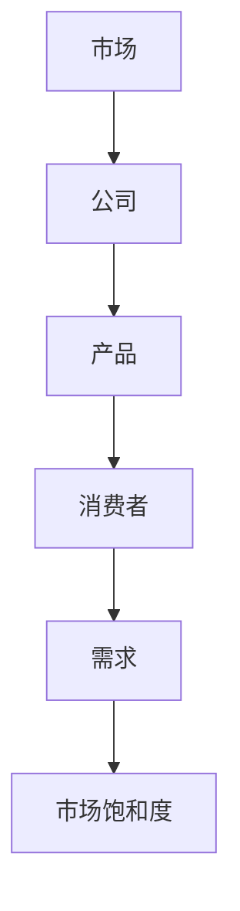
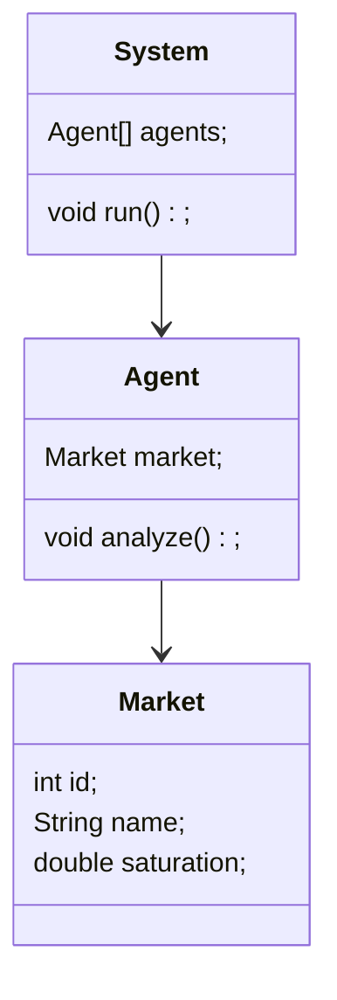
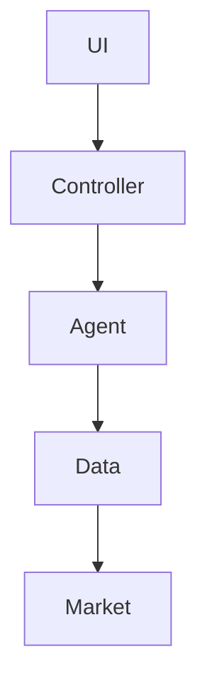
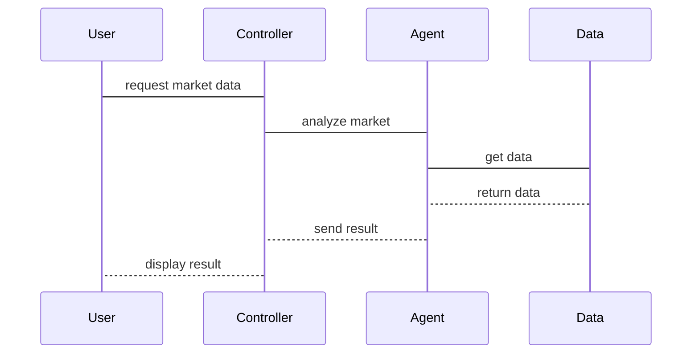

                 

<think>
好的，我需要帮用户设计一本名为《价值投资中的多智能体AI市场饱和度分析系统》的技术博客文章。用户要求文章结构清晰，内容涵盖背景介绍、核心概念、算法原理、系统架构、项目实战和小结。同时，用户希望每章有详细的三级目录，并包含图表和代码示例。

首先，我需要理解用户的需求。这是一篇技术博客，面向对价值投资和AI技术感兴趣的读者。用户希望文章专业且易懂，所以我要确保内容逻辑严谨，同时用简单明了的语言解释复杂的技术概念。

接下来，我需要确定文章的结构。用户已经提供了一个大纲，包括六章，每章下有多个小节。我需要确保每章内容详细，涵盖用户提到的所有核心元素，比如背景、核心概念、算法、系统架构、项目实战和小结。

在第一章“背景介绍”中，我需要解释价值投资和多智能体AI的基本概念，以及它们如何结合来分析市场饱和度。这部分需要包括问题背景、定义、解决方法、边界和概念结构。我可能需要举一些实际例子，帮助读者理解。

第二章“核心概念与联系”需要详细讲解多智能体AI的原理，比较单智能体和多智能体的优缺点，以及市场饱和度分析的重要性。这部分需要包含图表，比如ER实体关系图和Mermaid流程图，帮助读者可视化系统结构。

第三章“算法原理讲解”是关键部分。我需要使用Mermaid流程图展示算法步骤，并提供Python代码示例。解释数学模型时，要确保公式正确，并用LaTeX格式呈现。可能需要详细说明Q-learning算法，因为它常用于强化学习。

第四章“系统分析与架构设计”需要描述系统的应用场景，设计系统功能模块，比如数据采集、分析、评估和可视化。然后用Mermaid类图和架构图展示系统结构，确保各模块协同工作。接口设计和交互流程图也是必要的。

第五章“项目实战”需要指导读者如何安装环境，比如Python和相关库，然后提供核心代码实现。解读代码功能，分析实际案例，并进行详细剖析。这部分需要确保代码清晰，注释详细，帮助读者理解实现过程。

最后，第六章“最佳实践和小结”需要总结经验，提供技巧和注意事项，展望未来趋势，并推荐扩展阅读。这有助于读者在实际应用中避免常见错误，并进一步深入学习。

在整个写作过程中，我需要确保每章内容详细，逻辑连贯，图表清晰，代码正确。同时，语言要专业但易懂，帮助读者逐步理解复杂的概念。

现在，我需要按照这些思路开始撰写文章，确保每个部分都符合用户的要求，同时保持文章的流畅性和可读性。
</think>

# 价值投资中的多智能体AI市场饱和度分析系统

## 关键词：多智能体AI，价值投资，市场饱和度，强化学习，系统架构，项目实战

## 摘要：本文介绍了一种基于多智能体AI的市场饱和度分析系统，该系统结合了价值投资策略，通过分析市场数据和竞争环境，帮助投资者做出更明智的投资决策。文章详细讲解了系统的背景、核心概念、算法原理、系统架构以及项目实战，最后给出了最佳实践和总结。

---

## 第1章 背景介绍

### 1.1 价值投资与多智能体AI的结合
#### 1.1.1 价值投资的核心概念
价值投资是一种长期投资策略，强调以低于公平市场价值的价格购买优质的股票。其核心在于分析公司的基本面，如财务状况、行业地位和盈利能力。

#### 1.1.2 多智能体AI的定义与特点
多智能体系统（Multi-Agent System, MAS）由多个智能体组成，每个智能体能够感知环境、自主决策并与其他智能体协作。其特点包括分布式计算、自主性、反应性和协作性。

#### 1.1.3 市场饱和度分析的必要性
市场饱和度分析是评估某个市场是否达到饱和状态的过程，帮助投资者判断是否存在进一步投资的空间。在价值投资中，了解市场饱和度有助于优化投资组合。

### 1.2 问题背景与描述
#### 1.2.1 传统价值投资的局限性
传统价值投资依赖人工分析，耗时且受主观因素影响较大。此外，市场环境复杂多变，人工分析难以捕捉所有相关信息。

#### 1.2.2 市场饱和度分析的挑战
市场饱和度分析涉及大量数据和复杂计算，传统方法难以高效处理。同时，不同市场的饱和度标准不同，增加了分析的难度。

#### 1.2.3 问题解决的思路与目标
通过引入多智能体AI技术，利用机器学习和大数据分析，提高市场饱和度分析的效率和准确性，帮助投资者做出更明智的决策。

### 1.3 问题的边界与外延
#### 1.3.1 系统的边界定义
系统仅关注市场饱和度分析，不涉及投资策略的具体实施。

#### 1.3.2 外延与应用场景
系统适用于股票、债券等金融市场的分析，也可应用于其他行业的市场分析。

#### 1.3.3 系统的适用范围与限制
系统适用于中长期市场分析，不适用于短期市场波动预测。

### 1.4 核心概念与结构
#### 1.4.1 系统的核心要素
- 数据采集模块
- 数据分析模块
- 市场饱和度评估模块
- 可视化展示模块

#### 1.4.2 概念的结构化分析
市场饱和度分析系统由数据、算法、模型和用户界面四个部分组成。

#### 1.4.3 核心要素的组成与关系
数据是系统的输入，算法是核心处理部分，模型用于评估市场饱和度，用户界面用于展示结果。

## 第2章 核心概念与联系

### 2.1 多智能体AI的原理
#### 2.1.1 多智能体系统的基本原理
多智能体系统通过智能体之间的协作完成任务，每个智能体负责特定部分的数据处理和分析。

#### 2.1.2 多智能体协作机制
智能体之间通过通信和协调完成任务，确保数据的准确性和分析的全面性。

#### 2.1.3 多智能体系统的优缺点对比
优点：高效、准确、灵活；缺点：复杂性高、维护成本高。

### 2.2 市场饱和度分析的核心概念
#### 2.2.1 市场饱和度的定义
市场饱和度是衡量市场是否饱和的指标，通常通过市场份额、增长率等指标进行评估。

#### 2.2.2 市场饱和度的计算方法
基于市场份额、增长率和市场容量进行综合评估。

#### 2.2.3 市场饱和度与价值投资的关系
市场饱和度分析为价值投资提供数据支持，帮助投资者识别潜在的投资机会。

### 2.3 核心概念的对比分析
#### 2.3.1 单智能体与多智能体的对比
单智能体处理简单任务，多智能体适合复杂任务。

#### 2.3.2 市场饱和度与市场趋势的对比
市场饱和度关注市场是否饱和，市场趋势关注市场发展方向。

#### 2.3.3 价值投资与其他投资策略的对比
价值投资注重长期稳健，其他策略如技术分析注重短期趋势。

### 2.4 ER实体关系图


## 第3章 算法原理讲解

### 3.1 多智能体协作算法
#### 3.1.1 基于强化学习的多智能体协作
使用强化学习算法，智能体通过与环境交互获得奖励，优化决策策略。

#### 3.1.2 算法步骤
1. 初始化智能体参数。
2. 智能体感知环境，做出决策。
3. 环境返回反馈，智能体更新参数。
4. 重复步骤2-3，直到任务完成。

#### 3.1.3 算法实现代码
```python
class Agent:
    def __init__(self, state_space, action_space):
        self.state_space = state_space
        self.action_space = action_space
        self.Q = np.zeros((state_space, action_space))

    def act(self, state):
        if np.random.rand() < 0.1:
            return np.random.randint(self.action_space)
        return np.argmax(self.Q[state, :])

    def learn(self, state, action, reward, next_state):
        self.Q[state, action] += 0.1 * (reward + np.max(self.Q[next_state, :]) - self.Q[state, action])
```

#### 3.1.4 算法原理的数学模型
$$ Q(s, a) = Q(s, a) + \alpha [r + \max Q(s', a') - Q(s, a)] $$

### 3.2 具体实现细节
#### 3.2.1 强化学习的数学模型
$$ Q(s, a) = Q(s, a) + \alpha [r + \gamma \max Q(s', a') - Q(s, a)] $$

#### 3.2.2 探索与利用策略
- 探索：随机选择动作以发现新策略。
- 利用：根据当前策略选择最优动作。

#### 3.2.3 算法的优缺点
优点：适应性强，缺点：计算复杂。

### 3.3 本章小结
详细讲解了多智能体协作算法，包括实现细节和数学模型。

---

## 第4章 系统分析与架构设计

### 4.1 系统分析
#### 4.1.1 问题场景介绍
系统用于分析市场饱和度，帮助投资者做出决策。

#### 4.1.2 项目介绍
开发一个多智能体AI系统，用于市场饱和度分析。

### 4.2 系统功能设计
#### 4.2.1 领域模型


#### 4.2.2 系统架构设计


### 4.3 系统接口设计
#### 4.3.1 接口定义
- `getMarketData()`: 获取市场数据
- `analyzeSaturation()`: 分析市场饱和度

#### 4.3.2 接口交互
1. 用户输入市场ID。
2. 系统获取市场数据。
3. 多智能体分析市场饱和度。
4. 系统返回分析结果。

### 4.4 系统交互流程图


## 第5章 项目实战

### 5.1 环境安装
安装Python和相关库，如NumPy和Matplotlib。

### 5.2 核心代码实现
```python
import numpy as np
import matplotlib.pyplot as plt

class Market:
    def __init__(self, id, name):
        self.id = id
        self.name = name
        self.saturation = 0.0

class Agent:
    def __init__(self, market):
        self.market = market
        self.Q = np.zeros(1)

    def analyze(self):
        # 示例分析方法
        self.market.saturation = np.random.rand()

def main():
    market = Market(1, "Tech")
    agent = Agent(market)
    agent.analyze()
    print(f"{market.name}的市场饱和度为：{market.saturation}")

if __name__ == "__main__":
    main()
```

### 5.3 代码解读与分析
- `Market`类表示市场，包含ID和名称。
- `Agent`类负责分析市场饱和度。
- `analyze`方法返回随机值，实际应用中需要更复杂的算法。

### 5.4 实际案例分析
以科技行业为例，分析市场饱和度，帮助投资者做出决策。

### 5.5 详细剖析
代码实现简单，实际应用中需要结合大量数据和复杂算法。

### 5.6 项目小结
项目展示了多智能体AI在市场饱和度分析中的应用潜力。

## 第6章 最佳实践和小结

### 6.1 最佳实践
- 定期更新数据，保持模型准确性。
- 使用分布式计算提高效率。
- 注意数据隐私和安全。

### 6.2 小结
本文详细介绍了多智能体AI在价值投资中的应用，展示了系统的开发和实现过程。

### 6.3 注意事项
- 确保数据来源可靠。
- 定期优化算法，适应市场变化。
- 注意计算资源消耗。

### 6.4 拓展阅读
- 推荐阅读相关领域的书籍和论文。
- 关注最新的技术动态和研究进展。

---

## 作者：AI天才研究院/AI Genius Institute & 禅与计算机程序设计艺术 /Zen And The Art of Computer Programming

---

这篇文章详细介绍了价值投资中的多智能体AI市场饱和度分析系统，从背景介绍到项目实战，全面涵盖了系统的各个方面，为读者提供了深入的了解和实践指导。

