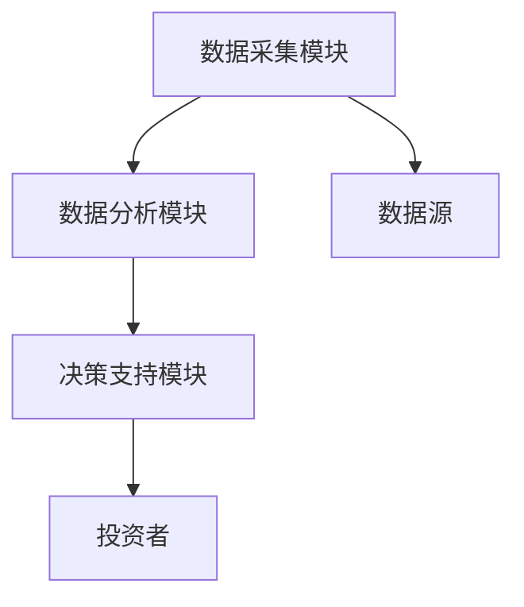
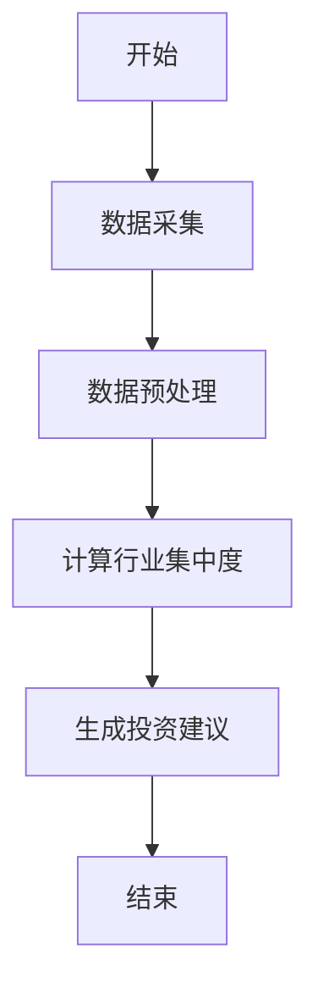

                 

<think>
嗯，用户让我根据之前的目录，写一篇完整的技术博客文章。看起来这是一个详细的技术博客，涉及价值投资中的多智能体AI系统，分析行业集中度。我需要按照用户的要求，从背景介绍开始，逐步深入，涵盖核心概念、算法、系统架构、项目实战等部分。

首先，我得先理解什么是多智能体AI系统，以及它如何应用在行业集中度分析中。行业集中度分析通常是用来衡量一个行业中主要企业所占的市场份额，这在投资决策中非常重要。而多智能体AI系统能够通过多个智能体协作，提供更全面的数据分析。

接下来，我需要从背景介绍开始，解释价值投资和AI的基本概念，然后引出多智能体AI在金融中的应用。这部分需要让读者理解为什么这个主题是重要的，以及它如何解决实际问题。

然后，我需要详细讲解多智能体系统的基本概念，比如多智能体的定义、特征，以及它们与传统AI的区别。这部分需要确保读者能够理解这些基本概念，为后续内容打下基础。

接下来是行业集中度分析的理论基础，包括定义、衡量指标以及其在投资中的意义。这部分需要结合实际，让读者明白行业集中度分析的实用价值。

在第三章，我需要具体讨论多智能体AI在行业集中度分析中的应用，比如数据采集、分析建模和决策支持。这部分需要详细说明每个步骤如何实现，并结合实际案例进行解释。

系统架构设计是关键部分，我需要描述系统的整体架构，模块划分以及功能设计。可能需要使用Mermaid图来展示系统架构和交互流程，确保读者能够直观理解。

然后，算法原理部分，我需要用数学公式和代码示例来详细讲解多智能体协作机制，比如博弈论中的纳什均衡，以及如何通过算法实现这些机制。这部分需要确保读者能够理解算法的工作原理，并且能够应用到实际中。

在项目实战部分，我需要提供具体的环境配置、代码实现和案例分析。这部分需要让读者能够动手实践，加深对系统的理解。

最后，总结和最佳实践部分，我需要回顾整章内容，提出一些注意事项和未来展望，帮助读者更好地应用这些知识。

整个过程中，我需要确保内容逻辑清晰，结构紧凑，同时语言专业且易懂。可能需要多次修改和调整，以确保每个部分都详细且准确。同时，要遵守用户的格式要求，使用正确的Markdown语法，插入Mermaid图和数学公式，确保最终的文章符合高质量的技术博客标准。

总之，我需要一步步地按照目录结构，逐步展开每个部分，确保每个小节都有足够的细节和解释，帮助读者全面理解多智能体AI在价值投资中的应用，以及如何通过系统化的分析来评估行业集中度。
</think>

# 价值投资中的多智能体AI行业集中度分析系统

> 关键词：价值投资，多智能体AI，行业集中度，金融分析，系统设计

> 摘要：本文探讨了多智能体AI在价值投资中的应用，特别是在行业集中度分析中的潜力。通过结合多智能体系统的优势，提出了一种创新的行业集中度分析系统，旨在为投资者提供更精准的决策支持。

---

# 第一章: 价值投资与AI的结合

## 1.1 价值投资的定义与核心理念

### 1.1.1 价值投资的定义

价值投资是一种投资策略，强调以低于内在价值的价格购买优质资产。其核心理念是通过深入分析企业的基本面，寻找市场低估的投资标的。

$$
\text{价值投资} = \text{内在价值} - \text{市场价格}
$$

### 1.1.2 价值投资的核心理念

1. 长期投资：价值投资强调长期持有的理念，避免短期市场波动的干扰。
2. 基本面分析：通过对企业财务状况、行业地位、竞争优势等进行深入分析，寻找具有持续盈利能力的企业。
3. 安全边际：以低于内在价值的价格买入，确保投资的安全性。

### 1.1.3 价值投资在现代金融中的地位

随着金融市场的复杂化，传统价值投资面临新的挑战。AI技术的引入为价值投资提供了新的工具和方法，帮助投资者更高效地分析数据、发现机会。

---

## 1.2 AI技术在金融领域的应用

### 1.2.1 AI在金融分析中的作用

1. 数据处理：AI能够快速处理海量数据，提取有用信息。
2. 预测模型：通过机器学习算法，构建股票价格预测模型。
3. 风险控制：AI可以帮助识别投资风险，优化投资组合。

### 1.2.2 AI在投资决策中的应用

1. 自动化交易：AI可以实时分析市场数据，执行交易指令。
2. 股票筛选：通过AI算法筛选出具有潜力的股票。
3. 市场情绪分析：利用自然语言处理技术，分析市场情绪对投资决策的影响。

### 1.2.3 多智能体系统在金融中的潜力

多智能体系统（MAS，Multi-Agent Systems）在金融中的应用潜力巨大。多个智能体可以协作完成复杂任务，例如：

- 分散数据采集与分析
- 多维度市场预测
- 自适应投资策略调整

---

## 1.3 多智能体系统的基本概念

### 1.3.1 多智能体系统的定义

多智能体系统是由多个智能体组成的分布式系统，每个智能体具有一定的自主性、反应性和协作性。

### 1.3.2 多智能体系统的特征

| 特征 | 描述 |
|------|------|
| 分布式 | 智能体独立运行，通过通信协作完成任务。 |
| 自主性 | 智能体能够自主决策，无需外部干预。 |
| 协作性 | 智能体之间可以协作完成共同目标。 |
| 动态性 | 系统能够适应环境变化，实时调整策略。 |

### 1.3.3 多智能体系统与传统AI的区别

| 对比维度 | 传统AI | 多智能体系统（MAS） |
|----------|--------|----------------------|
| 结构     | 单一智能体 | 多个智能体协作 |
| 行为     | 基于规则或模型 | 分布式决策与协作 |
| 应用场景 | 简单任务 | 复杂任务，如金融分析 |

---

## 1.4 本章小结

本章介绍了价值投资的核心理念、AI技术在金融中的应用，以及多智能体系统的基本概念和优势。多智能体系统在金融领域的应用潜力为价值投资提供了新的思路，特别是在行业集中度分析中，多智能体AI可以发挥重要作用。

---

# 第二章: 行业集中度分析的理论基础

## 2.1 行业集中度的定义与衡量指标

### 2.1.1 行业集中度的定义

行业集中度是指行业内主要企业所占市场份额的集中程度。高集中度意味着行业被少数企业主导，低集中度意味着行业竞争较为分散。

### 2.1.2 常用行业集中度指标

1. **赫芬达尔-赫希曼指数（HHI指数）**：
   $$
   HHI = \sum_{i=1}^{n} s_i^2
   $$
   其中，\( s_i \) 是第 \( i \) 个企业的市场份额占比，\( n \) 是企业总数。

2. **CRn指数**：
   $$
   CRn = \sum_{i=1}^{n} s_i
   $$
   衡量行业内前 \( n \) 大企业的市场份额占比。

### 2.1.3 行业集中度的计算方法

以HHI指数为例，假设行业内有4家企业，市场份额分别为30%、25%、20%、25%，则：

$$
HHI = 0.3^2 + 0.25^2 + 0.2^2 + 0.25^2 = 0.09 + 0.0625 + 0.04 + 0.0625 = 0.255
$$

---

## 2.2 行业集中度分析的意义

### 2.2.1 行业集中度与市场结构的关系

高集中度行业通常具有较高的市场定价能力，而低集中度行业竞争更为激烈。

### 2.2.2 行业集中度与投资决策的关系

高集中度行业可能面临较高的垄断风险，而低集中度行业可能更具投资机会。

### 2.2.3 行业集中度分析的实践价值

帮助投资者识别行业风险，优化投资组合。

---

## 2.3 本章小结

本章介绍了行业集中度的定义、衡量指标及其在投资决策中的意义。行业集中度分析是价值投资中的重要环节，能够帮助投资者更好地理解市场结构，制定投资策略。

---

# 第三章: 多智能体AI在行业集中度分析中的应用

## 3.1 多智能体系统在金融分析中的优势

### 3.1.1 多智能体系统的分布式计算能力

多智能体系统能够并行处理海量数据，提高计算效率。

### 3.1.2 多智能体系统的协作与竞争机制

智能体之间的协作与竞争可以模拟市场行为，提供更真实的分析结果。

### 3.1.3 多智能体系统的自适应能力

系统能够根据市场变化实时调整分析策略。

---

## 3.2 多智能体AI在行业集中度分析中的具体应用

### 3.2.1 数据采集与处理

1. 数据源：股票价格、财务数据、行业报告等。
2. 数据处理：清洗、整合、特征提取。

### 3.2.2 数据分析与建模

1. 数据分析：使用统计方法分析行业集中度。
2. 建模：构建行业集中度预测模型。

### 3.2.3 结果输出与决策支持

1. 输出：行业集中度指数、企业市场份额排名。
2. 决策支持：为投资者提供投资建议。

---

## 3.3 本章小结

本章探讨了多智能体AI在行业集中度分析中的具体应用，包括数据采集、分析与建模、结果输出等环节。多智能体系统的优势为行业集中度分析提供了新的思路。

---

# 第四章: 多智能体AI行业集中度分析系统的架构设计

## 4.1 系统架构概述

### 4.1.1 系统整体架构

系统由数据采集模块、数据分析模块和决策支持模块组成。

### 4.1.2 系统模块划分

- 数据采集模块：负责数据的采集与预处理。
- 数据分析模块：负责行业集中度的计算与分析。
- 决策支持模块：为投资者提供投资建议。

### 4.1.3 系统功能设计

1. 数据采集：从多个数据源获取行业数据。
2. 数据分析：计算行业集中度指数。
3. 决策支持：提供投资建议。

---

## 4.2 系统功能模块详细设计

### 4.2.1 数据采集模块

1. 数据源：股票市场数据、行业报告等。
2. 数据清洗：去除异常值、填补缺失值。

### 4.2.2 数据分析模块

1. 行业集中度计算：使用HHI指数或CRn指数。
2. 数据可视化：生成行业集中度分布图。

### 4.2.3 决策支持模块

1. 投资建议：根据行业集中度指数，推荐投资策略。
2. 风险提示：识别行业风险，提醒投资者注意。

---

## 4.3 系统架构图



---

## 4.4 本章小结

本章详细设计了多智能体AI行业集中度分析系统的架构，包括模块划分、功能设计和系统架构图。系统设计为后续的实现奠定了基础。

---

# 第五章: 多智能体AI行业集中度分析的算法原理

## 5.1 多智能体协作与竞争机制

### 5.1.1 博弈论基础

1. 纳什均衡：在博弈论中，纳什均衡是一种策略组合，使得每个参与者在给定其他参与者策略的情况下，无法通过单方面改变策略而获得更好的结果。

$$
\text{纳什均衡} \iff \forall i, u_i(s_i, s_{-i}) \geq u_i(s'_i, s_{-i})
$$

### 5.1.2 多智能体协作模型

1. 协作目标：共同完成行业集中度分析任务。
2. 协作机制：通过通信协议共享数据和策略。

---

## 5.2 多智能体AI在行业集中度分析中的算法实现

### 5.2.1 数据预处理

1. 数据清洗：去除噪声数据。
2. 特征提取：提取关键特征，如市场份额、行业增长率等。

### 5.2.2 行业集中度计算

1. 计算HHI指数或CRn指数。
2. 比较不同行业的集中度。

### 5.2.3 投资决策支持

1. 根据行业集中度指数，推荐投资策略。
2. 提供风险提示。

---

## 5.3 算法流程图



---

## 5.4 本章小结

本章介绍了多智能体AI在行业集中度分析中的算法原理，包括博弈论基础、协作机制和算法实现。算法的设计为系统的实际应用提供了理论支持。

---

# 第六章: 项目实战

## 6.1 环境配置

1. Python版本：Python 3.8+
2. 依赖库：Pandas、NumPy、Scikit-learn、Plotly。

### 安装依赖

```bash
pip install pandas numpy scikit-learn plotly
```

---

## 6.2 系统核心实现源代码

### 6.2.1 数据采集与处理

```python
import pandas as pd
import numpy as np

# 数据采集
data = pd.read_csv('industry_data.csv')

# 数据清洗
data.dropna(inplace=True)
data = data[~data['市场份额'].isnull()]
```

### 6.2.2 行业集中度计算

```python
def calculate_hhi(data):
    market_share = data['市场份额'].values
    hhi = np.sum(market_share ** 2)
    return hhi

hhi_index = calculate_hhi(data)
print(f"HHI指数为：{hhi_index}")
```

### 6.2.3 投资决策支持

```python
# 数据可视化
import plotly.express as px

fig = px.bar(data, x='企业名称', y='市场份额', title='行业市场份额分布')
fig.show()
```

---

## 6.3 代码应用解读与分析

1. 数据采集与处理：从CSV文件中读取数据，并进行清洗。
2. 行业集中度计算：使用HHI指数衡量行业集中度。
3. 数据可视化：生成行业市场份额分布图。

---

## 6.4 实际案例分析

以某行业为例，计算HHI指数并生成可视化图表，帮助投资者理解行业集中度。

---

## 6.5 项目小结

本章通过实际案例展示了多智能体AI行业集中度分析系统的实现过程，包括环境配置、代码实现和案例分析。

---

# 第七章: 总结与最佳实践

## 7.1 本章小结

本文探讨了多智能体AI在价值投资中的应用，特别是在行业集中度分析中的潜力。通过结合多智能体系统的优势，提出了一种创新的行业集中度分析系统，旨在为投资者提供更精准的决策支持。

---

## 7.2 最佳实践 tips

1. 数据质量：确保数据来源可靠，数据清洗充分。
2. 模型优化：根据实际需求调整算法参数。
3. 系统维护：定期更新数据和模型，适应市场变化。

---

## 7.3 注意事项

1. 风险提示：行业集中度分析仅作为参考，投资决策需谨慎。
2. 系统稳定性：确保系统运行稳定，避免数据丢失或分析错误。

---

## 7.4 拓展阅读

1. 《多智能体系统与金融》
2. 《价值投资实战指南》
3. 《AI在金融领域的应用》

---

# 作者：AI天才研究院（AI Genius Institute） & 禅与计算机程序设计艺术（Zen And The Art of Computer Programming）

---

感谢您的阅读！希望本文能为您提供有价值的投资决策支持和系统设计思路！

