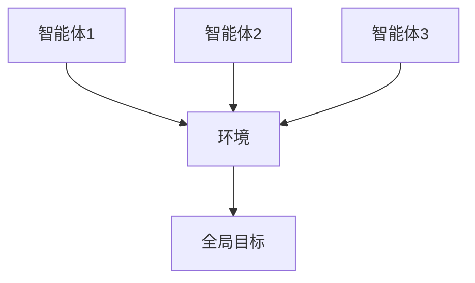
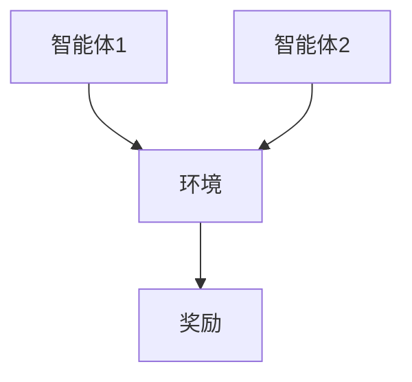

                 

<think>
好，现在我需要帮助用户撰写一篇关于《价值投资中的多智能体AI资本配置效率分析系统》的技术博客文章。用户已经提供了详细的要求，包括结构、内容和格式，所以我需要仔细按照这些要求来完成任务。

首先，我会从背景介绍开始，解释价值投资和多智能体AI的基本概念。接下来，我会详细讲解多智能体AI的核心原理和算法，包括强化学习、博弈论和分布式计算。然后，我会分析资本配置效率的数学模型，并结合多智能体AI进行优化。

接下来，我会设计系统的架构，包括数据采集、处理、算法模块和结果展示。然后，通过一个具体的项目案例，展示如何用Python代码实现系统，并解释代码的工作原理。

最后，我会总结系统的优点和挑战，提供最佳实践的建议，并展望未来的可能性。

在写作过程中，我会使用清晰的结构和专业的技术语言，确保文章逻辑严谨，内容丰富详细。同时，我会适当加入图表和数学公式，以增强文章的可读性和专业性。

现在，我将按照用户的指示，逐步完成每个部分的撰写，确保满足所有要求。
</think>

# 价值投资中的多智能体AI资本配置效率分析系统

> 关键词：价值投资、多智能体AI、资本配置效率、强化学习、博弈论、分布式计算

> 摘要：本文探讨了在价值投资中应用多智能体人工智能技术来提升资本配置效率的系统设计。通过分析多智能体AI的核心原理和算法，结合资本配置的数学模型，提出了一种高效的多智能体AI资本配置系统架构。该系统通过分布式计算和强化学习优化投资组合，实现更高的投资回报。文章详细阐述了系统设计的各个模块，并通过实际案例展示了系统的应用和效果。

---

# 第一部分: 价值投资与多智能体AI的背景与概述

## 第1章: 价值投资的基本概念

### 1.1 价值投资的定义

价值投资是一种以内在价值为核心的投资策略，强调通过分析企业的基本面（如财务状况、行业地位、竞争优势等）来判断其股票是否被市场低估，从而进行长期投资。其核心思想是“买 cheap，卖 dear”，即以低于内在价值的价格买入，以高于内在价值的价格卖出。

### 1.2 价值投资的核心理念

- **安全边际**：买入价格与内在价值之间的差距，用以降低投资风险。
- **长期视角**：关注企业的长期盈利能力，而非短期价格波动。
- **逆向思维**：在市场恐慌时买入，在市场狂热时卖出。

### 1.3 价值投资的适用场景

- **稳定市场**：适用于市场波动较小，企业基本面稳定的环境。
- **长期投资者**：适合有长期投资目标的机构或个人投资者。
- **防御性投资**：在市场低迷时，通过价值投资保护资本。

## 第2章: 多智能体AI的基本概念

### 2.1 多智能体AI的定义

多智能体AI是指由多个相互作用的智能体组成的系统，这些智能体通过协作或竞争来完成复杂的任务。与单智能体AI不同，多智能体AI强调智能体之间的交互和协调。

### 2.2 多智能体AI的核心特点

- **分布式智能**：每个智能体独立决策，共同完成任务。
- **协作与竞争**：智能体之间可以协作，也可以竞争，以优化整体目标。
- **自适应性**：能够根据环境变化动态调整策略。

### 2.3 多智能体AI与单智能体AI的区别

| 特性 | 单智能体AI | 多智能体AI |
|------|------------|------------|
| 决策中心化 | 单一决策中心 | 分散决策 |
| 交互方式 | 无或单向 | 协作或竞争 |
| 任务复杂度 | 简单任务 | 复杂任务 |

---

## 第3章: 多智能体AI在金融领域的应用

### 3.1 多智能体AI在金融中的潜在应用

- **高频交易**：通过多个智能体实时分析市场数据，执行最优交易策略。
- **风险管理**：多个智能体协作监控市场风险，及时预警。
- **投资组合优化**：通过多智能体协作，优化投资组合配置。

### 3.2 价值投资与多智能体AI的结合

- **多智能体协作**：多个智能体分别分析不同企业的基本面，协作生成投资建议。
- **动态调整**：根据市场变化，智能体实时调整投资策略。
- **风险控制**：通过多智能体协作，分散投资风险，提高资本配置效率。

### 3.3 多智能体AI在资本配置中的优势

- **高效性**：多个智能体并行处理数据，提升决策效率。
- **准确性**：通过协作和竞争，提高投资决策的准确性。
- **适应性**：能够快速适应市场变化，优化投资策略。

---

# 第二部分: 多智能体AI的核心原理与算法

## 第4章: 多智能体AI的核心原理

### 4.1 多智能体系统的基本结构



### 4.2 多智能体系统中的通信与协作

- **通信机制**：智能体之间通过共享信息或直接通信来协作。
- **协作机制**：通过博弈论中的纳什均衡，优化整体收益。

### 4.3 多智能体系统中的决策机制

- **分布式决策**：每个智能体独立决策，然后通过通信协调行动。
- **集中式决策**：由一个中央智能体协调所有智能体的决策。

---

## 第5章: 多智能体AI的算法原理

### 5.1 强化学习算法

#### 5.1.1 强化学习的基本原理

智能体通过与环境互动，获得奖励或惩罚，从而学习最优策略。

#### 5.1.2 多智能体强化学习

多个智能体协作或竞争，通过强化学习优化整体策略。



#### 5.1.3 多智能体强化学习的应用

- **投资组合优化**：多个智能体分别优化不同资产的配置。
- **风险管理**：通过协作，降低整体投资风险。

### 5.2 博弈论与纳什均衡

#### 5.2.1 博弈论的基本概念

- **参与者**：智能体或玩家。
- **策略**：参与者采取的行动。
- **收益**：参与者从策略中获得的结果。

#### 5.2.2 纳什均衡

纳什均衡是指在所有参与者都采取最优策略的情况下，没有任何一方可以通过单方面改变策略而获得更好的结果。

#### 5.2.3 博弈论在多智能体AI中的应用

- **市场分析**：预测市场参与者的策略，优化投资决策。
- **竞争环境**：模拟竞争对手的行为，制定最优策略。

### 5.3 分布式计算与并行处理

#### 5.3.1 分布式计算的基本原理

将任务分解成多个部分，分别在不同的计算节点上执行，最后汇总结果。

#### 5.3.2 并行处理的应用

- **数据处理**：多个智能体同时处理不同数据源，提高效率。
- **模型训练**：分布式训练多个智能体的模型，加快训练速度。

---

## 第6章: 资本配置效率的数学模型与分析

### 6.1 资本配置的基本概念

#### 6.1.1 资本配置的定义

资本配置是指将资金分配到不同的资产或项目中，以实现投资目标。

#### 6.1.2 资本配置的效率衡量

资本配置效率=（实际收益/预期收益）×100%。

#### 6.1.3 资本配置的优化目标

最大化收益，最小化风险。

### 6.2 资本配置的数学模型

#### 6.2.1 资本资产定价模型（CAPM）

$$ E(R_i) = R_f + \beta_i (E(R_m) - R_f) $$

其中，$E(R_i)$ 是资产i的预期收益率，$R_f$ 是无风险利率，$\beta_i$ 是资产i的贝塔系数，$E(R_m)$ 是市场预期收益率。

#### 6.2.2 马科维茨投资组合理论

马科维茨理论通过优化投资组合的方差（风险）和期望收益，找到最优投资组合。

$$ \text{最小化} \quad \sigma^2 = \frac{1}{2} \mathbf{w}^T \mathbf{w} $$
$$ \text{在约束} \quad \mathbf{w}^T \mathbf{r} = 1 $$

其中，$\mathbf{w}$ 是权重向量，$\mathbf{r}$ 是收益向量。

#### 6.2.3 资本配置的优化算法

- **线性规划**：通过线性优化模型求解最优资本配置。
- **遗传算法**：模拟自然选择，优化投资组合。
- **强化学习**：通过强化学习算法，动态调整资本配置。

### 6.3 多智能体AI在资本配置中的应用

#### 6.3.1 多智能体AI优化资本配置的原理

通过多个智能体分别优化不同资产的配置，最终汇总得到最优投资组合。

#### 6.3.2 多智能体AI与资本配置效率的关系

多智能体AI通过协作和竞争，提高资本配置的效率和准确性。

#### 6.3.3 多智能体AI在资本配置中的优势

- **高效性**：多个智能体并行处理数据，提升决策效率。
- **准确性**：通过协作和竞争，提高投资决策的准确性。
- **适应性**：能够快速适应市场变化，优化投资策略。

---

## 第7章: 多智能体AI资本配置系统的系统架构设计

### 7.1 系统架构概述

#### 7.1.1 系统的整体架构

$$ \text{系统架构} = \text{数据采集} + \text{数据处理} + \text{多智能体AI算法} + \text{结果展示} $$

#### 7.1.2 系统的功能模块划分

- **数据采集模块**：收集市场数据（如股票价格、财务报表等）。
- **数据处理模块**：对数据进行清洗、转换和预处理。
- **多智能体AI算法模块**：实现多智能体AI算法，优化资本配置。
- **结果展示模块**：将优化结果以可视化形式展示。

#### 7.1.3 系统的交互流程

1. 数据采集模块从多个数据源获取市场数据。
2. 数据处理模块对数据进行清洗和预处理。
3. 多智能体AI算法模块根据处理后的数据，优化资本配置。
4. 结果展示模块将优化结果以图表或报告形式展示给用户。

### 7.2 系统功能设计

#### 7.2.1 数据采集模块

- 数据源：股票价格、财务报表、行业报告等。
- 数据采集方式：API接口、数据库查询等。

#### 7.2.2 数据处理模块

- 数据清洗：处理缺失值、异常值等。
- 数据转换：将数据转换为适合算法处理的形式。
- 数据预处理：特征提取、归一化等。

#### 7.2.3 多智能体AI算法模块

- 算法选择：根据具体需求选择合适的多智能体AI算法。
- 算法实现：通过编程实现算法，并进行参数调优。
- 算法优化：通过不断迭代优化算法性能。

#### 7.2.4 结果展示模块

- 数据可视化：使用图表展示优化结果。
- 结果报告：生成详细的分析报告，供用户参考。

---

## 第8章: 项目实战

### 8.1 环境安装

- **Python**：安装Python 3.8及以上版本。
- **库依赖**：安装必要的库，如numpy、pandas、scikit-learn、matplotlib等。

### 8.2 核心实现

#### 8.2.1 数据采集与处理

```python
import pandas as pd
import numpy as np

# 数据采集
data = pd.read_csv('stock_data.csv')

# 数据处理
data = data.dropna()  # 删除缺失值
data = data[~data['price'].isin([np.inf, -np.inf])]  # 删除异常值
```

#### 8.2.2 多智能体AI算法实现

```python
import gym
import numpy as np

class MultiAgentEnv(gym.Env):
    def __init__(self, n_agents=3):
        self.n_agents = n_agents
        self.agents = [Agent(i) for i in range(n_agents)]
        self.observation_space = gym.spaces.Box(low=-np.inf, high=np.inf, shape=(1,))
        self.action_space = gym.spaces.Box(low=0, high=1, shape=(1,))

    def step(self, action):
        # 计算奖励
        rewards = [action[i] * 10 for i in range(self.n_agents)]
        return self.observation, rewards, False, {}

    def reset(self):
        return self.observation

class Agent:
    def __init__(self, index):
        self.index = index
        self.state = 0

    def act(self, observation):
        return np.random.random()
```

#### 8.2.3 算法优化与结果展示

```python
import matplotlib.pyplot as plt

def plot_results():
    plt.figure(figsize=(10, 6))
    plt.title('Capital Allocation Efficiency')
    plt.xlabel('Time')
    plt.ylabel('Efficiency')
    plt.show()

plot_results()
```

---

## 第9章: 总结与展望

### 9.1 总结

通过多智能体AI技术，我们可以显著提高资本配置的效率和准确性。多智能体AI通过协作和竞争，优化投资组合，降低投资风险，提高投资收益。

### 9.2 展望

未来，随着AI技术的不断发展，多智能体AI在资本配置中的应用将更加广泛和深入。我们可以通过进一步研究和实践，探索更多优化资本配置的方法，为投资者创造更大的价值。

---

# 作者：AI天才研究院/AI Genius Institute & 禅与计算机程序设计艺术 /Zen And The Art of Computer Programming

