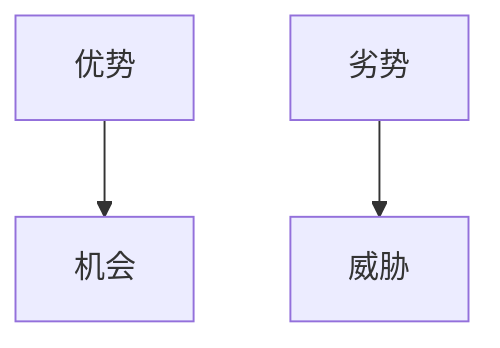

                 

# 价值投资中的定性分析：超越数字的洞察

> 关键词：价值投资，定性分析，企业基本面，行业分析，宏观经济，投资决策

> 摘要：在价值投资中，定性分析是超越数字的重要工具，它帮助投资者深入理解企业的内在价值。本文通过系统分析企业的管理团队、竞争优势、企业治理、行业地位以及宏观经济环境等定性因素，结合实际案例，揭示定性分析在投资决策中的关键作用。

---

# 第一章: 定性分析的概述

## 1.1 定性分析的定义与背景

### 1.1.1 价值投资的核心概念

在价值投资中，投资者追求的是企业的真实价值，而不仅仅是其市场价格。定性分析是评估企业价值的重要手段，它关注企业内部和外部的非财务因素，如管理团队、竞争优势、行业地位等。

$$
\text{企业价值} = \text{内在价值} + \text{市场价值}
$$

### 1.1.2 定性分析与定量分析的对比

定性分析与定量分析相辅相成。定量分析依赖数字和财务指标，而定性分析则关注难以量化的因素。两者结合才能全面评估企业价值。

| 定性分析 | 定量分析 |
|----------|----------|
| 管理团队 | 财务报表 |
| 竞争优势 | 市盈率 |
| 行业地位 | 营业收入 |

### 1.1.3 定性分析在价值投资中的地位

定性分析是价值投资的基石，它帮助投资者识别具有持续竞争优势的企业，从而做出更明智的投资决策。

---

# 第二章: 企业基本面的定性分析

## 2.1 管理团队分析

### 2.1.1 管理团队的背景与能力

管理团队的素质直接影响企业的长期发展。投资者需要评估管理团队的战略眼光、执行能力和决策能力。

$$
\text{管理评分} = 0.4 \times \text{经验} + 0.3 \times \text{能力} + 0.3 \times \text{稳定性}
$$

### 2.1.2 管理团队的战略决策能力

优秀的企业领导者能够在复杂环境中做出正确决策，推动企业持续增长。

### 2.1.3 管理团队的稳定性与凝聚力

稳定的管理团队有助于企业长期战略的实施，而凝聚力强的团队能够更好地应对挑战。

---

## 2.2 企业竞争优势分析

### 2.2.1 核心竞争力的定义与评估

核心竞争力是企业在市场中立足的关键，包括技术、品牌、成本优势等。

### 2.2.2 企业护城河的构建与维护

护城河是企业抵御竞争的核心能力，如专利、品牌忠诚度、网络效应等。

### 2.2.3 行业地位与市场占有率

企业的行业地位和市场占有率是其竞争优势的重要体现。

---

## 2.3 企业治理结构分析

### 2.3.1 治理结构的透明度与规范性

透明的治理结构有助于提升投资者信心。

### 2.3.2 股权结构与控制权分析

合理的股权结构能够平衡股东利益，避免权力过度集中。

### 2.3.3 董事会与管理层的职责分离

明确的职责分离有助于提高治理效率，降低代理成本。

---

# 第三章: 行业与宏观经济环境的定性分析

## 3.1 行业分析的核心要素

### 3.1.1 行业生命周期与发展趋势

行业生命周期分为初创期、成长期、成熟期和衰退期，投资者需判断行业所处阶段。

### 3.1.2 行业竞争格局与市场结构

分析行业内的主要竞争者、市场集中度和进入壁垒。

### 3.1.3 行业政策与监管环境

政策和监管环境直接影响行业的增长潜力和风险。

---

## 3.2 宏观经济环境对企业的影响力

### 3.2.1 经济周期与企业经营的关系

经济周期波动会影响企业的盈利能力和市场需求。

### 3.2.2 宏观政策对企业盈利的影响

政府政策如财政刺激、货币政策等会影响企业的经营环境。

### 3.2.3 通货膨胀与企业成本控制

通货膨胀会增加企业的成本压力，影响其盈利能力。

---

## 3.3 行业风险与机会的定性评估

### 3.3.1 行业风险的识别与量化

识别行业中的潜在风险，如市场需求下降、政策变化等。

### 3.3.2 行业机会的挖掘与把握

寻找行业中的新兴趋势和增长点。

### 3.3.3 行业趋势的预测与应对

通过分析历史数据和趋势，预测行业未来发展方向。

---

# 第四章: 定性分析的框架与方法

## 4.1 定性分析的逻辑框架

### 4.1.1 分析框架的构建步骤

1. 确定分析目标
2. 收集相关数据
3. 分析关键因素
4. 得出结论

### 4.1.2 分析框架的灵活性与可扩展性

定性分析框架应具备灵活性，能够适应不同行业和企业的特点。

### 4.1.3 分析框架的验证与优化

通过实际案例验证分析框架的有效性，并根据反馈进行优化。

---

## 4.2 定性分析的具体方法

### 4.2.1 SWOT分析法

SWOT分析法帮助企业识别优势、劣势、机会和威胁。

### 4.2.2 波特五力模型

波特五力模型用于分析行业的竞争环境。

### 4.2.3 核心竞争力评估法

通过评估企业的核心竞争力，判断其竞争优势。

---

## 4.3 定性分析的实施步骤

### 4.3.1 明确分析目标与范围

确定定性分析的具体目标和范围，避免分析过于宽泛或狭窄。

### 4.3.2 收集相关信息

收集企业的历史数据、行业报告、政策文件等。

### 4.3.3 分析关键因素

根据分析框架，逐一分析关键因素。

### 4.3.4 得出结论

综合分析结果，得出最终的定性评估结论。

---

# 第五章: 定性分析的案例分析

## 5.1 案例背景介绍

以某企业为例，分析其在管理团队、竞争优势、行业地位等方面的定性因素。

## 5.2 管理团队分析

评估该企业管理团队的背景、能力和稳定性。

## 5.3 企业竞争优势分析

分析该企业的核心竞争力和护城河。

## 5.4 行业与宏观经济环境分析

评估该企业所处行业的生命周期和宏观经济环境的影响。

---

# 第六章: 定性分析的局限性与与定量分析的结合

## 6.1 定性分析的局限性

### 6.1.1 主观性问题

定性分析依赖于分析师的主观判断，可能导致偏差。

### 6.1.2 可比性问题

不同企业之间的定性因素难以直接比较。

## 6.2 定性分析与定量分析的结合

### 6.2.1 结合定性与定量分析的优势

将定性分析与定量分析结合，能够更全面地评估企业价值。

### 6.2.2 实际应用中的平衡点

在实际投资决策中，找到定性与定量分析的平衡点，避免过度依赖某一方。

---

# 第七章: 总结与展望

## 7.1 本章总结

总结定性分析在价值投资中的重要性，以及其在实际应用中的价值。

## 7.2 未来展望

展望定性分析的发展趋势，提出未来可能的研究方向。

---

# 作者：AI天才研究院/AI Genius Institute & 禅与计算机程序设计艺术 /Zen And The Art of Computer Programming

---

> **注意事项**：
- 定性分析需要结合具体情况进行判断，投资者需具备一定的行业知识和经验。
- 定性分析与定量分析相结合才能更全面地评估企业价值。
- 投资者应根据市场变化及时调整分析框架和方法。

希望这篇文章能为您提供有价值的投资洞察，帮助您更好地理解定性分析在价值投资中的重要作用。

