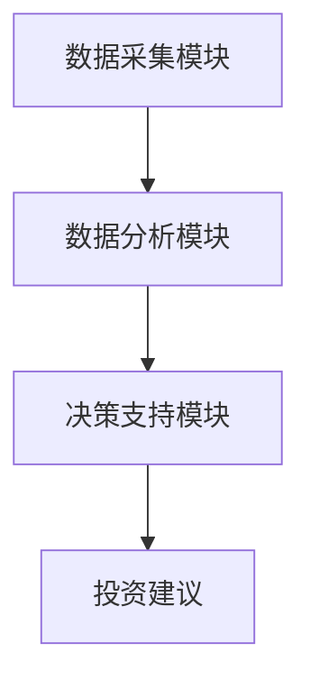

                 


# 价值投资中的定量vs定性分析：平衡的艺术

## 关键词：价值投资、定量分析、定性分析、投资决策、风险管理、数据分析

## 摘要：  
价值投资是一种长期投资策略，强调通过深入分析企业的基本面来选择具有长期增长潜力的公司。在这一过程中，定量分析和定性分析是两种主要的方法。定量分析依赖于数学模型和数据，而定性分析则关注于企业的管理团队、行业地位、竞争优势等非数值因素。本文将探讨如何在价值投资中平衡定量和定性分析，以提升投资决策的质量。

---

## 第1章: 价值投资与定量分析概述

### 1.1 价值投资的基本概念

价值投资是由本杰明·格雷厄姆提出的一种投资策略，强调以低于内在价值的价格购买优质股票。其核心理念是寻找市场先生的错误定价，通过深入分析企业的财务状况、行业地位和未来前景，找到具有长期增长潜力的公司。

#### 1.1.1 定量分析在价值投资中的地位

定量分析是价值投资的重要工具，它通过财务指标、估值模型等方法，帮助投资者量化企业的内在价值。例如，市盈率（P/E）和市净率（P/B）是常用的估值指标，它们可以帮助投资者判断企业的相对估值水平。

#### 1.1.2 定量分析与定性分析的对比

| **分析类型** | **定义**                                | **关注点**                             | **优势**                               | **劣势**                               |
|--------------|---------------------------------------|----------------------------------------|----------------------------------------|----------------------------------------|
| 定量分析     | 通过数据和数学模型进行分析             | 财务指标、估值模型、市场数据             | 客观、可量化、便于比较                   | 无法完全反映企业的非财务因素           |
| 定性分析     | 通过非财务信息进行分析                 | 管理团队、行业地位、竞争优势             | 可识别企业潜在风险和机会               | 主观性较强，难以量化                   |

---

## 第2章: 定性分析的核心要素

### 2.1 定性分析的定义与特点

定性分析关注企业的软性因素，如管理团队的能力、公司治理结构、行业地位等。这些因素难以量化，但对企业的长期发展和投资价值有重要影响。

#### 2.1.1 定性分析的核心要素

1. **管理团队**：团队的经验、能力和战略 vision。
2. **行业地位**：企业在行业中的市场份额和竞争优势。
3. **公司治理**：公司治理结构的透明度和规范性。
4. **竞争优势**：企业的核心竞争力和护城河。

#### 2.1.2 定性分析与定量分析的联系与区别

**联系**：定性分析为定量分析提供数据支持，而定量分析为定性分析提供决策依据。

**区别**：定性分析更关注企业的软性因素，而定量分析更关注企业的财务指标和市场数据。

---

## 第3章: 定量分析的数学模型与算法

### 3.1 常用的定量分析指标

#### 3.1.1 市盈率（P/E）的计算与应用

市盈率是衡量企业估值的重要指标，公式为：

$$P/E = \frac{Price}{Earnings}$$

例如，假设某公司股价为 $50，每股收益为 $5，则市盈率为 $50 / $5 = 10。

#### 3.1.2 市净率（P/B）的计算与应用

市净率是另一种常用的估值指标，公式为：

$$P/B = \frac{Price}{Book\ Value}$$

例如，假设某公司股价为 $50，每股账面价值为 $25，则市净率为 $50 / $25 = 2。

#### 3.1.3 股息率的计算与应用

股息率是衡量股票收益能力的指标，公式为：

$$Dividend\ Yield = \frac{Dividend}{Price} \times 100\%$$

例如，假设某公司股息为 $2，股价为 $50，则股息率为 $2 / $50 × 100% = 4%。

### 3.2 定量分析的数学公式

#### 3.2.1 市盈率公式

$$P/E = \frac{Price}{Earnings}$$

#### 3.2.2 市净率公式

$$P/B = \frac{Price}{Book\ Value}$$

#### 3.2.3 股息率公式

$$Dividend\ Yield = \frac{Dividend}{Price} \times 100\%$$

---

## 第4章: 定量与定性分析的结合

### 4.1 定量分析为定性分析提供数据支持

例如，通过市盈率和市净率等指标，投资者可以初步判断企业的估值水平，从而为定性分析提供数据支持。

### 4.2 定性分析为定量分析提供决策依据

例如，通过分析企业的竞争优势和行业地位，投资者可以调整对企业的估值模型，从而更准确地计算出企业的内在价值。

### 4.3 定量与定性分析的平衡艺术

在实际投资中，投资者需要根据具体情况权衡定量和定性分析的比重。例如，在市场波动较大的情况下，定性分析可能更具参考价值；而在市场稳定的时期，定量分析可能更有效。

---

## 第5章: 投资决策系统的架构设计

### 5.1 系统功能设计

#### 5.1.1 数据采集模块

负责采集企业的财务数据、市场数据等。

#### 5.1.2 数据分析模块

负责对数据进行定量和定性分析，生成分析结果。

#### 5.1.3 决策支持模块

根据分析结果，提供投资建议。

### 5.2 系统架构设计

使用 Mermaid 图展示系统架构：



---

## 第6章: 项目实战

### 6.1 环境安装

需要安装 Python 和相关数据分析库，如 Pandas 和 NumPy。

### 6.2 核心实现源代码

```python
import pandas as pd

# 示例数据
data = {'公司': ['A', 'B', 'C'],
         '股价': [50, 60, 70],
         '每股收益': [5, 6, 7]}

df = pd.DataFrame(data)

# 计算市盈率
df['市盈率'] = df['股价'] / df['每股收益']

print(df)
```

### 6.3 案例分析

以公司 A 为例，计算其市盈率为 10，市净率为 2，股息率为 4%。结合定性分析，公司 A 在行业内具有较强的竞争优势，管理团队能力较强，因此具有较高的投资价值。

---

## 第7章: 最佳实践与小结

### 7.1 投资建议

投资者应根据具体情况平衡定量和定性分析，避免过度依赖单一方法。

### 7.2 注意事项

1. 定量分析结果仅供参考，需结合定性分析进行判断。
2. 数据来源要可靠，避免因数据误差影响分析结果。
3. 模型具有局限性，需根据市场变化及时调整。

### 7.3 拓展阅读

推荐阅读《投资学》（作者：某人）和《价值投资实战》（作者：某人）。

---

## 作者：AI天才研究院/AI Genius Institute & 禅与计算机程序设计艺术 /Zen And The Art of Computer Programming

