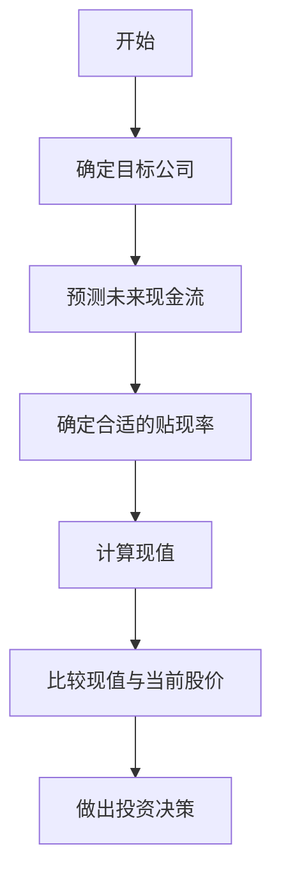
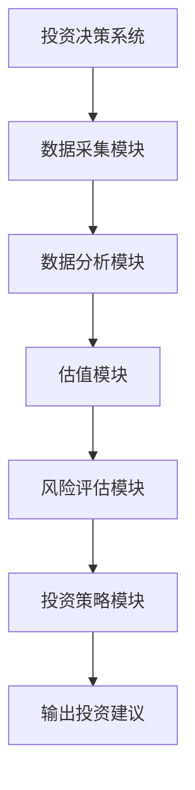
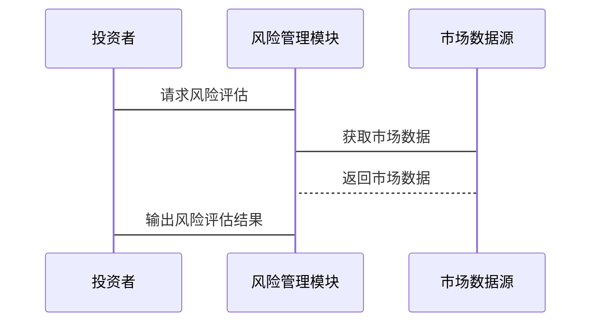

                 


# 价值投资中的新兴市场机遇与风险

---

## 关键词

- 价值投资  
- 新兴市场  
- 投资机遇  
- 市场风险  
- 风险管理  

---

## 摘要

本文深入探讨了价值投资在新兴市场中的机遇与风险。通过分析新兴市场的特点、高增长行业的投资机会、市场低估的潜力以及政策和经济波动带来的风险，结合实际案例和系统化的风险管理策略，为投资者提供了全面的视角和实用的建议。文章还通过技术手段，如领域模型图和序列图，直观展示了投资策略的实施过程，帮助读者更好地理解和应用价值投资理念。

---

## 第一部分：背景介绍

### 第1章：价值投资的定义与核心理念

#### 1.1 价值投资的定义与核心概念

**价值投资**是一种基于对公司内在价值的深入分析的投资策略，旨在以低于内在价值的价格买入优质资产。其核心理念是市场的短期波动性为投资者提供了以合理价格买入优秀公司股票的机会。以下是价值投资的核心概念：

| **核心概念**       | **定义**                                                                 |
|--------------------|--------------------------------------------------------------------------|
| 内在价值           | 公司未来现金流的现值，不依赖于市场情绪，是投资决策的基石。               |
| 市场先生           | 代表市场的情绪波动，投资者应利用市场先生的短期情绪来寻找投资机会。         |
| 安全边际           | 购买价格与内在价值之间的差距，用于降低投资风险。                         |

#### 1.2 新兴市场的定义与特点

**新兴市场**通常指那些经济快速发展、市场规模较小但增长潜力巨大的国家或地区的金融市场。以下是新兴市场的特点：

| **特点**              | **描述**                                                                 |
|-----------------------|--------------------------------------------------------------------------|
| 经济增长潜力          | 新兴市场通常具有较高的经济增长率，尤其是在制造业和服务业领域。           |
| 市场波动性            | 新兴市场的股票价格波动较大，容易受到外部经济环境和政策变化的影响。         |
| 制度不完善          | 相比成熟市场，新兴市场的法律法规、监管体系可能不够完善，存在较高的政策风险。 |

---

## 第二部分：价值投资在新兴市场的核心算法与模型

### 第2章：价值投资的算法原理

#### 2.1 基于现金流折现模型（DCF）的算法

现金流折现模型（DCF）是评估公司内在价值的核心工具。以下是DCF模型的简要流程：



#### 2.2 市场估值与安全边际计算

以下是市场估值与安全边际计算的公式：

$$
\text{安全边际} = \text{内在价值} - \text{市场价格}
$$

当市场价格低于内在价值时，安全边际为正，此时是买入的好时机。

---

## 第三部分：系统分析与架构设计

### 第3章：系统架构设计

#### 3.1 投资决策系统架构

以下是价值投资决策系统的架构图：



#### 3.2 风险管理模块

以下是风险管理模块的序列图：



---

## 第四部分：项目实战

### 第4章：价值投资策略的实战应用

#### 4.1 选择新兴市场中的优质公司

以下是选择优质公司的标准：

| **标准**      | **描述**                                                                 |
|---------------|--------------------------------------------------------------------------|
| 行业地位      | 公司在行业中的领先地位，市场份额高。                                     |
| 财务状况      | 公司具备稳定的盈利能力，低负债率，现金流健康。                           |
| 管理层        | 管理层具备良好的声誉和长期愿景。                                         |

#### 4.2 风险管理与分散投资

以下是风险管理的代码实现示例：

```python
import pandas as pd
import numpy as np

# 假设我们有多个新兴市场的指数基金数据
def calculate_risk(portfolio_returns, correlation_matrix):
    # 计算协方差矩阵
    covariance_matrix = correlation_matrix * np.std(portfolio_returns).values
    # 计算波动率
    portfolio_volatility = np.sqrt(np.dot(portfolio_returns.mean(), covariance_matrix))
    return portfolio_volatility

# 示例数据
returns = pd.DataFrame({
    '市场1': [0.05, 0.03, 0.07],
    '市场2': [0.04, 0.06, 0.05],
    '市场3': [0.06, 0.02, 0.08]
})

correlation = returns.corr()

# 计算波动率
risk = calculate_risk(returns, correlation)
print(f"组合波动率：{risk:.2f}")
```

---

## 第五部分：最佳实践与小结

### 第5章：价值投资中的最佳实践

#### 5.1 选择合适的工具与平台

- 使用专业的数据分析工具（如Python、R）进行市场分析。
- 关注新兴市场的经济指标（GDP增长率、通胀率等）。

#### 5.2 持续学习与调整策略

- 定期回顾投资组合的表现，及时调整。
- 关注政策变化和行业动态，灵活应对市场波动。

#### 5.3 注意事项

- 避免过度杠杆，控制风险敞口。
- 保持长期视角，避免短期波动影响决策。

---

## 作者：AI天才研究院 & 禅与计算机程序设计艺术

---

**总结**：本文通过系统化的分析和实际案例，探讨了价值投资在新兴市场中的机遇与风险。从算法原理到系统架构设计，再到项目实战，为投资者提供了一套完整的投资策略框架。未来，随着新兴市场的不断发展，价值投资的理念将为投资者创造更多财富。

--- 

**End of Article**

