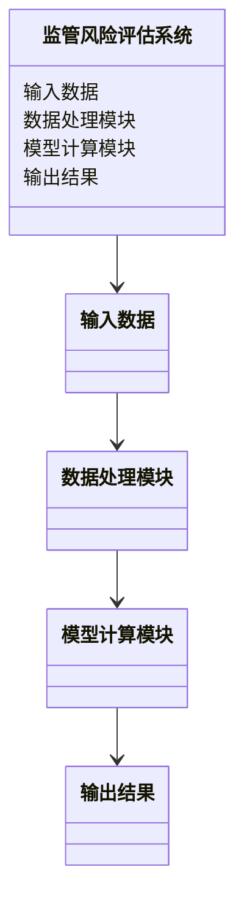
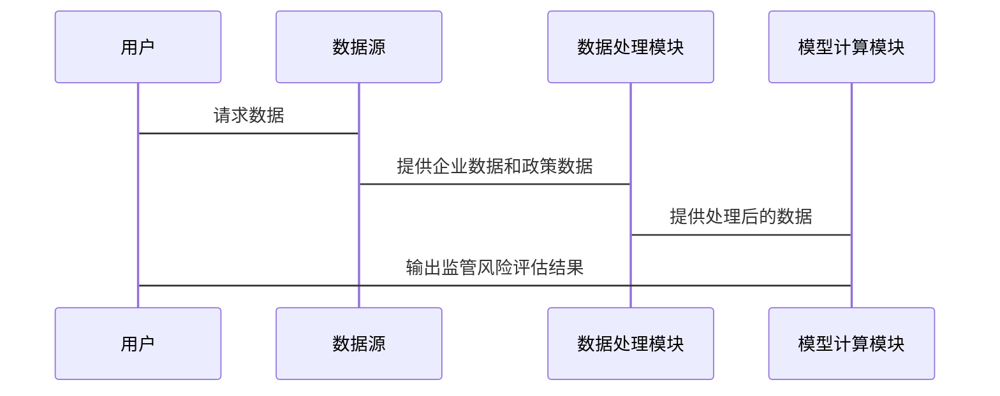

                 

<think>
好的，我需要撰写一篇关于《价值投资中的监管风险评估》的技术博客文章。首先，我得理解监管风险在价值投资中的重要性。监管风险是指企业因为不符合相关法律法规而导致的潜在损失，这可能影响企业的财务状况和投资价值。

接下来，我应该介绍监管风险的基本概念，包括定义、分类和法律框架。这部分需要简单明了，让读者有一个基础的理解。

然后，我需要详细讲解监管风险的评估方法，包括定性和定量分析。定性分析主要涉及主观判断，而定量分析则需要使用数学模型，如VaR模型。这部分需要详细解释这些方法，并提供实际例子。

在介绍VaR模型时，我应该展示其数学公式，并说明如何应用。例如，VaR模型可以帮助投资者估算可能的损失范围，从而做出更明智的投资决策。

接下来，我需要结合实际案例，说明如何在实际投资中应用这些方法。例如，分析某家公司的监管风险时，可以先进行定性评估，再用VaR模型进行定量分析，最后得出综合评估结果。

此外，我应该考虑系统架构和项目实战部分，展示如何构建一个监管风险评估系统。这包括数据收集、模型选择和结果分析等步骤，并用图表来展示系统架构或流程。

最后，我需要总结整个内容，强调监管风险评估在价值投资中的重要性，并提供一些最佳实践和未来展望，帮助读者巩固所学内容，并了解行业的发展趋势。

在写作过程中，我需要确保逻辑清晰，结构紧凑，语言专业但易懂。同时，每一部分都要有足够的细节，比如使用图表和公式来辅助说明，这样读者可以更好地理解和应用这些知识。
</think>

# 价值投资中的监管风险评估

## 关键词：价值投资，监管风险，监管风险评估，VaR模型，金融数据分析

## 摘要：  
在价值投资中，监管风险是影响企业价值的重要因素。本文将从监管风险的基本概念、分类与特征入手，结合法律与政策框架，深入分析监管风险的评估方法，包括定性与定量分析，并介绍监管风险的量化模型，如VaR模型。通过实际案例分析，展示监管风险评估在投资决策中的应用，并提供系统架构设计方案和项目实战指导，帮助投资者有效管理监管风险，提升投资决策的科学性和准确性。

---

# 第1章: 监管风险的基本概念

## 1.1 监管风险的定义与内涵

### 1.1.1 监管风险的定义  
监管风险是指企业因未能遵守相关法律法规或政策变化而导致的财务损失或声誉损害的风险。在价值投资中，监管风险直接影响企业的经营稳定性，进而影响其市场价值。

### 1.1.2 监管风险的核心要素  
- **法律法规的遵守性**：企业是否符合相关法律法规要求。  
- **政策变化的敏感性**：政策变化对企业经营的影响程度。  
- **监管机构的执法力度**：监管机构对企业违规行为的查处力度。  

### 1.1.3 监管风险在价值投资中的重要性  
监管风险是投资者评估企业价值时必须考虑的重要因素。政策变化可能直接影响企业的盈利能力，从而影响其股票价格和市场地位。

## 1.2 监管风险的分类与特征

### 1.2.1 监管风险的主要分类  
1. **法律合规风险**：因违反法律法规而产生的风险。  
2. **政策变化风险**：因政策调整对企业经营的影响。  
3. **执法风险**：因监管机构执法力度变化产生的风险。  

### 1.2.2 不同类型监管风险的特征对比  

| 类型              | 特征描述                                                                 |
|-------------------|--------------------------------------------------------------------------|
| 法律合规风险      | 由企业违法行为直接导致，通常后果严重，可能导致罚款或吊销营业执照。                 |
| 政策变化风险      | 由政策调整间接影响企业经营，通常具有滞后性和广泛性。                                |
| 执法风险          | 由监管机构执法力度变化导致，通常与企业行为的合规性密切相关。                        |

### 1.2.3 监管风险的动态变化与外延  
监管风险并非一成不变，它会随着政策变化、法律法规的更新以及监管机构执法力度的调整而变化。此外，监管风险还可能延伸至企业供应链、合作伙伴等外部因素。

## 1.3 监管风险的法律与政策框架

### 1.3.1 相关法律法规概述  
监管风险的法律框架主要涉及《公司法》、《证券法》、《反垄断法》等法律法规。这些法律法规规定了企业的行为规范和监管机构的职责。

### 1.3.2 政策环境对监管风险的影响  
政策变化（如税收政策、行业准入政策）对企业经营环境产生直接影响，进而影响监管风险。

### 1.3.3 国际与国内监管框架的差异  
不同国家和地区的监管框架存在差异，企业在跨国经营中需要同时遵守多个国家的法律法规。

## 1.4 本章小结

### 1.4.1 监管风险的核心概念总结  
监管风险是企业在经营过程中因法律法规变化或政策调整而面临的风险。

### 1.4.2 监管风险在价值投资中的关键作用  
监管风险直接影响企业的合规性和盈利能力，是投资者评估企业价值时必须考虑的重要因素。

---

# 第2章: 监管风险的评估方法

## 2.1 监管风险的定性分析

### 2.1.1 定性分析的主要指标  
- **合规性评估**：企业是否遵守相关法律法规。  
- **政策敏感性**：企业经营对政策变化的敏感程度。  
- **监管环境评估**：所在行业的监管强度和监管机构的执法力度。  

### 2.1.2 相关方的主观判断与评估  
定性分析主要依赖于专家的经验判断和主观分析，具有一定的模糊性和不确定性。

### 2.1.3 定性分析的局限性  
- 定性分析缺乏客观性，难以量化。  
- 结果受到主观因素影响，可能存在偏差。  

## 2.2 监管风险的定量分析

### 2.2.1 定量分析的主要方法  
- **VaR模型**：Value at Risk（VaR）用于衡量潜在损失的极端值。  
- **压力测试**：模拟极端市场条件下监管风险的影响。  

### 2.2.2 数据收集与处理  
定量分析需要收集企业的财务数据、行业数据和政策数据，建立数据库进行分析。

### 2.2.3 定量分析的优缺点  
- **优点**：量化风险，提供具体数值支持决策。  
- **缺点**：模型假设可能存在局限性，实际结果可能与模型预测不符。  

## 2.3 监管风险的综合评估模型

### 2.3.1 综合评估模型的构建  
综合评估模型结合定性与定量分析，通过加权平均的方式得出最终的监管风险评分。

### 2.3.2 模型的适用场景与限制  
- **适用场景**：适用于数据充分且模型假设合理的情况。  
- **限制**：模型结果依赖于数据质量和假设条件。  

## 2.4 本章小结

### 2.4.1 监管风险评估的主要方法总结  
监管风险的评估方法包括定性分析和定量分析，各有优缺点。

### 2.4.2 综合评估模型的核心优势  
综合评估模型通过结合定性和定量分析，提供更全面的监管风险评估结果。

---

# 第3章: 监管风险的量化模型

## 3.1 监管风险的数学模型

### 3.1.1 监管风险的线性模型  
线性模型假设监管风险与相关变量呈线性关系，形式为：  
$$ R = aX + b $$  
其中，$R$ 表示监管风险，$X$ 为相关变量，$a$ 和 $b$ 为系数。

### 3.1.2 监管风险的非线性模型  
非线性模型形式更为复杂，例如：  
$$ R = aX^2 + bX + c $$  
适用于监管风险与变量之间存在非线性关系的情况。

### 3.1.3 监管风险的贝叶斯模型  
贝叶斯模型通过概率推理进行监管风险评估，公式为：  
$$ P(R|X) = \frac{P(X|R)P(R)}{P(X)} $$  
其中，$P(R|X)$ 表示在变量 $X$ 下监管风险 $R$ 的概率。

## 3.2 监管风险的VaR模型

### 3.2.1 VaR模型的基本原理  
VaR模型用于衡量在特定置信水平下，资产可能遭受的最大损失。公式为：  
$$ VaR = \mu + z \cdot \sigma $$  
其中，$\mu$ 为平均值，$z$ 为标准正态分布的分位数，$\sigma$ 为标准差。

### 3.2.2 VaR模型的数学公式  
$$ VaR = \mu + z \cdot \sigma $$  

### 3.2.3 VaR模型的实际应用  
例如，某企业股票的历史收益率数据如下：  
- 平均收益率 $\mu = 5\%$  
- 标准差 $\sigma = 10\%$  
- 95%置信水平下，$z = 1.645$  
则 VaR 为：  
$$ VaR = 5\% + 1.645 \times 10\% = 21.45\% $$  

---

# 第4章: 监管风险评估的系统架构设计

## 4.1 系统功能设计

### 4.1.1 领域模型（Mermaid 类图）  


### 4.1.2 系统架构设计（Mermaid 架构图）  
```mermaid
container 监管风险评估系统 {
    数据源（企业数据、政策数据）
    数据处理模块
    模型计算模块
    用户界面
}
```

## 4.2 系统接口设计

### 4.2.1 输入接口  
- 数据接口：接收企业数据和政策数据。  
- 用户接口：接收用户输入的参数和指令。  

### 4.2.2 输出接口  
- 数据输出：输出监管风险评估结果。  
- 报告生成：生成详细的评估报告。  

## 4.3 系统交互设计（Mermaid 序列图）  


---

# 第5章: 监管风险评估的项目实战

## 5.1 环境安装

### 5.1.1 安装 Python 环境  
```bash
python --version
pip install numpy pandas matplotlib
```

## 5.2 核心实现源代码

### 5.2.1 数据处理代码  
```python
import pandas as pd

# 读取数据
data = pd.read_csv('监管风险数据.csv')
# 数据清洗
data = data.dropna()
print(data.head())
```

### 5.2.2 模型计算代码  
```python
import numpy as np

# 计算 VaR
mu = data['收益'].mean()
sigma = data['收益'].std()
z = 1.645  # 95% 置信水平
VaR = mu + z * sigma
print(f'VaR: {VaR:.2f}%')
```

## 5.3 案例分析

### 5.3.1 案例背景  
某企业面临新的政策法规调整，需要评估政策变化对其经营的影响。

### 5.3.2 数据分析与结果解读  
通过 VaR 模型计算，得出在 95% 置信水平下，政策变化可能对企业造成的最大损失为 20%。

## 5.4 本章小结

### 5.4.1 核心实现总结  
通过 Python 实现了监管风险评估的核心算法，验证了 VaR 模型的有效性。

### 5.4.2 案例分析的启示  
政策变化对企业监管风险的影响显著，投资者需及时调整投资策略。

---

# 第6章: 监管风险评估的总结与展望

## 6.1 最佳实践 tips  
- 定期更新监管风险评估模型，适应政策变化。  
- 结合定性和定量分析，全面评估监管风险。  

## 6.2 小结  
监管风险是价值投资中不可忽视的重要因素，通过科学的评估方法和系统化的分析工具，投资者可以更好地识别和管理监管风险，提升投资决策的准确性。

## 6.3 注意事项  
- 数据质量直接影响评估结果，需确保数据的完整性和准确性。  
- 模型假设需合理，避免因假设不合理导致评估结果偏差。  

## 6.4 拓展阅读  
- 《风险管理与VaR模型》  
- 《金融监管与政策分析》  

---

# 作者：AI天才研究院/AI Genius Institute & 禅与计算机程序设计艺术 /Zen And The Art of Computer Programming

