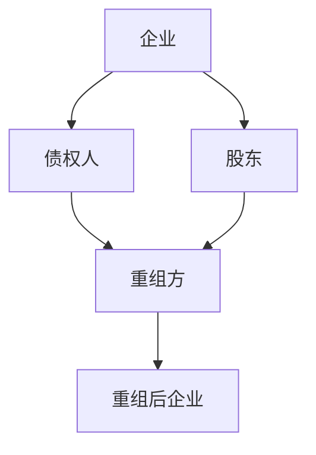
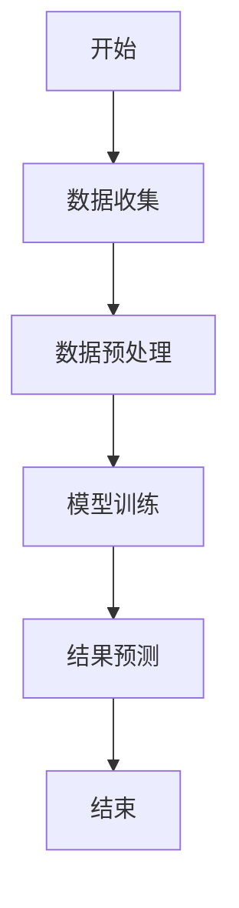
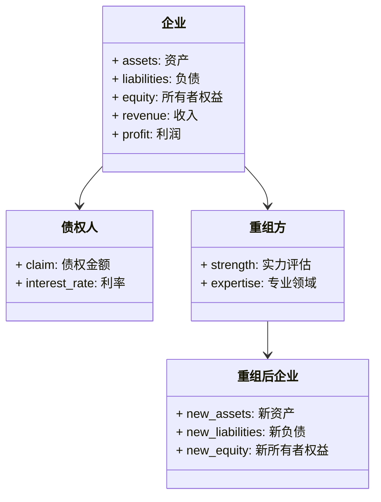
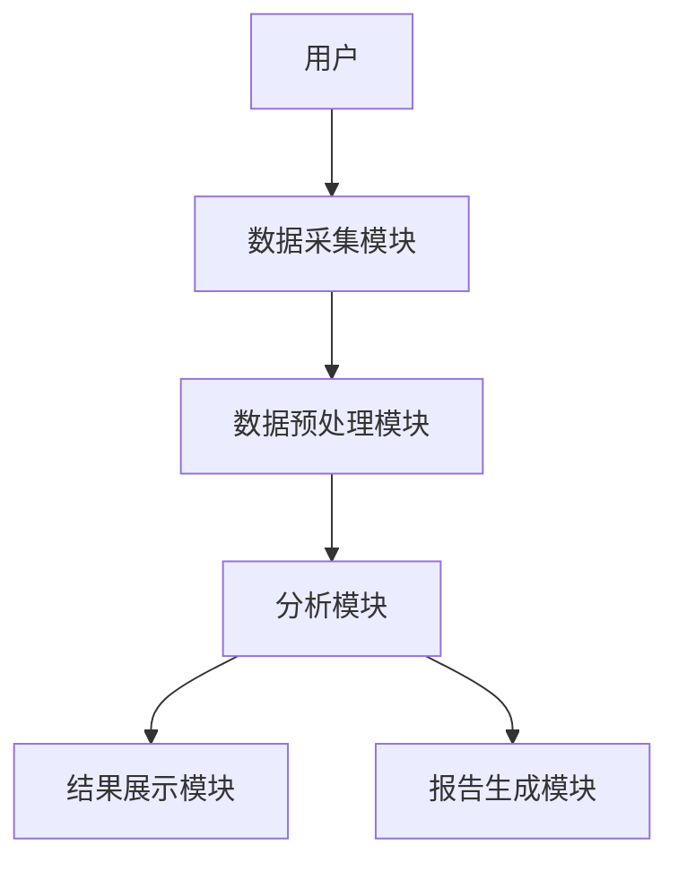
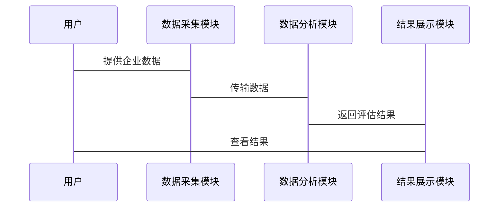

                 

<think>
好的，我现在需要帮用户设计一本名为《价值投资中的破产重组机会》的书籍目录大纲。用户是一位技术专家，希望内容专业且逻辑清晰，适合价值投资者和编程爱好者阅读。我需要确保目录涵盖从基础概念到实际应用的各个方面，同时结合技术分析的方法。

首先，我应该先明确书籍的结构，确保每个部分都有足够的深度。用户特别提到了要包括背景介绍、核心概念、算法原理、系统架构和实战案例等部分。这可能意味着我需要将目录分为几个主要章节，每章下再细分主题。

接下来，我需要考虑用户的需求，他们可能是一位希望将技术分析应用于价值投资的投资者，或者是一位对破产重组感兴趣的技术人员。因此，目录应该既有投资策略的内容，也有技术分析的方法，比如算法、数学模型和系统设计。

在开始撰写目录时，我应该先介绍价值投资和破产重组的基本概念，让读者了解它们的定义和相互关系。然后，深入探讨破产重组的机会，分析其中的核心要素和评估指标，帮助读者识别潜在的投资机会。

接下来，我需要引入技术分析的方法，如财务数据分析算法和市场情绪分析，用mermaid流程图和Python代码示例来解释这些方法。这将帮助读者理解如何用技术手段评估破产重组的机会。

然后，系统架构部分可能需要设计一个破产重组机会评估系统，包括数据收集、分析模块和决策模块。这部分可以用mermaid架构图来展示系统结构，并详细描述每个模块的功能。

最后，项目实战部分需要通过具体案例分析，展示如何应用前面的理论和方法。这将帮助读者将理论知识转化为实际操作能力。同时，总结部分需要回顾整个内容，并给出投资策略的建议。

在写作过程中，我需要确保每个章节都详细且有逻辑性，使用对比表格和ER图等工具来帮助读者理解复杂的概念。数学公式和代码示例也应该清晰易懂，方便读者学习和应用。

总的来说，我需要将技术分析与价值投资结合起来，设计一个结构合理、内容详实的目录，确保读者能够全面了解破产重组机会，并掌握相关的技术分析方法。
</think>

# 价值投资中的破产重组机会

> 关键词：价值投资, 破产重组, 企业估值, 技术分析, 算法模型, 风险评估

> 摘要：  
本文系统地探讨了价值投资中破产重组机会的识别与评估方法。通过结合技术分析、数学模型和实际案例，本文深入分析了破产重组对企业价值的影响、重组机会的评估指标、算法模型的应用以及系统架构的设计。文章最后通过具体案例展示了如何在实际投资中应用这些方法，并提供了最佳实践建议。

---

# 第一部分: 价值投资中的破产重组机会概述

## 第1章: 价值投资与破产重组的基本概念

### 1.1 价值投资的核心理念
- 价值投资的定义与核心原则
- 价值投资与其他投资策略的对比
- 价值投资中的长期视角

### 1.2 破产重组的基本概念
- 破产重组的定义与法律框架
- 破产重组的类型与流程
- 破产重组与企业价值的关系

### 1.3 破产重组机会的价值投资逻辑
- 破产重组中的价值发现
- 破产重组对股东价值的影响
- 破产重组中的风险与收益平衡

---

# 第二部分: 破产重组机会的核心概念与分析框架

## 第2章: 破产重组机会的核心要素

### 2.1 破产重组的核心要素分析
- 企业财务状况分析
- 企业经营状况评估
- 重组方的资质与实力

### 2.2 破产重组机会的评估指标
- 财务指标分析（如资产负债率、现金流等）
- 经营指标分析（如市场份额、竞争优势等）
- 市场环境分析（如行业周期、政策影响等）

### 2.3 破产重组机会的比较分析
- 不同类型重组案例对比
- 不同行业重组机会的差异
- 不同阶段重组风险的评估

### 2.4 核心概念对比表格
#### 表2-1：破产重组与企业清算的主要区别

| 指标 | 破产重组 | 企业清算 |
|------|----------|----------|
| 定义 | 通过债务调整和资产重组恢复企业价值 | 结束企业经营，清算资产 | 
| 目的 | 保护债权人和股东利益，恢复经营 | 清偿债务，终止企业 | 
| 风险 | 中等偏高 | 极高 | 
| 收益 | 可能较高 | 一般较低 | 

### 2.5 ER实体关系图（Mermaid）


## 第3章: 破产重组机会的算法与数学模型

### 3.1 破产重组机会的算法概述
- 破产重组机会的识别算法
- 破产重组潜在收益的预测模型
- 破产重组风险的评估算法

### 3.2 破产重组机会的数学模型
- 财务健康状况评估模型
- 重组后企业价值预测模型
- 风险收益平衡模型

### 3.3 算法流程图（Mermaid）


### 3.4 算法实现代码
```python
# 示例代码：企业财务健康状况评估
def calculate_financial_health(assets, liabilities, equity):
    health_score = (assets - liabilities) / equity
    return health_score

assets = 100000000
liabilities = 80000000
equity = 20000000

health_score = calculate_financial_health(assets, liabilities, equity)
print(f"企业财务健康状况得分：{health_score}")
```

---

# 第三部分: 破产重组机会的系统分析与架构设计

## 第4章: 系统架构设计

### 4.1 破产重组机会评估系统介绍
- 系统目标：识别破产重组机会，评估其潜在价值
- 系统功能：数据采集、分析、预测、报告生成

### 4.2 系统功能设计（领域模型）


### 4.3 系统架构设计（系统架构图）


### 4.4 系统接口设计
- 数据输入接口：CSV文件或数据库
- 数据输出接口：报告PDF或电子表格
- 用户界面：图形化界面或命令行

### 4.5 系统交互设计（序列图）


---

# 第四部分: 项目实战与案例分析

## 第5章: 项目实战

### 5.1 环境安装与数据准备
- 安装Python和相关库（如Pandas、Scikit-learn）
- 数据来源：企业财务报表、行业报告

### 5.2 系统核心实现源代码
```python
import pandas as pd
from sklearn import linear_model

# 示例代码：企业价值预测模型
data = pd.DataFrame({
    'assets': [100, 200, 300],
    'liabilities': [80, 160, 240],
    'equity': [20, 40, 60],
    'value': [120, 240, 360]
})

model = linear_model.LinearRegression()
model.fit(data[['assets', 'liabilities', 'equity']], data['value'])

print(f"模型系数：{model.coef_}")
print(f"模型截距：{model.intercept_}")
```

### 5.3 代码应用解读与分析
- 数据预处理：缺失值处理、标准化
- 模型训练：线性回归、随机森林
- 结果分析：预测值与实际值对比

### 5.4 实际案例分析
- 某企业破产重组案例分析
- 数据分析与模型预测结果
- 投资决策建议

---

# 第五部分: 总结与展望

## 第6章: 总结与最佳实践

### 6.1 核心内容回顾
- 破产重组机会的识别与评估方法
- 技术分析与数学模型的应用
- 系统架构与项目实战的经验总结

### 6.2 最佳实践 Tips
- 数据质量的重要性
- 模型选择的灵活性
- 风险控制的必要性

### 6.3 未来展望
- 更复杂模型的应用（如深度学习）
- 多因素分析的引入
- 系统的自动化与智能化

---

# 作者：AI天才研究院/AI Genius Institute & 禅与计算机程序设计艺术 /Zen And The Art of Computer Programming

