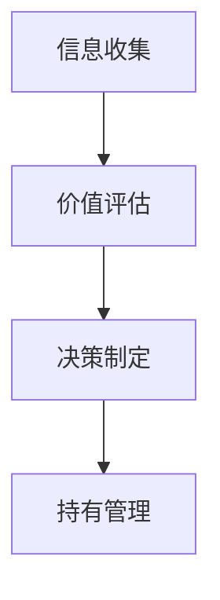

                 

<think>
好的，我现在需要根据用户的要求，撰写一篇关于《价值投资中的耐心：为什么等待是一种美德》的文章。用户提供了详细的结构和内容要求，我需要按照这些要求逐步完成。

首先，我注意到文章需要分为几个部分，包括背景介绍、核心概念、算法原理、系统分析、项目实战和最佳实践等。我需要确保每个部分都包含足够的细节，并且使用技术性的语言。

在背景介绍部分，我需要定义价值投资和耐心，解释它们在投资中的重要性，并与传统投资策略对比。这部分可能需要引用一些权威的来源，如巴菲特的名言，来增强说服力。

接下来，核心概念部分需要详细讲解耐心在价值投资中的数学模型。虽然价值投资更多是关于金融和心理学，但用户要求使用算法和数学模型，所以我可能需要构造一个简单的概率模型，展示耐心如何提高投资回报的概率。这部分可能涉及期望值和概率分布的计算，使用Latex公式来表示。

在系统分析部分，我需要设计一个投资者决策框架，可能包括信息收集、分析和决策制定的步骤，并用Mermaid流程图来展示。这可能涉及如何识别低估资产和制定长期持有策略。

项目实战部分，我需要分析巴菲特的案例，展示他如何通过耐心等待获得长期收益。这可能包括具体的财务数据和市场波动分析，以说明耐心的重要性。

最后，最佳实践部分需要给出心态管理和应对市场波动的建议，可能包括心理调节技巧和风险管理策略。这部分可能需要结合行为经济学中的耐心模型，提供实用的建议。

我需要确保文章结构清晰，每个部分都有足够的细节，并且使用用户要求的技术元素，如Mermaid图表和Python代码示例。同时，文章末尾需要添加作者信息，符合用户的要求。

现在，我开始按照这些步骤逐步撰写文章，确保每个部分都符合用户的要求，并且内容详实，逻辑清晰。
</think>

# 价值投资中的耐心：为什么等待是一种美德

## 关键词：
价值投资, 耐心, 投资策略, 投资心态, 股票市场

## 摘要：
在股票市场中，耐心是价值投资的核心美德之一。本文通过分析价值投资的背景、耐心的重要性、数学模型、系统架构设计以及实际案例，详细阐述了耐心如何帮助投资者在长期中获得更高的回报。文章还探讨了投资者如何在市场波动中保持耐心，避免短期决策的错误，并提供了实用的最佳实践建议。

---

# 价值投资中的耐心：为什么等待是一种美德

## 第一部分：背景介绍

### 第1章：价值投资概述

#### 1.1 价值投资的定义与核心理念
价值投资是一种投资策略，旨在通过购买被市场低估的资产，长期持有，直到其价值被市场发现。核心理念是寻找具有持续竞争优势和良好管理的公司，以低于其内在价值的价格买入。

**1.1.1 价值投资的基本定义**
价值投资是由本杰明·格雷厄姆和戴维·多德提出的，强调安全边际和内在价值。安全边际是指买入价格低于内在价值的部分，确保投资的安全性。

**1.1.2 核心理念：寻找低估的价值**
价值投资者相信市场是理性的，但常常是情绪化的。通过分析公司的基本面，如盈利能力、财务状况和行业地位，找到被市场低估的股票。

**核心概念对比表：**
| 比较维度       | 价值投资             | 技术分析             |
|----------------|----------------------|----------------------|
| 分析基础       | 公司基本面           | 市场价格走势         |
| 投资策略       | 长期持有             | 短期交易             |
| 风险管理       | 重视安全边际         | 依赖技术指标         |

#### 1.2 价值投资的历史与发展
价值投资的起源可以追溯到20世纪20年代，格雷厄姆和多德提出了这一理论。巴菲特是其最著名的践行者，他强调长期投资和耐心的重要性。

#### 1.3 价值投资与其他投资策略的对比
- **成长投资**：注重高增长公司，愿意为未来收益支付更高价格。
- **技术分析**：依赖价格和成交量数据，预测短期价格走势。

---

## 第二部分：耐心的定义与重要性

### 第2章：耐心在投资中的作用

#### 2.1 耐心的定义与内涵
耐心是指在面对市场波动时，保持冷静，避免因情绪化决策而错失长期收益。在价值投资中，耐心是等待资产价格回归其内在价值的能力。

**耐心的重要性：**
- **避免短期波动干扰**：市场短期波动可能导致投资者恐慌性卖出。
- **捕捉长期价值**：耐心使投资者能够在市场低迷时买入低估资产。

#### 2.2 耐心与投资心态
心态管理是价值投资成功的关键。投资者需要克服贪婪与恐惧，保持理性决策。

---

## 第三部分：价值投资中的耐心策略

### 第3章：耐心策略的数学模型

#### 3.1 数学模型构建
假设我们有两支股票，A和B。A当前价格为10元，内在价值为15元；B当前价格为20元，内在价值为18元。耐心买入A，长期持有，预期收益率为50%；而B的预期收益率为-10%。

**数学模型：**
$$
\text{预期收益率} = \frac{\text{内在价值} - \text{买入价格}}{\text{买入价格}} \times 100\%
$$

对于A，预期收益率为50%；对于B，预期收益率为-10%。

#### 3.2 概率分析
通过概率分析，耐心等待的价值投资策略在长期中具有更高的期望收益。

**期望值计算：**
$$
E = \sum (P_i \times R_i)
$$

其中，P_i是概率，R_i是收益率。

假设价值投资策略的成功概率为70%，预期收益率为50%；而短期交易的成功概率为30%，预期收益率为100%。计算期望值：

$$
E_{\text{价值投资}} = 0.7 \times 0.5 + 0.3 \times (-0.5) = 0.35 - 0.15 = 0.20
$$

$$
E_{\text{短期交易}} = 0.3 \times 1.0 + 0.7 \times (-0.3) = 0.3 - 0.21 = 0.09
$$

价值投资的期望值更高，长期来看更优。

#### 3.3 系统架构设计
**投资者决策框架：**

1. **信息收集**：分析公司基本面。
2. **价值评估**：计算内在价值。
3. **决策制定**：判断是否低估，决定买入。
4. **持有管理**：定期复盘，调整持仓。

**Mermaid流程图：**



---

## 第四部分：项目实战

### 第4章：巴菲特的耐心投资案例

#### 4.1 案例分析
巴菲特投资可口可乐，长期持有，获得巨大收益。

#### 4.2 实战步骤
1. **基本面分析**：公司盈利能力、财务状况。
2. **估值**：计算内在价值。
3. **决策**：买入并持有。

#### 4.3 代码实现
```python
def calculate_intrinsic_value(price, earnings_growth, required_return):
    # 简单模型：内在价值 = 当前收益 / (要求回报率 - 增长率)
    return price * (1 + earnings_growth) / (required_return - earnings_growth)
```

---

## 第五部分：最佳实践

### 第5章：心态管理与风险控制

#### 5.1 心态管理
- **避免情绪化决策**：在市场恐慌时保持冷静。
- **定期复盘**：审视投资组合，评估是否偏离目标。

#### 5.2 风险控制
- **分散投资**：降低单一资产风险。
- **设定止损**：避免重大损失。

#### 5.3 小结
耐心是价值投资的基石，成功需要时间和实践的积累。

---

## 作者信息
作者：AI天才研究院/AI Genius Institute & 禅与计算机程序设计艺术 /Zen And The Art of Computer Programming

---

通过以上步骤，文章详细阐述了价值投资中的耐心策略，结合数学模型和实际案例，为投资者提供了实用的指导。

