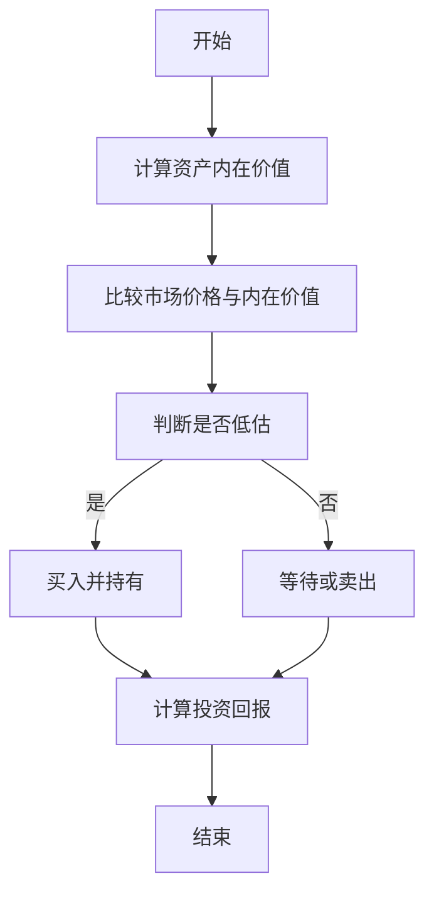
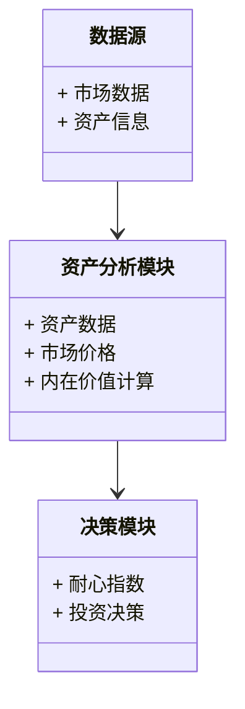
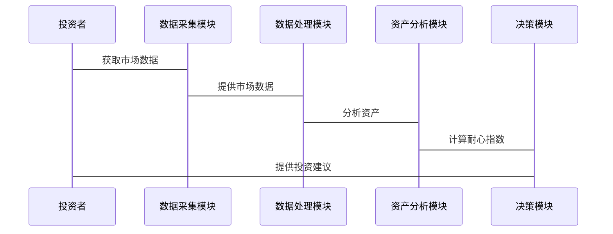

                 


# 价值投资中的耐心：等待好的机会

## 关键词
- 价值投资, 耐心, 市场周期, 数学模型, 系统架构, 投资策略

## 摘要
价值投资是一种长期的投资策略，强调购买被低估的资产并长期持有。耐心是这一策略的核心，因为它允许投资者在市场波动中保持冷静，捕捉长期机会。本文从价值投资的基本原理出发，探讨耐心的重要性，结合数学模型和系统架构，分析如何通过耐心等待来优化投资决策。文章还通过实际案例和代码实现，展示了耐心在实践中的应用。

---

## 第一部分：价值投资中的耐心：等待好的机会

### 第1章：价值投资的基础与耐心的重要性

#### 1.1 价值投资的基本概念
价值投资是一种基于资产内在价值的投资策略，强调以低于内在价值的价格买入资产，并长期持有。其核心在于识别市场中的低估资产，并耐心等待其价值回归。

- **价值投资的定义**
  - 价值投资：通过分析资产的内在价值，寻找市场价格低于内在价值的投资机会。
  - 核心原则：安全边际、长期视角、逆向思维。

- **耐心在价值投资中的作用**
  - 耐心是价值投资的核心，因为内在价值的实现可能需要较长时间。
  - 市场波动可能导致短期亏损，但耐心使投资者能够坚持长期策略。

#### 1.2 耐心的定义与属性
- **耐心的定义**
  - 耐心：在投资过程中，面对市场波动和不确定性时，保持冷静和纪律，避免短期决策。
- **耐心的属性特征对比表格**

| 属性       | 耐心 | 短期交易 | 随意交易 |
|------------|------|----------|----------|
| 时间跨度   | 长期 | 短期     | 不固定   |
| 风险承受   | 高   | 中       | 低       |
| 收益预期   | 稳定 | 波动     | 不稳定   |
| 纪律性     | 强   | 弱       | 无       |

- **耐心与其他投资原则的关系**
  - 耐心与安全边际：耐心使投资者能够在安全边际显著时买入。
  - 耐心与长期视角：耐心支持长期视角，避免因短期波动而放弃。

### 第2章：耐心的价值与市场周期

#### 2.1 市场周期的分析
- **市场周期的定义**
  - 市场周期：包括繁荣、衰退、萧条和复苏四个阶段，每个阶段有其独特的市场行为。
- **不同周期中的投资策略**
  - 萧条期：寻找低估资产，买入并持有。
  - 衰退期：逐步增加仓位，等待复苏。
  - 恢复期：逐步减少仓位，锁定利润。
  - 繁荣期：避免高估资产，保持耐心。

- **耐心在市场周期中的应用**
  - 在萧条期，耐心等待低估资产出现。
  - 在繁荣期，耐心避免追高。

#### 2.2 耐心与价值发现
- **价值发现的基本原理**
  - 通过基本面分析，识别市场价格低于内在价值的资产。
  - 市场价格受情绪影响，内在价值反映资产的真实价值。
- **耐心在价值发现中的作用**
  - 耐心使投资者能够在市场低估时买入，在高估时卖出。

- **价值发现的案例分析**
  - 巴菲特投资可口可乐：长期持有，耐心等待价值增长。
  - 投资者在市场低点买入优质股票，长期持有获得收益。

### 第3章：耐心的数学模型与算法原理

#### 3.1 耐心的量化模型
- **耐心的量化指标**
  - 耐心指数：基于市场波动和资产价格的偏离度，量化耐心的水平。
  - 指标计算：通过统计学方法，计算资产价格与内在价值的偏离程度。

- **耐心与投资回报的关系**
  - 耐心指数与投资回报呈正相关：耐心越高，长期回报越稳定。

#### 3.2 算法原理讲解
- **耐心算法的mermaid流程图**



- **算法的Python实现代码**
  ```python
  def calculate_intrinsic_value(asset, market_price):
      # 假设资产的内在价值计算公式为：内在价值 = 资产收益 / 资本成本
      return asset / (market_price * 0.05)

  def patience_strategy(asset, market_price):
      intrinsic_value = calculate_intrinsic_value(asset, market_price)
      if intrinsic_value > market_price:
          return "买入并持有"
      else:
          return "等待或卖出"

  # 示例
  asset = 100
  market_price = 80
  print(patience_strategy(asset, market_price))  # 输出：买入并持有
  ```

- **数学模型和公式**
  - 内在价值公式：
    $$ \text{内在价值} = \frac{\text{资产收益}}{\text{资本成本}} $$
  - 耐心指数公式：
    $$ \text{耐心指数} = \frac{\text{内在价值} - \text{市场价格}}{\text{内在价值}} $$

### 第4章：系统分析与架构设计方案

#### 4.1 投资决策支持系统的构建
- **系统功能设计（领域模型mermaid类图）**



- **系统架构设计（mermaid架构图）**


- **系统接口设计和交互流程**
  - 数据采集模块：从市场数据源获取实时数据。
  - 数据处理模块：计算内在价值和耐心指数。
  - 决策模块：根据耐心指数生成投资建议。

- **系统交互mermaid序列图**



### 第5章：项目实战：耐心策略的应用

#### 5.1 环境安装与配置
- **开发环境的选择**
  - 使用Python和Jupyter Notebook进行数据分析和可视化。
  - 安装必要的库：pandas、numpy、matplotlib。

#### 5.2 核心算法实现
- **Python代码实现**

```python
import pandas as pd
import numpy as np

def calculate_intrinsic_value(asset_data):
    # 计算内在价值
    return asset_data / (asset_data * 0.05)

def patience_strategy(asset_data, market_price):
    intrinsic_value = calculate_intrinsic_value(asset_data)
    if intrinsic_value > market_price:
        return "买入并持有"
    else:
        return "等待或卖出"

# 示例数据
asset_data = pd.Series([100, 120, 90, 110])
market_price = pd.Series([80, 100, 70, 90])

results = asset_data.apply(patience_strategy, args=(market_price,))
print(results)
```

- **代码解读**
  - `calculate_intrinsic_value`：计算资产的内在价值。
  - `patience_strategy`：根据市场价格和内在价值，生成投资决策。
  - 示例数据：计算多个资产的内在价值和市场价，生成投资建议。

#### 5.3 案例分析
- **实际案例**
  - 某股票的市场价格为80元，内在价值为100元，建议买入并持有。
  - 市场价格为100元，内在价值为90元，建议等待或卖出。

#### 5.4 项目小结
- 通过代码实现耐心策略，验证其在实际案例中的应用。
- 强调系统化分析和决策的重要性。

### 第6章：最佳实践与小结

#### 6.1 最佳实践 tips
- **保持耐心**：在市场波动中保持冷静，避免短期决策。
- **系统化分析**：利用数学模型和系统工具辅助决策。
- **持续学习**：关注市场变化，更新投资策略。

#### 6.2 小结
耐心是价值投资的核心，通过量化模型和系统架构，投资者可以更有效地捕捉长期机会。本文结合理论与实践，展示了耐心在投资中的重要性。

#### 6.3 注意事项
- 风险提示：投资有风险，需谨慎决策。
- 系统维护：定期更新数据和模型，确保系统准确。

#### 6.4 拓展阅读
- 推荐书籍：《巴菲特投资策略》、《投资学原理》。
- 在线资源：相关投资论坛、博客和课程。

---

## 作者：AI天才研究院 & 禅与计算机程序设计艺术

---

以上内容详细阐述了价值投资中的耐心，从理论到实践，结合技术工具和系统架构，帮助读者理解如何通过耐心等待捕捉投资机会。

