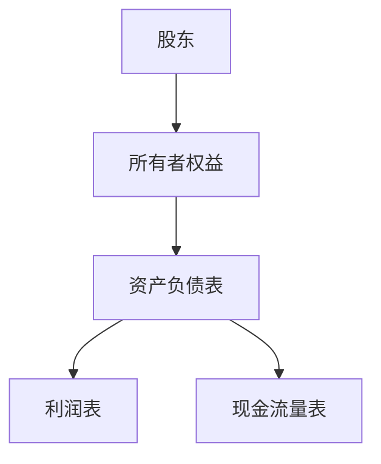
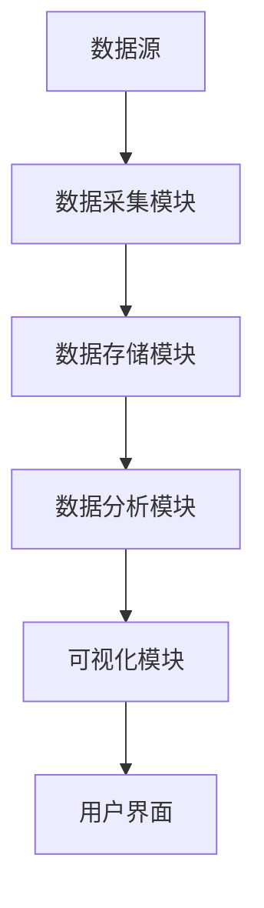
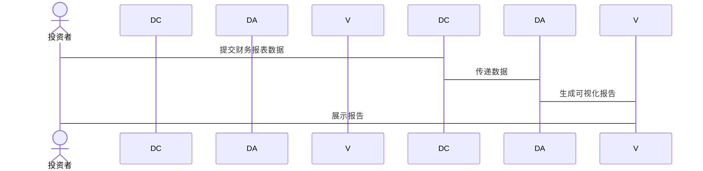

                 


# 价值投资中的财务报表分析：数字背后的故事

## 关键词：价值投资，财务报表分析，财务指标，投资决策，风险管理，数字故事

## 摘要：  
本文深入探讨了价值投资中财务报表分析的重要性，揭示了如何通过分析财务数据来评估企业的真实价值，帮助投资者做出明智的决策。文章详细讲解了财务报表的核心概念、关键指标、分析方法以及实际案例，并结合系统架构设计和项目实战，为读者提供了全面的指导。通过本文，读者将能够掌握如何从数字背后挖掘企业的财务健康状况，识别潜在风险，并在投资决策中运用这些分析结果。

---

## 第一部分：价值投资中的财务报表分析基础

### 第1章：财务报表分析的背景与价值投资概述

#### 1.1 价值投资的基本概念
##### 1.1.1 价值投资的定义与核心理念
价值投资是一种投资策略，强调以低于内在价值的价格购买优质资产。其核心理念是关注企业的基本面，寻找被市场低估的投资标的。  
**核心要素**：  
- **内在价值**：企业的真实价值，独立于市场波动。  
- **安全边际**：购买价格低于内在价值，以降低风险。  

##### 1.1.2 财务报表在价值投资中的重要性
财务报表是投资者了解企业财务状况的主要工具，帮助投资者评估企业的盈利能力、偿债能力和发展潜力。  
**关键作用**：  
- 揭示企业的财务健康状况。  
- 为投资决策提供数据支持。  

##### 1.1.3 价值投资与财务报表分析的关系
价值投资依赖于对财务报表的深入分析，通过解读数字背后的经营状况，发现潜在投资机会。  
**关系特点**：  
- 财务报表分析是价值投资的核心技能。  
- 通过分析财务数据，识别企业的竞争优势和风险。

#### 1.2 财务报表的基本结构与内容
##### 1.2.1 资产负债表的核心要素
资产负债表反映企业在某一特定时点的财务状况，包括资产、负债和所有者权益三部分。  
- **资产**：企业控制的资源，分为流动资产和非流动资产。  
- **负债**：企业承担的债务，分为流动负债和非流动负债。  
- **所有者权益**：企业净资产，等于资产减去负债。  

##### 1.2.2 利润表的关键指标
利润表展示企业在一定会计期间的经营成果，包括收入、费用和利润。  
- **营业收入**：企业日常经营活动中产生的收入。  
- **净利润**：扣除所有费用后的最终利润，是衡量企业盈利能力的核心指标。  

##### 1.2.3 现金流量表的重要性
现金流量表记录企业在一定会计期间内现金流入和流出的情况，分为经营活动、投资活动和筹资活动的现金流。  
- **经营活动现金流**：企业日常经营产生的现金流。  
- **投资活动现金流**：企业投资活动产生的现金流。  
- **筹资活动现金流**：企业通过融资活动产生的现金流。  

##### 1.2.4 财务报表的编制与审计
财务报表的编制遵循会计准则，审计则通过独立的第三方验证其准确性。  
- **会计准则**：确保财务报表的标准化和透明化。  
- **审计作用**：提高财务报表的可信度。  

#### 1.3 价值投资中的财务报表分析方法
##### 1.3.1 基本分析法
基本分析法通过分析企业的财务报表、行业地位和宏观经济环境，评估其内在价值。  
- **步骤**：收集数据、分析财务指标、评估行业地位、考虑宏观经济因素。  

##### 1.3.2 技术分析法
技术分析法通过研究历史价格和成交量，预测未来的价格走势。  
- **工具**：K线图、均线、成交量分析等。  

##### 1.3.3 综合分析法
综合分析法结合基本分析和技术分析，综合评估投资标的的价值。  
- **优势**：结合基本面和市场情绪，提高分析的准确性。  

---

### 第2章：财务报表分析的核心概念与联系

#### 2.1 财务报表分析的核心概念
##### 2.1.1 资产负债表的三要素
- **资产**：企业的资源，包括现金、应收账款、存货、固定资产等。  
- **负债**：企业的债务，包括应付账款、短期借款、长期借款等。  
- **所有者权益**：企业净资产，包括股本、资本公积、盈余公积等。  

##### 2.1.2 利润表的三大指标
- **营业收入**：企业主营业务收入。  
- **营业成本**：与营业收入相关的成本。  
- **净利润**：扣除所有费用后的最终利润。  

##### 2.1.3 现金流量表的三大活动
- **经营活动现金流**：企业日常经营产生的现金流。  
- **投资活动现金流**：企业投资活动产生的现金流。  
- **筹资活动现金流**：企业融资活动产生的现金流。  

#### 2.2 财务指标的核心属性对比
##### 2.2.1 盈利能力指标对比表
| 指标名称       | 计算公式                                  | 关键点                  |
|----------------|-----------------------------------------|------------------------|
| 净资产收益率（ROE） | 净利润 / 平均净资产 × 100%              | 衡量股东资金的使用效率 |
| 净利率         | 净利润 / 营业收入 × 100%                  | 衡量销售利润的空间     |

##### 2.2.2 偿债能力指标对比表
| 指标名称       | 计算公式                                  | 关键点                  |
|----------------|-----------------------------------------|------------------------|
| 速动比率       | （流动资产 - 存货） / 流动负债            | 衡量短期偿债能力       |
| 债务股本比率   | 总负债 / 股东权益                        | 衡量长期偿债能力       |

##### 2.2.3 成长能力指标对比表
| 指标名称       | 计算公式                                  | 关键点                  |
|----------------|-----------------------------------------|------------------------|
| 营收增长率     | （本年营业收入 - 上年营业收入） / 上年营业收入 × 100% | 衡量企业收入增长速度 |
| 净利润增长率   | （本年净利润 - 上年净利润） / 上年净利润 × 100% | 衡量企业盈利能力增长 |

#### 2.3 实体关系图


---

### 第3章：财务报表分析的核心算法与数学模型

#### 3.1 盈利能力分析
##### 3.1.1 净资产收益率（ROE）公式
$$ROE = \frac{\text{净利润}}{\text{平均净资产}} \times 100\%$$
**解读**：ROE越高，说明企业使用股东资金的效率越高。

##### 3.1.2 净利率公式
$$\text{净利率} = \frac{\text{净利润}}{\text{营业收入}} \times 100\%$$
**解读**：净利率越高，说明企业每单位收入的盈利能力越强。

##### 3.1.3 算法实现
```python
def calculate_roe(net_profit, average_equity):
    return (net_profit / average_equity) * 100

def calculate_net_margin(net_profit, revenue):
    return (net_profit / revenue) * 100

# 示例数据
net_profit = 100  # 假设净利润为100万元
average_equity = 500  # 假设平均净资产为500万元
net_margin = calculate_net_margin(100, 500)

print(f"ROE = {calculate_roe(net_profit, average_equity)}%")
print(f"Net Margin = {net_margin}%")
```

---

## 第四部分：系统分析与架构设计方案

### 第4章：系统分析与架构设计

#### 4.1 问题场景介绍
我们希望通过系统分析和设计，构建一个能够自动分析企业财务报表的工具，帮助投资者快速评估企业的财务状况。

#### 4.2 功能需求
##### 4.2.1 数据采集模块
- 从多种数据源获取财务报表数据（如Excel、CSV格式）。  
- 数据清洗和预处理。  

##### 4.2.2 数据分析模块
- 计算核心财务指标（如ROE、净利率等）。  
- 生成财务健康报告。  

##### 4.2.3 可视化模块
- 以图表形式展示财务数据。  
- 提供直观的财务健康评估。  

#### 4.3 系统架构设计


#### 4.4 接口设计
- 数据采集模块：提供API接口，接收财务报表数据。  
- 数据分析模块：提供API接口，返回财务指标结果。  

#### 4.5 交互设计


---

## 第五部分：项目实战

### 第5章：项目实战与案例分析

#### 5.1 环境安装
- 安装Python和必要的库（如pandas、matplotlib）。  

#### 5.2 核心代码实现
##### 5.2.1 数据采集与处理
```python
import pandas as pd

# 读取CSV文件
df = pd.read_csv('financial_report.csv')

# 数据清洗
df.dropna(inplace=True)
df = df[~df.isin([0])]  # 去除全为0的行
```

##### 5.2.2 财务指标计算
```python
import pandas as pd
import matplotlib.pyplot as plt

# 计算ROE
roe = df['净利润'] / df['平均净资产'] * 100

# 计算净利率
net_margin = df['净利润'] / df['营业收入'] * 100

# 绘制图表
plt.figure(figsize=(10, 6))
plt.plot(df['公司名称'], roe, 'b-', label='ROE')
plt.plot(df['公司名称'], net_margin, 'r-', label='Net Margin')
plt.xlabel('公司名称')
plt.ylabel('百分比')
plt.title('ROE与Net Margin对比图')
plt.legend()
plt.show()
```

#### 5.3 案例分析
以苹果公司为例，分析其2020年和2021年的财务报表，计算ROE和净利率，并进行对比分析。  
**案例结果**：苹果公司的ROE和净利率均保持高位，表明其盈利能力强，具有较高的投资价值。

---

## 第六部分：最佳实践与总结

### 第6章：最佳实践与总结

#### 6.1 最佳实践
- **持续学习**：关注行业动态和新的财务指标。  
- **风险管理**：定期复盘，及时调整投资策略。  

#### 6.2 总结
通过本文的学习，读者可以掌握价值投资中财务报表分析的核心方法和工具，能够从数字背后挖掘企业的财务健康状况，识别潜在风险，并在投资决策中运用这些分析结果。

#### 6.3 注意事项
- **数据滞后性**：财务报表数据存在滞后，需结合最新数据进行分析。  
- **行业差异**：不同行业的财务指标标准不同，需结合行业特点进行分析。  

#### 6.4 拓展阅读
- 《投资最重要的事》——本杰明·格雷厄姆  
- 《财务报表分析与投资策略》——张海晨  

---

## 作者：AI天才研究院 & 禅与计算机程序设计艺术

---

以上是《价值投资中的财务报表分析：数字背后的故事》的技术博客文章的完整目录和内容框架。通过本文，读者可以系统地了解财务报表分析的核心概念、方法和实际应用，为价值投资提供有力的决策支持。

