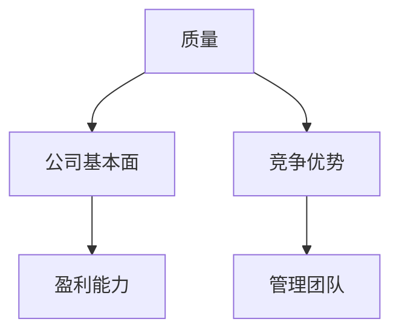

                 

<think>
好的，我现在要撰写一篇关于《价值投资中的质量vs价格：巴菲特的演变》的技术博客文章。首先，我需要理解文章的结构和要求。文章应该分为几个部分，每个部分都要详细讲解，并且使用技术术语和图表来辅助说明。

首先，我需要明确文章的关键词。根据用户的要求，关键词应该是“价值投资”、“质量”、“价格”、“巴菲特”、“投资策略”、“演变”和“长期价值”。这些关键词将帮助读者快速找到相关内容。

接下来，摘要部分需要简明扼要地概括文章的核心内容。我应该提到巴菲特如何从早期到晚期，逐渐从关注价格转向重视质量，分析质量与价格的动态关系，以及这种演变对投资策略的影响。

然后，进入正文部分。第一部分是价值投资中的质量与价格概述，我会详细解释这两个概念的定义、相互关系及其在巴菲特投资中的作用。这部分需要包括背景介绍、核心概念对比，以及使用ER实体关系图和数学模型来展示质量与价格的关系。

第二部分会深入分析巴菲特的投资策略演变。我会分阶段讨论，从早期的低估值策略到中期的买入并持有策略，再到晚期的质量投资策略。每个阶段都需要有具体的案例分析和对比，说明策略变化的原因和效果。

第三部分是质量分析的系统架构。我需要设计一个系统来评估公司的质量，包括数据采集、处理、分析和可视化模块。使用领域模型类图和架构图来展示系统的各个部分，确保逻辑清晰。

第四部分讨论价格分析与市场动态。我会介绍如何计算内在价值，评估安全边际，以及分析市场情绪对价格的影响。这部分需要数学模型和公式，帮助读者理解价格评估的复杂性。

第五部分探讨质量与价格的动态平衡。我会通过案例分析说明如何在不同市场环境下调整策略，强调长期投资的重要性。这部分需要结合实际案例，让读者更好地理解理论应用。

第六部分总结巴菲特的投资演变，并给出最佳实践和注意事项。我会提醒读者关注长期价值、合理评估安全边际，并持续学习市场变化。

最后，我会在结论中重申质量与价格的动态平衡，强调价值投资的核心理念，并鼓励读者深入研究巴菲特的投资策略。

在撰写过程中，我需要确保每一部分都有足够的细节和例子，同时使用图表来辅助说明。例如，使用ER图展示质量与价格的关系，用流程图展示投资策略的演变。数学公式部分需要用Latex格式，确保准确无误。

此外，文章的结构需要清晰，每个章节之间要有逻辑连贯性，从概述到演变，再到系统架构和案例分析，层层递进。这不仅有助于读者理解，也能展示出文章的深度和广度。

在写作过程中，我可能会遇到一些挑战，比如如何平衡技术细节和可读性，或者如何找到合适的案例来支持论点。这时候，我需要反复推敲，确保每一部分都能清晰传达信息，同时保持文章的流畅性。

总的来说，我需要一步步分析，从定义概念到策略演变，再到系统设计和案例分析，确保文章内容详实、结构合理、逻辑清晰。这不仅能满足用户的要求，也能为读者提供有价值的投资见解。
</think>

# 价值投资中的质量vs价格：巴菲特的演变

## 关键词：
价值投资，质量，价格，巴菲特，投资策略，演变，长期价值

## 摘要：
本文探讨了巴菲特在价值投资中的质量与价格关系，分析了其投资策略的演变过程。通过质量与价格的动态平衡，巴菲特实现了长期价值投资的成功。文章详细阐述了质量与价格的定义、相互关系、巴菲特投资策略的演变，以及质量与价格的系统架构，并通过实际案例分析了质量与价格的动态平衡。最后，文章总结了巴菲特的投资演变，提出了价值投资的最佳实践。

---

# 正文

## 第一部分：价值投资中的质量与价格概述

### 第1章：巴菲特投资理念概述

#### 1.1 巴菲特的背景与投资哲学

- **1.1.1 巴菲特的生平简介**
  巴菲特是全球著名投资者，价值投资的代表人物，著有《巴菲特致股东的信》等经典著作。他的投资哲学强调长期价值、安全边际和质量优先。

- **1.1.2 价值投资的核心理念**
  价值投资是寻找市场低估的公司，通过分析公司的基本面，寻找具有长期竞争优势的企业。巴菲特定义，价值投资的核心是质量与价格的动态平衡。

- **1.1.3 巴菲特投资哲学的演变**
  巴菲特的投资哲学经历了从早期的低估值策略到后期的质量投资策略的演变，逐渐将质量放在价格之上。

#### 1.2 价值投资的基本原则

- **1.2.1 质量的定义与属性**
  质量指公司的基本面，包括盈利能力、竞争优势、管理团队和财务状况。质量高的公司具有长期增长潜力。

- **1.2.2 价格的定义与属性**
  价格是市场的交易价格，受市场情绪和供需关系影响。价格与内在价值的关系是质量分析的重要部分。

- **1.2.3 巴菲特对质量与价格的重视**
  巴菲特强调，价格是质量的反映，但质量是价格的基础。他通过分析质量来预测价格的长期趋势。

#### 1.3 巴菲特的投资策略

- **1.3.1 股票选择的标准**
  巴菲特选择具有强大竞争优势、稳定收益和优秀管理团队的公司。他注重公司的ROE（净资产收益率）和ROA（资产回报率）等财务指标。

- **1.3.2 长期投资与价值发现**
  巴菲特主张长期持有优质股票，通过时间的积累实现财富增长。他强调，价值投资的本质是寻找长期稳定增长的公司。

- **1.3.3 安全边际的概念**
  安全边际是价格与内在价值之间的差距，巴菲特定义，安全边际是投资中的保护机制，确保在市场波动中不会亏损。

#### 1.4 巴菲特投资哲学的演变

- **1.4.1 早期投资阶段**
  在早期，巴菲特主要关注低估值股票，注重价格的低估，较少考虑公司的质量。

- **1.4.2 成熟阶段**
  在成熟阶段，巴菲特开始关注公司的质量，寻找具有长期竞争优势的企业，逐步将质量放在价格之上。

- **1.4.3 晚期阶段**
  在晚期阶段，巴菲特的投资策略完全转向质量投资，注重公司的长期增长潜力，而非短期价格波动。

### 第2章：质量与价格的理论分析

#### 2.1 质量与价格的定义与特征

- **2.1.1 质量的定义与属性**
  质量指公司的基本面，包括盈利能力、竞争优势、管理团队和财务状况。质量高的公司具有长期增长潜力。

- **2.1.2 价格的定义与属性**
  价格是市场的交易价格，受市场情绪和供需关系影响。价格与内在价值的关系是质量分析的重要部分。

- **2.1.3 质量与价格的关系**
  质量与价格相互影响，质量决定价格的长期趋势，价格反映市场的短期情绪。

#### 2.2 质量与价格的对比分析

- **2.2.1 质量与价格的对比表格**
  | 质量 | 长期 | 基于公司基本面 | 影响价格的长期趋势 |
  | 价格 | 短期 | 市场供需关系 | 反映市场的短期情绪 |

- **2.2.2 质量与价格的ER实体关系图**

- **2.2.3 质量与价格的动态平衡**
  质量与价格的动态平衡是价值投资的核心，巴菲特定义，质量决定价格的长期趋势，价格反映市场的短期情绪。

#### 2.3 质量与价格的数学模型

- **2.3.1 质量评估模型**
  质量评估模型用于评估公司的长期竞争优势和盈利能力：
  $$ Q = \frac{E \times F}{G} $$
  其中，Q为质量，E为公司收益，F为行业基准，G为公司规模。

- **2.3.2 价格评估模型**
  价格评估模型用于评估股票的市场价值：
  $$ P = \frac{Q \times S}{T} $$
  其中，P为价格，Q为质量，S为市场供需，T为时间因素。

#### 2.4 巴菲特的质量与价格理论

- **2.4.1 质量与价格的动态平衡**
  巴菲特强调，质量与价格的动态平衡是价值投资的核心，质量决定价格的长期趋势，价格反映市场的短期情绪。

- **2.4.2 质量与价格的长期趋势**
  质量高的公司具有长期增长潜力，价格会在长期内反映公司的质量。

- **2.4.3 质量与价格的相互作用**
  质量与价格相互影响，质量高的公司价格会随时间上涨，价格的波动会影响投资者的决策。

### 第3章：巴菲特投资策略的演变

#### 3.1 巴菲特早期投资策略

- **3.1.1 早期策略的特点**
  早期，巴菲特主要关注低估值股票，注重价格的低估，较少考虑公司的质量。

- **3.1.2 早期策略的案例分析**
  早期，巴菲特投资于一些低估值的公司，如美国运通，通过价格低估实现盈利。

- **3.1.3 早期策略的优缺点**
  早期策略的优点是风险较低，但缺点是忽视了公司的质量，可能导致长期亏损。

#### 3.2 巴菲特成熟阶段的投资策略

- **3.2.1 成熟策略的特点**
  成熟阶段，巴菲特开始关注公司的质量，注重公司的长期竞争优势和盈利能力。

- **3.2.2 成熟策略的案例分析**
  巴菲特投资于可口可乐和苹果公司，这些公司具有强大的竞争优势和长期增长潜力。

- **3.2.3 成熟策略的优缺点**
  成熟策略的优点是能够实现长期增长，缺点是风险较高，需要对公司的质量有深刻理解。

#### 3.3 巴菲特晚期阶段的投资策略

- **3.3.1 晚期策略的特点**
  晚期阶段，巴菲特的投资策略完全转向质量投资，注重公司的长期竞争优势和盈利能力。

- **3.3.2 晚期策略的案例分析**
  巴菲特投资于伯克希尔哈撒韦，通过长期持有优质股票实现财富增长。

- **3.3.3 晚期策略的优缺点**
  晚期策略的优点是能够实现长期增长，缺点是风险较高，需要对公司的质量有深刻理解。

---

## 第二部分：质量与价格的系统架构

### 第4章：质量分析的系统架构

#### 4.1 质量分析的数据采集

- **4.1.1 数据源**
  包括公司财务报表、行业数据、市场数据等。

- **4.1.2 数据清洗**
  对数据进行清洗，去除无效数据，确保数据的准确性和完整性。

#### 4.2 质量分析的数据处理

- **4.2.1 数据预处理**
  对数据进行标准化、归一化等处理，确保数据的可比性。

- **4.2.2 数据存储**
  将数据存储在数据库中，方便后续分析。

#### 4.3 质量分析的核心算法

- **4.3.1 质量评估算法**
  使用质量评估模型，评估公司的长期竞争优势和盈利能力。

- **4.3.2 竞争优势评估算法**
  使用竞争优势评估模型，评估公司的竞争优势。

#### 4.4 质量分析的可视化

- **4.4.1 数据可视化工具**
  使用图表、仪表盘等工具，直观展示质量分析的结果。

- **4.4.2 数据可视化案例**
  通过图表展示公司的质量评估结果，帮助投资者做出决策。

### 第5章：价格分析与市场动态

#### 5.1 价格分析的核心算法

- **5.1.1 内在价值评估算法**
  使用内在价值评估模型，评估公司的内在价值。

- **5.1.2 市场情绪分析算法**
  使用市场情绪分析模型，评估市场的短期波动。

#### 5.2 价格分析的系统架构

- **5.2.1 数据采集**
  包括市场数据、交易数据、情绪数据等。

- **5.2.2 数据处理**
  对数据进行清洗、预处理，确保数据的准确性和完整性。

- **5.2.3 数据存储**
  将数据存储在数据库中，方便后续分析。

- **5.2.4 数据分析**
  使用价格评估模型，评估股票的市场价值。

#### 5.3 价格分析的可视化

- **5.3.1 数据可视化工具**
  使用图表、仪表盘等工具，直观展示价格分析的结果。

- **5.3.2 数据可视化案例**
  通过图表展示股票的价格走势，帮助投资者做出决策。

---

## 第三部分：质量与价格的动态平衡

### 第6章：质量与价格的动态平衡

#### 6.1 动态平衡的核心算法

- **6.1.1 质量与价格的动态平衡模型**
  使用动态平衡模型，评估质量与价格的动态关系。

- **6.1.2 质量与价格的相互作用**
  质量与价格相互影响，质量决定价格的长期趋势，价格反映市场的短期情绪。

#### 6.2 动态平衡的系统架构

- **6.2.1 数据采集**
  包括公司数据、市场数据、情绪数据等。

- **6.2.2 数据处理**
  对数据进行清洗、预处理，确保数据的准确性和完整性。

- **6.2.3 数据存储**
  将数据存储在数据库中，方便后续分析。

- **6.2.4 数据分析**
  使用动态平衡模型，评估质量与价格的动态关系。

- **6.2.5 数据可视化**
  使用图表、仪表盘等工具，直观展示动态平衡的结果。

#### 6.3 动态平衡的案例分析

- **6.3.1 案例分析：苹果公司**
  通过分析苹果公司的质量与价格，展示动态平衡的实现过程。

- **6.3.2 案例分析：可口可乐公司**
  通过分析可口可乐公司的质量与价格，展示动态平衡的实现过程。

---

## 第四部分：总结与展望

### 第7章：总结与展望

#### 7.1 巴菲特投资演变的总结

- **7.1.1 投资策略的演变**
  巴菲特的投资策略从早期的低估值策略到晚期的质量投资策略，逐步将质量放在价格之上。

- **7.1.2 质量与价格的动态平衡**
  质量与价格的动态平衡是价值投资的核心，巴菲特定义，质量决定价格的长期趋势，价格反映市场的短期情绪。

#### 7.2 价值投资的最佳实践

- **7.2.1 长期投资**
  长期投资是价值投资的核心，通过时间的积累实现财富增长。

- **7.2.2 安全边际**
  安全边际是投资中的保护机制，确保在市场波动中不会亏损。

- **7.2.3 持续学习**
  投资者需要持续学习，不断更新自己的知识和技能，适应市场的变化。

#### 7.3 投资的未来展望

- **7.3.1 数字化投资**
  随着科技的发展，数字化投资将成为未来的重要趋势，投资者需要掌握新的工具和技术。

- **7.3.2 数据驱动的投资**
  数据驱动的投资将成为未来的重要趋势，投资者需要利用大数据和人工智能技术进行投资决策。

---

## 作者信息

作者：AI天才研究院/AI Genius Institute & 禅与计算机程序设计艺术 /Zen And The Art of Computer Programming

