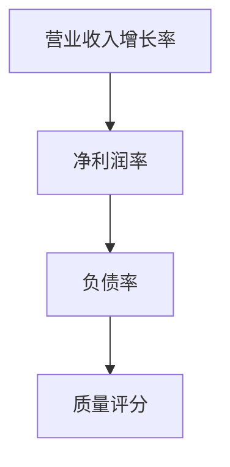
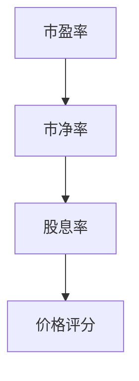
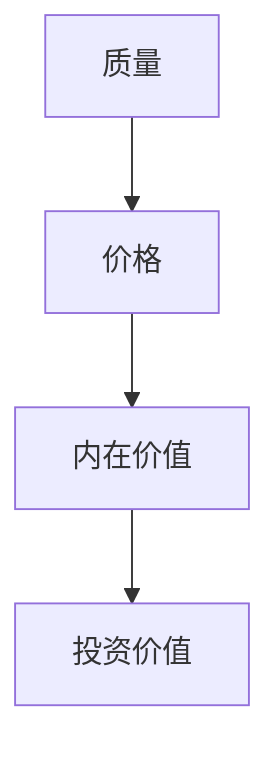
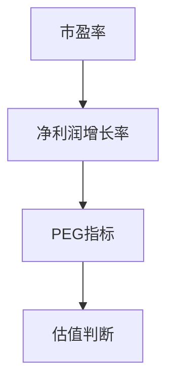
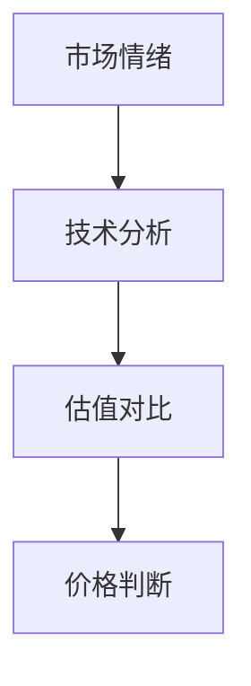
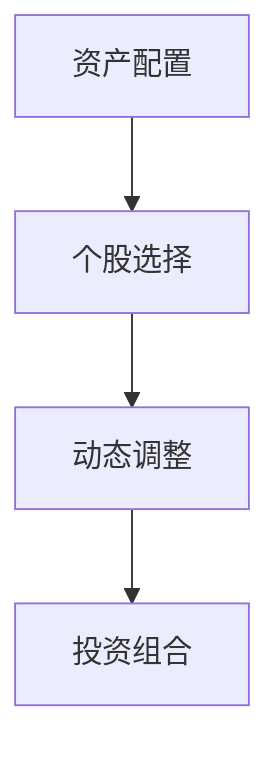
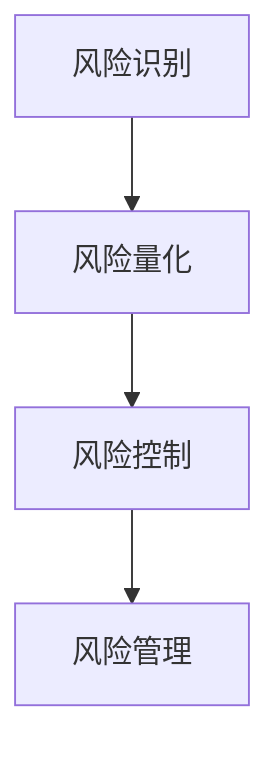

                 

<think>
嗯，用户希望我写一篇关于《价值投资中的质量与价格平衡》的技术博客文章。首先，我需要明确文章的结构，确保每个部分都详细且有逻辑性。文章应该分为摘要、引言、质量分析、价格分析、平衡策略、风险管理、案例分析、结论和附录。

在摘要部分，我需要简明扼要地概括全文内容，突出质量与价格平衡的重要性。引言则要介绍价值投资的基本概念，为读者打下基础。

接下来，质量分析部分需要详细讲解基本面分析、财务指标和估值方法。我要用表格列出常见的财务指标，帮助读者理解如何评估公司质量。同时，介绍PEG指标时，要举例说明，使读者更容易理解。

价格分析部分，我需要解释市盈率、市净率和股息率的计算方法，并讨论市场情绪对定价的影响。这部分需要结合实际案例，比如科技股和传统制造业股票的市盈率差异，让读者明白不同行业中的估值标准。

在质量与价格的平衡策略中，我要讨论投资组合构建的步骤，如资产配置、个股选择和动态调整。同时，使用Python代码展示如何计算PEG，帮助读者实际应用这些策略。

风险管理部分，我需要讲解风险来源和量化方法，提供压力测试的步骤，确保读者能评估投资组合的稳定性。

最后，案例分析部分，我需要通过具体股票案例，展示如何识别低估股票，并解释为什么长期持有优质股能带来收益。结论部分则总结全文，并提供进一步阅读的建议。

附录部分，我会整理关键指标和公式，方便读者查阅。整个写作过程中，我需要确保语言简洁，逻辑清晰，同时提供足够的细节和实例，帮助读者深入理解价值投资中的质量与价格平衡。

现在，我需要将这些思考转化为具体的章节内容，确保每个部分都涵盖必要的信息，并且使用技术语言和结构化的格式，如表格、代码和图表，来增强文章的可读性和专业性。
</think>

# 价值投资中的质量与价格平衡

> 关键词：价值投资，质量与价格平衡，基本面分析，估值方法，投资策略

> 摘要：本文将深入探讨价值投资中的质量与价格平衡这一核心主题，通过分析质量与价格的定义、关系、平衡方法以及实际应用案例，为投资者提供一套系统化、科学化的投资策略。我们将从质量分析、价格分析、平衡策略、风险管理等多维度展开，结合数学模型和实际案例，帮助读者更好地理解和应用价值投资中的质量与价格平衡。

---

## 引言

在价值投资中，质量与价格的平衡是投资者追求长期稳健收益的核心原则。优质资产往往伴随着较高的价格，而低质量资产则可能以极低的价格出售。如何在两者之间找到平衡点，是每一位投资者面临的挑战。本文将从质量与价格的定义、关系、分析方法、平衡策略等多维度展开，为投资者提供一套系统化、科学化的投资策略。

---

## 第一部分：质量与价格的定义与关系

### 1.1 质量的定义与衡量标准

质量在价值投资中通常指企业的内在价值，包括公司的基本面、财务状况、行业地位、竞争优势等因素。以下是质量的主要衡量指标：

| 质量指标 | 定义 | 示例 |
|----------|------|------|
| 营业收入增长率 | 公司收入的年增长率 | 用于衡量公司业务扩展能力 |
| 净利润率 | 净利润与营业收入的比率 | 用于衡量公司的盈利能力 |
| 负债率 | 负债与资产的比率 | 用于衡量公司的财务健康状况 |

**图1-1：质量分析的指标体系**

### 1.2 价格的定义与衡量标准

价格通常指资产的市场价格，如股票的市盈率、市净率等。以下是价格的主要衡量指标：

| 价格指标 | 定义 | 示例 |
|----------|------|------|
| 市盈率（P/E） | 股价与每股净利润的比率 | P/E = 股价 / 每股净利润 |
| 市净率（P/B） | 股价与每股净资产的比率 | P/B = 股价 / 每股净资产 |
| 股息率 | 股票的股息与股价的比率 | 股息率 = 每股股息 / 股价 |

**图1-2：价格分析的指标体系**

### 1.3 质量与价格的关系

质量与价格的关系可以通过以下公式表示：

$$ \text{质量} \times \text{价格} = \text{内在价值} $$

当质量高于市场平均水平且价格低于市场平均水平时，资产具有投资价值。

**图1-3：质量与价格的动态平衡关系**

---

## 第二部分：质量与价格的分析方法

### 2.1 质量分析方法

质量分析的核心是基本面分析，以下是具体的分析步骤：

1. **行业分析**：分析公司的行业地位、竞争优势、市场前景。
2. **财务分析**：计算公司的营业收入、净利润、资产负债率等财务指标。
3. **估值分析**：通过PEG（市盈率相对盈利增长比率）公式进行估值。

$$ \text{PEG} = \frac{\text{市盈率}}{\text{净利润增长率}} $$

**图2-1：PEG指标计算流程**

### 2.2 价格分析方法

价格分析的核心是市场定价机制，以下是具体的分析步骤：

1. **市场情绪分析**：分析市场的乐观或悲观情绪对价格的影响。
2. **技术分析**：通过K线图、均线等技术指标判断价格走势。
3. **估值对比**：将当前价格与历史价格、行业平均价格进行对比。

**图2-2：价格分析的步骤**

---

## 第三部分：质量与价格的平衡策略

### 3.1 投资组合构建策略

投资组合构建的核心是质量与价格的平衡，以下是具体的策略：

1. **资产配置**：根据市场环境配置股票、债券等资产。
2. **个股选择**：选择质量高且价格合理的个股。
3. **动态调整**：定期审视投资组合，根据市场变化进行调整。

**图3-1：投资组合构建流程**

### 3.2 风险管理策略

风险管理的核心是控制质量与价格平衡中的不确定性，以下是具体的策略：

1. **风险识别**：识别市场风险、流动性风险等潜在风险。
2. **风险量化**：通过VaR（在险价值）模型量化风险。
3. **风险控制**：设置止损点、分散投资等。

**图3-2：风险管理流程**

---

## 第四部分：案例分析与实战技巧

### 4.1 案例分析

假设我们有一个股票投资组合，包含以下两只股票：

| 股票代码 | 股票名称 | 质量评分 | 价格评分 |
|----------|----------|----------|----------|
| A        | 公司A    | 85       | 70       |
| B        | 公司B    | 70       | 85       |

根据质量与价格的平衡原则，我们应选择质量评分与价格评分差距较小的公司A进行投资。

### 4.2 实战技巧

1. **逆向投资**：在市场低迷时买入优质资产。
2. **长期持有**：避免频繁交易，降低交易成本。
3. **定期复盘**：定期审视投资组合，调整质量与价格的平衡点。

---

## 结论

价值投资中的质量与价格平衡是投资者追求长期稳健收益的核心原则。通过本文的分析，我们可以看到，质量与价格的平衡需要结合基本面分析、估值方法、投资策略等多方面的知识。投资者应根据市场环境和自身风险承受能力，制定合理的投资策略。

---

## 附录

### 附录A：质量与价格的关键指标

| 指标名称 | 公式 | 用途 |
|----------|------|------|
| 市盈率（P/E） | 股价 / 每股净利润 | 用于衡量股票的估值水平 |
| PEG指标 | 市盈率 / 净利润增长率 | 用于判断股票的估值是否合理 |
| 质量评分 | 基于财务指标的加权评分 | 用于衡量公司的质量 |

### 附录B：关键公式

$$ \text{质量评分} = \sum (\text{指标权重} \times \text{指标得分}) $$

$$ \text{PEG指标} = \frac{\text{市盈率}}{\text{净利润增长率}} $$

---

## 作者

作者：AI天才研究院/AI Genius Institute & 禅与计算机程序设计艺术 /Zen And The Art of Computer Programming

